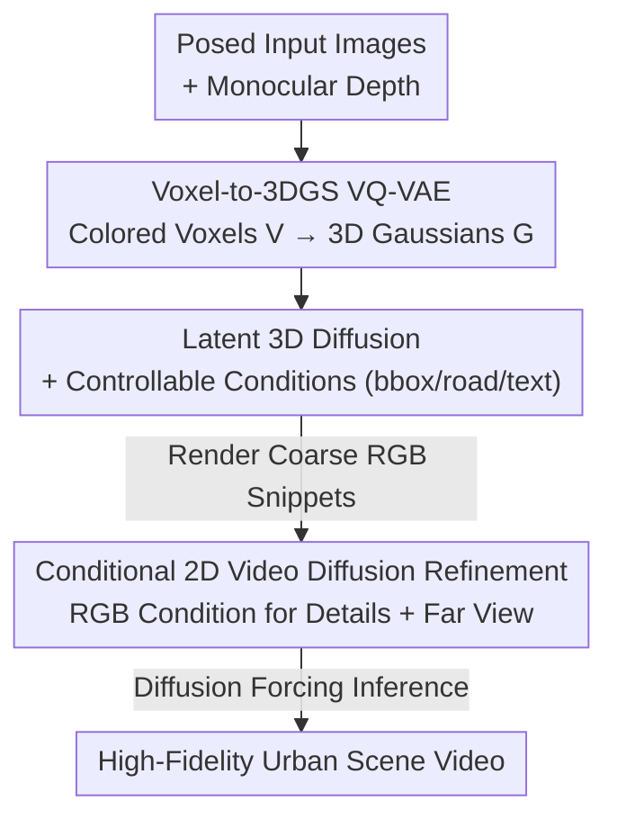

# ScenDi: 3D-to-2D Scene Diffusion Cascades for Urban Generation

**Conference**: CVPR 2026  
**Paper**: [CVF Open Access](https://openaccess.thecvf.com/content/CVPR2026/html/Guo_ScenDi_3D-to-2D_Scene_Diffusion_Cascades_for_Urban_Generation_CVPR_2026_paper.html)  
**Code**: None (Project page only: https://xdimlab.github.io/ScenDi)  
**Area**: Diffusion Models / 3D Vision  
**Keywords**: Urban Scene Generation, 3D Gaussian Splatting, Cascaded Diffusion, Video Diffusion, Camera Controllability

## TL;DR
ScenDi decomposes urban scene generation into a "3D coarse generation → 2D refinement" cascaded diffusion process. It first employs a 3D Latent Diffusion Model to generate a 3D Gaussian scene with coarse appearance (ensuring camera controllability) and then utilizes a video diffusion model to refine details and synthesize distant backgrounds on the rendered frames, achieving both high-fidelity quality and precise camera trajectories on Waymo and KITTI-360.

## Background & Motivation
**Background**: Generating 3D urban scenes from scratch (either unconditionally or with coarse guidance like text/layout) is a critical step for building open worlds in games and autonomous driving simulations. Unlike "Image-to-Video (I2V)," which extends input frames from a given perspective, scene generation requires creating an entire environment that is geometrically consistent, realistically appearing, and freely renderable from any viewpoint.

**Limitations of Prior Work**: Two mainstream approaches have inherent drawbacks. ① Pure 3D routes (directly generating occupancy/semantic voxels in 3D space) provide explicit spatial structure and natural support for camera control but are limited by the low resolution of 3D representations, resulting in blurry rendered details; furthermore, 3D GT data capable of direct high-fidelity rendering is extremely scarce. ② "3D Geometry + 2D Rendering" hybrid routes: these first generate 3D semantic voxels and then render depth/semantic maps as conditions for a video diffusion model. However, the final appearance is synthesized **entirely** by the 2D model from scratch. The model must learn a complex mapping from depth/semantics to RGB, leading to training inefficiency and a lack of consistency when revisiting the same location.

**Key Challenge**: To what extent should the generation process occur in 3D space vs. 2D space? Pure 3D sacrifices image quality, while pure 2D (or 3D providing only geometry) sacrifices consistency and training efficiency.

**Core Idea**: The 3D stage should provide not only geometry but also a **coarse RGB appearance**—this is the key distinction from previous methods where 3D only provided geometric cues. The 2D model then only needs to perform refinement (similar to super-resolution) on this coarse appearance rather than synthesizing all appearance from zero. This simultaneously enhances training efficiency and loop-closure consistency, while the explicit 3DGS backbone preserves camera controllability.

## Method

### Overall Architecture
ScenDi is a 3D-to-2D cascaded diffusion pipeline (the name "ScenDi" is derived from the Italian "descend," corresponding to the cascade from 3D to 2D), consisting of two major stages. **3D Generation Phase**: First, multiple posed input images are back-projected and fused into a global colored point cloud using an off-the-shelf monocular depth estimator, then discretized into a colored voxel grid $V$. A Voxel-to-3DGS VQ-VAE feed-forward maps $V$ into a set of 3D Gaussian primitives $G$ (capable of rendering multi-view consistent images at low resolution). A 3D Latent Diffusion Model is then trained in the VQ-VAE latent space to sample coarse 3D scenes from pure noise, optionally controlled by 3D bounding boxes, road maps, or text. **2D Refinement Phase**: Taking video snippets $\tilde{C}$ rendered from the 3DGS as conditions, a conditional video diffusion model is finetuned to add high-frequency details to the foreground and synthesize distant backgrounds beyond the voxel range. During inference, Diffusion Forcing ensures consistency across snippets.

### Key Designs

**1. Voxel-to-3DGS VQ-VAE: Learning a Feed-forward Voxel-to-3DGS Reconstructor from 2D Supervision**
The pain point is that training 3D diffusion requires massive 3D GT, yet 3D Gaussian optimization for urban scenes is too slow to scale. ScenDi bypasses this by avoiding 3D GT, using monocular depth estimators instead: given posed images $\{I_i\}$ within a volume, depths $\{D_i\}$ are estimated, back-projected, and fused into a unified coordinate system based on camera poses. A consistency check module filters inaccurate depths and outliers, resulting in a global RGB point cloud discretized into colored voxels $V \in \mathbb{R}^{H\times W\times D\times 3}$. The VQ-VAE encodes, quantizes, and decodes $V$ into 3D Gaussians: $z^V = E^{3D}_\theta(V),\ z^V_q = Q^{3D}_\theta(z^V),\ G = D^{3D}_\theta(z^V_q)$. The decoder has two branches: an occupancy branch predicting voxel occupancy $O$, and a feature branch providing a feature volume $F$. Occupied voxels use MLP heads to predict Gaussian attributes: color $c$, opacity $\alpha$, scale and rotation $s, R$, and offset $\Delta o$ relative to the voxel center, then rendered via function $\pi$. This transforms 3D representation acquisition from per-scene optimization to a single feed-forward pass, with supervision coming entirely from 2D images, enabling scalability.

**2. Latent 3D Diffusion + Explicit Controllable Conditions: Generation in 3D Latent Space with Direct 3D Constraints**
After training the VQ-VAE, a DiT-style 3D noise estimator is trained on its latent space. Forward noise is added via $z^V_t = \sqrt{\alpha_t}z^V_0 + \sqrt{1-\alpha_t}\epsilon$, using v-prediction to solve for the clean latent $\hat{z}^V_0 = \sqrt{\alpha_t}z^V_t - \sqrt{1-\alpha_t}\epsilon^{3D}_\theta(z^V_t;t,c)$. Inference uses DDIM for denoising. Controllability is a focus: since generation occurs in 3D space, layout conditions do not need to be rendered into 2D—a 3D condition volume (one-hot semantic labels per voxel) is constructed and concatenated with the latent code. Text conditions are injected via cross-attention. "Generating in 3D + using explicit 3D representations" is the source of camera controllability, which 2D-only methods lack.

**3. Conditional 2D Video Diffusion Refinement: Using Rendered RGB (Not Depth) as Condition for Details and Backgrounds**
Images rendered from the 3D LDM are multi-view consistent and camera-decoupled but blurry due to resolution limits and cannot model distant areas. ScenDi leverages pre-trained video diffusion priors as a "refiner" rather than a "generator from scratch." For a target RGB snippet $C$ and its corresponding VQ-VAE rendering $\tilde{C}$, both are mapped to latent space $z^C, z^{\tilde{C}}$ using a frozen VAE. Noise is added only to $z^C$, and $z^C_t$ is **concatenated** channel-wise with $z^{\tilde{C}}$ as U-Net input to learn the conditional noise estimator $\epsilon_\phi(z^C_t; t, z^{\tilde{C}})$. Critically, the condition is **rendered RGB** rather than depth/semantics: RGB directly provides texture cues, allowing the 2D model to perform super-resolution-style refinement, leading to higher efficiency and better revisit consistency (Ablation Tab. 3 proves: KITTI-360 RGB condition FID 36.9 vs. depth condition 78.6).

**4. Diffusion Forcing Inference: Preventing Abrupt Transitions in Distant Backgrounds across Snippets**
Since training is performed on short snippets (max 5/17 frames), naive replacement stitching causes "flickering" in distant backgrounds between adjacent snippets in long sequences. ScenDi adopts Diffusion Forcing: during finetuning, different noise levels are sampled independently for each frame within a snippet. During sampling, $W$ already generated frames serve as conditions for the subsequent $F-W$ frames, with the time embedding set to $t=[\underbrace{t_\epsilon,\dots,t_\epsilon}_{W},\underbrace{t,\dots,t}_{F-W}]$, where $t_\epsilon$ is a small timestep. This forces subsequent frames to denoise conditioned on generated frames, ensuring coherent backgrounds across clips.

### Loss & Training
Training occurs in three stages. ① **VQ-VAE Reconstruction**: Geometry is constrained by BCE between predicted occupancy and input voxels; appearance follows 3DGS L1+SSIM plus a foreground mask loss. $M$ frames are sampled per scene for 2D loss: $L_{recon}=L_{3D}+\sum_m L^m_{2D}$, where $L_{3D}=\lambda_{bce}L_{bce}+\lambda_{vq}L_{VQ}$ and $L_{2D}=\lambda_{rgb}L_1+\lambda_{ssim}L_{ssim}+\lambda_{fg}L_{fg}$ ($\lambda_{bce}=1, \lambda_{vq}=0.25, \lambda_{rgb}=0.8, \lambda_{ssim}=0.2, \lambda_{fg}=0.5$). ② **3D Diffusion**: clean sample supervision via MSE $L^{3D}_{diff}=\|z^V_0-\hat{z}^V_0\|^2$. ③ **2D Diffusion Refinement**: follows the backbone's loss $L^{2D}_{diff}=\|z^C_0-\hat{z}^C_0\|^2$. Two 2D variants (SVD and Wan2.1-1.3B-i2v) were trained; KITTI-360 and Waymo were jointly trained with dataset ID embeddings. Using 8×A100s, VQ-VAE took ~2 days, 3D Diffusion ~3 days, and 2D Finetuning ~5 days.

## Key Experimental Results

### Main Results
Comparison on KITTI-360 against 3D generation and I2V baselines (FID/KID/FVD lower is better; TransErr/RotErr measure camera controllability):

| Method | Type | Backbone | FID↓ | KID↓ | FVD↓ | Met3R↓ | TransErr↓ | RotErr↓ |
|------|------|----------|------|------|------|--------|-----------|---------|
| DiscoScene | 3D Gen | 3D GAN | 135.3 | 0.093 | 2025.9 | 0.544 | 5.45 | 2.07 |
| CC3D | 3D Gen | 3D GAN | 90.8 | 0.091 | 706.1 | 0.248 | 1.82 | 1.76 |
| UrbanGen | 3D Gen | 3D GAN | 33.0 | 0.017 | 300.1 | 0.220 | 0.21 | 0.25 |
| **Ours** | 3D Gen | SVD | 36.9 | 0.026 | 400.3 | 0.214 | 0.23 | 0.13 |
| **Ours** | 3D Gen | WAN2.1 | **22.9** | **0.016** | **262.6** | **0.125** | **0.06** | 0.23 |
| Vista | I2V | SVD | 25.6 | 0.016 | 234.0 | 0.091 | 2.33 | 0.74 |
| Gen3C | I2V | Cosmos | 24.1 | 0.012 | 426.1 | 0.148 | 0.04 | 0.11 |

The WAN variant leads the 3D generation category significantly (FID 22.9 / Met3R 0.125), and camera precision far exceeds pure 3D GAN baselines. While FID/FVD comparisons with I2V methods aren't strictly fair (as I2V frames often overlap with GT), ScenDi provides comparable image quality and does not collapse when the overlap between input and current view is minimal, unlike Gen3C.

### Ablation Study

| Configuration | Key Metrics | Explanation |
|------|---------|------|
| w/o $L_{bce}$, G=1 | PSNR 21.47 / SSIM 0.750 / LPIPS 0.327 | Removing occupancy supervision degrades geometry |
| w/ $L_{bce}$, G=6 | PSNR 21.53 / SSIM 0.753 / LPIPS 0.317 | 6 Gaussians per voxel provides only marginal gains |
| w/ $L_{bce}$, G=1 (Ours) | PSNR 21.56 / SSIM 0.753 / LPIPS 0.321 | Default config balancing memory and performance |

**Ablation of 2D Conditioning Signal (same training steps)**:

| Condition | KITTI-360 FID↓ | KITTI-360 KID↓ | Waymo FID↓ | Waymo KID↓ |
|------|----------------|----------------|------------|------------|
| Depth Condition | 78.6 | 0.070 | 77.4 | 0.071 |
| RGB Condition (Ours) | **36.9** | **0.026** | **41.3** | **0.030** |

### Key Findings
- **RGB condition crushes Depth condition**: For the same training effort, FID dropped from 78.6 to 36.9 because RGB provides texture directly, allowing the 2D model to focus on refinement. Under depth conditions, surfaces were rougher and noisier, with inconsistent appearance upon revisit.
- **Multiple Gaussians per voxel yield diminishing returns**: Increasing G from 1 to 6 provided minimal gains; default is G=1 to save memory.
- **BCE occupancy supervision is beneficial**: While VQ-VAE can converge with pure 2D supervision, occupancy prediction is less accurate, leading to slight performance drops.
- **Diffusion Forcing solves inter-snippet jumping**: Without it, distant backgrounds change drastically; with it, backgrounds remain coherent across adjacent clips.

## Highlights & Insights
- **Heuristically re-partitioning 3D/2D responsibilities**: The core insight is that the "3D stage should output a coarse RGB appearance, not just geometry." This downgrades the 2D model's task from "synthesizing RGB from semantics/depth" to "refining existing coarse appearance," benefiting both training efficiency and consistency.
- **Scalable 3D GT via monocular depth + consistency checks**: By bypassing per-scene optimization, the VQ-VAE learns the voxel-to-Gaussian mapping via 2D supervision. This "off-the-shelf depth estimator as a 3D data factory" approach is transferable to other tasks lacking 3D GT.
- **Explicit 3D Skeleton as the Root of Camera Controllability**: Compared to I2V/2D-only methods, explicit 3DGS ensures camera precision remains stable even under large viewpoint extrapolations (OOD translation/rotation), where pure 3D GANs fail in image quality and even pose estimation tools like DUSt3R cannot recover poses.

## Limitations & Future Work
- **2D quality is bottlenecked by the 3D stage**: The upper bound of video diffusion depends on the preceding 3D LDM. If 3D generation is poor, 2D refinement can only mitigate some artifacts but cannot recover from fundamental failures.
- **Data limitations and sampling constraints**: Based on Waymo (~20k) and KITTI-360 (~35k) samples, filtering is required for sharp turns, slow speeds, or large dynamic objects. The scope is biased toward forward-moving trajectories. Dynamic object performance was not fully explored.
- **Future Directions**: Scaling training data and model sizes to improve native 3D scene generation; strengthening the 3D stage is the only way to raise the entire cascade's performance ceiling.

## Related Work & Insights
- **vs. Pure 3D Generation (DiscoScene / CC3D / UrbanGen / GaussianCity)**: These rely solely on 3D backbones, offering explicit structures but blurry details due to 3D resolution limits. ScenDi adds a 2D refiner to recover high-frequency details.
- **vs. "3D Geometry + 2D Rendering" Hybrids (UrbanGen-like)**: Their 3D stages provide only geometric cues; ScenDi's 3D stage produces coarse RGB, making 2D refinement more efficient and consistent.
- **vs. Image-to-Video (Vista / Gen3C)**: These possess high quality due to internet-scale 2D priors but lack explicit 3D information, leading to weaker camera control (e.g., curved roads being straightened).
- **vs. SDS Distillation (Urban Architect, etc.)**: SDS/VSD-based distillation into 3D representations is extremely slow per scene and prone to over-saturation. ScenDi's feed-forward sampling + one-pass refinement is faster and more stable.

## Rating
- Novelty: ⭐⭐⭐⭐ The re-partitioning of "3D for coarse RGB, 2D for refinement" is simple yet effective, and the 3D-to-2D cascade framework is comprehensive.
- Experimental Thoroughness: ⭐⭐⭐⭐ Evaluated across two datasets, against both 3D and I2V baselines, including image quality, camera controllability, and consistency; however, lacks code and deep analysis of dynamic scenes.
- Writing Quality: ⭐⭐⭐⭐ Motivation and methodological chain are clearly articulated; formulas and diagrams are well-coordinated.
- Value: ⭐⭐⭐⭐ Provides a practical route balancing image quality and camera controllability for autonomous driving simulation and open-world generation.

<!-- RELATED:START -->

## Related Papers

- [\[CVPR 2025\] Lifting Motion to the 3D World via 2D Diffusion](../../CVPR2025/image_generation/lifting_motion_to_the_3d_world_via_2d_diffusion.md)
- [\[CVPR 2026\] StyleTextGen: Style-Conditioned Multilingual Scene Text Generation](styletextgen_style-conditioned_multilingual_scene_text_generation.md)
- [\[CVPR 2026\] A Self-Conditioned Representation Guided Diffusion Model for Realistic Text-to-LiDAR Scene Generation](a_self-conditioned_representation_guided_diffusion_model_for_realistic_text-to-l.md)
- [\[CVPR 2026\] 3D Space as a Scratchpad for Editable Text-to-Image Generation](3d_space_as_a_scratchpad_for_editable_text-to-image_generation.md)
- [\[CVPR 2025\] Move-in-2D: 2D-Conditioned Human Motion Generation](../../CVPR2025/image_generation/move-in-2d_2d-conditioned_human_motion_generation.md)

<!-- RELATED:END -->
## Related Papers

- [\[CVPR 2025\] Lifting Motion to the 3D World via 2D Diffusion](../../CVPR2025/image_generation/lifting_motion_to_the_3d_world_via_2d_diffusion.md)
- [\[CVPR 2026\] StyleTextGen: Style-Conditioned Multilingual Scene Text Generation](styletextgen_style-conditioned_multilingual_scene_text_generation.md)
- [\[CVPR 2026\] 3D Space as a Scratchpad for Editable Text-to-Image Generation](3d_space_as_a_scratchpad_for_editable_text-to-image_generation.md)
- [\[CVPR 2025\] Move-in-2D: 2D-Conditioned Human Motion Generation](../../CVPR2025/image_generation/move-in-2d_2d-conditioned_human_motion_generation.md)
- [\[CVPR 2026\] PhysGen: Physically Grounded 3D Shape Generation for Industrial Design](physgen_physically_grounded_3d_shape_generation_for_industrial_design.md)

<!-- RELATED:END -->
