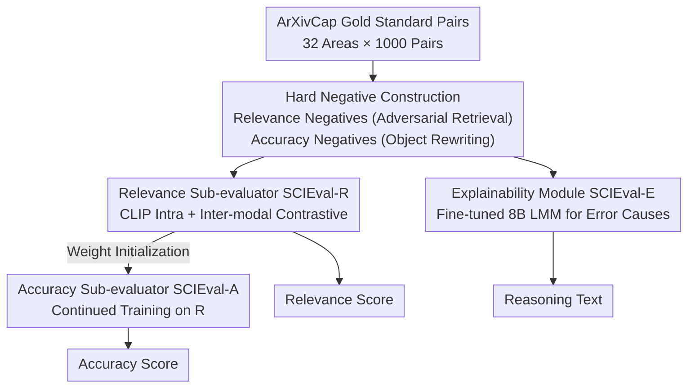

# SCIEval: Evaluating and Benchmarking the Faithfulness of Scientific Image Generation and Interpretation with Large Multimodal Models

**Conference**: CVPR 2026  
**Paper**: [CVF Open Access](https://openaccess.thecvf.com/content/CVPR2026/html/Ye_SCIEval_Evaluating_and_Benchmarking_the_Faithfulness_of_Scientific_Image_Generation_CVPR_2026_paper.html)  
**Code**: Project Page https://SCIEval.github.io  
**Area**: Diffusion Models / Image Generation Evaluation  
**Keywords**: Scientific Images, Faithfulness Evaluation, CLIP Contrastive Learning, Explainable Evaluation, Benchmark

## TL;DR
SCIEval is a faithfulness evaluator specifically designed for "scientific images" (line charts, binary trees, molecular formulas, etc., containing precise numerical/attribute data). It decomposes faithfulness into three dimensions: relevance, accuracy, and explainability. By training two scoring sub-modules via CLIP contrastive learning and fine-tuning a lightweight LMM to generate error explanations, it provides a comprehensive assessment. Accompanied by the manually annotated SCIEval-Bench (6,000 samples), SCIEval achieves significantly higher correlation with human judgment compared to 24 competitors, including GPT-4o.

## Background & Motivation

**Background**: Scientific communication relies heavily on images, catalyzing two inverse tasks: Scientific Text-to-Image (Sci-T2I, generating scientific figures from text) and Scientific Image Captioning (Sci-IC, generating descriptions from scientific figures). Measuring the quality of these results depends on "faithfulness": whether the generated image/text accurately reflects the scientific details in the source.

**Limitations of Prior Work**: Existing faithfulness evaluation methods are inadequate. ① Current metrics (e.g., TIFA targets T2I via VQA, VALOR-Eval targets IC via object hallucination detection) are designed for **natural images**, handle only single tasks, and provide a single merged score without explanation. ② Expert human evaluation is accurate but prohibitively expensive—for example, ScImage spent $3,000 for 11 scientists to evaluate 3,000 images, which is not scalable. ③ Directly using general LMMs (e.g., Qwen-VL, ALIGNScore, CLIPScore) as judges shows weak correlation with human judgment (Kendall coefficient < 0.3 on ScImage). ④ State-of-the-art automatic judges like the GPT series (GPT-4o) suffer from high API costs and black-box opacity.

**Key Challenge**: Faithfulness in scientific images requires **precise numerical and attribute** alignment (e.g., "four blue lines," "seven binary tree nodes") rather than just "sketching lines/trees." Metrics for natural images focus on whether "entities exist," failing to distinguish these fine-grained errors.

**Goal**: Develop a unified, automatic, reference-free, fine-grained, and lightweight faithfulness evaluator for both Sci-T2I and Sci-IC that provides error explanations, accompanied by a dedicated human-annotated benchmark.

**Key Insight**: The authors explicitly decompose "faithfulness" into three complementary dimensions: Relevance (overall image-text correspondence), Accuracy (technical details of scientific objects), and Explainability (pointing out specific unfaithful elements). The first two are quantifiable scores, while the third provides natural language reasoning.

**Core Idea**: Using CLIP as a backbone, fine-grained perception of scientific images is injected into the encoders via "hard negatives + intra/inter-modal contrastive learning" (to create SCIEval-R and SCIEval-A). A lightweight 8B LMM is then fine-tuned with supervised reasoning signals to produce error explanations (SCIEval-E). Together, these form a low-cost evaluator that aligns more closely with human judgment than GPT-4o.

## Method

### Overall Architecture
The goal of SCIEval is to take a scientific text-image pair (⟨Text T, Image I⟩ for T2I; ⟨Image I, Caption C⟩ for IC) and output a relevance score, an accuracy score, and a reasoning text explaining any unfaithfulness. The system is supported by a "task-aligned three-stage training framework": training data with hard negatives is first constructed from ArXivCap, followed by CLIP contrastive learning to train the relevance sub-evaluator (SCIEval-R) and the accuracy sub-evaluator (SCIEval-A). Finally, a lightweight LMM is fine-tuned with reasoning signals to obtain the explainability module (SCIEval-E). Inference produces scores and reasons using only the two CLIP encoders and the LMM.

### Key Designs

**1. Three-Dimensional Decomposition of Faithfulness: Separating "Similarity" into Optimizable Components**

The authors argue against the conventional "single merged score" because failure modes in scientific images differ: some involve the wrong overall object (relevance), while others involve the correct object but incorrect attributes/values (accuracy, e.g., 5 nodes instead of 7). Faithfulness is split into: Relevance (R) for overall correspondence, Accuracy (A) for technical details, and Explainability (E) for identifying specific unfaithful elements. R and A are constrained to $[0,1]$, while E is unconstrained text. This routing of failure modes improves discrimination and provides built-in explanations for score deductions.

**2. Hard Negative Construction: Adversarial Retrieval and Object Rewriting**

Standard gold pairs ⟨I_T, C_T⟩ do not provide enough fine-grained discriminative power. The authors construct hard negatives in two ways. For Relevance: Following SciFIBench’s adversarial filtering, each caption is encoded into a vector $x_C \in \mathbb{R}^d$ and stored in a Faiss index. Nearest neighbor retrieval is used to find the most similar caption $C_R$ and its original image $I_R$, yielding two hard negatives ⟨I_T, C_R⟩ and ⟨I_R, C_T⟩ that are semantically close but mismatched. For Accuracy: Target captions $C_T$ are edited (changing quantities, attributes, or spatial relations) to create $C_A$. A lightweight LMM (SEED-X) then serves as an image editor to modify the original image $I_T$ based on $C_A$, producing $I_A$. This yields accuracy negatives ⟨I_T, C_A⟩ and ⟨I_A, C_T⟩. The modification $\mathrm{diff}(C_T, C_A)$ serves as the supervision signal for training SCIEval-E.

**3. Intra-modal + Inter-modal Contrastive Learning: Injecting Scientific Perception into CLIP**

SCIEval-R and SCIEval-A use the same CLIP contrastive strategy (A is initialized from R to retain scientific knowledge). The intra-modal loss $L_{IM}$ separates negative samples within the same modality in feature space: for the visual side, $L_{IMv} = \max\{0, s(Z_{I_T}, Z_{I_F}) - \epsilon_v\}$, where $s$ is cosine similarity and $\epsilon_v$ (e.g., 0.2) is a margin threshold. The inter-modal loss $L_{CM}$ pulls matching pairs together and pushes mismatched pairs apart. The positive term is $L^P_{CM} = \exp(s(Z_{I_T}, Z_{C_T})/\tau) + \exp(s(Z_{I_F}, Z_{C_F})/\tau)$, and the negative term $L^N_{CM}$ uses mismatched pairs ⟨I_F, C_T⟩ and ⟨I_T, C_F⟩. The total loss is $L = L_{CM} + \frac{1}{2}(L_{IMt} + L_{IMv})$. CLIP is chosen for efficiency: training and inference take only 3 hours on 4x RTX 3090 GPUs.

**4. SCIEval-E SFT + SCIEval-Bench**

SCIEval-E is an mPLUG-owl3 (8B) model fine-tuned on triplets $(I_T, C_A, \mathrm{diff}(C_T, C_A))$ to point out error causes using templates like "The scientific detail should be [Ground Truth] rather than [Fake Value]." To validate the metrics, SCIEval-Bench was created: 600 high-quality gold pairs across CS, Bio, Econ, Physics, etc. (non-CS summarized as General) were sampled. For T2I, images were generated by Llama-python, Llama-tikz, Stable Diffusion, and DALL-E. For IC, captions were generated by LLaVA-1.6, IDEFICS-2, Qwen-VL, and DeepSeek-VL. Each sample (3,000 for each task) was annotated by three CS PhDs on a 1–5 scale. The total cost was ~$1,200, significantly lower than prior human evaluation efforts.

### Loss & Training
- Total loss for CLIP sub-modules: $L = L_{CM} + \frac{1}{2}(L_{IMt} + L_{IMv})$, where $L_{CM}$ uses InfoNCE and $L_{IM}$ uses a hinged margin loss.
- Strategy: Train SCIEval-R first, initialize SCIEval-A with those weights to transfer scientific knowledge, and then perform independent SFT for SCIEval-E.
- Data: 32,000 pairs across 32 scientific domains from ArXivCap.

## Key Experimental Results

### Main Results
Reliability is measured by the Spearman and Pearson correlation coefficients (%) between automatic scores and human judgment. The table below shows results for the CS subset of Sci-T2I and Sci-IC (Spearman / Pearson):

| Method | T2I·CS Rel. | T2I·CS Acc. | IC·CS Rel. | IC·CS Acc. |
|------|------|------|------|------|
| GPT-4o (Prev. SOTA) | 71.3 / 70.5 | 66.7 / 66.0 | 72.8 / 72.4 | 67.2 / 67.3 |
| Gemini 1.5 Pro | 70.9 / 70.2 | 66.5 / 66.1 | 71.4 / 70.9 | 66.8 / 66.3 |
| TIFA (T2I specialized) | 45.2 / 44.3 | 42.6 / 42.1 | — | — |
| CLIPScore | 42.6 / 42.5 | 40.4 / 39.6 | 45.5 / 44.7 | 38.2 / 37.8 |
| **SCIEval (Ours)** | **74.1 / 73.2** | **69.4 / 68.2** | **75.9 / 75.6** | **69.9 / 69.1** |

SCIEval outperforms all 24 competitors across all CS categories. Similar trends are observed in the General subset (e.g., T2I·General Rel. 68.5/68.2, leading GPT-4o's 64.9/65.1).

Evaluation of reasoning quality (5-point scale, Human/LMM-as-Judge):

| Model | Human·Correct. | Human·Complet. | LMM·Correct. | LMM·Complet. |
|------|------|------|------|------|
| InstructBLIP | 3.6 | 2.8 | 3.3 | 2.7 |
| Gemini 1.5 Pro | 4.4 | 3.3 | 4.2 | 3.8 |
| GPT-4V | 4.5 | 3.5 | 4.4 | 3.9 |
| **SCIEval (Ours)** | **4.7** | **4.2** | **4.4** | **4.3** |

SCIEval is notably superior to GPT-4V in completeness (Human 4.2 vs 3.5), proving that 3D decomposition and reasoning supervision make explanations more precise.

### Ablation Study
The paper analyzes drivers of gain through cross-model comparisons rather than simple module removal:

| Dimension | Key Metric | Observation |
|------|------|------|
| Closed vs. Open LMM | T2I·CS Rel. diff ~30.1% | Top closed LMMs significantly outperform open LMMs; the strongest open LMM (InstructBLIP-13b) lags behind the weakest closed LMM (Claude 3 Haiku). |
| Specialized vs. General | TIFA 45.2 > Open LMM | Specialized metrics like TIFA/VALOR-Eval outperform generic LMMs, highlighting the value of task customization. |
| Model Scale | Large ≠ Better | For InstructBLIP, larger scale did not yield significant gains, suggesting >10B parameters might not be necessary for evaluation. |

### Key Findings
- SCIEval achieves SOTA performance surpassing GPT-4o in 3 hours on 4x RTX 3090s, proving "distilling" faithfulness into CLIP encoders is highly cost-effective.
- While a massive gap exists between closed and open LMMs, task-specialized metrics can partially bridge this gap.
- Evaluating Sci-T2I is **not necessarily** harder than Sci-IC for LMM judges. While generating scientific images is harder, LMM performance for evaluation was similar across both tasks.

## Highlights & Insights
- **Scalable Hard Negative Generation**: Using CLIP+Faiss for semantic neighbors and LMM-based "targeted editing" to generate $\mathrm{diff}$ signals are techniques transferable to any fine-grained alignment task.
- **"Score with Built-in Reason"**: Treating explainability as an independent dimension allows the evaluator to provide actionable feedback (e.g., "should be X, not Y"), which is directly useful for model debugging.
- **Cost-Efficiency as a Core Selling Point**: 3 hours training / 4x RTX 3090 / ~$1,200 labeling cost. This demonstrates that "small and specialized" models can outperform "large and general" ones in evaluation scenarios.

## Limitations & Future Work
- The benchmark samples are derived from 600 gold pairs with only 3 CS PhD annotators; the "General" category is a mixture of fields, potentially lacking depth in biology or physics.
- SCIEval is CLIP-based, inheriting CLIP's limits in perceiving extremely fine scientific symbols (e.g., complex formulas or specific axis labels).
- Accuracy negative generation depends on the SEED-X editor; quality issues in edited images may introduce noise. Structured reasoning templates may also limit generalization to open-ended scientific errors.

## Related Work & Insights
- **vs. TIFA / VALOR-Eval**: These target only one task (T2I or IC), are built for natural images, and lack explanations. SCIEval provides a unified framework for both, focused on scientific data with explainable scores.
- **vs. Generic LMM Judges (GPT-4o)**: While general LMMs have broad capabilities, they are expensive, black-box, and show lower human correlation. SCIEval distills this into a lightweight, high-correlation alternative.
- **vs. CLIPScore / BLIP2Score**: These rely on one-shot alignment similarity and are insensitive to scientific nuances. SCIEval explicitly trains for fine-grained discrimination using hard negatives.

## Rating
- Novelty: ⭐⭐⭐⭐ First faithfulness metric for scientific images covering both T2I/IC with built-in reasoning; innovative 3D decomposition and negative construction.
- Experimental Thoroughness: ⭐⭐⭐⭐ Compared against 24 methods across two tasks and two domains; human and LMM-based evaluation of reasoning quality.
- Writing Quality: ⭐⭐⭐⭐ Clear motivation and decomposition; helpful diagrams for data construction and training.
- Value: ⭐⭐⭐⭐ A low-cost, explainable scientific image evaluator and a 6,000-sample benchmark serve as practical infrastructure for the field.

<!-- RELATED:START -->

## Related Papers

- [\[CVPR 2026\] MICON-Bench: Benchmarking and Enhancing Multi-Image Context Image Generation in Unified Multimodal Models](micon-bench_benchmarking_and_enhancing_multi-image_context_image_generation_in_u.md)
- [\[ACL 2026\] Multimodal Large Language Models for Multi-Subject In-Context Image Generation](../../ACL2026/image_generation/multimodal_large_language_models_for_multi-subject_in-context_image_generation.md)
- [\[CVPR 2026\] Evaluating Reasoning Fidelity in Visual Text Generation](evaluating_reasoning_fidelity_in_visual_text_generation.md)
- [\[CVPR 2026\] Omni IIE Bench: Benchmarking the Practical Capabilities of Image Editing Models](omni_iie_bench_benchmarking_the_practical_capabilities_of_image_editing_models.md)
- [\[CVPR 2026\] Evaluating Generative Models via One-Dimensional Code Distributions](evaluating_generative_models_via_one-dimensional_code_distributions.md)

<!-- RELATED:END -->
