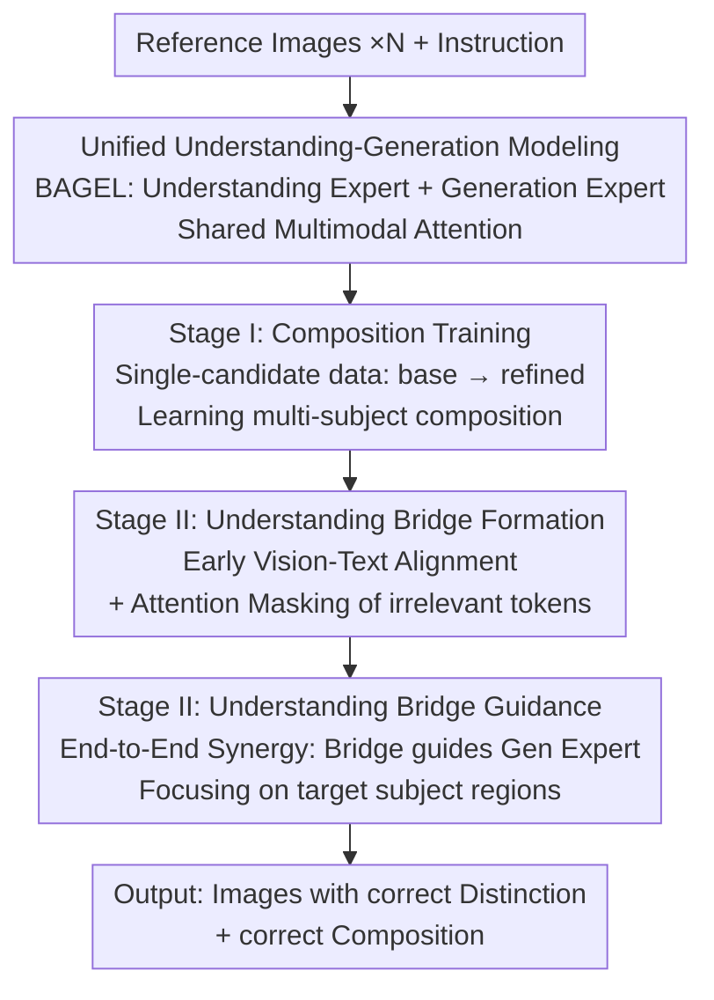

# Scone: Bridging Composition and Distinction in Subject-Driven Image Generation via Unified Understanding-Generation Modeling

**Conference**: CVPR 2026  
**arXiv**: [2512.12675](https://arxiv.org/abs/2512.12675)  
**Code**: https://github.com/Ryann-Ran/Scone (Available)  
**Area**: Diffusion Models / Subject-driven Image Generation  
**Keywords**: Subject-driven generation, Unified understanding-generation modeling, Semantic bridge, Attention mask, Subject distinction

## TL;DR
Scone builds upon the unified understanding-generation model BAGEL by transforming the "understanding expert" into a **semantic bridge**. Through early multimodal alignment and attention masking to filter out irrelevant subjects in reference images, it guides the "generation expert" in an end-to-end manner. This enables the model to accurately "identify then generate" even when a reference image contains multiple candidate subjects, achieving state-of-the-art performance among open-source models on OmniContext.

## Background & Motivation
**Background**: Subject-driven image generation has evolved from single-subject to multi-subject composition. The mainstream approach involves feeding several reference images into a Diffusion model or DiT to compose multiple subjects into a single output based on instructions. The primary competition lies in how many reference images and subjects can be combined.

**Limitations of Prior Work**: These methods assume that reference images are "clean"—each image containing only one prominent subject. However, real-world images are often cluttered: a single reference image might contain several candidate subjects, while the instruction specifies only one. Current models exhibit a neglected capability gap called **distinction**: they fail to discern which subject to draw, leading to either missing subjects or incorrect subject generation. The authors name this the "distinction problem."

**Key Challenge**: Distinction is essentially a **semantic understanding** task (interpreting which part of the reference image "the man with green hair" refers to). Pure generation models excel at pixel reconstruction but are weak in semantic alignment. Similarity visualizations (Fig.1b/2a) prove that in unified models, the semantic similarity between the instruction and the reference image encoded by the understanding expert is significantly higher than that of the generation expert. Moreover, the understanding expert begins focusing on "instruction-relevant regions" at much shallower layers. However, relying solely on the understanding expert is insufficient due to its inherent bias, which can lead to "correct semantics but misaligned generation" (Fig.1c).

**Goal**: (1) Add the capability to discern and generate only the target subject from multi-candidate reference images while maintaining multi-subject composition skills; (2) Avoid external understanding modules, additional parameters, or test-time tricks.

**Key Insight**: Utilize a **unified understanding-generation model** (containing both understanding and generation experts sharing multimodal attention). This architecture offers two natural advantages: the understanding expert captures semantic cues earlier to locate candidate subjects, and the unified framework supports end-to-end synergy, allowing generation feedback to correct understanding biases.

**Core Idea**: Treat the understanding expert as a "semantic bridge." First, let it learn to "comprehend instructions and filter irrelevant subjects" through multimodal alignment and attention masks. Then, transmit this clean semantic guidance to the generation expert for end-to-end joint optimization.

## Method

### Overall Architecture
Scone uses BAGEL (a Mixture-of-Transformer-Experts architecture where the understanding expert processes ViT image tokens + instruction tokens, and the generation expert processes VAE image tokens, sharing multimodal attention) as its backbone. It adds **no extra parameters** and follows the original MSE loss. The pipeline consists of **two-stage training**: Stage I focuses on basic multi-subject composition using "single-candidate" data; Stage II introduces "multi-candidate" data to inject distinction capability via the **understanding bridge strategy**. This strategy is divided into two steps: **forming** the semantic bridge (teaching the understanding expert to align semantics and mask irrelevant tokens) and **guiding** the generation expert using this bridge.

### Key Designs

**1. Unified Modeling + Understanding Expert as a Semantic Bridge: Let the "knower" guide the "drawer"**

The fundamental insight is that distinction is a semantic challenge. Generation experts are semantically weak, whereas understanding experts are strong (Fig.2a shows higher similarity between image and text tokens in shallow layers of the understanding expert). Instead of using an external understanding module, Scone reuses the internal understanding expert of BAGEL as a "semantic bridge." It identifies target subjects and relevant regions, passing this high-level semantics to the generation expert. As both experts share attention, this guidance is end-to-end learnable, allowing generation feedback to refine the understanding expert's bias.

**2. Stage I: Composition Training: Solidifying basic "multi-subject puzzles"**

Before injecting distinction, the model must master basic composition. This stage fine-tunes the experts and MLP connectors on **single-candidate data** (where each image contains only one subject, removing ambiguity). Training follows a quality gradient: first, one epoch on 70K "base" single-candidate data for general capability; second, one epoch on 22K "refined" data (filtered by Qwen3-VL based on consistency and instruction following). Ablation (Tab.4) shows this raises the Overall score from 6.03 to 8.02.

**3. Understanding Bridge Formation: Filtering irrelevant subjects via early alignment + attention masks**

This is core to the distinction capability. In Stage II, given multi-candidate data, the understanding expert first learns to act as a semantic bridge. Let the shallow visual hidden states be $\mathbf{h}^v=\{\mathbf{h}^v_i\}_{i=1}^{N_v}$ and text hidden states be $\mathbf{h}^t=\{\mathbf{h}^t_j\}_{j=1}^{N_t}$. After L2 normalization, the cosine similarity matrix $S_{i,j}=\hat{\mathbf{h}}^v_i\cdot\hat{\mathbf{h}}^t_j$ is calculated. The **semantic relevance** for each visual token is computed as $s_i=\frac{1}{N_t}\sum_{j=1}^{N_t}S_{i,j}$. A binary **semantic mask** $\mathbf{M}$ is constructed using a threshold $\tau$ and applied to the "target token → reference token" attention logits in the generation expert:

$$\tilde{A}_{k,i}=A_{k,i}+M_i,\quad M_i=\begin{cases}0,& s_i>\tau,\\ -\infty,& \text{otherwise}.\end{cases}$$

Reference tokens with relevance below the threshold are penalized with $-\infty$, effectively zeroing out their attention. Crucially, it **does not discard tokens** but masks them at the attention level, preserving information flow while suppressing interference. This step is trained for 1k steps.

**4. Understanding Bridge Guidance: End-to-end synergy to align the generator with the bridge**

The second step of Stage II trains both experts for another 1k steps to align generation representations with the semantic cues provided by the bridge. This loop corrects the "understanding bias"—clean semantics alone aren't enough; the generation expert must actually follow those semantics to avoid "correct semantics, wrong generation" (Fig.1c). This synergy allows the understanding expert to refine semantics based on generation feedback while the generation expert preserves subject details.

**5. SconeEval Benchmark: The first evaluation set for both composition and distinction**

Existing benchmarks (DreamBench++, OmniContext) focus on "clean single-subject" composition and rely on DINOv2/CLIP similarity, which is inaccurate for multi-subject scenarios. SconeEval includes 409 samples across Character/Object/Scene domains, 19 case types, and 6 sub-tasks. It categorizes tasks by difficulty: composition (single subject per image), distinction (pick one from many), and distinction & composition (multiple images with multiple candidates). Scoring is performed by GPT-4.1: composition is graded 0–10 on prompt following and consistency; distinction is measured via accuracy/precision/recall/F1. The **distinction score** is the mean of accuracy and F1 (scaled to 0–10).

## Loss & Training
The pipeline uses the original MSE generation loss from BAGEL throughout, with **no new parameters or loss terms**. The two stages consist of four steps: Stage I Step 1 (70K base, 1 epoch) $\to$ Step 2 (22K refined, 1 epoch); Stage II Step 1 bridge formation (1k steps) $\to$ Step 2 bridge guidance (1k steps). Training data includes X2I, MUSAR-Gen, UNO-1M, and Echo-4o-Image, supplemented by 15K self-synthesized multi-input samples and 20K multi-candidate samples.

## Key Experimental Results

### Main Results
Scone is the best among open-source/unified models; closed-source models like GPT-4o still lead.

| Benchmark | Metric | Scone | Base BAGEL | Prev. SOTA (Open) | Closed SOTA (GPT-4o) |
|------|------|-------|-----------|-----------|------------------|
| OmniContext | Average | **8.01** | 6.03 | Echo-4o 7.95 | 8.78 |
| SconeEval | Overall | **8.50** | 6.97 | Echo-4o 8.09 | 8.94 |
| SconeEval | Composition (avg) | **8.21** | 6.74 | Echo-4o 8.05 | 8.98 |
| SconeEval | Distinction (avg) | **8.79** | 7.20 | Echo-4o 8.14 | 8.90 |

- Scone ranks first among open-source models on OmniContext with 8.01 (a +1.98 gain over base BAGEL), approaching Gemini-2.5-Flash-Image (8.07).
- On SconeEval, Scone's distinction score (8.79) significantly outperforms competitors, validating the effectiveness of the understanding bridge.

### Ablation Study
| Stage/Config | COM ↑ | DIS ↑ | Overall ↑ | Description |
|-----------|-------|-------|-----------|------|
| BAGEL Base | 6.74 | 7.20 | 6.97 | Starting point |
| Stage I | 7.94 | 7.78 | 7.86 | Improvement after composition training |
| Stage II (a) Direct | 7.64 | 8.23 | 7.94 | Direct joint fine-tuning of experts |
| Stage II (b) Two-step, w/o bridge | 8.15 | 8.70 | 8.43 | Sequential training without masking |
| Stage II (c) Two-step, w/ bridge | **8.21** | **8.79** | **8.50** | Full understanding bridge (Ours) |

### Key Findings
- **Understanding bridge is the primary source of distinction**: Moving from Direct (7.94) to Two-step w/o bridge (8.43) and then w/ bridge (8.50) shows the value of sequential refinement.
- **Tighter threshold $\tau$ works better**: $\tau$ from 0.82 $\to$ 0.88 improved Overall from 8.46 $\to$ 8.50, suggesting that blocking more irrelevant tokens is beneficial.
- **Best Stability**: Scone shows the lowest standard deviation on SconeEval, indicating stable performance in complex contexts.

## Highlights & Insights
- **Repurposing the understanding expert as a bridge is lightweight and effective**: By reusing internal experts instead of external VLM modules, Scone maintains end-to-end optimization and low latency.
- **"Masking vs. Discarding" is a clever trick**: Applying $-\infty$ to attention logits suppresses interference without breaking the sequence structure, a trick applicable to other conditioned generation tasks.
- **Quantifying "Distinction" is a major contribution**: While the field competes on composition, this paper identifies the failure to pick the correct subject as a bottleneck and provides a metric (accuracy/F1 mean) to quantify it.

## Limitations & Future Work
- **Gap with closed-source models remains**: SconeEval overall 8.50 vs GPT-4o 8.94; there is still room for improvement compared to top-tier LLMs.
- **Reliance on GPT-4.1 as a judge**: Although backed by human studies, the systemic bias of LLM-as-a-judge could affect absolute scores.
- **Boundaries of distinction**: Intra-category cases (e.g., two similar women) remain difficult. Future work could explore adaptive masks or explicit distinction loss terms.

## Related Work & Insights
- **vs. Pure Generation Models (UNO/USO)**: These lack mechanisms to suppress interference in multi-candidate contexts, lead to lower distinction scores.
- **vs. SSR-Encoder**: While SSR-Encoder isolates features, it struggles with complex instructions; Scone's bridge benefits from high-level cross-modal alignment.
- **vs. Other Unified Models (OmniGen2/Echo-4o)**: Scone introduces an active distinction mechanism (the bridge) that significantly elevates the base model's performance in noisy contexts.

## Rating
- Novelty: ⭐⭐⭐⭐ Clearly defines the "distinction" problem and repurposes the understanding expert without adding parameter overhead.
- Experimental Thoroughness: ⭐⭐⭐⭐ Extensive benchmarks, ablation on stages/thresholds, and two user studies.
- Writing Quality: ⭐⭐⭐⭐ Well-motivated by visualizations; clear technical breakdown.
- Value: ⭐⭐⭐⭐ Open-sourced model and benchmark; addresses a practical and overlooked pain point in subject-driven generation.

<!-- RELATED:START -->

## Related Papers

- [\[CVPR 2026\] FlowFixer: Towards Detail-Preserving Subject-Driven Generation](flowfixer_towards_detail-preserving_subject-driven_generation.md)
- [\[CVPR 2026\] Proxy-Tuning: Tailoring Multimodal Autoregressive Models for Subject-Driven Image Generation](proxy-tuning_tailoring_multimodal_autoregressive_models_for_subject-driven_image.md)
- [\[CVPR 2026\] Enhancing Spatial Understanding in Image Generation via Reward Modeling](enhancing_spatial_understanding_in_image_generation_via_reward_modeling.md)
- [\[CVPR 2026\] Learning to Generate via Understanding: Understanding-Driven Intrinsic Rewarding for Unified Multimodal Models](learning_to_generate_via_understanding_understanding-driven_intrinsic_rewarding_.md)
- [\[CVPR 2026\] Unified Customized Generation by Disentangled Reward Modeling](unified_customized_generation_by_disentangled_reward_modeling.md)

<!-- RELATED:END -->
