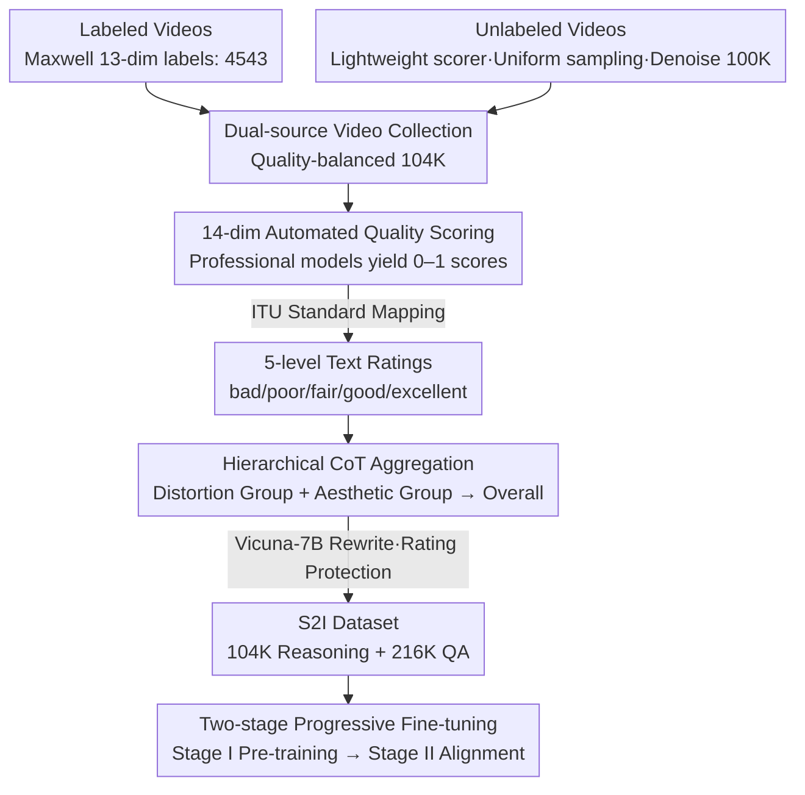

# Score2Instruct: Scaling Up Video Quality-Centric Instructions via Automated Dimension Scoring

**Conference**: CVPR 2026  
**arXiv**: [2506.21011](https://arxiv.org/abs/2506.21011)  
**Code**: [https://github.com/KeiChiTse/S2I](https://github.com/KeiChiTse/S2I)  
**Area**: Image Generation  
**Keywords**: Video Quality Assessment, Instruction Tuning, Automated Scoring, Quality Reasoning, Large Multimodal Models

## TL;DR
Score2Instruct proposes SIG, an automated video quality instruction generation pipeline that requires no human annotation or closed-source APIs. By automatically evaluating 14 quality dimensions and aggregating them into comprehensive quality reasoning text via hierarchical CoT, the authors construct the S2I dataset containing 320K+ instructions. Coupled with a two-stage progressive fine-tuning strategy, several video LMMs simultaneously acquire quality scoring and reasoning capabilities, achieving an average SRCC improvement of 26-31% across five VQA datasets.

## Background & Motivation

**Background**: Traditional Video Quality Assessment (VQA) methods regress a single Mean Opinion Score (MOS) through deep learning. However, this single numerical value cannot describe complex multi-dimensional quality issues (e.g., noise, motion blur, flickering). With the emergence of LMMs, outputting quality justifications through natural language has become feasible.

**Limitations of Prior Work**: (1) Existing quality instruction data generation relies heavily on subjective human evaluation—for instance, Q-Instruct required 39 experts to write 58K descriptions for 18,973 images, which is time-consuming and costly; (2) Data generation depends on closed-source APIs (e.g., GPT-4), limiting scalability and reproducibility; (3) Most work focuses on Image Quality Assessment (IQA), lacking deep understanding of video-specific temporal factors (e.g., flickering, motion blur); (4) Existing methods fail to equip models with both precise scoring and quality reasoning capabilities.

**Key Challenge**: High-quality video quality instruction data requires both extensive dimensional coverage (beyond global scores) and scalable generation methods (independent of humans or closed-source systems). These two requirements have historically been contradictory, as richer dimensions typically necessitate more expert annotation.

**Goal**: (1) Design a fully automated video quality instruction generation pipeline; (2) Cover 14 quality dimensions and aggregate them via cognitive reasoning; (3) Improve both scoring accuracy and reasoning/explanation capabilities of the model.

**Key Insight**: Utilize existing professional video quality assessment models (from practical video processing platforms) to automatically generate quality dimension scores. These continuous scores are mapped to ITU-standard 5-level text ratings, and a hierarchical CoT is used to simulate the reasoning process of the Human Visual System (HVS) to generate complete quality descriptions.

**Core Idea**: Replace human annotation with automated quality dimension scoring and replace closed-source LLMs with hierarchical CoT to construct large-scale, low-cost video quality instruction data.

## Method

### Overall Architecture
The Score-based Instruction Generation (SIG) pipeline consists of three steps: (1) Video source collection—collecting 104K videos with balanced quality distributions from labeled VQA datasets (Maxwell, 4,543 videos) and unlabeled general video repositories (100K videos); (2) Automated dimension scoring—using professional models to evaluate 14 quality dimensions for each video and mapping them to text ratings; (3) Hierarchical CoT aggregation—simulating the HVS reasoning process to aggregate dimension ratings into full quality reasoning text, then expanding them into various QA pairs using an LLM. The resulting S2I dataset (104K reasoning + 216K QA pairs = 320K instructions) is then used for two-stage progressive fine-tuning of video LMMs.

### Key Designs

**1. Dual-source Video Collection: Using labeled data for "quality knowledge" and unlabeled data for "scale"**

VQA datasets are inherently scarce—MOS labels require human scoring, and the overall scale is often only 1/10 to 1/100 of other vision task datasets. This alone cannot support a 320K instruction library. Conversely, directly scraping unlabeled videos leads to heavily skewed quality distributions. This paper splits the sources: the labeled side prioritizes "annotation dimensions" over quantity (Maxwell annotates 13 dimensions per video, providing high information density), so only 4,543 are taken. The unlabeled side uses a lightweight quality evaluator to assign noisy labels to candidates, performs uniform sampling to flatten the distribution, and removes videos with clearly inaccurate noisy labels, leaving 100K videos. Together, these provide 104K videos with balanced quality and sufficient annotation information.

**2. 14-dim Automated Quality Scoring: Transitioning from expert subjective scoring to professional model automated continuous scoring mapped to text ratings**

To enable models to understand video quality, a comprehensive and human-independent multi-dimensional profile is required. The authors systematically enumerate 14 dimensions across four stages of the video lifecycle (shooting, editing, compression, transmission)—including lens clarity, noise, flickering, motion blur, and inter-frame smoothness. Scores are obtained not from crowdsourcing, but from professional models deployed on well-known video platforms, with each dimension outputting a continuous score between $0\text{–}1$ to avoid subjective bias. To bridge the gap between continuous scores and language tokens, scores are discretized into 5-level ITU-standard text ratings (bad / poor / fair / good / excellent). To avoid ambiguity where a model might misunderstand a dimension's polarity (e.g., "flicker is good"), dimension names are replaced with short definitions (e.g., flicker → "the variation smoothness between adjacent frames").

**3. Hierarchical CoT Aggregation: Reasoning from local to global to bridge discrete dimension ratings into complete quality descriptions**

Listing 14 dimension ratings results in a set of discrete labels, lacking the "integrated trade-off" cognitive process of human reviewers. Humans do not view dimensions in isolation; they weigh distortion and aesthetics separately before making a final judgment. The authors categorize the 14 dimensions into distortion-related and aesthetic-related groups. The CoT runs in three bottom-up steps: evaluating the impact of each dimension, deriving an intermediate rating for each group, and finally synthesizing both groups for an overall quality evaluation. The generated reasoning framework is then handed to an open-source LLM (Vicuna-7B) for linguistic diversification, incorporating high-level content descriptions from ShareCaptioner-Video. To prevent the LLM from inadvertently altering the original ratings during rewriting, a specifically designed "rating protection" prompt is used.

### Loss & Training
Two-stage progressive fine-tuning is employed: **Stage I Pre-training**—freezing the LLM and training only the vision encoder and projector to learn simple "dimension name → rating" mappings (100K entries) to establish basic quality perception. **Stage II Instruction Fine-tuning**—unfreezing the LLM (using LoRA, $r=16$) and training on 220K reasoning and QA items to enhance quality reasoning and scoring. Both stages use cross-entropy loss, supervising only the Assistant's response.

## Key Experimental Results

### Main Results (Quality Scoring Capability - SRCC / PLCC)

| Model | S2I | Maxwell | LSVQtest | LSVQ1080p | KoNViD-1k | LIVE-VQC |
|------|-----|---------|----------|-----------|-----------|----------|
| LLaVA-OV-7B | No | 0.474/0.428 | 0.449/0.438 | 0.337/0.311 | 0.392/0.394 | 0.397/0.410 |
| LLaVA-OV-7B | **Yes** | **0.795/0.812** | **0.751/0.730** | **0.671/0.634** | **0.726/0.689** | **0.738/0.752** |
| LLaVA-Video-7B | No | 0.564/0.557 | 0.494/0.446 | 0.422/0.380 | 0.535/0.488 | 0.572/0.530 |
| LLaVA-Video-7B | **Yes** | **0.826/0.774** | **0.760/0.734** | **0.667/0.652** | **0.773/0.769** | **0.730/0.765** |

### Ablation Study

| Configuration | CI↑ | CU↑ | DO↑ | TU↑ | Maxwell SRCC/PLCC | Description |
|---------|-----|-----|-----|-----|-------------------|------|
| Full (S2I) | 3.02 | 2.49 | 2.13 | 2.24 | 0.795/0.812 | Full Model |
| w/o labeled videos | 2.44 | 1.76 | 1.68 | 1.59 | 0.738/0.702 | Maxwell removal affects reasoning |
| w/o unlabeled videos | 2.57 | 2.08 | 2.10 | 2.14 | 0.506/0.553 | Unlabeled removal affects scoring |
| w/o Hierarchical CoT | 2.96 | 2.41 | 2.08 | 2.16 | 0.786/0.810 | Degradation in reasoning |
| w/o High-level Caption | 2.54 | 2.35 | 1.98 | 2.09 | 0.750/0.723 | Significant CU/DO/TU drop |
| w/o Rating Protection | 3.02 | 2.49 | 2.13 | 2.24 | 0.604/0.658 | Massive drop in scoring accuracy |
| w/o Stage I Pre-train | 2.86 | 2.49 | 2.10 | 2.19 | 0.638/0.592 | Significant scoring drop (-15.7% SRCC) |

### Key Findings
- **Labeled data primarily contributes reasoning knowledge, while unlabeled data primarily contributes scoring calibration**: This indicates Maxwell's 13-dimensional annotations provide "quality knowledge," whereas large-scale unlabeled data provides "quantitative calibration" via automated scoring.
- **Stage I pre-training is critical for scoring**: Removing it drops Maxwell SRCC from 0.795 to 0.638, showing that simple dimension-level scoring tasks help the model build a foundational understanding of quality dimensions.
- **"Rating protection" prompts are essential for scoring precision**: Failing to control rating consistency during LLM rewriting causes SRCC to plummet from 0.795 to 0.604.
- **Scaling effects are not yet saturated**: Training with 20%/50%/100% of the data shows continuous performance gains, suggesting that further scaling of the SIG pipeline could yield even better results.

## Highlights & Insights
- **The "Automated Scoring → Text Mapping → CoT Aggregation" data generation paradigm** is the primary contribution: it transforms "subjective quality assessment" into an "automatable engineering workflow," overcoming the bottleneck of manual annotation. This logic could be transferred to any field requiring multi-dimensional subjective evaluation (e.g., audio quality, font aesthetics).
- **The two-stage progressive strategy** proves the effectiveness of "learning dimensions before reasoning" curriculum learning in quality assessment. Stage I serves as a "warm-up" for the model to establish a quality vocabulary.
- **Intertwining Quality and Content**: The improvement in CU/DO/TU metrics after incorporating high-level captions validates that human quality perception cannot be decoupled from content understanding—the evaluation mechanism for a blurred but content-rich video differs fundamentally from that of a clear but boring one.

## Limitations & Future Work
- **Precision of the 14-dim scoring models is not fully validated**: While the score-to-text mapping precision is high (SRCC > 0.95), the impact of errors from the underlying scoring models on instruction quality has not been quantified.
- **S2I-Bench scale is relatively small** (400 questions), and its ground truth is based on an automated pipeline (though manually audited), leaving a gap compared to purely human ground truth.
- **Visual quality dimensions only**: The work lacks multi-modal quality dimensions such as audio quality or audio-visual synchronization, which are vital in UGC videos.
- **Vicuna-7B for rewriting**: The limited capacity of the base model might restrict linguistic diversity; using more powerful open-source LLMs could improve the richness of instructions.

## Related Work & Insights
- **vs Q-Instruct**: Q-Instruct requires 39 experts for descriptions plus ChatGPT for expansion; SIG is fully automated and covers more dimensions. The trade-off is that SIG reasoning text might feel less natural than human descriptions.
- **vs Chat-UniVi-VQA**: Similar video VQA instruction tuning work, but its data generation still relies on VQA datasets and manual annotation, offering less scalability than SIG.
- **Insight**: The "automated scoring + mapping + CoT" methodology of the SIG pipeline can be generalized to image aesthetic assessment and audio quality assessment by finding domain-specific automated scoring tools.

## Rating
- Novelty: ⭐⭐⭐⭐ Clever pipeline design that bridges automated scoring with CoT reasoning to solve data scalability.
- Experimental Thoroughness: ⭐⭐⭐⭐⭐ Six open-source models + three closed-source models across five VQA datasets; comprehensive and insightful ablation analysis.
- Writing Quality: ⭐⭐⭐⭐ Clear pipeline description, though Related Work is somewhat long; content distribution between main text and appendix could be optimized.
- Value: ⭐⭐⭐⭐ High practical significance for improving video LMM quality understanding through a reproducible automated data pipeline.

<!-- RELATED:START -->

## Related Papers

- [\[CVPR 2026\] CREval: An Automated Interpretable Evaluation for Creative Image Manipulation under Complex Instructions](creval_an_automated_interpretable_evaluation_for_creative_image_manipulation_und.md)
- [\[CVPR 2026\] Preserving Source Video Realism: High-Fidelity Face Swapping for Cinematic Quality](preserving_source_video_realism_high-fidelity_face_swapping_for_cinematic_qualit.md)
- [\[CVPR 2026\] EffectErase: Joint Video Object Removal and Insertion for High-Quality Effect Erasing](effecterase_joint_video_object_removal_and_insertion_for_high-quality_effect_era.md)
- [\[ICCV 2025\] Video Color Grading via Look-Up Table Generation](../../ICCV2025/image_generation/video_color_grading_via_look-up_table_generation.md)
- [\[CVPR 2026\] PSDesigner: Automated Graphic Design with a Human-Like Creative Workflow](psdesigner_automated_graphic_design_with_a_human-like_creative_workflow.md)

<!-- RELATED:END -->
