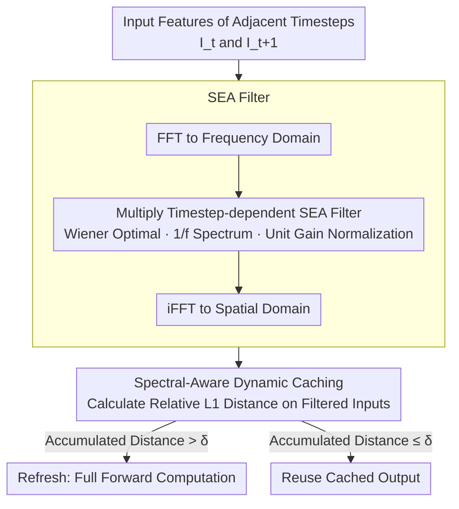

# SeaCache: Spectral-Evolution-Aware Cache for Accelerating Diffusion Models

**Conference**: CVPR2026  
**arXiv**: [2602.18993](https://arxiv.org/abs/2602.18993)  
**Code**: [jiwoogit/SeaCache](https://github.com/jiwoogit/SeaCache)  
**Area**: Image Generation  
**Keywords**: Diffusion Model Acceleration, Caching Strategy, Spectral Evolution, Frequency Domain Filtering, Training-free Acceleration

## TL;DR

SeaCache is proposed as a training-free dynamic caching strategy based on Spectral-Evolution-Aware (SEA) filters. By separating signal and noise components in the frequency domain to measure redundancy between timesteps, it significantly improves the latency-quality trade-off for diffusion model inference.

## Background & Motivation

1. **Inference Latency Bottleneck**: Diffusion and rectified flow models require dozens to hundreds of iterative denoising steps, causing severe latency in user-end applications.
2. **Limitations of Prior Work**: Methods like distillation, quantization, and efficient attention are effective but introduce additional training overhead and dependency on specific tasks or data.
3. **Potential of Caching**: Caching and reusing intermediate features from adjacent timesteps can reduce the number of forward passes without retraining, representing a complementary approach.
4. **Static vs. Dynamic Scheduling**: Early methods (e.g., DeepCache) use fixed-interval caching, failing to adapt to input diversity. TeaCache and DiCache introduce dynamic scheduling but still measure distances in the original feature space.
5. **Ignoring Spectral Evolution**: The diffusion denoising process exhibits clear spectral evolution—early timesteps establish low-frequency structures, while later steps refine high-frequency details. Existing caching strategies treat all spectral components equally.
6. **Entanglement of Content and Noise**: Distance in the original feature space mixes content-bearing signal components with random noise components, causing caching decisions to be interfered with by high-frequency noise and deviating from optimal scheduling.

## Method

### Overall Architecture

SeaCache addresses a neglected issue in caching acceleration: diffusion denoising has clear spectral evolution (early low-frequency structure, late high-frequency refinement), yet dynamic caching methods like TeaCache and DiCache measure distances in the **original feature space**, mixing signals and random noise. SeaCache inserts a "Spectral-Evolution-Aware (SEA) filtering" step before the distance measurement of existing caching strategies.

Specifically, given input features $I_t$ and $I_{t+1}$ from adjacent timesteps, they are first transformed to the frequency domain via FFT, multiplied by a timestep-dependent SEA filter $G_t^{\text{norm}}$, and transformed back via iFFT. The relative $\ell_1$ distance is then calculated on the filtered features; if the accumulated distance exceeds a threshold $\delta$, a refresh is triggered; otherwise, the cached output is reused. This adds only an FFT-filter-iFFT step before distance calculation without modifying architectural properties or samplers.

### Key Designs

**1. SEA Filter: Timestep-dependent Spectral Reweighting Derived from Wiener Optimization**

Caching decisions are interfered with by noise because of the spatial domain used for distance measurement. SeaCache starts from a linear minimum mean square error (MMSE) denoiser and derives the frequency response of the optimal linear denoising filter $G_t(f) = a_t S_x(f) / (a_t^2 S_x(f) + b_t^2)$, which takes the form of a Wiener filter. Assuming the power spectrum of natural images follows a $1/f$ power law, this filter allows primarily low frequencies in early timesteps and gradually incorporates high frequencies, aligning with the spectral evolution of diffusion denoising.

Directly using this filter has a drawback: the average gain of the original $G_t(f)$ varies across timesteps, making distances incomparable. A normalization factor $\nu_t$ is introduced to ensure $G_t^{\text{norm}}(f)$ has unit average gain across radial frequencies, stabilizing the energy of filtered features. The final filtering operation is $\mathcal{P}(G_t^{\text{norm}}, I_t) = \text{iFFT}(G_t^{\text{norm}}(f) \odot \text{FFT}(I_t))$, applied channel-wise over spatial (image) or spatio-temporal (video) axes.

**2. Spectral-Aware Dynamic Caching: Filtered Inputs as Proxies**

Ideally, the distance of "filtered output features" should be compared, but that requires full forward passes. The authors use filtered **input** features $\mathcal{P}(G_t^{\text{norm}}, I_t)$ as a proxy, verifying its high correlation with filtered output distances. The distance metric is updated to $\widetilde{\Delta}_t = \text{L1}_{\text{rel}}(\mathcal{P}(G_t^{\text{norm}}, I_t), \mathcal{P}(G_{t+1}^{\text{norm}}, I_{t+1}))$. The accumulation and thresholding logic follows TeaCache exactly, only replacing this single distance calculation. Since filtering suppresses noise and emphasizes content in the frequency domain, the caching schedule tracks the full computation trajectory more faithfully. As it is plug-and-play, it can be directly integrated into TeaCache, DiCache, and other existing methods.

## Key Experimental Results

### Text-to-Image (FLUX.1-dev, 50 steps, DrawBench 200 prompts)

| Method | Latency(s) | TFLOPs | PSNR↑ | LPIPS↓ | SSIM↑ |
|------|---------|--------|-------|--------|-------|
| Original | 20.9 | 2976 | – | – | – |
| TeaCache (δ=0.3) | 11.4 | 1547 | 20.76 | 0.211 | 0.810 |
| TaylorSeer (S=3) | 9.8 | 1191 | 22.78 | 0.163 | 0.828 |
| **SeaCache (δ=0.3)** | **9.4** | **1098** | **26.29** | **0.106** | **0.893** |
| TeaCache (δ=0.6) | 7.1 | 892 | 17.21 | 0.348 | 0.714 |
| TaylorSeer (S=5) | 7.5 | 834 | 19.97 | 0.236 | 0.762 |
| **SeaCache (δ=0.6)** | **6.4** | **773** | **21.33** | **0.226** | **0.798** |

### Text-to-Video (HunyuanVideo / Wan2.1 1.3B, 50 steps, VBench 944 prompts)

- **HunyuanVideo ~50%**: SeaCache PSNR 32.39 vs TeaCache 23.40 (+9 dB), Latency 90.8s vs 98.5s
- **HunyuanVideo ~30%**: SeaCache PSNR 26.46 vs TeaCache 20.42 (+6 dB), Latency 58.1s vs 64.4s
- **Wan2.1 ~50%**: SeaCache PSNR 26.60 vs TeaCache 20.84 (+5.8 dB), Latency 83.9s vs 86.6s
- **Wan2.1 ~30%**: SeaCache PSNR 21.78 vs TeaCache 18.88 (+2.9 dB), Latency 56.6s vs 63.6s

### Ablation Study

| Variant | Effect |
|------|------|
| SEA Filter (Full) | Optimal PSNR-Refresh Rate trade-off |
| 1−SEA (Complementary Filtering) | Slightly worse; tracking noise is less effective than tracking signals |
| Without Gain Normalization | PSNR drops; distance bias across timesteps |
| Static Low-pass Filtering (LPF 30%) | Significantly worse than SEA, indicating timestep-dependent spectral evolution is crucial |

## Highlights & Insights

- **Theory-Driven Design**: Derives timestep-dependent spectral evolution filters from Wiener optimal filters, tightly coupling theory and practice.
- **Plug-and-Play**: Just a single filtering operation in the distance metric is replaced, allowing direct embedding into existing caching methods like TeaCache and DiCache.
- **Cross-Model Generalization**: Consistently outperforms baselines across FLUX (image), HunyuanVideo, and Wan2.1 (video).
- **Adaptive Early Refresh**: Naturally allocates more computation budget to early timesteps without manually setting "first N steps must compute" hyperparameters.
- **Significant PSNR Gain**: The +9 dB PSNR improvement on HunyuanVideo is particularly prominent.

## Limitations & Future Work

- **Linear Denoiser Assumption**: The SEA filter is derived based on optimal linear denoisers, whereas actual diffusion models are highly non-linear; the filter is only an approximation.
- **Fixed Power Spectrum Prior**: Assumes a natural $1/f$ power spectrum; applicability to non-natural images (e.g., text, charts) remains to be verified.
- **Focus on "When to Reuse"**: Does not explore "how to reuse" spectral-aware strategies (e.g., differentiated reuse across frequency bands).
- **Reconstruction Metric Focus**: Measures deviation from full computation (PSNR/LPIPS/SSIM); reports on downstream perceptual quality (FID, user preference) are relatively limited (only CycleReward).
- **FFT Overhead**: Although lightweight, FFT/iFFT operations introduce extra computation at each timestep, which may be non-negligible in extreme acceleration scenarios.

## Related Work & Insights

| Method | Scheduling Type | Distance Space | Spectral Aware | Training Required |
|------|---------|---------|---------|---------|
| DeepCache | Static | – | No | No |
| PAB | Static (by block) | – | No | No |
| TeaCache | Dynamic | Original Features | No | No |
| TaylorSeer | Dynamic (Taylor) | Original Features | No | No |
| DiCache | Dynamic (Mid-block) | Original Features | No | No |
| **SeaCache** | **Dynamic** | **SEA Filtered Features** | **Yes** | **No** |

SeaCache is the first method to inject explicit frequency priors into cache reuse decisions, suppressing noise and emphasizing content through frequency-domain reweighting to more faithfully track the full computation trajectory.

## Rating

- Novelty: ⭐⭐⭐⭐ — Introducing spectral evolution priors into cache scheduling is a novel perspective; the theoretical derivation of SEA filters is elegant.
- Experimental Thoroughness: ⭐⭐⭐⭐ — Covers image and video generation, multiple models, complete ablations, and extensive plug-and-play validation.
- Writing Quality: ⭐⭐⭐⭐ — Clear motivation, self-consistent theoretical derivation, and informative charts.
- Value: ⭐⭐⭐⭐ — Plug-and-play with significant performance gains, offering direct practical value for diffusion model deployment.

<!-- RELATED:START -->

## Related Papers

- [\[CVPR 2026\] SenCache: Accelerating Diffusion Model Inference via Sensitivity-Aware Caching](sencache_accelerating_diffusion_model_inference_via_sensitivity-aware_caching.md)
- [\[NeurIPS 2025\] Emergence and Evolution of Interpretable Concepts in Diffusion Models](../../NeurIPS2025/image_generation/emergence_and_evolution_of_interpretable_concepts_in_diffusi.md)
- [\[AAAI 2026\] HACK: Head-Aware KV Cache Compression for Efficient Visual Autoregressive Modeling](../../AAAI2026/image_generation/head-aware_kv_cache_compression_for_efficient_visual_autoreg.md)
- [\[CVPR 2026\] SegQuant: A Semantics-Aware and Generalizable Quantization Framework for Diffusion Models](segquant_a_semantics-aware_and_generalizable_quantization_framework_for_diffusio.md)
- [\[ICML 2026\] Spectral Guidance for Flexible and Efficient Control of Diffusion Models](../../ICML2026/image_generation/spectral_guidance_for_flexible_and_efficient_control_of_diffusion_models.md)

<!-- RELATED:END -->
