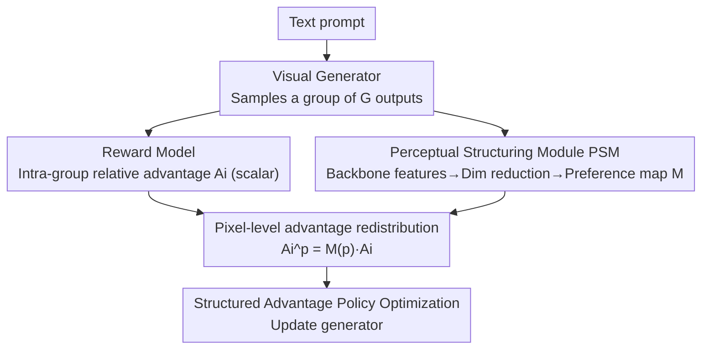

# Seeing What Matters: Visual Preference Policy Optimization for Visual Generation

**Conference**: CVPR 2026  
**Paper**: [CVF Open Access](https://openaccess.thecvf.com/content/CVPR2026/html/Ni_Seeing_What_Matters_Visual_Preference_Policy_Optimization_for_Visual_Generation_CVPR_2026_paper.html)  
**Code**: None  
**Area**: Image Generation / Reinforcement Learning Alignment  
**Keywords**: GRPO, Visual Preference Alignment, Pixel-level Advantage, Diffusion/Flow Matching, Perceptual Structuring

## TL;DR
ViPO transforms the scalar advantage of "full-image scoring" in GRPO into a pixel-level, perception-aware structured advantage. It utilizes a training-free Perceptual Structuring Module (PSM) to extract preference allocation maps from pre-trained visual backbones. These maps are multiplied by the scalar advantage, directing optimization pressure toward regions that human eyes truly care about, thereby outperforming the original GRPO (DanceGRPO) in both image and video generation.

## Background & Motivation
**Background**: Using Reinforcement Learning (RL) for post-training of visual generation models to align with human preferences has become mainstream. Among these, Group Relative Policy Optimization (GRPO) has been successfully applied to diffusion and flow-matching generators (e.g., DanceGRPO, FlowGRPO) due to its stable training via intra-group relative advantage calculation.

**Limitations of Prior Work**: GRPO was originally designed for token-level or sequence-level outputs in language/reasoning tasks. It assumes a whole image or video can be represented by **a single scalar advantage** $A_i$. When directly applied to visual data, this scalar is averaged across all pixels, implying every region contributes equally to perceptual quality. Consequently, local artifacts (e.g., extra legs, redundant foreground objects) are not targeted for correction, and the model fails to model fine-grained perceptual cues.

**Key Challenge**: This is essentially a **spatial credit assignment problem** in RL. Indiscriminate rewards push gradients toward regions that should not be modified, amplifying irrelevant or misleading cues. Modern visual reward models (HPSv2, PickScore, VideoAlign, etc.) actually encode rich spatial structures, but a scalar compresses all this spatial evidence into a single number, making it unusable for the GRPO framework.

**Goal**: Design a **fine-grained, perception-guided** policy optimization framework that allows advantages to be distributed differentially across spatial and temporal dimensions while maintaining the stability and plug-and-play nature of GRPO.

**Key Insight**: Human visual preferences are inherently **selective and spatially biased**, where observers focus on semantically rich regions and ignore redundant backgrounds. Features from pre-trained visual backbones (DINOv2, SAM, ResNet) carry this spatial/semantic structure, which can be used to distill the distribution of "which regions are more important" without manual annotation.

**Core Idea**: Use a perception correlation map $M$, extracted from pre-trained backbones, to redistribute the scalar advantage: $A_i^p = M(p)\,A_i$. This converts "one score per image" into "one score per position," while the multiplication ensures consistent optimization direction within a sample, evitando mixed-sign gradients, thus achieving both fine-grained control and stability.

## Method

### Overall Architecture
ViPO is a rewrite of the "advantage representation + credit assignment" in GRPO. The goal is to upgrade coarse scalar feedback to structured pixel-level feedback, while the intra-group reward calculation process of GRPO remains **unchanged**. The pipeline: Given a text prompt, the generator first samples a group of outputs (group size $G$); these outputs are fed into a reward model to compute a scalar advantage $A_i$ for each sample; in parallel, they are fed into the **Perceptual Structuring Module (PSM)**, which produces a **preference allocation map** $M$ reflecting regional perceptual relevance. Finally, the allocation map is multiplied by the scalar advantage to obtain the pixel-level, preference-aware advantage $A_i^p$, which is used for the policy optimization objective. This design is architecture-agnostic, lightweight, and fully compatible with existing GRPO training pipelines.

### Key Designs

**1. Perceptual Structuring Module (PSM): Distilling backbone features into label-free preference maps**

This is the only new computational component in ViPO, specifically addressing the issue of "scalar rewards not knowing which part of the image is important" without requiring any pixel-level annotations or region labels. PSM consists of Two parts: a Visual Preference Extractor (VPE) and a Visual Preference Allocator (VPA). Given a generated image or video frame $x \in \mathbb{R}^{H\times W\times 3}$, VPE uses a pre-trained visual backbone $\Phi$ to extract feature maps $F$ carrying spatial organization and high-level semantics. Then, a dimensionality reduction operator $R(\cdot)$ (e.g., principal component projection) is used to find dominant feature directions, resulting in a compact representation:

$$Z = R(F) \in \mathbb{R}^{N\times K},$$

where $K$ is the number of components retained. VPA aggregates these components into a spatial correlation map $S \in \mathbb{R}^{H_p\times W_p}$ using **variance-weighted summation**:

$$S = \mathrm{Reshape}\Big(\sum_{j=1}^{K} \lambda_j z'_j\Big),$$

where $\lambda_j$ is the explained variance ratio of the $j$-th component and $z'_j$ is its normalized projection. $S$ is optionally smoothed and upsampled to the latent resolution to form the final allocation map $M$. For videos, this is computed frame-by-frame and aligned temporally into a spatio-temporal volume $M \in \mathbb{R}^{T_\ell\times H_\ell\times W_\ell}$. Variance weighting is key—it prioritizes directions with higher explained variance, favoring components with stronger semantic signals, which better reflects semantic importance than simple averaging (variance-weighted ImageReward 1.1883 vs. average 1.1318).

**2. Pixel-level Advantage Redistribution: Spatial/temporal credit assignment via multiplication**

With $M$, ViPO rewrites the advantage representation of GRPO. While standard GRPO assigns a scalar $A_i$ to each sample (normalized from intra-group rewards), ViPO spreads this advantage across spatial and temporal dimensions. Letting $p \in \mathcal{P}$ be a position index in latent space spanning space and time, the spatially resolved advantage is defined as:

$$A_i^p = M(p)\,A_i.$$

The corresponding policy objective becomes:

$$\mathcal{J}(\theta) = \mathbb{E}\Big[\frac{1}{G\,T_s\,|\mathcal{P}|}\sum_{i=1}^{G}\sum_{t=1}^{T_s}\sum_{p\in\mathcal{P}} \min\big(\rho_{t,i}^p A_i^p,\ \mathrm{clip}(\rho_{t,i}^p, 1-\epsilon, 1+\epsilon)A_i^p\big)\Big],$$

where $\rho_{t,i}^p$ is the local likelihood ratio and $T_s$ is the number of diffusion/flow steps. The **multiplication** (rather than replacement or weighted reward) is crucial because multiplying by $M$ maintains optimization direction consistency within a sample ($M\ge 0$ does not flip the sign of $A_i$), avoiding gradient interference from mixed-sign rewards while being naturally plug-and-play. Ablation studies confirm that multiplying the **reward** directly by the map leads to performance drops (ImageReward 1.0058) because different samples might place the same concept in different locations with different weights, leading to mismatched advantages or conflicting gradients; multiplying the **advantage** instead preserves the stable relative signal.

> ⚠️ Background: The scalar advantage in GRPO is normalized from intra-group rewards: $A_i = \dfrac{r_i - \mathrm{mean}(\{r_1,\dots,r_G\})}{\mathrm{std}(\{r_1,\dots,r_G\})}$. ViPO leaves this step untouched and redistributes $A_i$ using $M(p)$ afterwards.

### Loss & Training
To perform RL within a flow-matching framework, deterministic ODE sampling $\mathrm{d}z_t = u_t\,\mathrm{d}t$ is converted to a Stochastic Differential Equation (SDE) to introduce exploration: $\mathrm{d}z_t = (u_t - \tfrac{1}{2}\varepsilon_t^2\nabla\log p_t(z_t))\,\mathrm{d}t + \varepsilon_t\,\mathrm{d}w$, where $\varepsilon_t$ controls stochasticity and $\mathrm{d}w$ is Brownian motion. Assuming intermediate states follow a Gaussian $p_t(z_t)=\mathcal{N}(z_t\mid\alpha_t x, \sigma_t^2 I)$, the log-density term can be analytically expanded to obtain a conditional sampling policy suitable for policy gradients. Besides this, ViPO maintains the structure of GRPO’s training objective, with advantages changed from scalar to pixel-level.

## Key Experimental Results

### Main Results
Image generation was fine-tuned on FLUX.1-dev with rewards from HPSv2.1 (in-domain) and OOD evaluation using PickScore/ImageReward. Video generation was fine-tuned on Wan2.1-T2V-14B with VideoAlign rewards and VBench for OOD. The baseline is DanceGRPO.

| Model | Method | HPSv2.1↑(in) | PickScore↑(OOD) | ImageReward↑(OOD) |
|------|------|------|------|------|
| Flux | Original | 0.3121 | 22.7038 | 1.1495 |
| Flux | DanceGRPO | 0.3203 | 22.5962 | 1.0392 |
| Flux | **Ours (DINO)** | **0.3321** | 22.8305 | **1.1883** |
| Flux | Ours (ResNet) | 0.3251 | **22.8492** | 1.1625 |
| Flux | Ours (SAM) | 0.3219 | 22.6324 | 1.1422 |

All three backbone variants outperform DanceGRPO. DINOv2 is the best overall (1st in in-domain HPS and OOD ImageReward), ResNet is surprisingly best on OOD PickScore, while SAM is relatively weaker—attributed to its features being more low-level than high-level semantic. Notably, DanceGRPO performed worse than original Flux on OOD metrics (PickScore 22.5962, ImageReward 1.0392), exposing overfitting or generalization decay in scalar optimization, whereas ViPO improved generalization.

Video Generation (DINOv2 only):

| Model | Method | VQ↑(in) | MQ↑(in) | Semantic↑ | Quality↑ | Total↑ |
|------|------|------|------|------|------|------|
| Wan2.1 | Original | 2.6219 | 0.5896 | 83.36 | 71.20 | 80.92 |
| Wan2.1 | DanceGRPO | 3.0935 | 0.8639 | 83.63 | 69.68 | 80.84 |
| Wan2.1 | **Ours** | **3.5501** | **1.1515** | **83.98** | **72.59** | **81.70** |

Ours outperforms DanceGRPO across all in-domain (VQ/MQ) and OOD VBench dimensions, with motion quality (MQ) increasing significantly from 0.86 to 1.15.

### Ablation Study
Ablations on Flux focused on four PSM design choices:

| Configuration | HPSv2.1↑ | PickScore↑ | ImageReward↑ | Note |
|------|------|------|------|------|
| Map = all ones (≈orig. GRPO) | 0.3043 | 22.2043 | 0.9520 | Pixelated but no semantics → introduces variance |
| Multiply by reward | 0.3090 | 22.3866 | 1.0058 | Mismatched samples, conflicting gradients |
| Multiply by advantage (Default) | **0.3321** | **22.8305** | **1.1883** | Preserves stable relative signal |
| Average aggregation | 0.3238 | 22.7037 | 1.1318 | Equal weight, dilutes semantics |
| Variance-weighted (Default) | **0.3321** | **22.8305** | **1.1883** | Prioritizes high-variance directions |

Number of principal components $K$: $K{=}3$ is a robust balance point (strong HPS, ImageReward, stable PickScore) and allows visualization by mapping 3 components to RGB. Larger $K$ captures weaker directions, helping one metric while slightly hurting another. Smoothing strength $\sigma$: $\sigma{=}1$ is most stable, while $\sigma{=}0.5$ leads to a severe drop (HPS 0.3059). No smoothing remains competitive.

### Key Findings
- **The true driver of performance is "semantic-guided fine-grained allocation" rather than pure pixelation**: An all-ones allocation map theoretically equals original GRPO but performs worse due to added variance in pixel-level formulas, showing gains stem from semantic structure.
- **Multiplying Advantage vs. Reward is the key to success**: Multiplying rewards directly causes mismatches due to inconsistent object positions across samples, whereas multiplying advantages preserves stable relative signals.
- **Improved robustness against collapse under rule-based rewards**: In a "redness reward" test $r(x)=x_0-\tfrac{1}{2}(x_1+x_2)$, DanceGRPO eventually degrades content into unrecognizable shapes, while ViPO preserves overall structure and identity even as hair/background turn red. Regional differentiation makes policy optimization more robust against global gradient collapse.

## Highlights & Insights
- **The observation that "reward models actually have spatial information, but GRPO flattens it" is insightful**: Modern visual reward models could provide regional cues; scalarization wastes this. ViPO recovers this information by changing advantage distribution without changing the reward model itself.
- **PSM is training-free and label-free**: It distills "where the human eye focuses" using pre-trained backbones + PCA/variance weighting. With zero additional learnable parameters, it can be grafted onto any GRPO pipeline at nearly zero cost.
- **Stability of multiplicative redistribution**: $A_i^p=M(p)A_i$ with $M\ge0$ ensures signs are not flipped. Combined with the "advantage vs reward" ablation, it provides a solid explanation for why it is stable, making it transferable to other RL alignment tasks requiring spatial credit assignment.

## Limitations & Future Work
- **PSM preference maps come from unsupervised features of generic backbones**, which may not perfectly align with true human preference — directions with high variance are not necessarily what humans care about. The backbone choice (DINO vs SAM vs ResNet) significantly impacts results.
- **Lack of comparison with "direct dense reward models"**: ViPO assumes rewards are scalars, but if a spatially-aware reward model is used directly, the necessity of indirect distillation via PSM remains unconfirmed. ⚠️ Implementation details (specific backbone configs, etc.) are in the supplementary material and not fully detailed in the main text.
- **Sensitivity to smoothing hyperparameters**: Performance drops sharply with $\sigma{=}0.5$, suggesting $\sigma$ and $K$ might need re-tuning for new models or resolutions.

## Related Work & Insights
- **vs DanceGRPO / FlowGRPO**: They implement online RL by converting Flow-matching ODEs to SDEs but still use a single scalar advantage. ViPO reuses their reward calculation and redistributes advantages, serving as an orthogonal enhancement.
- **vs Perceptual Loss**: Perceptual loss approximates human perceptual similarity via CNN feature differences for reconstruction targets. ViPO uses "perceptual features" as a weight map for RL credit assignment on the policy advantage, sharing a similar philosophy but acting on a different level.
- **vs Scalar Visual Reward Models (HPSv2 / PickScore / VisionReward)**: These models capture fine-grained cues but only output scalars without indicating "what is good or bad." ViPO does not reinvent the reward model but uses PSM to supplement spatial structure from the generated content side.

## Rating
- Novelty: ⭐⭐⭐⭐ Introducing spatial credit assignment to visual GRPO via label-free PSM advantage redistribution is refreshing.
- Experimental Thoroughness: ⭐⭐⭐⭐ Image/video tasks, three backbones, human/rule-based rewards, and complete ablations, though comparison with spatial reward models is missing.
- Writing Quality: ⭐⭐⭐⭐ Clear logic from motivation to method to ablation; formulas are concise.
- Value: ⭐⭐⭐⭐ Plug-and-play, architecture-agnostic, and can directly enhance existing GRPO visual alignment pipelines with high practical utility.

<!-- RELATED:START -->

## Related Papers

- [\[CVPR 2026\] Learning What to Trust: Bayesian Prior-Guided Optimization for Visual Generation](learning_what_to_trust_bayesian_prior-guided_optimization_for_visual_generation.md)
- [\[CVPR 2026\] ThinkGen: Generalized Thinking for Visual Generation](thinkgen_generalized_thinking_for_visual_generation.md)
- [\[CVPR 2026\] GlyphPrinter: Region-Grouped Direct Preference Optimization for Glyph-Accurate Visual Text Rendering](glyphprinter_region-grouped_direct_preference_optimization_for_glyph-accurate_vi.md)
- [\[CVPR 2026\] MaskFocus: Focusing Policy Optimization on Critical Steps for Masked Image Generation](maskfocus_focusing_policy_optimization_on_critical_steps_for_masked_image_genera.md)
- [\[CVPR 2026\] Curriculum Group Policy Optimization: Adaptive Sampling for Unleashing the Potential of Text-to-Image Generation](curriculum_group_policy_optimization_adaptive_sampling_for_unleashing_the_potent.md)

<!-- RELATED:END -->
