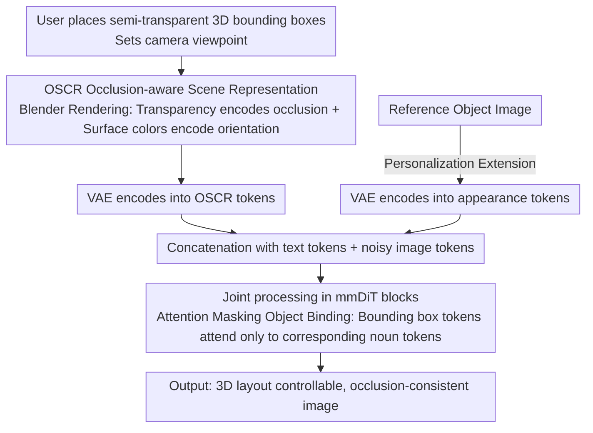

# SeeThrough3D: Occlusion Aware 3D Control in Text-to-Image Generation

**Conference**: CVPR2026  
**arXiv**: [2602.23359](https://arxiv.org/abs/2602.23359)  
**Code**: [Project Page](https://seethrough3d.github.io)  
**Area**: Image Generation
**Keywords**: 3D Layout Control, Occlusion Awareness, Text-to-Image Generation, DiT, FLUX, Attention Masking, LoRA

## TL;DR

SeeThrough3D is proposed to condition the FLUX model via an Occlusion-aware Scene Representation (OSCR) rendered from semi-transparent 3D bounding boxes, achieving precise 3D layout control and occlusion-consistent text-to-image generation.

## Background & Motivation

**Limitations of 2D Control**: Existing controllable generation methods mostly rely on 2D spatial controls (bounding boxes, segmentation maps) and cannot control 3D scene attributes (object arrangement, camera viewpoints), making it difficult to satisfy requirements in fields like design, gaming, and architectural visualization.

**Neglected Occlusion Reasoning**: While occlusion is a core capability for 3D-aware generation, existing 3D layout methods (e.g., LooseControl, Build-A-Scene) condition on depth maps. Depth maps cannot represent occluded objects, leading to frequent failures in scenes with overlapping objects.

**Imprecise 2D Layer Decomposition**: Methods like LaRender and VODiff approximate occlusion by decomposing scenes into 2D object layers. However, this flattened representation loses true 3D geometry, causing occlusion relationships to violate 3D perspective laws.

**Lack of Semantic Binding**: Spatial conditioning often fails to associate 3D bounding boxes with corresponding text descriptions, leading to attribute confusion and positional errors.

**Insufficient Orientation Control**: Depth maps can only encode orientation information within a 180° range, failing to provide complete 3D orientation control.

**Generalization Challenges with Synthetic Data**: Training on synthetic data often leads to overfitting on synthetic backgrounds. Effective data augmentation strategies are required to ensure generalization to real-world scenes.

## Method

### Overall Architecture

SeeThrough3D addresses the lack of 3D layout control—especially occlusion—in text-to-image generation. Existing 3D methods mostly use depth maps for conditioning, which cannot represent occluded objects. Based on the pre-trained FLUX (DiT architecture), the method encodes an Occlusion-aware Scene Representation (OSCR) into visual tokens to condition the generation.

The workflow is: The user places semi-transparent 3D bounding boxes and sets the camera viewpoint in a virtual environment → Blender renders the OSCR image → VAE encodes it into OSCR tokens → These are concatenated with text tokens and noisy image tokens for joint processing in mmDiT blocks.

### Key Designs

**1. OSCR Occlusion-aware Scene Representation: Encoding occlusion, orientation, and viewpoint into a single image using semi-transparent colored bounding boxes**

Depth maps cannot encode occluded objects, and 2D layer decomposition loses true 3D geometry. OSCR assigns a **semi-transparent 3D bounding box** to each object. Transparency makes occluded object parts visible, providing explicit occlusion reasoning cues for the model. Each face of the bounding box uses a **predefined color mapping** (canonical color mapping), where different colors correspond to specific faces. This encodes 3D orientation directly in the image space, compensating for the 180° limitation of depth maps. Even if occlusion changes the apparent color of some faces, the relative color differences between faces remain discernible, keeping orientation cues reliable. The entire image is rendered from a specific **camera viewpoint**, naturally embedding the camera pose for precise perspective control.

**2. Attention Masking Object Binding: Locking spatial tokens and corresponding text semantics together**

Spatial conditions alone can lead to attribute confusion and positional errors. SeeThrough3D applies masks to the self-attention in mmDiT blocks: OSCR tokens within the region of bounding box $b_i$ **can only attend to** the corresponding object noun token $\mathbf{p}_i$, thereby binding spatial tokens with semantics. The spatial extent of each bounding box is provided by an amodal segmentation mask $\mathbf{s}_i$ rendered by Blender. When two bounding box regions overlap, tokens in the intersection attend to multiple object tokens simultaneously. Experiments show that the model naturally maintains object feature separation in the latent space—the attention map itself outlines occlusion boundaries. Simultaneously, attention from OSCR tokens $\mathbf{z}$ to image tokens $\mathbf{x}_t$ is blocked to protect the base model's priors.

**3. Personalization Extension: Reusing the same masking strategy for layout-aware specific object generation**

Given a reference object image $v$, it is encoded via VAE into an "appearance token" $\mathbf{v}$ and appended to the sequence. By reusing the above attention masking strategy, allowing OSCR tokens within bounding box $b_i$ to attend to the appearance token, the model can generate objects with specific appearances at designated 3D layout positions.

### Loss & Training

Only **LoRA** (rank=128) on the projection matrices corresponding to OSCR tokens is trained, while the base model is frozen to retain text-to-image priors. The learning rate is $10^{-4}$ for 30K steps. Data is generated by procedurally placing 3D assets in Blender, intentionally controlling positions and camera parameters to create strong occlusion, rendering paired real images and OSCR representations. Depth is extracted from rendered images, and FLUX.1-Depth-dev is used to generate diverse realistic augmented images. Samples that do not follow the original layout are filtered using CLIP, and simple scenes with minimal overlap or low visibility are discarded—this hard sample filtering is crucial for occlusion consistency. The final dataset consists of 25K rendered images + 25K augmented images.

## Main Results

### Baseline Comparison (3DOc-Bench, 500 samples)

| Method | Depth Order↑ | Object Score↑ | Angular Error↓ | Text Align↑ | KID(×10⁻³)↓ |
|------|-----------|-----------|-----------|-----------|--------------|
| VODiff | 0.68 | 19.70 | 92.73 | 29.51 | 15.40 |
| LooseControl | 0.82 | 20.02 | 89.88 | 28.43 | 14.32 |
| Build-A-Scene | 0.89 | 21.0 | 91.62 | 28.05 | 20.12 |
| LaRender | 1.02 | 21.83 | 89.63 | 30.20 | 13.46 |
| **Ours** | **1.46** | **22.86** | **47.92** | **31.87** | **5.43** |

SeeThrough3D significantly outperforms existing methods across all five metrics. Angular error dropped from approximately 90° to 48°, and KID decreased from 13+ to 5.43.

### Ablation Study

| Variant | Depth Order↑ | Object Score↑ | Angular Error↓ | Text Align↑ | KID(×10⁻³)↓ |
|------|-----------|-----------|-----------|-----------|--------------|
| W/O Transparency | 1.20 | 21.67 | **46.15** | 31.39 | 5.90 |
| W/O Color Encoding | 1.36 | 22.23 | 88.77 | 31.57 | 5.93 |
| W/O Binding Mask | 0.98 | 20.45 | 57.44 | 31.61 | 6.35 |
| W/O Hard Data | 1.24 | 21.89 | 49.73 | 31.32 | 6.34 |
| **Full Model** | **1.46** | **22.86** | 47.92 | **31.87** | **5.43** |

### Key Findings

- **Transparency** is the core design of OSCR: removing it drops the depth order from 1.46 to 1.20, proving its importance for occlusion reasoning. Opaque bboxes are slightly better for orientation accuracy (clearer color signals) but sacrifice occlusion modeling.
- **Color Encoding** is critical for orientation control: removing it causes the angular error to soar from 48° to 89°, nearly returning to baseline levels.
- **Attention Binding** is indispensable for layout following: removing it drops the object score from 22.86 to 20.45, with objects appearing in incorrect positions.
- **Hard Data Filtering** effectively improves model performance in complex occlusion scenes.
- In a 60-person user study, SeeThrough3D achieved high preference rates in image realism, layout following, and text alignment.
- Despite being trained on synthetic scenes with at most 4 objects, the model generalizes to many objects, unseen categories (instruments, electronics, transparent objects), diverse poses (sitting, cycling), and natural object interactions.

## Highlights & Insights

- **Ingenious OSCR Representation**: The semi-transparent, color-coded 3D bounding box is both simple and expressive, simultaneously encoding occlusion, orientation, and camera viewpoint.
- **Elegant Attention Masking Binding**: The scheme gracefully solves the spatial-semantic association problem, avoiding the limitations of fixed category sets.
- **Strong Generalization**: Trained on only 50K synthetic samples (including augmentation), the model generalizes to unseen object categories, complex layouts, and diverse backgrounds.
- **Preservation of Base Model Priors**: LoRA fine-tuning and attention blocking allow the model to retain original capabilities like transparent object rendering and text generation.
- **Establishment of 3DOc-Bench**: Fills the gap in evaluating occlusion-aware 3D control.

## Limitations & Future Work

- **Lack of Image Consistency**: The model does not maintain consistency when layouts change; changing the layout generates a completely different image, lacking editing continuity.
- **Rigid Object Constraint**: Training data only includes standard poses of rigid objects, potentially limiting control over non-rigid objects and complex poses.
- **Workflow Dependency**: Relies on Blender to render OSCR maps and segmentation masks, resulting in a relatively long user interaction chain.
- **Proxy Metrics**: There is no single direct metric for 3D layout following; instead, it is evaluated via a combination of three proxy metrics: depth order, object score, and angular error.

## Related Work & Insights

- **3D Layout Control**: LooseControl uses depth maps but fails to represent occluded objects; Build-A-Scene adds objects iteratively via generation-inversion but introduces artifacts; LACONIC treats bboxes as set inputs but is limited to single scene domains.
- **Occlusion Control**: LaRender and VODiff are based on 2D layer decomposition and lack 3D awareness; CObL performs unordered layer decomposition but lacks 3D layout control.
- **Orientation Control**: Compass Control and ORIGEN provide object orientation control but do not support 3D positioning.
- **3D-Aware Editing**: Diffusion Handles and 3D-FixUp utilize depth for 3D editing but are limited to single objects.

## Rating

- Novelty: ⭐⭐⭐⭐ — The combination of OSCR representation and attention masking binding is novel, explicitly modeling occlusion reasoning into the scene representation.
- Experimental Thoroughness: ⭐⭐⭐⭐ — Five metrics + ablations + user study + personalization extension, with the self-established 3DOc-Bench.
- Writing Quality: ⭐⭐⭐⭐ — Clear structure, rich illustrations, and in-depth attention visualization analysis.
- Value: ⭐⭐⭐⭐ — Fills the gap in occlusion-aware 3D layout control with a simple yet practical design and impressive generalization.

<!-- RELATED:START -->

## Related Papers

- [\[CVPR 2026\] 3D Space as a Scratchpad for Editable Text-to-Image Generation](3d_space_as_a_scratchpad_for_editable_text-to-image_generation.md)
- [\[ICCV 2025\] LaRender: Training-Free Occlusion Control in Image Generation via Latent Rendering](../../ICCV2025/image_generation/larender_training-free_occlusion_control_in_image_generation_via_latent_renderin.md)
- [\[CVPR 2026\] BiMotion: B-spline Motion for Text-guided Dynamic 3D Character Generation](bimotion_b-spline_motion_for_text-guided_dynamic_3d_character_generation.md)
- [\[CVPR 2026\] Taming Video Models for 3D and 4D Generation via Zero-Shot Camera Control](taming_video_models_for_3d_and_4d_generation_via_zero-shot_camera_control.md)
- [\[CVPR 2025\] Compass Control: Multi Object Orientation Control for Text-to-Image Generation](../../CVPR2025/image_generation/compass_control_multi_object_orientation_control_for_text-to-image_generation.md)

<!-- RELATED:END -->
