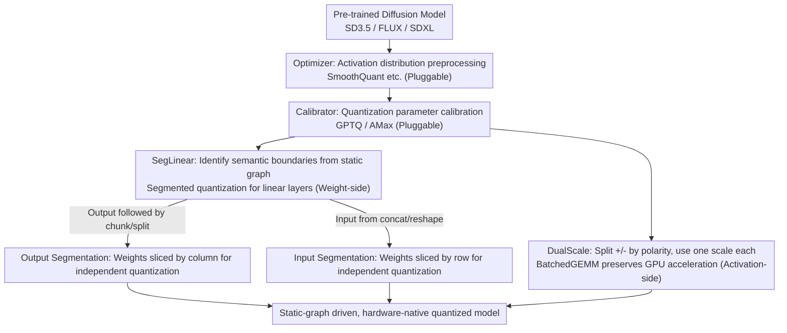

# SegQuant: A Semantics-Aware and Generalizable Quantization Framework for Diffusion Models

**Conference**: CVPR2026  
**arXiv**: [2507.14811](https://arxiv.org/abs/2507.14811)  
**Code**: None  
**Area**: Image Generation  
**Keywords**: Diffusion Model Quantization, Post-Training Quantization, Semantics-Aware Segmentation, Polarity-Preserving, Deployment-Friendly

## TL;DR

The SegQuant framework is proposed, which achieves high-fidelity post-training quantization for diffusion models that is generalizable across architectures and compatible with deployment pipelines. This is achieved through semantics-aware segmentation quantization (SegLinear) based on static computation graphs and hardware-native dual-scale polarity-preserving quantization (DualScale), without relying on manual rules or runtime dynamic information.

## Background & Motivation

**Diffusion Model Deployment Bottlenecks**: Diffusion models (e.g., SD3.5, FLUX) perform excellently in image generation, but multi-step denoising inference (usually 50 steps) imposes a massive computational burden. Quantization is a key technology for reducing model size and inference latency, and Post-Training Quantization (PTQ) is the preferred industrial solution as it requires no retraining and is directly applicable to pre-trained models.

**The "Compiler Gap" in Existing Methods**: This is the core insight of this paper. Existing diffusion PTQ methods can be categorized into two types, both incompatible with modern AI compilers:
   - **Architecture-Specific Methods** (e.g., Q-Diffusion): Use manual hard-coded rules to handle the bimodal distribution of UNet skip-connections, which cannot generalize to new architectures like DiT.
   - **Data-Dependent Methods** (e.g., PTQ4DiT): Rely on runtime dynamic information (activations varying with timesteps, salient channels), which is fundamentally incompatible with compilers based on static graph analysis like TensorRT, preventing automated deployment.

**Neglected Semantic Heterogeneity of Linear Layers**: In DiT architectures, linear layers in modules such as AdaNorm and TimeEmbedding actually receive multi-semantic segment inputs concatenated via chunk/split/concat operations. Different semantic segments have distinct data distributions (as shown in Figure 4, where AdaNorm weights exhibit a clear segmented pattern). Uniformly quantizing the entire layer leads to "quantization interference"—where the numerical characteristics of one segment damage the precision of another.

**Quantization Dilemma of Polarity Asymmetric Activations**: Modern activation functions like SiLU/GELU (widely used in DiT, SD3, FLUX), unlike ReLU, retain dense low-magnitude negative values. Their outputs are highly skewed: positive values can reach a range of 3.5, while negative values are confined to $[-0.3, 0]$. Standard quantization distributes limited bins uniformly across the entire range, causing severe compression of the semantically critical negative region. Experimental visualization (Figure 7) clearly demonstrates that negative activations carry high-frequency details and texture consistency; quantization loss directly leads to image quality degradation.

**Existing Polarity Handling Schemes Break GPU Acceleration Paths**: Logarithmic quantizers or custom bit-widths in ViT quantization literature redefine data representation, breaking the fixed-width PTX instructions and CUDA epilogue fusion mechanisms of Tensor Cores, making them unusable in high-throughput GPU inference.

## Method

### Overall Architecture

The starting point for SegQuant is a pain point termed the "Compiler Gap": existing diffusion model PTQ either relies on manual hard-coded rules (e.g., Q-Diffusion specifically handles the bimodal distribution of UNet skip-connections, which fails when moving to DiT) or relies on runtime dynamic information (e.g., PTQ4DiT uses timestep-varying activations), the latter being incompatible with static graph analysis compilers like TensorRT. SegQuant therefore adopts a purely static graph, hardware-native approach.

It is a top-down modular design consisting of four pluggable components:

| Component | Role | Optional Implementation |
|------|------|----------|
| **Optimizer** | Activation distribution preprocessing, smoothing quantization difficulty | SmoothQuant, SVDQuant, DMQ, SpinQuant |
| **Calibrator** | Quantization parameter calibration (scale/zero-point) | GPTQ (Hessian reconstruction), AMax (Absolute Maximum) |
| **SegLinear** ★ | Computation graph-based semantic segmentation quantization | Automatic graph analysis, no manual configuration |
| **DualScale** ★ | Hardware-native polarity-preserving quantization | BatchedGEMM implementation, no custom operators |

The default combination is SmoothQuant + GPTQ + SegLinear + DualScale, where the Optimizer and Calibrator can be freely replaced, making the framework a versatile quantization platform; SegLinear and DualScale marked with ★ are the two core contributions.

### Key Designs

**1. SegLinear: Automatically Identifying Semantic Boundaries from the Computation Graph for Segmented Linear Layer Quantization**

In DiT, the inputs to linear layers in modules like AdaNorm and TimeEmbedding are actually multi-semantic segments concatenated via chunk/split/concat. Since different segments vary significantly in distribution, uniform quantization of the whole layer causes numerical characteristics of one segment to harm another—this is "quantization interference." Instead of manual specification, SegLinear analyzes patterns like chunk/split/concat/reshape in the static computation graph (torch.fx DAG) to automatically find semantic boundaries and quantizes each segment independently.

It operates in two modes. When a linear layer's output is followed by chunk/split (flowing into downstream branches with different semantics), it uses **Output Segmentation**: slicing the weights $\mathbf{W} \in \mathbb{R}^{k \times n}$ by column into $[\mathbf{W}_1, \ldots, \mathbf{W}_N]$ ($\mathbf{W}_i \in \mathbb{R}^{k \times d_i}$), quantizing each independently, then concatenating: $\hat{\mathbf{Y}} = [\hat{\mathbf{X}}\hat{\mathbf{W}}_1, \cdots, \hat{\mathbf{X}}\hat{\mathbf{W}}_N]$. A typical case is AdaNorm outputs split into shift/scale with vastly different distributions. When the input comes from concat/reshape (e.g., MHA head merging), it uses **Input Segmentation**: slicing weights by row into $[\mathbf{W}_1^T, \ldots, \mathbf{W}_N^T]^T$, quantizing independently, then summing: $\hat{\mathbf{Y}} = \sum_{i=1}^{N} \hat{\mathbf{X}}_i \hat{\mathbf{W}}_i$. This is typical for linear layers following UNet skip-connection concatenation. This upgrades the manual special cases of Q-Diffusion into an automated algorithm applicable to any AdaNorm/MHA/TimeEmbedding structure; it captures channel-wise semantic relationships defined by the computation graph, complementing channel-level quantization.

**2. DualScale: Splitting Positive/Negative by Polarity with Independent Scales without Breaking GPU Acceleration**

Modern activations like SiLU/GELU differ from ReLU by retaining dense low-magnitude negative values, resulting in highly skewed outputs (positives up to 3.5, negatives squeezed into $[-0.3, 0]$). These negative values carry high-frequency details; in SD3.5 AdaNorm, 95.5% of channels are dominated by negative values. Standard quantization uniformly spreads bins across the whole range, severely compressing the critical negative zone. DualScale splits activations by polarity into $\mathbf{X}_+ = \max(\mathbf{X}, 0)$ and $\mathbf{X}_- = \min(\mathbf{X}, 0)$, quantizing each with independent scales $s_- = |\min(x)|/q_{\min}$ and $s_+ = \max(x)/q_{\max}$, then reconstructing via linear combination:

$$\mathbf{Y} \approx s_+ s_w \cdot (\hat{\mathbf{X}}_+ \hat{\mathbf{W}}) + s_- s_w \cdot (\hat{\mathbf{X}}_- \hat{\mathbf{W}})$$

While this appears to require two matrix multiplications, the key design is that $\hat{\mathbf{X}}_+ \hat{\mathbf{W}}$ and $\hat{\mathbf{X}}_- \hat{\mathbf{W}}$ are executed in parallel within a single kernel launch using CUTLASS's BatchedGEMM, with the two scaled results merged in a fused epilogue. This fully preserves the standard integer GEMM path, utilizes Tensor Cores and CUDA epilogue fusion, and **requires no custom operators**. It also avoids reverse zero-point correction by using only fixed positive/negative scales for reconstruction. This overcomes the limitations of logarithmic quantizers or custom bit-width schemes in ViT quantization that break fixed-width PTX instructions and epilogue fusion.

### Loss & Training

Ours is a pure PTQ framework, introducing no additional training loss. Quantization quality is measured by the layer-wise Frobenius norm error $\|\Delta \epsilon_t\|_F$. The calibration phase can use GPTQ (Hessian-based layer-wise reconstruction, high precision but requires calibration data: 256 images for SD3/SDXL, 64 for FLUX 8-bit, 32 for 4-bit) or AMax (Absolute Maximum calibration, faster). All experiments use 50-step sampling with the default scheduler on Ada Lovelace architecture GPUs (24GB/48GB VRAM).

## Key Experimental Results

### Main Results: MJHQ-30K Evaluation Across Models and Precisions (Table 2)

| Model | Params | W/A | Method | FID↓ | IR↑ | LPIPS↓ | PSNR↑ | SSIM↑ |
|------|--------|-----|------|------|-----|--------|-------|-------|
| SD3.5-DiT | 2B | FP16 | Baseline | 23.70 | 0.952 | - | - | - |
| SD3.5-DiT | 2B | W8A8 | PTQD | 36.84 | 0.309 | 0.520 | 10.20 | 0.417 |
| SD3.5-DiT | 2B | W8A8 | PTQ4DiT | 25.66 | 0.752 | 0.426 | 12.18 | 0.532 |
| SD3.5-DiT | 2B | W8A8 | Smooth+ | 24.10 | 0.851 | 0.404 | 12.16 | 0.552 |
| SD3.5-DiT | 2B | W8A8 | **SegQuant-A** | 24.33 | **0.924** | 0.384 | 12.78 | 0.563 |
| SD3.5-DiT | 2B | W8A8 | **SegQuant-G** | **23.94** | 0.859 | **0.383** | **12.83** | **0.564** |
| SD3.5-DiT | 2B | W4A8 | PTQ4DiT | 60.47 | -0.190 | 0.577 | 10.06 | 0.429 |
| SD3.5-DiT | 2B | W4A8 | SVDQuant | 27.95 | 0.725 | 0.456 | 11.76 | 0.523 |
| SD3.5-DiT | 2B | W4A8 | **SegQuant-G** | **27.30** | **0.762** | **0.453** | 11.69 | 0.521 |
| FLUX-DiT | 12B | BF16 | Baseline | 23.21 | 0.837 | - | - | - |
| FLUX-DiT | 12B | W8A8 | Q-Diffusion | 23.99 | 0.732 | 0.299 | 15.87 | 0.633 |
| FLUX-DiT | 12B | W8A8 | PTQ4DiT | 27.34 | 0.630 | 0.325 | 15.36 | 0.611 |
| FLUX-DiT | 12B | W8A8 | **SegQuant-G** | **23.07** | **0.822** | **0.138** | **20.32** | **0.782** |
| FLUX-DiT | 12B | W4A8 | SVDQuant | 23.61 | 0.783 | 0.232 | 17.29 | 0.697 |
| FLUX-DiT | 12B | W4A8 | **SegQuant-G** | **23.45** | **0.789** | **0.225** | **17.48** | **0.702** |
| SDXL-UNet | - | FP16 | Baseline | 17.10 | 0.910 | - | - | - |
| SDXL-UNet | - | W8A8(fp) | Q-Diffusion | 17.04 | 0.897 | 0.093 | 24.31 | 0.827 |
| SDXL-UNet | - | W8A8(fp) | **SegQuant-G** | **17.03** | **0.903** | **0.082** | **24.84** | **0.838** |

### Ablation Study (SD3.5 W8A8, MJHQ-30K, SmoothQuant+AMax, Table 4)

| Configuration | FID↓ | IR↑ | LPIPS↓ | PSNR↑ | SSIM↑ |
|------|------|-----|--------|-------|-------|
| Baseline (No Seg/Dual) | 23.35 | 0.877 | 0.419 | 11.93 | 0.536 |
| +SegLinear | 23.36 | 0.899 | 0.395 | 12.03 | 0.554 |
| +DualScale | 22.61 | 0.909 | 0.401 | 12.14 | 0.551 |
| +Seg.+Dual. (Full SegQuant) | **22.54** | **0.952** | **0.377** | **12.50** | **0.567** |

### SegLinear Layer-wise Error Reduction (SD3.5, Table 3)

| Layer Name | Calibration | W/o Seg. F-norm | W/ Seg. F-norm | Reduction |
|------|----------|---------------|---------------|------|
| DiT.0.norm1 | SmoothQuant | 0.7041 | 0.5381 | -23.6% |
| DiT.0.norm1 | GPTQ | 0.8350 | 0.4441 | -46.8% |
| DiT.0.norm1_context | GPTQ | 1.5166 | 0.7441 | -50.9% |
| DiT.11.norm1_context | GPTQ | 3.0176 | 1.7637 | -41.6% |
| DiT.11.attn.out | SmoothQuant | 2273.3 | 1879.3 | -17.3% |
| DiT.11.attn.out | SVDQuant | 2031.6 | 1810.7 | -10.9% |

### Key Findings

- **Most striking improvement on FLUX**: Under W8A8, LPIPS dropped significantly from 0.299 in Q-Diffusion to 0.138 (54% reduction), and PSNR increased from 15.87 to 20.32 (+4.45dB), indicating that SegLinear is particularly effective for large models (12B) with semantic heterogeneity.
- **High complementarity between SegLinear and DualScale**: In the ablation study, alone they Gain Image Reward from 0.877 to 0.899 and 0.909 respectively; combined, it jumps to 0.952 (surpassing the FP16 baseline), demonstrating the orthogonal complementarity of "structural segmentation + polarity preservation."
- **SegLinear most effective on norm layers**: Under GPTQ calibration, the Frobenius error for DiT.0.norm1_context is halved (-50.9%), verifying that semantic heterogeneity introduced by chunk operations in AdaNorm is indeed a key source of quantization degradation.
- **Cross-architecture generalization**: The same SegQuant setup is optimal or near-optimal across DiT (SD3.5, FLUX) and UNet (SDXL), without requiring any architecture-specific modifications.
- **Efficiency for quality trade-off**: The INT8 model size is roughly half of FP16 (Figure 10). The additional inference time introduced by DualScale is manageable, and the quality improvement significantly outweighs the overhead.

## Highlights & Insights

- **Precise definition of the "Compiler Gap"**: Shifting the core challenge of diffusion model quantization from "precision" to "deployment compatibility" is a pragmatic and important perspective shift. Existing methods perform well in experiments but cannot be automatically integrated into deployment pipelines; SegQuant addresses this industrial pain point systematically for the first time.
- **Purely static-graph driven**: SegLinear is based entirely on structural analysis of the torch.fx computation graph, independent of runtime data (activation statistics, timestep info), making it naturally compatible with static-graph optimization compilers like TensorRT/TVM.
- **Ingenious hardware-native design of DualScale**: By converting polarity decomposition + dual-scale quantization into BatchedGEMM + epilogue fusion, it appears as two GEMMs but is actually executed in parallel in a single kernel launch with zero custom operator overhead. This approach of "maximizing utilization of existing hardware primitives" is noteworthy.
- **Modular Architecture**: Pluggable Optimizer/Calibrator components make SegQuant not just a method, but an extensible quantization platform where new PTQ techniques can be directly integrated.

## Limitations & Future Work

- **DualScale Theoretical FLOPs doubled**: Although latency overhead is mitigated via BatchedGEMM parallelization, the calculation volume is still 2x standard quantization, which might affect extremely latency-sensitive scenarios. Adaptive strategies could be explored—only enabling DualScale for layers with severe polarity asymmetry (e.g., AdaNorm).
- **Limited Gain in low-bit scenarios**: Under W4A8, the Gain over SVDQuant is not as significant as in W8A8. Ultra-low bit (W4A4) scenarios remain challenging, likely because weight quantization error becomes the bottleneck at 4-bit, and activation-side improvements alone are insufficient.
- **Covers image generation only**: Not yet validated on video generation (ViDiT-Q, Q-VDiT temporal token scenarios) or 3D generation. SegLinear's graph analysis is theoretically generalizable but requires experimental support.
- **Calibration data requirement**: GPTQ variants still require 32-256 calibration images, making completely zero-shot PTQ unfeasible.
- **SegLinear search space**: Currently only matches known graph operation patterns (chunk/split/concat/reshape). It might fail to automatically discover segmentation boundaries for more complex custom operator graph structures.

## Related Work & Insights

- **Q-Diffusion**: First to identify the bimodal distribution caused by UNet skip-connections and solve it with manual segmentation. It is a special case and inspiration for SegLinear. SegQuant upgrades it from manual rules to automatic graph analysis.
- **PTQ4DiT**: Achieves good results on DiT using timestep-dynamic activation information but is incompatible with static-graph compilers—a typical example of the "Compiler Gap" defined by SegQuant.
- **SmoothQuant / SVDQuant**: Methods for activation distribution smoothing and low-rank decomposition, integrated into SegQuant as pluggable Optimizers, verifying the framework's compatibility.
- **GPTQ**: Hessian-based layer-wise reconstruction calibration, used as the default Calibrator in SegQuant.
- **ViDiT-Q / Q-VDiT**: Video diffusion quantization methods utilizing temporal redundancy and token-level adaptation. They are complementary to SegQuant's general graph analysis path and could theoretically be integrated as Calibrators.
- **TFMQ-DM / TAC-Diffusion**: Temporal feature maintenance and time-aware calibration methods, which are orthogonal technologies and could be integrated as Calibrator components.

## Rating

- Novelty: ⭐⭐⭐⭐ — The "Compiler Gap" perspective is novel and pragmatic; purely static-graph semantics-driven quantization is unique, and the hardware-native design of DualScale is clever.
- Experimental Thoroughness: ⭐⭐⭐⭐ — Covers three architectures (SD3.5-DiT/FLUX-DiT/SDXL-UNet), three precisions (W8A8/W4A8/W8A8fp), three datasets, five evaluation metrics, and comprehensive ablation.
- Writing Quality: ⭐⭐⭐⭐ — Clear framework hierarchy, powerful problem definition, concise derivations, and highly informative charts.
- Value: ⭐⭐⭐⭐⭐ — Directly instructs industrial deployment; modular design allows it to serve as a unified quantization platform.

<!-- RELATED:START -->

## Related Papers

- [\[CVPR 2026\] GenErase: Generalizable and Semantically-Aware Concept Erasure in Diffusion Models](generase_generalizable_and_semantically-aware_concept_erasure_in_diffusion_model.md)
- [\[ICLR 2026\] Quantization-Aware Diffusion Models for Maximum Likelihood Training](../../ICLR2026/image_generation/quantization-aware_diffusion_models_for_maximum_likelihood_training.md)
- [\[ICLR 2026\] AttriCtrl: A Generalizable Framework for Controlling Semantic Attribute Intensity in Diffusion Models](../../ICLR2026/image_generation/attrictrl_a_generalizable_framework_for_controlling_semantic_attribute_intensity.md)
- [\[ICCV 2025\] DMQ: Dissecting Outliers of Diffusion Models for Post-Training Quantization](../../ICCV2025/image_generation/dmq_dissecting_outliers_of_diffusion_models_for_post-training_quantization.md)
- [\[CVPR 2026\] SeaCache: Spectral-Evolution-Aware Cache for Accelerating Diffusion Models](seacache_spectral-evolution-aware_cache_for_accelerating_diffusion_models.md)

<!-- RELATED:END -->
