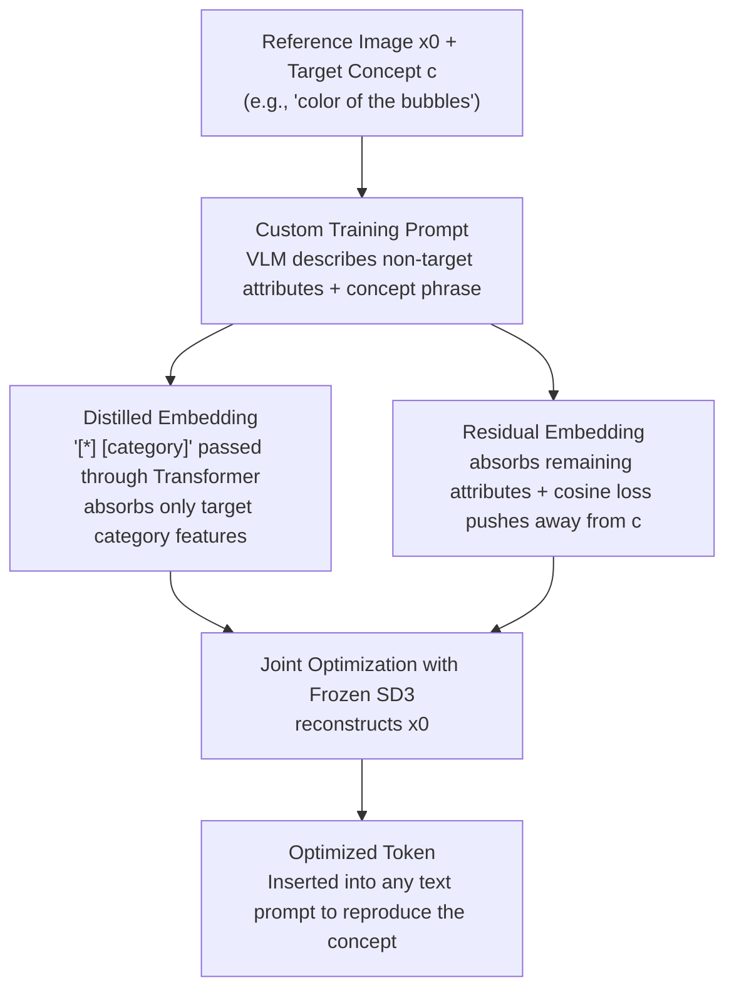

# Selectively Extracting and Injecting Visual Attributes into Text-to-Image Models

**Conference**: CVPR 2026  
**Paper**: [CVF Open Access](https://openaccess.thecvf.com/content/CVPR2026/html/Choi_Selectively_Extracting_and_Injecting_Visual_Attributes_into_Text-to-Image_Models_CVPR_2026_paper.html)  
**Code**: To be confirmed  
**Area**: Diffusion Models / Text-to-Image / Concept Learning  
**Keywords**: Text-to-Image, Visual Attribute Extraction, Concept Injection, Textual Inversion, Distilled Embedding

## TL;DR
This paper proposes a method to extract only a "specified visual attribute" (such as color, material, pose, or camera angle) from a **single reference image** and inject it into a text-to-image model. By leveraging a VLM to automatically construct a training prompt that "describes non-target attributes", alongside two new embeddings—the **distilled embedding** (which isolates target features from tokens using a text Transformer) and the **residual embedding** (which absorbs the remaining attributes to stabilize optimization)—the optimized text token is forced to represent only the target concept. The attribute selectivity of this method outperforms existing approaches like TokenVerse, U-VAP, and ProSpect on a self-built dataset.

## Background & Motivation

**Background**: Text-to-image models have been deeply embedded in design workflows, allowing designers to quickly prototype by specifying shapes, materials, and colors through text prompts. To enhance controllability, various image-conditioned variations have emerged. ControlNet, T2I-Adapter, and StyleShot adopt a "modify architecture + external visual guidance (sketch / pose / style map)" paradigm. InstructPix2Pix and Emu Edit focus on image editing. Subject-driven generation in the style of Textual Inversion maps an object to a text token to reconstruct it in new environments.

**Limitations of Prior Work**: Pure text struggles to describe refined design intentions. Designers often have a reference image and want to capture "this kind of feeling", but have to repeatedly tweak prompts to reproduce it, or even study "prompt books" for mapping words to images, with results still deviating from the goal. Concurrently, existing image-conditioned methods have limitations: ControlNet-based methods only cover shape or style and require preprocessing (such as edge detection/pose estimation) and tens of thousands of training samples; editing methods excel at "modifying a certain attribute" rather than "reproducing a certain attribute"; subject-driven methods reconstruct the **entire object** and cannot isolate just the "color of the object" or the "camera angle of the image".

**Key Challenge**: What is truly desired is **attribute-level** concept learning—extracting only a "specific attribute" from the reference image. However, multiple attributes in a reference image are **entangled** (color, layout, camera angle, and material are mixed together). Since the optimization objective of Textual Inversion forces the token to reconstruct **all** attributes in the image, there is no inherent mechanism to isolate the target attribute from irrelevant ones.

**Goal**: Given a reference image $x_0$ and a textually-described target concept $c$ (e.g., "color of the bubbles"), optimize a text token embedding $e_*$ so that it **only** represents $c$, using only a single image without any external datasets or preprocessing.

**Key Insight**: This work leverages an observation from subject-driven generation: if the training prompt describes "non-target content such as background" clearly, the token embedding will automatically capture only the "remaining foreground" to minimize the loss. Generalizing this concept: as long as all **non-target attributes** are described in the training prompt, the token will be forced to learn only the target attribute.

**Core Idea**: A three-part framework is proposed: "custom training prompt to exclude non-target attributes + distilled embedding to structurally isolate target features via Transformer + residual embedding to hold remaining attributes and stabilize training". This allows a text token to be **selectively** optimized to represent only the target concept.

## Method

### Overall Architecture

The entire method is built upon Textual Inversion (TI): freezing the parameters of the text-to-image model and optimizing only a text token embedding that can be inserted into any prompt. While original TI forces this token to reconstruct **all** attributes of the reference image, this work "crops" it to represent only the target concept $c$.

The pipeline consists of three steps for progressive isolation:
(1) Given a reference image $x_0$ and a target concept $c$ in text form, a **VLM is first used to automatically write a description that "describes all attributes in the image except $c$"**. This is then combined with a concept phrase (e.g., "in [*]") to form a custom training prompt $y_{\text{custom}}$, which passively forces the token to learn only the target attributes not covered by the description. The same VLM also selects an initialization token semantically close to $c$ to shorten the optimization iterations.
(2) Because text length is limited and descriptions cannot be fully comprehensive, some non-target attributes may still leak into the token. Therefore, a **distilled embedding** is introduced: passing "[*] [category]" through the Transformer of the text encoder. Leveraging the mechanism of "semantically related tokens attending to each other", the output embedding of [category] "filters out" and absorbs only the features belonging to that category from [*], structurally isolating the target.
(3) Forcing the distilled embedding to reconstruct all undescribed attributes would conflict with its structure, leading to unstable training. Therefore, a **residual embedding** is added to absorb the remaining attributes. A cosine similarity loss is employed to push the residual embedding away from the target concept, stabilizing the joint optimization. After optimization, inserting this token into any text prompt reproduces the concept in new scenes.

### Key Designs

**1. Custom Training Prompt: Forcing the token to learn only target attributes by "describing non-target attributes"**

To address the limitation where "TI tokens reconstruct all attributes," the authors modify the training prompt instead of directly constraining the token. Original TI uses "A [*]" as a prompt; when the loss is minimized, [*] is forced to represent everything in $x_0$, including the object, background, and camera angle. This paper leverages the finding from subject-driven generation: the more thoroughly the training prompt describes the image, the more the token is restricted to learning only the "undescribed" parts. Hence, the authors use a VLM to generate a description for $x_0$ that "excludes $c$", and then insert the concept phrase (such as "in [*]", "made of [*]", "captured in [*]") into this caption to obtain $y_{\text{custom}}$. During optimization, since the non-target attributes are already captured by the text, [*] only needs to represent the target concept to minimize the loss. In addition, the VLM is used to automatically select the initialization token: it first infers what [*] refers to, provides several synonymous candidates, and feeds them back into the VLM to select the most appropriate one as the optimization starting point, reducing the number of iterations.

**2. Distilled Embedding: Structurally isolating target features using the "like attracts like" mechanism of Transformers**

Since the text length is limited, $y_{\text{custom}}$ cannot enumerate all non-target attributes, and residual irrelevant attributes (such as layout, camera focus, etc.) can still seep into $e_*$. This happens because $e_*$ is unconstrained during optimization, so any undescribed attribute is pushed into it to reduce loss. The authors propose the distilled embedding $h_{\text{[category]}\leftarrow *}$ to close this loophole structurally. The key observation is: semantically related tokens in a Transformer attend to each other; when passing "[*] color" through the text encoder, the output embedding of the "color" token **only** extracts color-related features from [*]. The paper validates this in Fig. 5: replacing [*] with "red / green / blue" significantly changes the "color" embedding, while replacing it with color-irrelevant words like "circular / stretching / aerial" leaves it almost unchanged, proving that the text encoder can indeed isolate features by category. Thus, the authors pass "[*] [category]" ([category] is the coarse category description word of $c$) through the Transformer and take the forward embedding of [category] as the distilled embedding, which is used with the prompt $\tilde y_{\text{custom}}$ (with [*] removed) to calculate the reconstruction loss:

$$\mathbb{E}_{\boldsymbol{\epsilon}\sim\mathcal{N}(\mathbf{0},\mathbf{I}),t}\,\big\|x_\theta(\mathbf{x}_t,t,\text{Insert}(\tau(\tilde y_{\text{custom}}),\mathbf{h}_{\text{[category]}\leftarrow *}))-\mathbf{x}_0\big\|_2^2$$

Where $\text{Insert}(\cdot)$ inserts the distilled embedding back into the encoded $\tilde y_{\text{custom}}$. Compared to letting a raw token optimize freely, the distilled embedding embeds the constraint of "retaining only target category features" directly into the forward pass of the text encoder, acting as a structural constraint rather than a soft prompt.

**3. Residual Embedding + Cosine Loss: Absorbing residual attributes to stabilize optimization without hijacking the target**

If only the distilled embedding is used, the reconstruction loss still forces $h_{\text{[category]}\leftarrow *}$ to reconstruct those undescribed attributes. This causes a conflict between the "target-category-only" structure of the embedding and the "reconstruct everything" requirement of the loss, resulting in unstable training and optimization drift (as shown in Fig. 6, removing the residual embedding leads to failure). The authors add a learnable residual embedding $h_{\text{residual}}$ designed specifically to capture residual attributes other than $c$. Similarly, "[R] [category]" is passed through the Transformer to extract the forward embedding, but [category] is fixed as the generic word "image" (which does not bind to any specific category). With this embedding taking over the task of "reconstructing residual attributes", the distilled embedding can focus purely on representing $c$. However, as the residual embedding is capable of capturing any attribute, it might also absorb $c$. To prevent this, a cosine similarity loss is added to update only the residual embedding, pushing it away from the direction of the distilled embedding (i.e., $c$):

$$\mathcal{L}_{\text{cosine}}=\max\!\left(0,\ \frac{\mathbf{h}_{\text{residual}}\cdot\mathbf{h}_{\text{[category]}\leftarrow *}}{\|\mathbf{h}_{\text{residual}}\|\,\|\mathbf{h}_{\text{[category]}\leftarrow *}\|}\right)$$

### Loss & Training

The final reconstruction loss prepends the residual embedding $\text{Prepend}$ to the front of the prompt, inserts the distilled embedding $\text{Insert}$ back into the conceptual position, and reconstructs $x_0$ using the frozen model $x_\theta$:

$$\mathcal{L}_{\text{recon}}=\mathbb{E}_{\boldsymbol{\epsilon}\sim\mathcal{N}(\mathbf{0},\mathbf{I}),t}\big\|x_\theta\big(\mathbf{x}_t,t,\text{Insert}(\text{Prepend}(\tau(\tilde y_{\text{custom}}),\mathbf{h}_{\text{residual}}),\mathbf{h}_{\text{[category]}\leftarrow *})\big)-\mathbf{x}_0\big\|_2^2$$

$$\mathcal{L}_{\text{total}}=\mathcal{L}_{\text{recon}}+\lambda\,\mathcal{L}_{\text{cosine}}$$

The implementation is based on Stable Diffusion 3 (SD3, which contains 3 text encoders; 4 token embeddings are optimized for each encoder). To maintain sentence structure, after removing [*], a dummy token "category" is used as a placeholder and then replaced by the distilled embedding, while the residual embedding is represented by the dummy token "image". Using a single RTX 3090 with a batch size of 1, each optimization runs for an average of approximately 5,000 steps with a learning rate of 0.001. The cosine loss weight $\lambda$ is set to 0.01 or 0.001.

## Key Experimental Results

Evaluation was fully conducted on a self-built dataset. Target concepts were categorized into six main classes: **shape / material / color / pose / camera shot and angle / style**. The dataset comprises 30 real images and 60 evaluation prompts, specifically including off-center objects, multiple objects, and complex background-dominated scenes (differing from subject-driven datasets where the subject is always centered). Each method generates 6 images per prompt, totaling 1,800 images. Baselines include concept learning methods TokenVerse, U-VAP, and ProSpect, the unified text-to-image model OmniGen2, and Textual Inversion (TI). Since TokenVerse has no official implementation, the authors re-implemented it on SD3 based on the paper (a non-trivial task as the paper did not disclose the training architecture or learning rates).

Two automatic metrics were reported: **Concept Similarity (CS)** measures target concept alignment by calculating the CLIP similarity between generated images and reference images (preprocessed by edge detection for shape/pose, and background removal for material/color; camera angle and style were excluded from this metric due to the lack of robust preprocessing); **Concept Exclusiveness (CE)** = 1 − CLIP similarity, which measures the ability to "avoid introducing irrelevant attributes". Fig. 8 shows that the proposed method achieves the highest overall score. While TokenVerse and ProSpect achieve higher CE, this is because they largely fail to generate the target concept (resulting in a low CS), thereby naturally avoiding extra attributes.

### Main Results (User Study: Ours vs. Baselines)

The table below shows the results of a user study with 28 participants and 540 responses. The "Concept Sim. / Concept Excl." rows display the "preference win rate (%) of the proposed method over each baseline" (>50% indicates that users preferred the proposed method). The "Prompt Fidelity" row indicates the fidelity score of each method (the proposed method's score is listed in its column).

| Metric | Ours | TokenVerse | U-VAP | ProSpect | OmniGen2 | TI |
|------|------|-----------|-------|----------|----------|-----|
| Concept Sim. (vs Ours Win Rate %) | — | 84.0 | 54.0 | 93.7 | 65.3 | 69.2 |
| Concept Excl. (vs Ours Win Rate %) | — | 40.0 | 75.9 | 25.2 | 68.0 | 56.0 |
| Prompt Fidelity (Score) | **0.815** | 0.573 | 0.207 | <u>0.820</u> | 0.613 | 0.604 |

*Interpretation*: In terms of CS, the proposed method dominates (achieving 93.7% against ProSpect and 84.0% against TokenVerse), indicating that users overwhelmingly prefer the proposed method for accurately reconstructing target attributes. Regarding CE, the win rates against ProSpect and TokenVerse are below 50% (25.2% and 40.0%, respectively), but this is because these baselines fail to restore the target concept, naturally avoiding any irrelevant attributes (representing a "passive" exclusion). For Prompt Fidelity, the proposed method achieves 0.815, which is second only to ProSpect's 0.820 and significantly higher than TokenVerse and U-VAP (0.207, which is extremely low).

### Ablation Study

| Configuration | CS | CE | Phenomenon |
|------|----|----|------|
| Full Method (Ours) | Highest | High | Accurately reconstructs target concepts while excluding irrelevant attributes |
| w/o Residual Embedding (Ours w/o $h_{\text{residual}}$) | Decreased | Decreased | Unstable training; the distilled embedding fails to capture target concepts (Fig. 6) |
| Custom Prompts Only (TI w/ $y_{\text{custom}}$) | — | Decreased | Undescribed non-target attributes still seep into the token and are generated together |

> ⚠️ Note: The exact coordinate values for CS / CE in Fig. 8 (CS around 0.755–0.775, CE around 0.32–0.44) are extracted from scatter plots, as precise tabular values were not provided in the paper; refer to the original paper's figures for exact details. Here, the table only represents the trend that "the full method significantly outperforms both ablation variants in both CS and CE."

### Key Findings
- **The residual embedding is key to stabilizing optimization**: Removing it causes training drift, and the distilled embedding fails to capture target concepts. This shows that the division of labor—allowing the distilled embedding to focus on the target while outsourcing remaining attributes to the residual embedding—is indispensable.
- **"High exclusiveness" does not equate to "high quality"**: TokenVerse and ProSpect have higher CE simply because they fail to reconstruct target concepts (very low CS). Evaluations of attribute-level concept learning must consider CS and CE together.
- **Continuing value compared to general large multimodal models**: Compared to GPT-4V/GPT Image 1 and Gemini 2.5 Flash Image, these models struggle to extract implicit concepts like camera angles. While they can reflect target attributes in material examples, they also introduce non-target attributes like background and color, highlighting the ongoing significance of the "selective extraction" task proposed in this work.

## Highlights & Insights
- **Utilizing Transformer's "like attracts like" behavior as an isolation tool**: Passing "[*] [category]" through the text encoder and extracting the forward embedding of [category] to "distill" target features is a clever structural constraint. It requires no architecture modifications or additional regularization; instead, it directly leverages the text encoder's attention mechanism to extract target category features from entangled tokens. The visualization in Fig. 5 (changing color words alters the embedding, while changing irrelevant words does not) is highly convincing.
- **The training prompt paradigm of "describing non-target = passively learning target" is transferable**: Instead of directly constraining "what the token should learn," describing "what should not be learned" in text allows optimization to automatically capture the rest. This reverse approach is highly of reference value for other tasks that extract single factors from entangled representations (e.g., attribute editing, concept disentanglement).
- **Single image, zero dataset, zero preprocessing**: Unlike ControlNet-type methods that require thousands of samples and edge/pose preprocessing, this method can learn an attribute-level concept from a single reference image, significantly lowering deployment costs.

## Limitations & Future Work
- The authors acknowledge that due to GPU resource constraints, experiments were conducted only on SD3, meaning generation quality and applicable contextual ranges are bounded by the capability of the base model. For example, SD3's limited understanding of human anatomy degrades the extraction accuracy of complex human poses. Upgrading to larger models (e.g., FLUX) would unlock stronger capabilities (though the method itself is model-agnostic).
- Limited evaluation scale: The evaluation focuses on six major categories, keeping the number of reference images per concept within a manageable range, prioritizing diversity across concept types and contexts over sheer quantity. The authors call for future work to expand scalable evaluation tools in both "difficulty" and "volume."
- Self-identified limitations: CS metrics exclude camera angle and style due to the lack of robust preprocessing, relying instead on user studies and VLM evaluation; the automatic quantification of these two categories remains an open challenge. Additionally, the lack of an official implementation for TokenVerse necessitated re-implementation, introducing potential reconstruction discrepancies.

## Related Work & Insights
- **vs. Textual Inversion (TI)**: TI maps the entire object into a single token, reconstructing all attributes. This work adds custom prompts and distilled/residual embeddings on top of TI to narrow the scope to an "attribute-level concept", refining TI at an attribute granularity.
- **vs. TokenVerse**: TokenVerse optimizes modulation parameters of text tokens to learn arbitrary visual attributes, but relies on a specific architecture (originally based on FLUX) and fails when transferred to SD3 (not model-agnostic). This method does not bind to a specific modulation structure.
- **vs. U-VAP / ProSpect**: U-VAP trained on subject-driven generation samples tends to almost duplicate the reference image. ProSpect optimizes timestep-dependent token embeddings to disentangle layout, content, style, and material, but often fails to capture the target concept. This method strikes a better balance between "accurately reconstructing the target" and "excluding irrelevant details."
- **vs. ControlNet / T2I-Adapter / Editing methods (InstructPix2Pix, Emu Edit)**: ControlNet-style methods modify the architecture and require extensive samples/preprocessing, only covering shapes or styles. Editing methods excel at "modifying attributes" rather than "reproducing attributes." This method takes the "single-image token optimization" route, covering a broader range of attributes without requiring preprocessing.

## Rating
- Novelty: ⭐⭐⭐⭐ Combining "describing non-target attributes to force target learning" and "leveraging Transformer attention for distilled isolation" is novel and logically consistent.
- Experimental Thoroughness: ⭐⭐⭐⭐ Self-built six-category dataset, five baselines, a user study, and ablation studies, though CS metrics exclude two categories and precise values are omitted from Fig. 8's table.
- Writing Quality: ⭐⭐⭐⭐ Clear build-up of motivation; the distillation mechanism is thoroughly explained and visualized in Fig. 5.
- Value: ⭐⭐⭐⭐ High practical value for design prototyping workflows by achieving attribute-level concept injection using a single image and zero datasets.

<!-- RELATED:START -->

## Related Papers

- [\[CVPR 2026\] When Anonymity Breaks: Identifying Models Behind Text-to-Image Leaderboards](when_anonymity_breaks_identifying_models_behind_text-to-image_leaderboards.md)
- [\[CVPR 2026\] CSF: Black-box Fingerprinting via Compositional Semantics for Text-to-Image Models](csf_black-box_fingerprinting_via_compositional_semantics_for_text-to-image_model.md)
- [\[CVPR 2026\] DCoAR: Deep Concept Injection into Unified Autoregressive Models for Personalized Text-to-Image Generation](dcoar_deep_concept_injection_into_unified_autoregressive_models_for_personalized.md)
- [\[CVPR 2026\] Visual Diffusion Models are Geometric Solvers](visual_diffusion_models_are_geometric_solvers.md)
- [\[CVPR 2026\] TINA: Text-Free Inversion Attack for Unlearned Text-to-Image Diffusion Models](tina_text-free_inversion_attack_for_unlearned_text-to-image_diffusion_models.md)

<!-- RELATED:END -->
