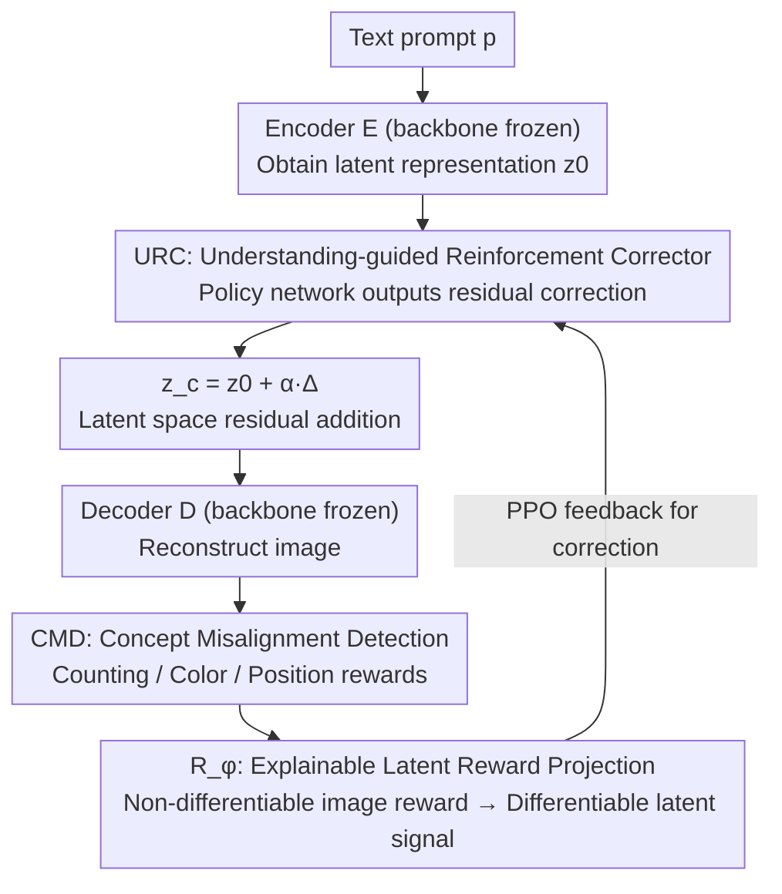

# Self-Corrected Image Generation with Explainable Latent Rewards

**Conference**: CVPR 2026  
**arXiv**: [2603.24965](https://arxiv.org/abs/2603.24965)  
**Code**: [https://yinyiluo.github.io/xLARD/](https://yinyiluo.github.io/xLARD/)  
**Area**: Image Generation / Diffusion Models  
**Keywords**: Text-to-Image Self-Correction, Latent Reward, Explainable Generation, Semantic Alignment, Reinforcement Learning

## TL;DR

Ours proposes the xLARD framework, which performs semantic self-correction in latent space during text-to-image generation via a lightweight residual corrector. It leverages explainable latent reward signals (counting/color/position) to guide generation, achieving a +4.1% improvement on GenEval and +2.97% on DPGBench, while adapting to multiple backbones in a plug-and-play manner.

## Background & Motivation

1. **Background**: Multimodal Large Language Models (e.g., GPT-4V, Qwen2.5-VL) excel in vision-language understanding but often fail to faithfully express their understanding during image generation, especially regarding fine-grained semantics like counting, spatial relations, and color combinations.

2. **Limitations of Prior Work**: A core asymmetry exists—models "understand correctly but generate incorrectly." For example, given the prompt "six penguins walking in a line on snow," the model understands the text but generates incorrect counts and arrangements. This occurs because the understanding and generation components are functionally decoupled during inference.

3. **Key Challenge**: Existing solutions have limitations—(1) Post-training methods (RL/Instruction-tuning) require massive supervision and retraining; (2) Post-processing methods lack control during the generation process; (3) Training-free methods rely on ad-hoc rules and lack semantic transparency.

4. **Goal**: How to utilize the model's own understanding capacity as a real-time guidance signal to correct generation results during the inference process.

5. **Key Insight**: Evaluating a generated image is easier than generating correct content directly—utilizing this asymmetry, the model is allowed to generate first and then self-evaluate and correct.

6. **Core Idea**: Freeze the backbone and train a lightweight residual corrector to modify latent representations in latent space based on explainable multi-dimensional reward signals (counting, color, position).

## Method

### Overall Architecture

xLARD solves a specific dilemma: the "understand right, generate wrong" phenomenon—where a model reads "six penguins walking in a line" but draws five penguins in a mess. The paper bets that **evaluating an image's correctness is much easier than generating it correctly in one go**. Thus, instead of retraining the backbone, the model generates first, reviews its own latent representation, and applies a correction.

The pipeline works as follows: a text prompt $p$ is encoded to obtain a latent representation $z_0 = \mathcal{E}(p)$; a lightweight residual corrector $\Delta_\theta$ takes $z_0$ and the prompt embedding $e_p$ to output a correction amount, which is added back to get $z_c = z_0 + \alpha \cdot \Delta_\theta(z_0, e_p)$; the decoder then restores the corrected latent representation into an image $\hat{x} = \mathcal{D}(z_c)$. To guide the correction direction, three components collaborate: URC is the policy network that applies the fix; CMD monitors misalignments in counting, color, and position dimensions; and $R_\phi$ translates these image-level judgments into latent signals the corrector can learn from. In the penguin example: CMD detects only five penguins, calculates this as a reward penalty, $R_\phi$ projects this back to latent space, and URC adds a residual to $z_0$ to ensure the decoded image contains six penguins—all without changing a single backbone parameter.

### Key Designs

**1. Understanding-guided Reinforcement Corrector (URC): Latent Correction Without Backbone Tuning**

Addressing the pain point that post-training methods often require fine-tuning billions of parameters at high cost, URC treats the corrector $\Delta_\theta$ as a policy network. It takes the current latent $z_0$ and prompt embedding $e_p$ as input and outputs a residual correction while freezing the entire backbone. It bypasses the obstacle of "non-differentiable image-level rewards"—where gradients cannot flow back from images to latent space—by using a learnable reward projector $R_\phi$ to map image-level rewards back: $r_{\text{latent}} = R_\phi(z_c, e_p) \approx r_{\text{image}}(\hat{x}, p, x^*)$. This enables end-to-end learning for the corrector. With trainable parameters kept below 50M (<1% of the base model) and a single forward pass during inference, it introduces zero overhead without requiring extra sampling or online reward calculation.

**2. Concept Misalignment Detection (CMD): Decomposing Correctness into Interpretable Dimensions**

If reward signals are black-box scores, the correction process lacks explainability. CMD decomposes semantic alignment into three orthogonal, explainable sub-rewards. **Counting Reward** performs connected component analysis on token attention maps to estimate object counts $\hat{n}_t$ and compares them with target counts $n_t$: $r_{\text{count}} = \exp(-|\hat{n}_t - n_t|/n_t)$. **Color Reward** calculates cosine similarity between patch-level image features and color word embeddings, averaging the best-matched patches: $r_{\text{color}} = \frac{1}{|\mathcal{C}|}\sum_{c} \max_i s_{i,c}$. **Position Reward** uses attention-weighted centroids to locate entities and sigmoid functions to evaluate consistency with spatial terms in the prompt. These are weighted into a joint reward:

$$r_{\text{task}} = \lambda_{\text{count}}r_{\text{count}} + \lambda_{\text{color}}r_{\text{color}} + \lambda_{\text{pos}}r_{\text{pos}}$$

Weights $\lambda$ are dynamically adjusted by a confidence head based on the prompt—if a prompt emphasizes quantity, the counting weight is increased. Unlike rule-based training-free methods, this decomposition ensures corrections are traceable to specific semantic dimensions.

**3. Explainable Latent Reward Projection ($R_\phi$): Translating Evaluation into Differentiable Objectives**

This component is critical for training URC. $R_\phi(z_c, e_p) \in \mathbb{R}^3$ is a projector trained to approximate the three CMD sub-rewards. Once learned, the corrector's optimization objective becomes a fully differentiable form within latent space, optimized via PPO:

$$\theta^* = \arg\max_\theta \mathbb{E}_{p}\big[R_\phi(z_0 + \Delta_\theta(z_0, e_p), e_p)\big]$$

It also provides visualization via Latent Activation Maps (LAM), which aggregate the absolute values of corrections across channels spatially: $\text{LAM}(h,w) = \sum_c |\Delta_\theta(z_0, e_p)[c,h,w]|$. Highly activated regions indicate where the corrector actually modified the representation, allowing users to see if it added a penguin or adjusted a color, rather than just trusting a better score.

### Loss & Training

The corrector is optimized via PPO with gradients in the form $\nabla_\theta \mathcal{L} = -(R_\phi - b)\nabla_\theta \log \pi_\theta(\Delta_\theta | z_0, e_p)$, where $b$ is a learned baseline to reduce variance. The backbone remains frozen throughout. Training is efficient: approximately 7–8 minutes per epoch on a single H100, completing in about 2 hours for 15 epochs.

## Key Experimental Results

### Main Results

| Method | Type | Params | DPG-Bench | GenEval |
|------|------|--------|-----------|---------|
| FLUX-dev | Diffusion | 12B | 84.00 | 0.68 |
| Janus-pro | AR | 7B | 84.19 | 0.80 |
| BAGEL | AR+RAG | 14B | 84.07 | 0.79 |
| OmniGen2 | Diffusion+AR | 7B | 83.48 | 0.77 |
| **xLARD** | - | - | **86.45** | **0.81** |

GenEval detailed metrics (OmniGen2 backbone):

| Metric | OmniGen2 | + xLARD | Gain |
|------|----------|--------|------|
| Counting | 69.12% | 78.44% | +9.3% |
| Colors | 85.88% | 92.11% | +6.2% |
| Position | 45.52% | 48.75% | +3.2% |
| Overall | 77.03% | 81.29% | +4.3% |

### Ablation Study

| Variant | GenEval (%) | DPG-Bench (%) |
|------|-------------|---------------|
| Full model | 81.29 | 86.45 |
| Without RL | 77.68 | 83.84 |
| Without Confidence Map | 77.94 | 84.21 |
| Without Latent Anchor | 76.90 | 83.56 |

### Key Findings

- **Most Significant Gain in Counting**: A +9.3% improvement in counting on GenEval suggests counting rewards are highly effective for correcting numerical errors.
- **Universal across Backbones**: Consistent improvements are observed across OmniGen2, BAGEL, and Show-O architectures.
- **Latent Anchor Contribution**: Removing the latent anchor drops GenEval by 4.39%, indicating that structured semantic priors are crucial for layout and relationship reasoning.
- **Faithful Explainability Signals**: Masking high-activation LAM regions results in a 6.3% drop in CLIPScore, with a Spearman correlation of ρ=0.71 between token contribution and reward gain.
- **High Data Efficiency**: Compared to post-training methods, xLARD achieves higher gains with significantly less data (see Figure 1, right).

## Highlights & Insights

- **Evaluation is Easier than Generation**: Leveraging the asymmetry between understanding and generation for self-correction is more elegant than massive post-training or external post-processing.
- **Explainability as a First-Class Citizen**: By embedding explainability into the design rather than performing a posteriori analysis, every correction has a semantic basis (counting/color/position). This is the core differentiator from other alignment methods.
- **Extremely Lightweight**: Trainable parameters are less than 1% of the base model, training takes 2 hours, and inference has zero additional overhead—ideal for industrial deployment.
- **Transferable Latent Reward Projection**: The strategy of converting non-differentiable image evaluations into differentiable latent signals can be transferred to other scenarios requiring learning from non-differentiable evaluators.

## Limitations & Future Work

- **Reward Function Scope**: Currently covers only counting, color, and position; more complex semantics like texture, style, and actions are not yet modeled.
- **Dependency on Reference Images**: Training requires high-quality reference images to provide supervision signals.
- **English-only Evaluation**: Multilingual and cross-cultural scenarios have not been validated.
- **Implicit Aesthetic Modeling**: Reward functions may not fully capture aesthetic nuances or cultural subtleties.

## Related Work & Insights

- **vs HermesFlow/UniRL**: Post-training methods require fine-tuning massive backbones at high cost; xLARD modifies <50M parameters, making it several orders of magnitude more efficient.
- **vs CLIP-guided optimization**: While training-free, CLIP-guided optimization often degrades visual quality or introduces instability; xLARD maintains generation priors through latent residual correction.
- **vs RLHF for images**: xLARD offers zero overhead during inference, whereas RLHF-based methods shift the entire model distribution.

## Rating

- Novelty: ⭐⭐⭐⭐ The idea of explainable latent reward-driven self-correction is novel, embedding transparency into the optimization objective.
- Experimental Thoroughness: ⭐⭐⭐⭐⭐ Covers multiple benchmarks (GenEval/DPGBench/ImgEdit/GEdit) across multiple backbones with comprehensive ablations.
- Writing Quality: ⭐⭐⭐⭐ Clear structure with detailed explainability analysis.
- Value: ⭐⭐⭐⭐ A plug-and-play lightweight corrector is highly valuable for practical applications, setting a good example for explainable design in the field.

<!-- RELATED:START -->

## Related Papers

- [\[CVPR 2026\] SOLACE: Improving Text-to-Image Generation with Intrinsic Self-Confidence Rewards](solace_self_confidence_rewards_t2i.md)
- [\[CVPR 2026\] PSR: Scaling Multi-Subject Personalized Image Generation with Pairwise Subject-Consistency Rewards](psr_scaling_multi-subject_personalized_image_generation_with_pairwise_subject-co.md)
- [\[CVPR 2026\] Self-Evaluation Unlocks Any-Step Text-to-Image Generation](self-evaluation_unlocks_any-step_text-to-image_generation.md)
- [\[CVPR 2026\] OSPO: Object-Centric Self-Improving Preference Optimization for Text-to-Image Generation](ospo_object-centric_self-improving_preference_optimization_for_text-to-image_gen.md)
- [\[CVPR 2026\] When Local Rules Create Global Order: Self-Organized Representation Learning for Latent Diffusion Models](when_local_rules_create_global_order_self-organized_representation_learning_for_.md)

<!-- RELATED:END -->
