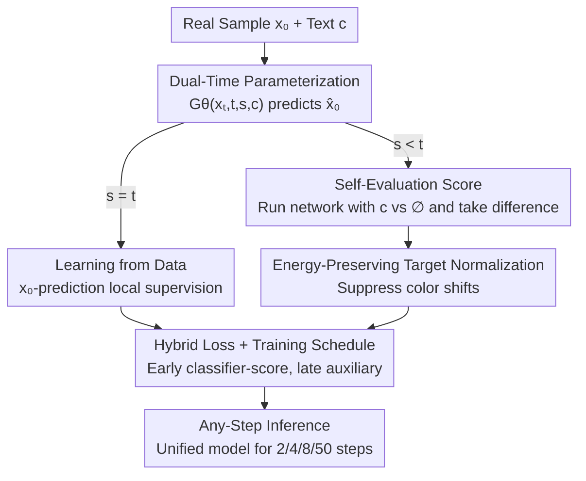

# Self-Evaluation Unlocks Any-Step Text-to-Image Generation

**Conference**: CVPR 2026  
**Paper**: [CVF Open Access](https://openaccess.thecvf.com/content/CVPR2026/html/Yu_Self-Evaluation_Unlocks_Any-Step_Text-to-Image_Generation_CVPR_2026_paper.html)  
**Code**: None  
**Area**: Diffusion Models / Image Generation  
**Keywords**: Any-step generation, text-to-image, self-evaluation, flow matching, few-step sampling

## TL;DR
This paper introduces the Self-Evaluating Model (Self-E), enabling a text-to-image model trained from scratch to learn local velocity fields like flow matching while simultaneously using its own current scoring as a "dynamic self-teacher." Without pre-trained teachers or distillation, it achieves a single model supporting any-step inference—producing high-quality images in 2 steps while competing with top-tier flow matching models at 50 steps.

## Background & Motivation
**Background**: Diffusion models and Flow Matching are the current mainstream for text-to-image generation. Both approximate **local supervision**—the instantaneous velocity (or equivalent score function) at which a noisy sample should move toward the data manifold.

**Limitations of Prior Work**: Local supervision only provides "short-range guidance," correcting minimal bias at each step without a global view of the target distribution. Consequently, the reverse trajectories are curved, forcing the model to run dozens of sequential steps to reliably transition from noise to data, making inference slow and expensive.

**Key Challenge**: Achieving few-step generation requires a "global vision." Mainstream distillation methods must first have a powerful **pre-trained teacher** to provide the true distribution score. This contradicts the goal of "self-sufficient training from scratch." Other approaches trained from scratch (consistency/flow-map types) often suffer from unstable optimization or quality degradation, succeeding only on simple benchmarks like ImageNet, while large-scale success still heavily relies on distillation.

**Goal**: Enable a model to produce images in both few steps (<8 steps) and high-quality many steps when **trained from scratch**, without relying on any external teacher.

**Key Insight**: The authors observe that the "true score provided by the teacher" in distillation can be approximated by the **model's own currently learned local score**. According to the Tweedie formula, the true score is directly linked to the conditional expectation $E[x_0|x_s,c]$, which the model inherently learns from the data. Even if the estimation is inaccurate early on while the "student" has not converged, this coarse self-evaluation signal is sufficient to guide training effectively.

**Core Idea**: Replace "teacher evaluating student samples" with "model evaluating its own generated samples." By stitching instantaneous local learning with self-driven global distribution matching, any-step inference is unlocked within a unified model trained from scratch.

## Method

### Overall Architecture
Self-E trains a network $G_\theta(x_t, t, s, c)$ that receives **two time variables** $s \le t$ and directly predicts a clean sample $\hat{x}_0 = x_t - t\,V_\theta(x_t, t, s, c)$. The entire training is driven by two complementary objectives: when $s=t$, only the local reconstruction loss learned from data applies; when $s<t$, an additional "self-evaluation" objective is introduced for global distribution matching. The total loss is:

$$L(\theta) = L_{\text{data}}(\theta) + \lambda L_{\text{self-evaluate}}(\theta).$$

The key workflow for self-evaluation is: first generate $\hat{x}_0$ using the model, then diffuse it into $\hat{x}_s$, and run the **same network** (with gradients stopped/evaluation mode) twice—once with text condition $c$ and once with an empty prompt $\phi$. The difference between the two serves as a "self-evaluation score," backpropagated as feedback gradients applied to $\hat{x}_0$, pushing generated samples toward high-density regions of the true distribution without a teacher.

### Key Designs

**1. Dual-Time Parameterization: Changing the target from "learning trajectories" to "direct marginal matching"**

The pain point of consistency/flow-map methods is that while they use two time variables, they learn the **average velocity or flow map** (the integral of local velocity) over a segment of the reverse trajectory, essentially binding them to a specific path. The network $G_\theta(x_t, t, s, c)$ in this paper also takes $(t, s)$, but its goal is fundamentally different: it predicts samples directly and requires the marginal distribution $p_\theta(x_s|c)$ of the diffused $\hat{x}_0$ to match the real distribution $q(x_s|c)$, **without constraining** the reverse transition to any specific trajectory. When $s=t$, the model reduces to standard conditional flow matching, where $G_\theta(x_t,t,t,c)$ estimates the conditional expectation $E[x_0|x_t,c]$. This dual identity—functioning as both a single-step predictor and a score estimator—is why self-evaluation works.

**2. Self-Evaluation Score: Using the model to approximate the true score to ditch the teacher**

Global distribution matching requires gradients of the reverse KL divergence $D_{\text{KL}}(p_\theta(x_s|c)\,\|\,q(x_s|c))$, involving the difference between the "fake score" $\nabla\log p_\theta$ and the "true score" $\nabla\log q$. The true score typically relies on a pre-trained teacher. This work uses the Tweedie formula $\nabla_{x_s}\log q(x_s|c) = (\alpha_s E[x_0|x_s,c] - x_s)/\sigma_s^2$, where the model's current $G_\theta(x_s,s,s,c)$ is learning this expectation from data, thus using it directly to approximate the true score. In implementation, the authors split the KL gradient into a **classifier score term** and an **auxiliary term**. Empirically, the classifier score alone is sufficiently effective and converges more easily, so the auxiliary term is omitted early on to avoid co-training a model to estimate the fake score. A pseudo-target is constructed:

$$x_{\text{self}} := \mathrm{sg}\big[\hat{x}_0 - (G_\theta(\hat{x}_s, s, s, \phi) - G_\theta(\hat{x}_s, s, s, c))\big],$$

where $\mathrm{sg}$ denotes stop-gradient. Minimizing $\|G_\theta(x_t,t,s,c) - x_{\text{self}}\|^2$ induces gradients aligned with the expected classifier score direction—this is the complete mechanism of "self-evaluation": the same network acts as both generator and judge.

**3. Energy-Preserving Target Normalization: Controlling color shifts from self-evaluation**

The weight of the self-evaluation term is $\lambda_{s,t} = \sigma_t/\alpha_t - \sigma_s/\alpha_s$ (becomes 0 when $t=s$). However, when $\lambda_{s,t}$ is large, it can overwhelm the data loss, causing color shifts. Borrowing from high CFG processing, the authors apply **energy-preserving normalization** to the implicit regression target $x_{\text{tar}} = (x_0 + \lambda_{s,t} x_{\text{self}})/(1+\lambda_{s,t})$:

$$x_{\text{renorm}} = \frac{x_0 + \lambda_{s,t} x_{\text{self}}}{\|x_0 + \lambda_{s,t} x_{\text{self}}\|_2}\,\|x_0\|_2,$$

aligning the target's energy with the clean sample $x_0$. Ablations show this slightly improves image quality and stability (except at extreme 2-step settings).

**4. Hybrid Training Schedule + Any-Step Inference: Stable early, refined late**

While the auxiliary term corresponds to more precise distribution matching, adding it from the start significantly hinders training (it primarily prevents mode collapse, which "learning from data" already addresses). Thus, a **hybrid schedule** is used: early stages use only the classifier score (saving compute and stabilizing optimization), while the auxiliary term is added later for refinement, specifically addressing checkerboard or oversaturated artifacts in 2-step generation. The inference side naturally supports any number of steps: given a step budget $N$ and schedule $\{t_k\}$, it iteratively denoises via $x_{t_{k+1}} = x_{t_k} - (t_k - t_{k+1})V_\theta(x_{t_k}, t_k, s_k, c)$, with $s_k = t_{k+1}$ by default, combined with energy-preserving CFG ($\omega=5$).

### Loss & Training
The final loss for each pair $(s, t)$ is $L_{s,t}(\theta) = \|\hat{x}_0 - x_{\text{renorm}}\|_2^2$, with the overall loss being a weighted average over all time pairs $L(\theta) = E_{s,t}[w_{s,t} L_{s,t}(\theta)]$. Main experiments use a 2B parameter, 512×512 latent transformer (adapted from FLUX, fine-tuned to accept an additional time input $s$); ablations use a 0.5B model at 256×256 with a batch size of 1024.

## Key Experimental Results

### Main Results
Comparison on the GenEval benchmark against methods covering various training paradigms (Flow Matching FLUX/SANA/SDXL, Distillation LCM, any-step TiM). Self-E achieves comprehensive SOTA across all steps and improves monotonically.

| Steps | Metric | Self-E | Second Best | Gain |
|-------|--------|--------|-------------|------|
| 2     | GenEval Overall | 0.753 | 0.634 (TiM) | +0.12 |
| 4     | GenEval Overall | 0.781 | 0.687 (TiM) | +0.09 |
| 8     | GenEval Overall | 0.785 | 0.779 (SANA-1.5) | +0.006 |
| 50    | GenEval Overall | 0.815 | 0.806 (SANA-1.5) | +0.009 |

The advantage in the few-step range is particularly stark: at 2 steps, FLUX/SANA/SDXL almost completely fail (Overall 0.002~0.166), while Self-E reaches 0.753. At 50 steps, it still outperforms FLUX.1-dev (0.797).

### Ablation Study
0.5B model, GenEval Overall (top block at 100k iterations for design choices, bottom block at 300k iterations for paradigm comparison).

| Configuration | 2 steps | 4 steps | 8 steps | 50 steps | Description |
|---------------|---------|---------|---------|----------|-------------|
| w/o normalization | 0.5555 | 0.6156 | 0.6521 | 0.7018 | Performance drop in most steps |
| Full-time aux term | 0.3307 | 0.4304 | 0.5153 | 0.6166 | Serious degradation if added early |
| Self-E (Complete) | 0.5439 | 0.6381 | 0.6819 | 0.7160 | Final model |
| Flow Matching | 0.2523 | 0.6075 | 0.7155 | 0.7311 | Standard FM, fails at few steps |
| IMM | 0.2617 | 0.5994 | 0.7112 | 0.7472 | Alternative few-step from scratch |
| Self-E (300k) | 0.6097 | 0.7121 | 0.7490 | 0.7543 | Comprehensive lead |

### Key Findings
- **Auxiliary term cannot be added from the start**: Using it throughout results in only 0.33 at 2 steps, far behind the final model (0.54)—confirming that the hybrid schedule is essential.
- **Few-step performance is the core moat**: Flow Matching/IMM can catch up at 50 steps but collapse to ~0.25 at 2 steps, whereas Self-E maintains 0.61; the global vision from self-evaluation manifests most in low-step budgets.
- **Cost of normalization**: It improves stability/quality in most steps but slightly hurts extreme 2-step settings.
- Late-stage aux terms specifically fix artifacts like checkerboards in 2-step generation (visible in Fig. 6).

## Highlights & Insights
- **Clever paradigm shift**: Distillation's global supervision was once thought to require an external teacher; by using the Tweedie formula to replace the "true score" with the "model's own learned expectation," the paper bridges training from scratch and global matching.
- **Smart reuse of dual-time variables**: For the same $(t, s)$ input, consistency methods learn flow maps, while this paper performs marginal distribution matching—different goals sharing the same parameterization with almost zero architectural overhead.
- **Single model for any step budget**: High performance scales monotonically with steps, removing the engineering burden of training/deploying separate few-step and many-step models. This approach is transferable to tasks like text-to-video.

## Limitations & Future Work
- Results focus on GenEval (alignment/counting/positioning); there is a lack of systematic quantification for image quality like FID or human preference.
- Early self-evaluation uses an "unconverged model" to approximate the true score. While authors argue it's acceptable since the student has also not converged, the theoretical boundary and failure cases of this approximation are not fully discussed.
- Switching points for hybrid schedules and values for $\lambda_{s,t}$ and $s_k$ depend on empirical tuning.
- Concurrent with TiM; finer horizontal comparison of their respective strengths remains to be seen.

## Related Work & Insights
- **vs. Distillation (LCM / DMD, etc.)**: These require a pre-trained teacher's distribution/trajectory. Ours replaces the teacher with "the training self," completing distribution matching during pre-training without teacher dependency.
- **vs. Consistency / Flow-map (MeanFlow / TiM)**: These learn average velocities or flow maps; scaling them to large-scale T2I is difficult. Ours does not bind to trajectories, matching marginal distributions instead for more stable few-step quality.
- **vs. Standard FM / Diffusion (FLUX / SANA / SDXL)**: Pure local supervision leads to few-step failure. Ours overlays self-driven global matching on local data supervision, filling the "blind spot" of short-range guidance.

## Rating
- Novelty: ⭐⭐⭐⭐⭐ "Self-evaluation as teacher score" is a clean and powerful innovation.
- Experimental Thoroughness: ⭐⭐⭐⭐ Strong GenEval and ablation results, though missing some quality-specific metrics.
- Writing Quality: ⭐⭐⭐⭐ Clear motivation (local vs. global, Tweedie approximation) and well-structured design.
- Value: ⭐⭐⭐⭐⭐ Direct significance for efficient generation deployment.

<!-- RELATED:START -->

## Related Papers

- [\[CVPR 2026\] GenColorBench: A Color Evaluation Benchmark for Text-to-Image Generation](gencolorbench_a_color_evaluation_benchmark_for_text-to-image_generation.md)
- [\[CVPR 2026\] OSPO: Object-Centric Self-Improving Preference Optimization for Text-to-Image Generation](ospo_object-centric_self-improving_preference_optimization_for_text-to-image_gen.md)
- [\[CVPR 2026\] OctoT2I: A Self-Evolving Agentic Text-to-Image Router](octot2i_a_self-evolving_agentic_text-to-image_router.md)
- [\[CVPR 2026\] LeapAlign: Post-Training Flow Matching Models at Any Generation Step by Building Two-Step Trajectories](leapalign_post_training_flow_matching_models_at_any_generation_step.md)
- [\[CVPR 2026\] SOLACE: Improving Text-to-Image Generation with Intrinsic Self-Confidence Rewards](solace_self_confidence_rewards_t2i.md)

<!-- RELATED:END -->
