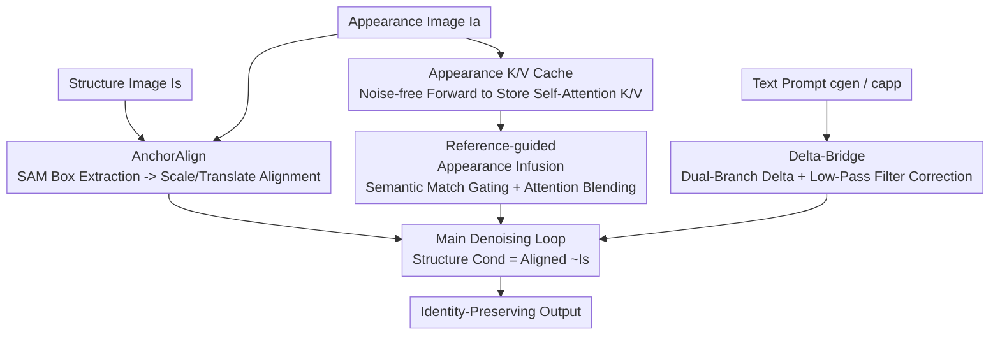

# Semantic Alignment for Pose-Invariant Identity Preserving Diffusion

**Conference**: CVPR 2026  
**Paper**: [CVF Open Access](https://openaccess.thecvf.com/content/CVPR2026/html/Kim_Semantic_Alignment_for_Pose-Invariant_Identity_Preserving_Diffusion_CVPR_2026_paper.html)  
**Code**: [Project Page jwonkm.github.io/SeAl](https://jwonkm.github.io/SeAl/)  
**Area**: Image Generation / Controllable Diffusion  
**Keywords**: Identity Preservation, Training-Free, Structure-Appearance Controllable Generation, Self-Attention Feature Infusion, Pose-Invariant

## TL;DR
SeAl proposes a **training-free** text-to-image framework that uses three modules—geometric pre-alignment, self-attention K/V feature infusion, and text-appearance delta correction—to **infuse** the fine-grained identity of a reference image into arbitrary structural conditions. Unlike existing methods that "re-imagine" the subject, this approach significantly boosts the identity preservation metric DINO-I in highly challenging scenarios, such as animal textures and human faces/apparel.

## Background & Motivation
**Background**: Controllable T2I generation aims to simultaneously control three signals: structure (pose/layout), appearance (identity/style), and text prompts. Training-based methods (such as ControlNet for structure and IP-Adapter for appearance) are effective but require training separate adapters for each control signal. Personalization methods like DreamBooth/Textual Inversion offer high identity fidelity but require per-subject fine-tuning, suffering from poor flexibility and scalability.

**Limitations of Prior Work**: Training-free methods (e.g., Ctrl-X, DRF, FreeControl) can simultaneously control structure and appearance in a plug-and-play manner. However, they generally fall into the "**re-imagination**" trap—the strong priors of diffusion models tend to **re-synthesize** appearance features to match the given structure, resulting in the loss of fine-grained details and the identity of the reference image. This "identity leakage" is particularly severe on out-of-domain data, such as unique faces, complex apparel, and species-specific animal textures. Furthermore, these methods are highly sensitive to **spatial misalignment** between the structure and appearance images. Once the subject positions or scales are inconsistent, feature mapping errors and structural artifacts arise even before the re-synthesis issues occur.

**Key Challenge**: Existing research faces a trilemma: pay a high training cost to achieve high identity fidelity, tolerate conflicts among multiple control signals, or choose a flexible training-free scheme at the expense of authentic identity. The root cause is that mainstream pipelines treat appearance as "materials to be redrawn," which is fundamentally **re-imagining** rather than **identity infusion**.

**Goal**: To simultaneously satisfy structure, appearance, and text constraints within a training-free framework, liberating identity preservation from the "re-drawing" paradigm, while resolving structural artifacts caused by spatial misalignment.

**Key Insight**: The authors observe that identity information is inherently contained within the **self-attention K/V features** generated when the appearance image passes through the U-Net. Instead of forcing the model to synthesize the subject from scratch, these original K/V keys and values can be **directly cached and selectively infused** into the generation process based on semantic matching, enabling the model to "infuse" rather than "re-imagine."

**Core Idea**: Transform the task from "re-imagining" to "infusing"—geometrically pre-aligning the structure to the appearance anchor, injecting the cached self-attention K/V features of the appearance image based on semantic similarity, and resolving text-appearance conflicts via a delta guidance mechanism.

## Method

### Overall Architecture
SeAl implements **zero-training** modifications on a pre-trained SDXL, which is split into a **preprocessing stage** and a **main diffusion stage**. The preprocessing stage performs two tasks in parallel: `AnchorAlign` uses SAM to extract bounding boxes of the subjects and scales/moves the structural image to align with the appearance anchor, yielding the aligned structural condition $\tilde{I}_s$; meanwhile, the appearance image $I_a$ undergoes a single noise-free forward pass, caching the self-attention Key/Value features of each layer as $CA_{app}$. In the main diffusion stage, during each denoising step, `Reference-guided Appearance Infusion` blends the cached appearance K/V features into the self-attention layers inside the U-Net based on semantic matching. Concurrently, `Delta-Bridge` computes the final noise prediction $\hat{\epsilon}_{final}$ corrected by text guidance to update the latent variables. These three modules work in harmony to resolve the trilemma among structure, appearance, and text.

### Key Designs

**1. AnchorAlign: Geometric Pre-Alignment for a Stable Foundation**

Training-free methods are highly sensitive to spatial misalignment between the structure and appearance images—when the subject positions or scales differ, the model maps features incorrectly, leading to structural artifacts or identity leakage. `AnchorAlign` is an automated preprocessing step that aligns the structure image with the appearance anchor via a two-step "scale-translate" operation. First, Segment Anything (SAM) is utilized on both the appearance image $I_a$ and the structure image $I_s$ to extract their respective bounding boxes $B_a$ and $B_s$. The uniform scale factor is calculated as the ratio of the heights of the two boxes $s_{scale} = h_a / h_s$. Then, taking the bottom centers of the boxes $P_a$ and $P_s$ as anchors, the translation vector is computed as $\mathbf{t} = P_a - (s_{scale}\cdot P_s)$. The scaled structure image is projected onto a new canvas to obtain $\tilde{I}_s$:

$$\tilde{I}_s = \begin{cases} I^{scaled}_s(p-\mathbf{t}) & \text{if } p-\mathbf{t}\in\mathcal{D}_{scaled}\\ c_{bg} & \text{otherwise}\end{cases}$$

This approach is highly effective because it decouples "alignment" from the implicit learning burden of the diffusion model, converting it into a deterministic geometric preprocessing step. Consequently, the subsequent feature infusion process always operates on a well-posed and scale-matched structure, avoiding degradation before the re-synthesis phase. This step is optional and can be skipped to save time if the inputs are already aligned.

**2. Reference-guided Appearance Infusion: Caching Appearance K/V for Selective Identity Injection via Semantic Matching**

This is the core mechanism that allows SeAl to bypass the "re-imagination" issue. It consists of three steps. **Caching**: Before generation begins, $I_a$ goes through a single noise-free forward pass. The self-attention K/V features at specified layer sets $L_{app}$ (only standard attention layers in the mid and up blocks `attn1` are selected to focus on texture/style, while down blocks are deliberately excluded to reduce structural interference) and at specified timesteps $T_{app}$ are preserved as $CA_{app}$. **Gating**: During generation, the current latent variable is used to compute the Query. For each query token $q_i$ and all appearance keys in the cache, the maximum cosine similarity is calculated as $\text{sim}(q_i, K^{(t,l)}_{app}) = \max_j \frac{q_i\cdot k_{app,j}}{\|q_i\|\|k_{app,j}\|}$. If it exceeds the threshold $\tau$, the validity mask is set to $M_{valid,i}=1$. **Hybrid Scheduling**: Two paths of attention are computed: the base attention $A_{base}$ uses the K/V features of the current latent variables, while the appearance attention $A_{app}$ uses the top-$k$ (default $k=1$) appearance K/V features $(\tilde{K}_{app},\tilde{V}_{app})$ most similar to Q. These are blended based on the injection strength $\delta$ and the validity mask:

$$A_{final} = (1-\delta\cdot M_{valid})\odot A_{base} + (\delta\cdot M_{valid})\odot A_{app}$$

The validity mask ensures that low-similarity tokens ($M_{valid,i}=0$) fall back to the base attention, shielding the structural skeleton from being corrupted by appearance. Furthermore, $\tau$ and $\delta$ are dynamically scheduled along the denoising process: a conservative setting (high $\tau$, low $\delta$) is used in the early stages to secure structural stability, while an aggressive setting (low $\tau$, high $\delta$) is adopted in the later stages to maximize detail infusion. This is effective because it only transfers the local features of the appearance image that **genuinely correspond semantically** to the target positions instead of re-drawing the entire subject based on priors—the very differentiator of "infusion vs. re-imagination."

**3. Delta-Bridge: Treating Text-Appearance Conflicts as Controllable "Delta Correction Signals" Rather Than Noise**

When a semantic discrepancy exists between the style/appearance image and the text prompt (e.g., the appearance shows a "blue shirt" but the text prompt specifies a "red shirt"), naive methods lead to conflicts where either the text is ignored or the identity is disrupted. `Delta-Bridge` **reinterprets** such discrepancy as a useful directional vector $\Delta$, representing "the direction of change desired by the text prompt." It employs a dual-branch guidance framework, separately computing the generation guidance $g_{gen}=\epsilon_\theta(z_t,c_{gen})-\epsilon_\theta(z_t,\emptyset)$ and the appearance guidance $g_{app}=\epsilon_\theta(z_t,c_{app})-\epsilon_\theta(z_t,\emptyset)$. Notably, **global quality enhancers like "high quality" are only appended to $c_{gen}$**, separating their roles: $g_{app}$ focuses purely on preserving identity, while $g_{gen}$ regulates new styles and overall quality, preventing identity contamination. The difference between the two forms the semantic delta $\Delta = g_{gen} - g_{app}$, which is low-pass filtered via iterative 2D average pooling to isolate macro-changes (e.g., pose or color) from high-frequency identity details. It is finally added back to the main guidance:

$$\hat{\epsilon}_{final} = \epsilon_\theta(z_t,\emptyset) + w\cdot g_{gen} + \lambda(\gamma)\cdot\Delta_{filtered}$$

The strength $\lambda(\gamma)$ is scheduled according to the sampling progress $\gamma$. It mainly functions during the early-to-mid phases to enforce text-driven controls and macro-shapes, and subsequently decays to zero, handing the final detailed rendering back to the appearance infusion pipeline. This design is highly effective because it only applies modifications along the direction of the "difference between text and appearance" while filtering out high-frequency identity features. As a result, it alters only "what should be changed" (e.g., red to blue, pose alterations) without modifying "what should remain" (e.g., face, intrinsic textures).

### Loss & Training
SeAl is completely **training-free**, featuring no trainable parameters or loss functions. It directly modifies self-attention and CFG during inference on pre-trained SDXL v1.0. The core tunable hyperparameters include top-$k$ (default $k=1$), semantic matching threshold $\tau=0.15$, and blending strength $\delta=3.0$, where $\tau$ and $\delta$ dynamically vary according to a pre-defined schedule during the denoising process.

## Key Experimental Results

### Main Results
Appearance datasets consist of 256 images (81 humans, 133 animals, 21 celebrities) paired with various structure conditions (Mesh, Pose, Depth, Canny, etc.). Metrics evaluated include: CLIP Score (text alignment $\uparrow$), DINO-I (identity similarity $\uparrow$), and DreamSim-str (structural alignment $\uparrow$), supplemented by human-preference reward models HPSv2 and ImageReward. The following table showcases selected results in two highly challenging setups, Animal-Pose and Human-Pose:

| Setup | Method | CLIP $\uparrow$ | DINO-I $\uparrow$ | DreamSim-str $\uparrow$ |
|------|------|-------|---------|---------------|
| Animal-Pose | Ctrl-X | 0.2807 | 0.6174 | 0.7926 |
| Animal-Pose | DRF | 0.3268 | 0.6318 | 0.8397 |
| Animal-Pose | **SeAl** | 0.3281 | **0.7104** | **0.8450** |
| Human-Pose | Ctrl-X | 0.2863 | 0.5588 | 0.7830 |
| Human-Pose | DRF | 0.3099 | 0.5438 | 0.8144 |
| Human-Pose | **SeAl** | 0.3064 | **0.7465** | 0.8186 |

The identity metric DINO-I is significantly superior across all datasets and structural types (escalating from ~0.56 to 0.7465 in Human-Pose), while CLIP and DreamSim-str remain the highest or highly competitive in most categories, indicating that identity infusion does not compromise text and structural alignment. HPSv2 and ImageReward are also consistently the highest, showing that the outputs are not only numerically superior but also highly favored by human-preference models.

### Ablation Study

| Configuration | Key Phenomenon | Description |
|------|---------|------|
| w/o AnchorAlign | Subject geometric misalignment, structural inconsistency | Particularly deteriorated in extreme scale or pose differences, proving that pre-alignment is a stable foundation |
| top-k: k=1 vs k>1 | k=1 is sharp with clear identity; as k increases, blurring and unnatural foreground-background blending occur | Soft matching averages multiple features which introduces blurriness; hence, k=1 is the default |
| Threshold $\tau \uparrow$ | DINO-I monotonically decreases | The stricter $\tau$ is, the fewer tokens can be infused, weakening the transfer of appearance |
| Strength $\delta \uparrow$ | DINO-I monotonically increases | The larger $\delta$ is, the higher the weight of the appearance branch during blending, which enhances identity transfer |

The defaults are set to $\tau=0.15$ and $\delta=3.0$, achieving a robust trade-off between identity preservation and text/structural alignment.

### Key Findings
- The dominant module for identity preservation is Reference-guided Appearance Infusion: the significant boost in DINO-I stems directly from "cached K/V + semantically gated infusion," demonstrating that it indeed "transfers" rather than "re-draws" identity.
- AnchorAlign contributes most when subjects are severely misaligned; removing it leads to geometric inconsistencies, making it a prerequisite for the down-stream modules to function properly.
- The three-way trade-off among identity, text, and structure is highly sensitive to $\tau$ and $\delta$, and their effects are in opposite directions (stricter thresholds diminish identity, stronger blending enhances it), necessitating cooperative scheduling.
- Computational Cost: SeAl is training-free. A single 512×512 resolution inference takes approximately 34.83s (main denoising $\approx$ 18s + AnchorAlign $\approx$ 10s + K/V caching $\approx$ 6s), with a peak GPU memory of 8.70 GiB. This is lower than ControlNet+IP-Adapter (13.88 GiB) and DRF (14.44 GiB). AnchorAlign can be bypassed for already aligned inputs, saving around 10s.

## Highlights & Insights
- **Paradigm reformulation of "infusion over re-imagination"**: The failure of identity preservation is attributed to "the model re-drawing the subject." Directly transferring raw features using cached self-attention K/V is a simple yet insightful solution, serving as the most compelling "ah-ha!" moment of the paper.
- **Validity mask with semantic gating**: Deciding whether each token is infused with appearance using a query-key cosine similarity threshold allows structural skeletons (low similarity areas) to fallback automatically to the base attention. This cleverly delegates the decision of "where to preserve structure" and "where to transfer appearance" to semantic self-adaptation rather than manual masks.
- **Delta-Bridge turning "conflict" into "signal"**: While guidance discrepancy between text and appearance is traditionally problematic, the authors leverage low-pass filtering to segregate macro-level edits from high-frequency identity details. This transforms tasks like "changing colors/pose while keeping the face intact" into controllable operations—an elegant delta+filtering technique easily generalizable to other identity-preserving diffusion editing tasks.
- **Limiting K/V caching to mid/up blocks**: The deliberate exclusion of down-blocks to prevent appearance features from corrupting structural geometry showcases a nuanced exploitation of U-Net layer-wise functionalities (structure vs. texture).

## Limitations & Future Work
- The authors acknowledge a moderate runtime overhead (AnchorAlign $\approx$ 10s, K/V caching $\approx$ 6s); although training-free, single-image inference is slower than the pipeline combining Ctrl-X and IP-Adapter.
- AnchorAlign relies on SAM to extract reliable bounding boxes of the subjects, which works well for clean, single-subject scenarios. However, under multi-subject conditions, severe occlusions, or scenes lacking a clear main subject, the geometric alignment assumption (box-scale-translate) might fail (which is not adequately discussed in the paper).
- The dataset scale is relatively small (256 appearance images), and the $\tau/\delta$ schedules are manually engineered. Whether the optimal scheduling remains consistent across different subjects/structures or can be made adaptive remains to be verified.
- The hard matching of $top\text{-}k=1$ preserves sharpness, but might lead to insufficient details when the semantic gap between the style and target is large, resulting in sparse infusible tokens. Investigating adaptive $k$ schemes bridging hard and soft matching remains an prospective avenue.

## Related Work & Insights
- **vs. Ctrl-X / DRF (Training-Free)**: These approaches utilize spatial normalization or score guidance to re-synthesize appearance features to fit the structure, which is fundamentally "re-drawing" and leads to obvious identity leakage in complex subjects. SeAl instead caches and selectively infuses the raw K/V features, drastically outperforming them in DINO-I. The core difference lies in "infusion vs. re-drawing."
- **vs. ControlNet + IP-Adapter (Training-based Combination)**: This approach couples structural controls with appearance adapters, which frequently causes conflict between the two signals, overriding the identity or disregarding the structure. Additionally, it demands heavy training. SeAl is training-free and actively reconciles text-appearance conflicts via Delta-Bridge.
- **vs. DreamBooth / Textual Inversion (Personalization)**: Subject-specific fine-tuning offers high identity fidelity but incurs scale bottlenecks; SeAl is plug-and-play, omitting per-subject optimization.

## Rating
- Novelty: ⭐⭐⭐⭐⭐ A paradigm shift from "re-imagination" to "infusion," combined with cached K/V semantic-gating infusion and Delta-Bridge correction. Highly creative integration.
- Experimental Thoroughness: ⭐⭐⭐⭐ Spans various structure types, animal/human datasets, human-preference rewards, and thorough ablations. However, the appearance dataset is limited to 256 images, lacking multi-subject and failure-case analysis.
- Writing Quality: ⭐⭐⭐⭐⭐ Distinctly defines the roles of the three modules, matches formulas with diagrams excellently, and delivers a coherent narrative from limitations to mechanism and outcomes.
- Value: ⭐⭐⭐⭐ Training-free high-fidelity identity preservation is highly practical for controllable generation, and techniques like delta-correction are transferable to other editing tasks.

<!-- RELATED:START -->

## Related Papers

- [\[CVPR 2026\] CaricHarmony: Contrastive Diffusion Paths for Identity-Preserving Caricature Synthesis](caricharmony_contrastive_diffusion_paths_for_identity-preserving_caricature_synt.md)
- [\[CVPR 2026\] Identity-Preserving Image-to-Video Generation via Reward-Guided Optimization](identity-preserving_image-to-video_generation_via_reward-guided_optimization.md)
- [\[CVPR 2026\] Not All Birds Look The Same: Identity-Preserving Generation For Birds](not_all_birds_look_the_same_identity-preserving_generation_for_birds.md)
- [\[CVPR 2026\] MultiCrafter: High-Fidelity Multi-Subject Generation via Disentangled Attention and Identity-Aware Preference Alignment](multicrafter_high-fidelity_multi-subject_generation_via_disentangled_attention_a.md)
- [\[CVPR 2025\] StableAnimator: High-Quality Identity-Preserving Human Image Animation](../../CVPR2025/image_generation/stableanimator_high-quality_identity-preserving_human_image_animation.md)

<!-- RELATED:END -->
