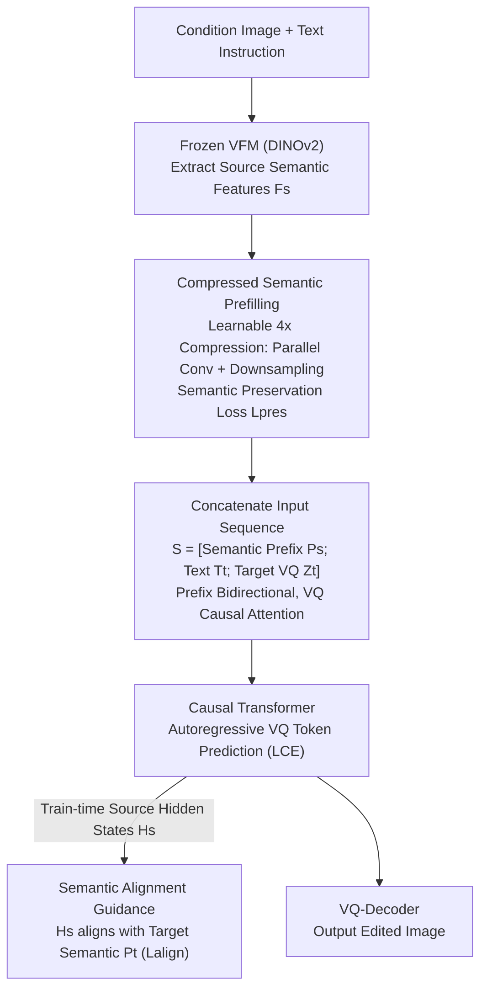

# Semantic Context Matters: Improving Conditioning for Autoregressive Models

**Conference**: CVPR 2026  
**Paper**: [CVF Open Access](https://openaccess.thecvf.com/content/CVPR2026/html/Jin_Semantic_Context_Matters_Improving_Conditioning_for_Autoregressive_Models_CVPR_2026_paper.html)  
**Code**: https://github.com/AMAP-ML/SCAR (Code to be released)  
**Area**: Image Generation / Autoregressive Models / Controllable Editing  
**Keywords**: Autoregressive Image Editing, Prefix Conditioning, Semantic Compression, DINOv2, Hidden State Alignment  

## TL;DR
SCAR replaces the "prefix conditioning" of autoregressive image editing from lengthy, semantically sparse VQ tokens to dense semantic prefixes (Compressed Semantic Prefilling) extracted by a frozen visual foundation model and compressed 4× via a learnable module. During decoding, an auxiliary loss is used to align the "internal hidden states" of the source image with the target image semantics (Semantic Alignment Guidance), achieving higher visual quality and instruction consistency for both next-token and next-set AR paradigms while reducing training memory by ~24% and increasing speed by ~1.4×.

## Background & Motivation

**Background**: Image editing currently follows two main paths—diffusion models and autoregressive (AR) models. AR models (e.g., next-token LlamaGen, next-set VAR) are considered promising due to their natural alignment with unified multimodal architectures and higher efficiency in sampling/deployment, with generation quality approaching top-tier diffusion models.

**Limitations of Prior Work**: When extending AR models to "general image editing," conditioning is weak and inefficient, leading to poor instruction following and artifacts. Existing AR editing solutions fall into two categories with inherent flaws: (1) **Decoding-stage injection** (e.g., ControlAR) inserts control signals into intermediate layers. While strong for pixel-level controllable generation, this rigid spatial guidance **interrupts the autoregressive process**, causing undesirable changes during general instruction-based editing. (2) **Prefix-stage conditioning** (e.g., EditAR, major UMMs) concatenates visual tokens of the condition map to the start of the input sequence. Though simple and model-agnostic, it **nearly doubles the sequence length**, causing attention overhead to explode. Moreover, it uses VQ tokens, which are widely recognized as "semantically sparse" and lack the high-level representation required for complex editing.

**Key Challenge**: The prefix conditioning path is more universal and compatible with various AR paradigms, but it is bottlenecked by prefixes being "both lengthy and semantically shallow": obtaining semantics requires long sequences (expensive), while cost-effectiveness requires VQ (insufficient semantics).

**Goal**: Split into two sub-problems: (a) How to construct a "short yet semantically rich" conditioning prefix; (b) How to translate sparse text instructions into effective guidance for thousands of dense visual tokens.

**Key Insight**: The authors re-examine prefix conditioning from a "semantic" perspective, advocating for high-level features extracted by a frozen visual foundation model (VFM, specifically DINOv2) to replace VQ tokens, complemented by a dense alignment signal learned within the context during decoding.

**Core Idea**: Replace "original VQ prefixes" with "compressed VFM semantic prefixes" and fill the gap of sparse text instruction guidance with "hidden state $\leftrightarrow$ target semantic alignment"—collectively termed SCAR (Semantic-Context-driven AutoRegressive).

## Method

### Overall Architecture
SCAR is a **prefilling-based** AR image editing/controllable generation framework. The input consists of a condition map (source or control map like Canny/Depth) and a text instruction, and the output is the edited target image. It does not alter the generation paradigm of the AR backbone, only modifying: **how condition maps are encoded as prefixes** before the sequence, and **adding an alignment constraint during training**. The pipeline is: frozen VFM encodes the condition map into semantic features $\rightarrow$ learnable compression module shortens them $\rightarrow$ concatenated with text embeddings and target VQ tokens into a sequence for the causal Transformer $\rightarrow$ standard autoregressive VQ token prediction, with an auxiliary loss supervising "source hidden state alignment with target semantics" during training. This design applies to both next-token (LlamaGen) and next-set (VAR) with minimal changes.

### Key Designs

**1. Compressed Semantic Prefilling: Replacing Lengthy VQ Prefixes with "Short and Semantic-Dense" VFM Prefixes**

The direct pain point is that prefix conditioning uses either VQ tokens (semantically sparse) or VFM features (semantically rich but too long, e.g., 1024 tokens for 512×512 input). SCAR aims for "both semantic richness and brevity" by using a frozen DINOv2 to extract source features $F_s = E(I_s)$, then applying a learnable compression module $P_k(\cdot)$ to compress it by a factor of $k$. Compression is achieved by **summing two parallel downsampling paths**: a strided convolution $C_k$ and a spatial resampling $R_k$:

$$F_c = P_k(F_s) = C_k(F_s) + R_k(F_s)$$

This results in $F_c \in \mathbb{R}^{\frac{h}{k}\times \frac{w}{k}\times d}$, reducing sequence length from $h\times w$ to $\frac{h\times w}{k^2}$, equivalent to $k^2 \times$ compression (default 4×, i.e., 1024 $\rightarrow$ 256). To ensure no loss of critical semantics, a lightweight upsampling module $U_k$ and a **semantic preservation loss** are used during training:

$$L_{pres} = \lVert F_s - U_k(F_c)\rVert_2^2$$

This loss forces the model to "rebuild original semantics after compression," learning to discard redundancy while retaining high-level information; $U_k$ is discarded during inference. The compressed prefix $P_s$ is concatenated with text $T_t$ and target VQ $Z_t$ into $S=[P_s; T_t; Z_t]$, with a modified attention mask: **bidirectional** between $P_s$ and $T_t$ (allowing deep interaction) and **causal** for $Z_t$ relative to prefixes and prior tokens. This is effective because DINO features carry structural and semantic cues far denser than VQ tokens; ablations show this semantic prefix remains robust under compression where VQ prefixes would fail.

**2. Semantic Alignment Guidance: Steering the "Internal Understanding" Toward the Edit Goal via Target Semantics**

The second pain point is the semantic gap: text instructions provide sparse, high-level guidance insufficient for generating thousands of dense, low-level VQ tokens. SCAR provides a **dense, in-context alignment signal**: use the same frozen VFM and compressor to compute the target image $I_t$ semantic representation as the supervision target $P_t = P_k(E(I_t))$ (ensuring source/target prefixes reside in the same space). During training, the sequence $S$ passes through the causal Transformer, and the last hidden states corresponding to the source semantic prefix positions are extracted, $H_s = G_\theta(S)[1:L_c,:]$. This represents the "model's internal reasoning of the source image after reading the instruction," and an $\ell_2$ constraint forces it toward the target semantics:

$$L_{align} = \lVert H_s - P_t\rVert_2^2$$

This is effective because, unlike EditAR which distills supervision onto **output VQ tokens**, it acts directly on **causal hidden states**. This provides a dense "how the target looks" in-context prior before the first VQ token is even predicted, providing a grounding for subsequent token-by-token prediction.

### Loss & Training
The total loss is $L = L_{CE} + L_{pres} + \delta L_{align}$, with $\delta=0.5$. The image encoder uses frozen DINOv2-B. For C2I controllable generation on ImageNet-256, VAR is trained for 10 epochs and LlamaGen for 20 epochs. T2I controllable generation (LlamaGen-XL + T5, 512×512) is trained for 4 epochs, and instruction editing (SEED-Edit-Unsplash) for 2 epochs; all on 8 NVIDIA H20 GPUs. Default compression is 4×, saving ~23.9% memory (56.6 $\rightarrow$ 43.1GB) and accelerating training by ~1.42×.

## Key Experimental Results

### Main Results

**C2I Controllable Generation (ImageNet-256, FID↓ / Consistency)**: SCAR significantly leads previous AR methods across five control conditions for both next-token and next-set paradigms.

| Method | Backbone | Canny FID↓ | Depth FID↓ | HED FID↓ | Sketch FID↓ |
|------|------|-----------|-----------|----------|-------------|
| ControlAR | LlamaGen-L | 7.69 | 4.19 | - | - |
| ControlVAR | VAR-d30 | 7.85 | 6.50 | - | - |
| CAR | VAR-d30 | 8.30 | 6.90 | 5.60 | 10.20 |
| **SCAR (Ours)** | VAR-d20 | **1.97** | 3.29 | **1.51** | 3.39 |
| **SCAR (Ours)** | LlamaGen-L | 2.69 | **2.50** | 2.67 | 3.04 |

**T2I Controllable Generation (MultiGen-20M, 512×512, LlamaGen-XL)**: FID is universally superior to diffusion and AR baselines.

| Method | Depth FID↓ | HED FID↓ | Canny FID↓ | Lineart FID↓ |
|------|-----------|----------|-----------|--------------|
| ControlNet++ | 16.66 | 15.01 | 18.23 | 13.88 |
| ControlAR | 14.61 | 10.53 | 17.51 | 12.41 |
| EditAR | 15.97 | - | - | - |
| **SCAR (Ours)** | **13.77** | **8.41** | **10.82** | **8.91** |

**Instruction Editing (PIE-Bench, LlamaGen-XL)**: Optimal across most metrics in structure preservation, background reconstruction, and image-text consistency. Compared to EditAR, structure distance decreased by 21.4%, LPIPS by 10.3%, MSE by 35.9%, and PSNR increased by 1.27 dB. Note: ControlAR*, using decoding-stage injection, performs poorly (Structure 116.99), validating that "strong spatial guidance breaks AR editing."

| Method | Structure Dist.↓ | PSNR↑ | LPIPS↓ | MSE↓ |
|------|------------------|-------|--------|------|
| ControlAR* | 116.99 | 14.63 | 289.34 | 590.63 |
| EditAR | 39.43 | 21.32 | 117.15 | 130.27 |
| **SCAR (Ours)** | **30.98** | **22.59** | **105.09** | **83.47** |

### Ablation Study
(Results after 1 training epoch on MultiGen-20M.)

| config | HED FID↓ | HED SSIM↑ | Depth FID↓ | Comment |
|------|----------|-----------|-----------|------|
| Resize | 10.07 | 80.15 | 15.78 | Spatial resampling only |
| PixelUnshuffle | 9.82 | 81.65 | 15.48 | Pixel rearrangement compression |
| Ours (w/o $L_{pres}$) | 9.89 | 81.47 | 15.21 | Parallel conv + resampling |
| **Ours + $L_{pres}$** | **9.43** | **81.76** | **14.70** | Semantic preservation loss, best |

| Comp. Ratio $k^2$ | HED FID↓ | HED SSIM↑ | Depth FID↓ |
|------|----------|-----------|-----------|
| 1× (No comp.) | 9.29 | 81.95 | 14.61 |
| **4× (Default)** | **9.43** | **81.76** | **14.70** |
| 16× | 10.74 | 79.66 | 16.10 |

### Key Findings
- **4× compression shows almost no degradation, 16× shows visible decline**: 4× reduces tokens from 1024 to 256 with quality comparable to no compression but speeds close to 16×; this highlights the robustness of VFM semantic prefixes under compression.
- **$L_{pres}$ is key to effective compression**: Without it, HED FID degrades from 9.43 to 9.89; it forces the compression module to "keep semantics, drop noise."
- **DINOv2 is the best image encoder**: At similar sizes, DINOv2-B (FID 9.43) significantly outperforms ViT-B, SAM-B, and CLIP-B (CLIP-B SSIM was 55.43, the worst); larger encoders also perform better.
- **$\delta=0.5$ is optimal for alignment**: Larger $\delta$ increases instruction following, but $\delta=1.0$ introduces structural distortion/color bleeding. Removing $L_{align}$ leads to instances where instructions are ignored.

## Highlights & Insights
- **Repositioning "Prefixes should contain semantics, not pixels" is crucial**: The author does not invent a new structure but identifies that the bottleneck of prefix conditioning is "using VQ tokens as prefixes." Replacing them with compressed VFM semantic features solves both "length" and "depth" issues simultaneously.
- **Aligning hidden states rather than output tokens is more consistent**: Applying supervision to causal hidden states $H_s$ provides a dense in-context prior before generation starts, which is more aligned with the causal decoding mechanism than EditAR’s token-level distillation.
- **The parallel Conv/Resampling + Reconstruction loss compressor** is a lightweight, reusable component: Using a temporary upsampling head with an $\ell_2$ reconstruction loss to constrain compression quality resembles an autoencoder bottleneck and can be applied elsewhere.
- **Universal compatibility with next-token and next-set**: By only modifying the prefix and adding losses without touching the backbone, the method is validated as effective on both LlamaGen and VAR.

## Limitations & Future Work
- **Dependency on frozen DINOv2 representation limits**: Performance is limited by the VFM quality; ablations show significant degradation with CLIP/SAM. It might fail on domains DINO covers poorly (e.g., medical or satellite imagery).
- **Directions acknowledged by authors**: (1) Scaling SCAR to larger parameter sizes to further leverage AR scaling laws; (2) Expanding from image editing to unified multimodal models and video editing.
- **Training overhead and target image dependency**: $L_{align}$ requires a pass through the VFM+compressor for the target image during training, increasing cost and requiring paired data supervision.
- **Sensitivity of $\delta$**: High alignment weights cause structural/color issues, indicating a trade-off between the alignment constraint and generation fidelity that may require re-tuning for different datasets.

## Related Work & Insights
- **vs ControlAR (Decoding Injection)**: ControlAR allows pixel-level control but breaks instruction-based AR editing (Structure 116.99 vs. SCAR 30.98 on PIE-Bench); SCAR retains competitive control while being significantly better at editing.
- **vs EditAR (Prefix Condition + Output Distillation)**: Both use prefixes, but EditAR uses VQ prefixes and distills supervision to output tokens; SCAR uses compressed VFM prefixes and aligns causal hidden states, outperforming it across PIE-Bench.
- **vs ControlVAR / CAR (Next-set AR Controllable Generation)**: These perform C2I on VAR with FIDs around 6-8; SCAR reduces Canny FID to 1.97 on a smaller VAR-d20, proving the semantic prefix is also highly effective for next-set paradigms.
- **vs Diffusion Controllable Methods (ControlNet++ / T2I-Adapter)**: Diffusion methods still hold edges in control precision (e.g., SSIM), but SCAR excels in visual quality (FID) and efficiency, showcasing AR's potential in multimodal architectures.

## Rating
- Novelty: ⭐⭐⭐⭐ Accurately attributes prefix bottlenecks to "VQ semantic sparsity"; solved via compressed VFM prefixes + hidden state alignment. Clear and elegant, though components use clever combinations of known techniques.
- Experimental Thoroughness: ⭐⭐⭐⭐ Covers C2I/T2I controllable generation + instruction editing across two AR paradigms with complete ablations (compression strategy, ratio, encoder choice, alignment weight).
- Writing Quality: ⭐⭐⭐⭐ Motivation and Figure 1 cost comparisons are clear; formulas and notation are consistent.
- Value: ⭐⭐⭐⭐ Provides an efficient, universal, and easily integrated conditioning solution for AR image editing, highly practical for unified multimodal trends.

<!-- RELATED:START -->

## Related Papers

- [\[ICLR 2026\] MVAR: Visual Autoregressive Modeling with Scale and Spatial Markovian Conditioning](../../ICLR2026/image_generation/mvar_visual_autoregressive_modeling_with_scale_and_spatial_markovian_conditionin.md)
- [\[CVPR 2026\] High-Fidelity Diffusion Face Swapping with ID-Constrained Facial Conditioning](high-fidelity_diffusion_face_swapping_with_id-constrained_facial_conditioning.md)
- [\[CVPR 2025\] Conditional Balance: Improving Multi-Conditioning Trade-Offs in Image Generation](../../CVPR2025/image_generation/conditional_balance_improving_multi-conditioning_trade-offs_in_image_generation.md)
- [\[CVPR 2026\] Breaking Semantic Boundaries: Distribution-Guided Semantic Exploration for Creative Generation](breaking_semantic_boundaries_distribution-guided_semantic_exploration_for_creati.md)
- [\[CVPR 2026\] MICON-Bench: Benchmarking and Enhancing Multi-Image Context Image Generation in Unified Multimodal Models](micon-bench_benchmarking_and_enhancing_multi-image_context_image_generation_in_u.md)

<!-- RELATED:END -->
