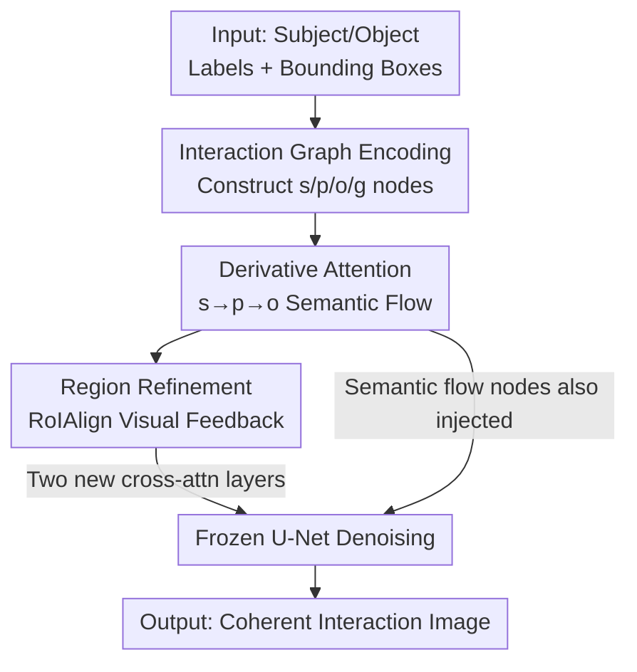

# Semantic Derivative Flow: Graph-Guided Diffusion for Controllable Instance Interactions

**Conference**: CVPR 2026  
**Paper**: [CVF Open Access](https://openaccess.thecvf.com/content/CVPR2026/html/Mei_Semantic_Derivative_Flow_Graph-Guided_Diffusion_for_Controllable_Instance_Interactions_CVPR_2026_paper.html)  
**Code**: None  
**Area**: Image Generation / Controllable Diffusion  
**Keywords**: Interaction Generation, Graph-Guided Diffusion, Derivative Attention, Human-Object Interaction, Layout Control

## TL;DR
The interaction relationship of "subject → predicate → object" is constructed as a directed acyclic interaction graph. A "Derivative Attention" mechanism is proposed to force predicate semantics to derive from the subject and object semantics to derive from the predicate. A region refinement module then back-injects visual features into graph nodes in real-time. This achieves semantically coherent and spatially reasonable human-object interaction images on HICODet, reaching SOTA in both FID and HOI detection mAP.

## Background & Motivation

**Background**: Text-to-image diffusion models (Stable Diffusion, SDXL) can produce high-fidelity images. With "extra condition" methods like GLIGEN and InteractDiffusion, bounding boxes can precisely control instance placement, largely solving layout controllability.

**Limitations of Prior Work**: However, "placing a person and a box in the correct positions" is distinct from "showing a person actually carrying a box." Existing methods treat instances as independent individuals conditioned on their own boxes, ensuring spatial proximity but often generating physically unreasonable and semantically incoherent interactions—where people and objects are adjacent but the poses do not reflect the action. InteractDiffusion formalizes interactions as (subject, predicate, object) triplets for diffusion injection, yet it merely concatenates or adds these three embeddings without modeling the inherent semantic dependency chain.

**Key Challenge**: The problem is twofold. First, pre-trained text encoders like CLIP are "noun-centric," leading to naturally weak predicate (e.g., carrying) representations that are often semantically decoupled from their subjects and objects. Second, and more fundamentally, existing conditioning paradigms lack a mechanism to force "the generation process of one instance to be functionally and semantically dependent on another." Without this logical chain, models can only statistically approximate interactions rather than performing structured reasoning.

**Goal**: To align the generation process with the logic chain of interactions, encoding the dependency of "who did what to whom" directly into the diffusion process, ensuring both fidelity and controllability, especially for long-tail rare interactions.

**Key Insight**: The authors propose a theoretical hypothesis: a coherent interaction can be formalized as a "Semantic Derivative Flow" across a structured graph. The semantic representation of a predicate should derive functionally from the subject, and the object representation from the predicate, forming a directed acyclic graph $s \rightarrow p \rightarrow o$, where edges representing differentiable semantic dependencies.

**Core Idea**: Use a "Derivative Attention" mechanism for structured message passing on the interaction graph to force Predicate = f(Subject) and Object = f(Predicate). Coupled with a global context node and real-time regional feedback, this grounds abstract semantic graphs into the diffusion denoising process.

## Method

### Overall Architecture

SDF is built upon a frozen latent diffusion model (SD1.5 / SDXL), training only newly inserted graph conditioning layers. Given an interaction (subject label + box, object label + box), the method follows three steps: first, encode the subject $s$, predicate $p$, object $o$, and a global node $g$ into initial node features; then, apply Derivative Attention along $s \rightarrow p \rightarrow o$ edges for top-down semantic transfer to obtain semantic-flowed node representations $f_I$; finally, use a region refinement module to extract visual features corresponding to each node box from the current denoising latent, feeding them back bottom-up to produce node representations $k_I$ that sense both semantic plans and current visual content. Two sets of graph nodes (semantic-flowed $e_I$ and visual-refined $k_I$) are injected into the denoising U-Net via new cross-attention layers, guiding generation alongside original text conditions.

Overall, this is a bidirectional closed-loop pipeline of "top-down semantic planning + bottom-up visual feedback":

### Key Designs

**1. Interaction Graph Encoding: Transforming (S, P, O) into Node Roles with Boxes**

Existing methods treat predicates as tokens of equal rank to subjects/objects, but predicates lack their own bounding boxes and have weak semantics, making it hard for models to ground "actions" to specific image regions. SDF constructs the skeleton: vertex set $V=\{s,p,o,g\}$ includes subject, predicate, object, and a global context node. The edge set defines the semantic flow $s \rightarrow p \rightarrow o$ and edges from each node to the global node. Since predicates have no annotated boxes, the authors use "between" operations on subject/object boxes $b_p = \mathrm{Expand}(\mathrm{BBox\text{-}Between}(b_s, b_o), \zeta)$, ensuring the predicate region sufficiently overlaps with the participants. The global box $b_g$ is the minimum bounding box enclosing all three. Each node uses CLIP for labels and Fourier encoding for coordinates, fused via node-type-specific MLPs to obtain initial features $f_s, f_p, f_o, f_g$.

**2. Derivative Attention: Gated Message Passing for Functional Derivation**

This is the core of the paper, addressing the "weak predicate" problem. Standard cross-attention is symmetric; here, **directional functional dependence** is required: the target node $v$ representation must be guided by the source node $u$. For a directed edge $(u \rightarrow v)$, queries are taken from the source, and keys/values from the target: $Q=W_Q f_u, K=W_K f_v, V=W_V f_v$. A gating function conditioned on source-target compatibility modulates the value:

$$\mathrm{Guide}(f_u,f_v)=\sigma\!\big(\mathrm{MLP}_{gate}([Q,K])\big)\odot V$$

where $\sigma$ is sigmoid and $\odot$ is element-wise multiplication. This gate learns to **selectively amplify features in $v$ that are semantically dependent on $u$**, injecting the prior that $v$ should follow $u$. Applied sequentially: $f^{Gs}_{p}=\mathrm{Guide}(f_s,f_p)$ (Subject guides Predicate), $f^{Gp}_{o}=\mathrm{Guide}(f'_p,f_o)$ (Predicate guides Object). The mechanism is theoretically supported by Theorem 4.1: $I(f_s;f'_p) \ge I(f_s;f_p)$, meaning it increases mutual information between adjacent nodes, compensating for weak text encoder representations.

**3. Region Refinement + Dual Injection: Locking Semantic Plans to Visual Content**

Static semantic plans may decouple from the evolving image during denoising. The region refinement module provides a bottom-up feedback loop: for node $v$ and its box $b_v$, regional features are extracted via $\mathrm{RoIAlign}(z_t, b_v)$ from the current noisy latent $z_t$. These are fused with semantic embeddings to form visual-aware representations $k_v = \mathrm{MLP}_{region}([f'_v, \mathrm{GAP}(z_{b_v})])$. In each denoising block, two sets of conditions are injected:

$$v \leftarrow v+\eta\tanh(\gamma_1)\,\mathrm{TS}(\mathrm{CrossAttn}(v,e_I)),\quad v \leftarrow v+\eta\tanh(\gamma_2)\,\mathrm{TS}(\mathrm{CrossAttn}(v,k_I))$$

$\mathrm{TS}$ (token selection) ensures only image tokens are updated. Original U-Net weights are frozen, maintaining pre-trained priors. During inference, grounding guidance $\eta=1$ is used for the first $\tau T$ steps, then $\eta=0$ to ensure image quality.

### Loss & Training

The training objective follows the standard LDM noise prediction loss $L = \mathbb{E} \|\epsilon - \epsilon_\theta(z_t, t, \tau(c))\|_2^2$. The authors prove that adding graph conditions still respects the variational lower bound (Thm 4.3). Training is performed on HICODet for 500k steps using Adam ($LR=5 \times 10^{-5}$) with a 10k step linear warmup. Predicate expansion ratio $\zeta=0.1$ and RoIAlign size $1 \times 1$ are used.

## Key Experimental Results

### Main Results

Evaluated on HICODet for fidelity (FID/KID) and controllability (HOI mAP via FGAHOI detector). Results for FGAHOI Swin-Large (Default):

| Method | FID ↓ | KID ↓ | mAP-Full ↑ | mAP-Rare ↑ |
|------|-------|-------|-----------|-----------|
| SDXL (Text-only) | 30.43 | 0.01018 | 1.38 | 1.24 |
| GLIGEN | 18.82 | 0.00694 | 26.45 | 18.93 |
| InteractDiffusion | 18.69 | 0.00676 | 31.56 | 26.09 |
| SDF (Ours, SD1.5) | 18.58 | 0.00668 | 32.20 | 26.84 |
| **SDF (Ours, SDXL)** | **18.42** | **0.00656** | **33.55** | **28.03** |

SDF leads in both fidelity and controllability. Compared to InteractDiffusion, the SDXL version gains +1.99 Full mAP and +1.94 Rare mAP, showing **significant gains in long-tail interactions**, validating the regularization effect of the graph structure.

### Ablation Study

Impact of removing components (FGAHOI Swin-Large, Default, Full):

| Configuration | FID ↓ | KID ↓ | HOI Score ↑ | Description |
|------|-------|-------|------------|------|
| Full model | 18.58 | 0.00668 | 32.20 | Complete model |
| w/o Global Node | 18.64 | 0.00671 | 32.08 | Lack of overall context |
| w/o Predicate Expansion | 18.61 | 0.00669 | 32.16 | Insufficient interaction overlap |
| w/o Derivative Attention | 18.65 | 0.00673 | 31.87 | Independent S/P/O encoding (worst) |
| w/o Region Refinement | 18.61 | 0.00671 | 32.02 | Decoupling of semantics/visuals |

### Key Findings
- **Derivative Attention is crucial**: Reverting to independent S/P/O encoding causes the largest drop in HOI score (31.87), validating Thm 4.1 regarding mutual information.
- **Region Refinement is necessary**: Without it, static semantic plans cannot adapt to the dynamic denoising process.
- **Predicate Expansion $\zeta=0.1$ is optimal**: Excessive expansion (0.20) dilutes interaction signals, while no expansion reduces reasonable overlaps.

## Highlights & Insights
- **Applying "Dependency Direction" to Diffusion**: Explicitly modeling the derivation chain $s \rightarrow p \rightarrow o$ using a DAG and gated attention is a clean, transferable idea for structured condition generation.
- **Theory-Practice Loop**: The gated $\mathrm{Guide}$ mechanism is lightweight and supported by information-theoretic analysis (mutual information monotonicity, generalization bounds), explaining *why* it works.
- **Predicate Box Construction ("between+expand")**: A practical heuristic to locate "where actions happen" when predicate boxes are missing.
- **Top-Down Plan + Bottom-Up Feedback**: RoIAlign feedback allows conditions to update dynamically, a more robust paradigm than static injection.

## Limitations & Future Work
- Dependency on (Subject, Predicate, Object, Box) annotations makes data acquisition costly.
- Generated interactions might be "too idealized," lacking real-world noise and diversity.
- Current graph only models pair-wise interactions (one s-o); scaling to multi-instance complex scenes is future work.
- Theoretical proofs for generalization bounds are relegated to the supplementary material.

## Related Work & Insights
- **vs InteractDiffusion**: While both use (S, P, O) triplets, SDF uses derivative attention to model the functional dependence chain, leading to higher mAP and better long-tail performance.
- **vs Layout Methods (GLIGEN, MIGC, etc.)**: These focus on "where instances are" but treat them as independent. SDF demonstrates that spatial control is necessary but insufficient for coherent interactions.
- **vs Standard Cross-Attention**: SDF's gated $\mathrm{Guide}$ is asymmetric and directional, better fitting the logical structure of interactions than symmetric information exchange.

## Rating
- Novelty: ⭐⭐⭐⭐ Explicitly building semantic derivation via DAGs and gated attention is novel and well-motivated.
- Experimental Thoroughness: ⭐⭐⭐⭐ Comprehensive comparisons on HICODet, though limited to single-dataset verification.
- Writing Quality: ⭐⭐⭐⭐ Clear progression from motivation to theoretical grounding and experiments.
- Value: ⭐⭐⭐⭐ Provides a transferable graph-guided paradigm for structured conditional generation.

<!-- RELATED:START -->

## Related Papers

- [\[CVPR 2026\] Semantic Scale Space: A Framework for Controllable Image Abstraction](semantic_scale_space_a_framework_for_controllable_image_abstraction.md)
- [\[CVPR 2026\] Breaking Semantic Boundaries: Distribution-Guided Semantic Exploration for Creative Generation](breaking_semantic_boundaries_distribution-guided_semantic_exploration_for_creati.md)
- [\[CVPR 2026\] GrOCE: Graph-Guided Online Concept Erasure for Text-to-Image Diffusion Models](groce_graph-guided_online_concept_erasure_for_text-to-image_diffusion_models.md)
- [\[ICLR 2026\] HOG-Diff: Higher-Order Guided Diffusion for Graph Generation](../../ICLR2026/image_generation/hog-diff_higher-order_guided_diffusion_for_graph_generation.md)
- [\[CVPR 2026\] Few-Step Diffusion Sampling Through Instance-Aware Discretizations](few-step_diffusion_sampling_through_instance-aware_discretizations.md)

<!-- RELATED:END -->
