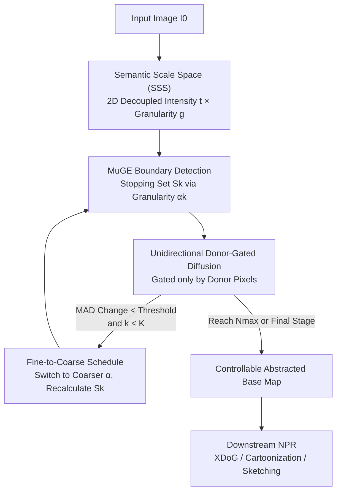

# Semantic Scale Space: A Framework for Controllable Image Abstraction

**Conference**: CVPR 2026  
**Paper**: [CVF Open Access](https://openaccess.thecvf.com/content/CVPR2026/html/Mishiba_Semantic_Scale_Space_A_Framework_for_Controllable_Image_Abstraction_CVPR_2026_paper.html)  
**Code**: None  
**Area**: Image Generation / Non-Photorealistic Rendering (NPR)  
**Keywords**: Image Abstraction, Controllable Smoothing, Semantic Boundaries, Anisotropic Diffusion, Stylization

## TL;DR
This paper reformulates "image abstraction" as a two-dimensional space spanned by **smoothing intensity** $t$ and **semantic granularity** $g$ (Semantic Scale Space, SSS). By **externalizing** the decision of "which structures to preserve" from the smoothing process via a controllable boundary detector, it introduces a specific traversal strategy called AGSS (unidirectional donor-gated diffusion + fine-to-coarse scheduling). Under equivalent smoothing levels, AGSS retains significantly more semantic boundaries with lower geometric drift compared to classic baselines, and its downstream NPR stylization results are strongly preferred by users.

## Background & Motivation
**Background**: The goal of Non-Photorealistic Rendering (NPR) and image abstraction is to simplify photographs into "clean" stylization base maps—removing cluttered textures while preserving contours essential to human perception. Mainstream approaches include classic edge-preserving filters (Bilateral, Guided, Anisotropic Diffusion), global optimization smoothing (WLS, L0 gradient minimization, RTV), and end-to-end learning models.

**Limitations of Prior Work**: These methods offer controls that are highly "entangled" for the user. Typically, there are only one or two coupling parameters acting as "intensity knobs": if a user wants to remove more texture, they must turn the knob higher, which inadvertently erases important contours. In other words, **"how deep the smoothing should go" and "which structures must be saved" are locked into the same scalar value**, preventing independent adjustment.

**Key Challenge**: The root cause is that the "stopping set" (the set of boundaries that halt smoothing diffusion) in these methods is derived either from low-level image statistics (gradient magnitude) or a fixed semantic edge map. Low-level cues cannot distinguish between "high-contrast texture" and "semantic boundaries," and fixed edge maps do not allow users to adjust the granularity of preserved structures. Consequently, smoothing intensity and the scale of preserved structures remain coupled, restricting abstraction to a one-dimensional path.

**Goal**: To decouple the abstraction process into two **independently adjustable** axes—intensity (how far smoothing progresses) and granularity (which boundaries are kept)—and to provide a concrete algorithm capable of navigating this 2D space with downstream-friendly results.

**Key Insight**: Rather than hard-tuning parameters within stylization operators, it is more effective to prepare a "selectively abstracted base map" at the **input stage** for any downstream NPR pipeline. This ensures the stylization phase receives clean input with predictable behavior, allowing users to tune the desired level of simplification beforehand.

**Core Idea**: Utilize a modern semantic boundary detector (MuGE) with continuous granularity parameters to externalize the "stopping set," thereby completely decoupling "what to preserve (stopping set)" from "how much to smooth (intensity)." A fine-to-coarse traversal strategy is then employed to remove textures first, merge regions second, and consistently maintain salient contours.

## Method

### Overall Architecture
The method operates on two levels: **SSS is the spatial definition, and AGSS is a specific traversal path within that space**. SSS denotes a family of images generated from input $I_0$ as $I(t,g)$, where $(t,g)$ are coordinates in the 2D abstraction space—$t\ge 0$ controls smoothing progress, and $g\in G$ parametrizes a boundary detector to produce a stopping set $S_g$ that acts as "diffusion walls." The authors propose four well-posedness properties for this space: P1 Continuity, P2 Monotonic Region Smoothing (local variance in non-boundary regions does not increase with $t$), P3 Semantic Selectiveness (fine textures disappear before main structures, with bounded boundary displacement), and P4 Grounding (starts from the original image and converges to a simplified state).

**Mechanism**: AGSS defines "how to move" in this space using a **fine-to-coarse granularity schedule** $G=[\alpha_1,\dots,\alpha_K]$. At each granularity stage, a boundary map is computed from the original image using MuGE and fixed. Intensity $t$ is then advanced using repeated **unidirectional donor-gated smoothing updates**. When smoothing stagnates at a given stage (determined by a MAD change criterion), the algorithm switches to a coarser granularity. The resulting abstracted base map is fed into downstream NPR pipelines like XDoG, White-box Cartoonization, or artistic sketching.

### Key Designs

**1. Semantic Scale Space (SSS): Externalizing "What to Preserve" from "How Much to Smooth"**

The limitation of older methods is that the stopping set is hidden inside the operator; as smoothing intensity is adjusted, the scale of preserved structures changes automatically. SSS explicitly introduces two axes: intensity $t$ controls the smoothing progress under a fixed operator, while granularity $g$ **parametrizes the process of generating the stopping set $S_g$** (the boundary detector). Changing $g$ alters "which boundaries act as walls," not how far the smoothing travels. Thus, abstraction is represented as a continuous family $I(t,g)$, placing "what to preserve" and "how much to smooth" on orthogonal axes.

**2. Unidirectional Donor-Gated Update: Breaking Weight Symmetry to "Brake" at Boundaries**

Standard anisotropic diffusion PDE $\frac{\partial I}{\partial t}=\nabla\cdot\!\big(D_g(x)\nabla I\big)$ discrete approximations often lead to **symmetric** weights $w(x,y)=w(y,x)$. Symmetric averaging naturally blurs edges by mixing values across boundaries, regardless of intensity. This work **breaks this symmetry** by gating weights only based on the properties of the "pixel providing the value (the donor)":

$$\omega_g(y\to x)=\eta(x,y)\,A_g(y),\quad A_g(y)=1-S_g(y)$$

Where $\eta(x,y)$ is a spatial kernel on a 9-point neighborhood $N_8^+(x)$, and $A_g(y)$ is the "semantic pass-weight" at the donor location. The pixel-wise normalized update is:

$$I^{(t+1)}(x)=\frac{\sum_{y\in N_8^+(x)}\omega_g(y\to x)\,I^{(t)}(y)+\xi\,I^{(t)}(x)}{Z_g(x)},\quad Z_g(x)=\sum_{y\in N_8^+(x)}\omega_g(y\to x)+\xi$$

This ensures that only donors within coherent regions ($A_g(y)$ is high) contribute significantly. If a donor falls on a strong boundary, its low $A_g(y)$ suppresses its influence on others, **minimizing cross-boundary mixing**.

**3. AGSS Traversal Strategy: Fine-to-Coarse Scheduling + Adaptive MAD Switching**

AGSS progresses through a predefined fine-to-coarse schedule $G=[\alpha_1,\dots,\alpha_K]$. Stage switching is driven by an **adaptive criterion**: let $\text{MAD}_t$ be the Mean Absolute Difference between $I^{(t)}$ and $I^{(t-1)}$. The stage threshold follows a decay form $\delta_{\text{target}}(k)=\delta_{\text{base}}\,r_{\text{decay}}^{\,k-1}$. When $\Delta\text{MAD}_t < \delta_{\text{target}}(k)$, the system shifts to a coarser granularity. This "fine-to-coarse" route ensures fine textures are removed first, followed by region merging, while salient boundaries remain anchored.

**4. RHI Effect-Matched Evaluation Protocol: Fair Comparison via "Equal Smoothing"**

Directly comparing boundary preservation is unfair if one method smooths more aggressively than another. This paper introduces a method-agnostic **Region Homogeneity Index (RHI)**, calculated from local variance in linear luminance, to quantify the actual degree of smoothing. In evaluation, for every image and target smoothing level (Weak/Medium/Strong), **only the intensity parameter of each method is tuned** to match the target RHI. This ensures that differences in boundary preservation and geometric fidelity are truly attributable to the operator's selectiveness rather than the smoothing volume.

## Key Experimental Results

### Main Results (E1: Effect-Matched Selectivity on SBD)
On the SBD test set (650 images), across three aligned RHI levels, the authors report Boundary Preservation F1 (BPF-ODS↑) and geometric drift (Symmetric Chamfer Distance Drift, px↓). AGSS leads significantly in Medium and Strong levels.

| Method | Weak BPF↑ | Weak Drift↓ | Mid BPF↑ | Mid Drift↓ | Strong BPF↑ | Strong Drift↓ |
| :--- | :--- | :--- | :--- | :--- | :--- | :--- |
| WLS | 0.529 | 86.61 | 0.541 | 84.92 | 0.545 | 85.65 |
| PM | 0.529 | 86.78 | 0.533 | 86.92 | 0.526 | 85.85 |
| GF-it | 0.529 | 0.538 | 87.77 | 0.542 | 87.89 |
| DT+MuGE | 0.497 | 92.45 | 0.535 | 89.04 | 0.555 | 88.97 |
| **AGSS (Ours)** | **0.535** | **86.76** | **0.575** | **83.91** | **0.594** | **82.98** |

At the Strong level, AGSS achieves a BPF of 0.594 (+10.5% relative to classic baselines) and a 4.0% reduction in Drift.

### Key Findings
*   **Counter-intuitive Observation**: While baselines show stagnating or declining BPF as abstraction intensity increases, AGSS's BPF rises monotonically with intensity. This validates the fine-to-coarse scheduling—it effectively removes more "clutter" while keeping "salient edges" intact.
*   **Ablation (E2)**: Comparison with DT+MuGE shows that even with the **same** MuGE boundary cues, AGSS performs better. This confirms the performance gain stems from the donor-gated smoothing operator itself, not just the quality of the boundary detector.
*   **User Study**: In a 2AFC preference test for downstream stylization (XDoG, Cartoonization, Sketching), **72.9%** of participants preferred AGSS results over baselines ($p<.001$).

## Highlights & Insights
*   **The 2D Space Reformulation**: Reframing abstraction as Intensity × Granularity is a powerful concept. It provides a "unified coordinate system" to map and evaluate both old and new methods.
*   **The Donor-Gated Trick**: Breaking the symmetry of neighborhood weights is a simple yet effective way to prevent edge blurring in diffusion-based smoothing.
*   **Paradigm Shift**: Shifting controllability to the input stage (preprocessing) allows any downstream NPR effect to benefit from "selective simplification" without modifying the effect's internal logic.
*   **RHI Protocol**: The effect-matched evaluation methodology is a rigorous way to compare algorithms with different parameter scales.

## Limitations & Future Work
*   **Dependency on Boundaries**: The semantic selectivity is upper-bounded by the quality of the boundary detector. Missed or false detections in MuGE propagate directly to the results.
*   **Fixed Scheduling**: The fine-to-coarse schedule is currently global. Future work could explore content-adaptive traversal strategies for complex scenes.
*   **Utility Scope**: The value of the method is heavily tied to downstream NPR pipelines; as a standalone image simplifier, its utility is more limited without a specific artistic goal.

## Related Work & Insights
*   **vs. Classic Edge-Preserving Filters**: These lack a decoupled granularity axis and struggle to distinguish between texture and semantic structure.
*   **vs. Global Optimization**: Methods like WLS or L0 use a single scalar weight, forcing a trade-off where more texture removal inevitably damages fine semantic structures.
*   **vs. Learning-based Models**: Most are black-box mappings with entangled hyperparameters. AGSS provides a traversable, style-agnostic trajectory that complements these models as a pre-processor.

## Rating
*   Novelty: ⭐⭐⭐⭐
*   Experimental Thoroughness: ⭐⭐⭐⭐
*   Writing Quality: ⭐⭐⭐⭐
*   Value: ⭐⭐⭐⭐

<!-- RELATED:START -->

## Related Papers

- [\[CVPR 2026\] Scale Space Diffusion：把尺度空间塞进扩散过程](scale_space_diffusion.md)
- [\[CVPR 2026\] Unified Latent Space for Understanding and Generation via Semantic Auto-encoder](unified_latent_space_for_understanding_and_generation_via_semantic_auto-encoder.md)
- [\[CVPR 2026\] PortraitDirector: A Hierarchical Disentanglement Framework for Controllable and Real-time Facial Reenactment](portraitdirector_a_hierarchical_disentanglement_framework_for_controllable_and_r.md)
- [\[CVPR 2026\] Semantic Derivative Flow: Graph-Guided Diffusion for Controllable Instance Interactions](semantic_derivative_flow_graph-guided_diffusion_for_controllable_instance_intera.md)
- [\[CVPR 2026\] RDF-MIG: A Robust Diffusion Framework for Masked Image Generation to Augment Semantic Segmentation and Change Detection](rdf-mig_a_robust_diffusion_framework_for_masked_image_generation_to_augment_sema.md)

<!-- RELATED:END -->
