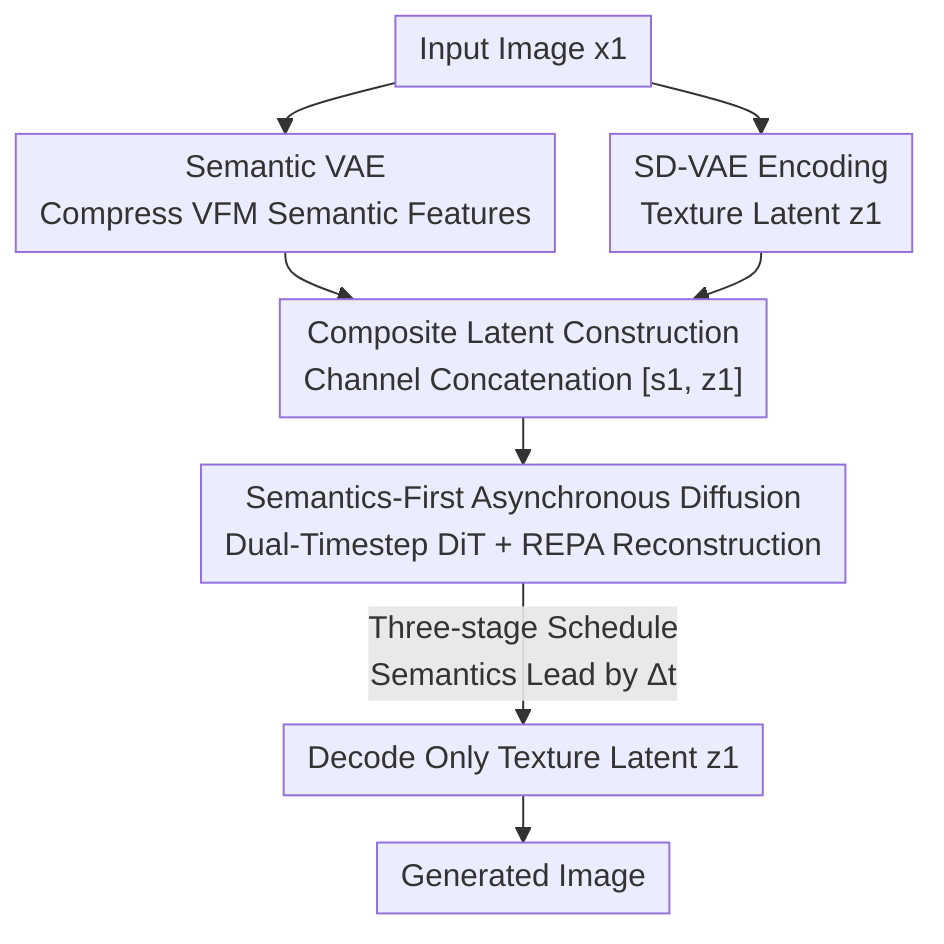

# Semantics Lead the Way: Harmonizing Semantic and Texture Modeling with Asynchronous Latent Diffusion

**Conference**: CVPR 2026  
**Paper**: [CVF Open Access](https://openaccess.thecvf.com/content/CVPR2026/html/Pan_Semantics_Lead_the_Way_Harmonizing_Semantic_and_Texture_Modeling_with_CVPR_2026_paper.html)  
**Code**: https://yuemingpan.github.io/SFD.github.io/ (Project Page)  
**Area**: Diffusion Models / Image Generation  
**Keywords**: Latent Diffusion, Semantics-First, Asynchronous Denoising, Semantic VAE, Convergence Acceleration

## TL;DR
SFD decouples semantics and texture into two latent paths within latent diffusion. By using independent noise schedules, semantics are denoised "one step ahead" of texture, serving as a structural blueprint to guide texture refinement. This achieves an FID of 1.04 on ImageNet 256×256 and accelerates training convergence by approximately $100\times$ compared to DiT.

## Background & Motivation

**Background**: Latent Diffusion Models (LDM) are the current workhorses of image generation—VAEs compress images into latents, and Diffusion Transformers (DiT/SiT, etc.) model the distribution in the latent space. Recent works have found that injecting discriminative semantic priors from pre-trained vision encoders (like DINOv2) can significantly accelerate convergence and improve quality. Approaches include aligning semantics with VAE latents (REPA / REPA-E) or concatenating semantics and texture for joint modeling (REG / ReDi).

**Limitations of Prior Work**: Standard VAEs are optimized for pixel-level reconstruction, filling latents with low-level texture features. Consequently, the diffusion model faces conflicting objectives—it must learn high-level semantic structures and preserve low-level texture details within the same latent, resulting in slow convergence and compromised generation quality. Existing semantic injection methods, while introducing semantic priors, still perform **synchronous denoising** of semantics and texture at the same noise level without distinction.

**Key Challenge**: Diffusion is inherently coarse-to-fine—it naturally generates low-frequency structures before filling in high-frequency textures. Semantic structures should emerge slightly earlier than detailed textures. However, the "synchronous denoising" paradigm ignores this temporal order, essentially forcing the blueprint and the final decoration to emerge from chaos simultaneously.

**Goal**: To explicitly incorporate the "semantics first, then texture" sequence into the generation process while avoiding the training-inference mismatch (similar to exposure bias in teacher forcing) caused by rigid sequential generation (i.e., generating full semantics before texture).

**Key Insight**: Following the coarse-to-fine nature of diffusion, if semantics should lead, they should evolve at a **cleaner noise level**. Semantics should maintain a fixed temporal offset $\Delta t$ ahead of texture, rather than being perfectly synchronized or strictly serial.

**Core Idea**: Construct a composite "semantic + texture" latent and use **staggered noise schedules for asynchronous denoising** (semantics leading texture by $\Delta t$). Semantics act as a blueprint to guide texture refinement, preserving the benefits of early semantic stability while maintaining collaborative optimization.

## Method

### Overall Architecture

SFD (Semantics-First Diffusion) takes an image (during training) or a category label (during inference) as input and outputs a generated image. It consists of two main components: ① **Composite Latent Construction**—a specialized Semantic VAE (SemVAE) compresses the semantic features of a vision foundation model (VFM) into a compact latent, which is concatenated channel-wise with the texture latent from an SD-VAE; ② **Semantics-First Asynchronous Diffusion**—a DiT backbone processes the composite latent with different noise levels and their respective timesteps to predict two velocity fields. During inference, a three-stage schedule ensures semantics denoise ahead of texture. Finally, **only the texture latent is decoded** to produce the image; the semantic latent is discarded.

### Key Designs

**1. Semantic VAE: Compressing high-dimensional semantic features into diffusion-compatible compact latents**

Directly feeding patch features from VFMs like DINOv2 into diffusion is inefficient due to high dimensionality and unfriendly noise scheduling. SemVAE uses a Transformer-based VAE to achieve "semantic compression without information loss": a frozen VFM $f(\cdot)$ extracts patch-level semantic features $f_s = f(x_1) \in \mathbb{R}^{L\times C_{in}}$. The encoder maps these to low-dimensional Gaussian parameters $h_s = E_s(f_s) \in \mathbb{R}^{L\times 2C_s}$, followed by reparameterization to obtain the semantic latent $s_1 = \mu + \sigma \odot \epsilon$. The decoder mirrors this structure to reconstruct $\hat f_s$.

The training objective balances fidelity and orientation: MSE loss $L_{MSE} = \|\hat f_s - f_s\|^2$ handles reconstruction accuracy, cosine similarity loss $L_{cos} = 1 - \frac{\hat f_s \cdot f_s}{\|\hat f_s\|\|f_s\|}$ ensures feature directional consistency, and a light KL regularization $L_{KL}$ ($\lambda_{kl}=10^{-7}$) constrains the latent space. Total loss: $L_{SemVAE} = L_{MSE} + L_{cos} + \lambda_{kl}L_{KL}$. SemVAE has only 29M parameters, and its performance (FID 3.03) significantly outperforms PCA reduction (FID 4.06 used in ReDi) because the VAE preserves semantic integrity and spatial layout better than linear PCA. SemVAE is frozen after training.

**2. Asynchronous Denoising + Dual-Timestep DiT: Letting semantics lead at a cleaner noise level**

This is the core of SFD, addressing the "synchronous denoising" flaw. After constructing the composite latent $c = [s_1, z_1]$, different timesteps are assigned during training: a semantic timestep $t_s \sim U(0, 1+\Delta t)$ is sampled first, and the texture timestep is derived via a fixed offset $t_z = \max(0, t_s - \Delta t)$, with $t_s$ clipped to $\min(t_s, 1)$. This ensures $t_s, t_z \in [0,1]$ and $t_s \ge t_z$, meaning the semantic latent is less noisy at every step, providing clearer structural guidance for texture denoising.

The DiT backbone $v_\theta$ takes the composite latent $[s_{t_s}, z_{t_z}]$, two timesteps $[t_s, t_z]$, and class label $y$ to predict dual velocities $[\hat v_s, \hat v_z] = v_\theta([s_{t_s}, z_{t_z}], [t_s, t_z], y)$. The training loss is a weighted sum of flow-matching velocity losses: $L_{vel} = \mathbb{E}[\|\hat v_z - (z_1 - z_0)\|^2 + \beta\|\hat v_s - (s_1 - s_0)\|^2]$ ($\beta=2.0$). This "soft asynchrony" avoids the issues of hard serial generation—where $\Delta t=1$ leads to exposure bias and $\Delta t=0$ reverts to standard synchronous denoising. An offset of $\Delta t=0.3$ achieves the best trade-off (FID 3.03).

**3. REPA Reconstruction Alignment: Treating semantic priors as "reconstructible targets"**

The authors introduce a REPA representation alignment loss with a twist. The hidden states $h_t = f_\psi([s_{t_s}, z_{t_z}], [t_s, t_z])$ of the DiT are passed through a projection head $h_\phi$ to align with the VFM output $y^* = f(x_1)$: $L_{REPA} := -\mathbb{E}[L_{sim}(y^*, h_\phi(h_t))]$. Since $y^*$ is the exact semantic representation fed into SemVAE, $L_{REPA}$ acts as a task to reconstruct the clean $y^*$ from the noisy $s_{t_s}$. Unlike the original REPA which distills discriminative power, this explicit reconstruction from the semantic latent is a more tractable goal that preserves semantic integrity. Total objective: $L_{total} = L_{vel} + \lambda L_{REPA}$ ($\lambda=1.0$). Ablations show REPA improves the baseline from FID 8.17 to 7.08, which drops further to 5.24 with SemVAE and 3.03 with semantics-first.

**4. Three-Stage Denoising Schedule: Switching "who is denoising" without extra steps**

During inference, SFD follows three stages (controlled by binary masks $M_s, M_z$): ① **Semantic Initialization** ($t_s \in [0, \Delta t)$, $t_z=0$, masks $[1,0]$)—only semantics are denoised to establish the global skeleton; ② **Asynchronous Generation** ($t_s \in [\Delta t, 1]$, $t_z \in [0, 1-\Delta t)$, masks $[1,1]$)—joint denoising with semantics leading to provide guidance; ③ **Texture Completion** ($t_s=1$, $t_z \in [1-\Delta t, 1]$, masks $[0,1]$)—semantics are fully denoised, focusing only on texture details. The updated velocity is $\hat v = [M_s \odot \hat v_s, M_z \odot \hat v_z]$. Note: Although the timestep range is extended by $\Delta t$, the intervals between steps are scaled proportionally to keep the total number of diffusion steps constant, resulting in **no extra inference cost**. Final output is the texture latent $z_1$.

## Key Experimental Results

### Main Results

Convergence comparison on ImageNet 256×256 without guidance (selected from Table 1, FID↓):

| Model | Params | Iterations | FID |
| :--- | :--- | :--- | :--- |
| DiT-XL/2 | 675M | 7M | 9.62 |
| LightningDiT-XL/1 + REPA | 675M | 4M | 5.84 |
| LightningDiT-XL/1 + SFD | 675M | 400K | **3.53** |
| LightningDiT-XL/1 + SFD | 675M | 4M | **2.54** |
| LightningDiT-B/1 + REPA | 130M | 400K | 21.45 |
| LightningDiT-B/1 + SFD | 130M | 400K | **10.40** |

SFD achieves an FID of 3.53 at 400K iterations, which is 2.31 points lower than REPA at 4M iterations, needing only 10% of the training cost. To match DiT-XL@7M and LightningDiT-XL@4M, SFD requires only 70K and 120K iterations respectively, representing a **$100\times$ / $33.3\times$ speedup**.

System-level comparison with guidance (selected from Table 2, ImageNet 256×256):

| Model | Epochs | Params | FID↓ | sFID↓ | IS↑ |
| :--- | :--- | :--- | :--- | :--- | :--- |
| DiT-XL | 1400 | 675M | 2.27 | 4.60 | 278.2 |
| REPA-E | 800 | 675M | 1.12 | 4.09 | 302.9 |
| ReDi | 800 | 675M | 1.61 | 4.66 | 295.1 |
| SFD (XL) | 80 | 675M | 1.30 | 3.87 | 233.4 |
| SFD (XL) | 800 | 675M | 1.06 | 3.89 | 267.0 |
| SFD (XXL) | 800 | 1.0B | **1.04** | 3.75 | 264.2 |

SFD trained for only 80 epochs (FID 1.30) outperforms DiT-XL trained for 1400 epochs (2.27). The XXL version at 800 epochs sets the SOTA FID at 1.04.

### Ablation Study

| Configuration | FID↓ | Description |
| :--- | :--- | :--- |
| baseline | 8.17 | LightningDiT-XL@400K |
| + REPA | 7.08 | Repr. alignment only |
| + REPA + SemVAE | 5.24 | Introducing semantic latent |
| + REPA + SemVAE + Semantic-First | **3.03** | Full SFD |

Other key ablations: ① Semantic compression—SemVAE (FID 3.03) performs significantly better than PCA (4.06); ② Temporal offset $\Delta t$—$\Delta t=0$ (Sync) degrades performance, $\Delta t=1.0$ (Serial) causes mismatch, while $\Delta t=0.3$ is optimal.

### Key Findings
- **Semantics-First Mechanism is the primary contributor**: Moving from SemVAE (5.24) to Semantic-First (3.03) accounts for a 2.21-point drop, proving that the lead-time denoising is the core driver, not just the features themselves.
- **Generalizability**: Integrating the mechanism into ReDi dropped its FID from 5.33 to 4.41, showing the approach generalizes to other semantic-texture concatenation methods.
- **No sacrifice in reconstruction fidelity**: Texture still uses SD-VAE (rFID 0.26 / PSNR 28.59), outperforming models like VA-VAE or RAE. Keeping semantics on a separate path prevents semantic alignment from degrading pixel reconstruction.

## Highlights & Insights
- **Asynchronous denoising makes coarse-to-fine explicit**: While traditional methods rely on the implicit coarse-to-fine nature of diffusion, SFD explicitly bakes the "semantics leads texture" rule into the noise schedule via $\Delta t$. The logic is clean and fits seamlessly into DiT backbones.
- **Soft asynchrony avoids exposure bias**: Hard serial generation (semantics finished before texture starts) suffers from training-inference mismatch. SFD's soft staggered approach allows both to optimize jointly while maintaining the benefit of early semantic guidance—$\Delta t$ acts as a tunable "leadership" knob.
- **Discard semantics, decode texture**: Since semantics are only needed for guidance, only the texture latent is decoded. This decoupling prevents semantic "pollution" of pixel reconstruction, making it potentially useful for high-resolution synthesis or editing.
- **Repurposing REPA as reconstruction**: Treating the external prior as a reconstructible target rather than a distillation signal is an insightful shift in representation-augmented generation.

## Limitations & Future Work
- Evaluation is limited to ImageNet 256×256 class-conditional generation; text-to-image or complex layout tasks remain to be verified.
- The optimal offset $\Delta t=0.3$ was tuned on a specific backbone/dataset. Its sensitivity and optimal value for other architectures or data regimes are not fully explored.
- The method introduces a SemVAE (29M params) and a dual-timestep design, adding slight engineering complexity. Semantic latents do not directly contribute to the final pixel output despite the compute spent on them.

## Related Work & Insights
- **vs REPA / REPA-E**: These align diffusion features with VFM representations but use synchronous denoising. SFD incorporates REPA (as reconstruction) but adds the asynchronous schedule, pushing FID from 1.12 to 1.04.
- **vs ReDi / REG**: These concatenate DINOv2 semantics and VAE texture but use synchronous schedules. SFD demonstrates that concatenation alone is insufficient—the temporal order is the key.
- **vs Diffusion Forcing / AsynDM**: These apply independent noise schedules to tokens or pixels. SFD applies this concept to "semantic subspace vs texture subspace," representing a move toward asynchronous denoising at the hierarchical representation level.

## Rating
- Novelty: ⭐⭐⭐⭐⭐ Turning "semantics leads texture" into an explicit asynchronous schedule is both novel and logically sound.
- Experimental Thoroughness: ⭐⭐⭐⭐ Strong results on convergence and SOTA FID, with extensive ablations, though focused on ImageNet.
- Writing Quality: ⭐⭐⭐⭐⭐ Clear motivation (blueprint analogy) and well-defined technical components.
- Value: ⭐⭐⭐⭐⭐ $100\times$ convergence speedup and SOTA performance make this highly practical for the community.

<!-- RELATED:START -->

## Related Papers

- [\[CVPR 2026\] Unified Latent Space for Understanding and Generation via Semantic Auto-encoder](unified_latent_space_for_understanding_and_generation_via_semantic_auto-encoder.md)
- [\[CVPR 2026\] Texvent: Asynchronous Event Data Simulation via Text Prompt](texvent_asynchronous_event_data_simulation_via_text_prompt.md)
- [\[CVPR 2026\] Refaçade: Editing Object with Given Reference Texture](refacade_editing_object_with_given_reference_texture.md)
- [\[CVPR 2026\] FaithFusion: Harmonizing Reconstruction and Generation via Pixel-wise Information Gain](faithfusion_harmonizing_reconstruction_and_generation_via_pixel-wise_information.md)
- [\[ICLR 2026\] Asynchronous Denoising Diffusion Models for Aligning Text-to-Image Generation](../../ICLR2026/image_generation/asynchronous_denoising_diffusion_models_for_aligning_text-to-image_generation.md)

<!-- RELATED:END -->
