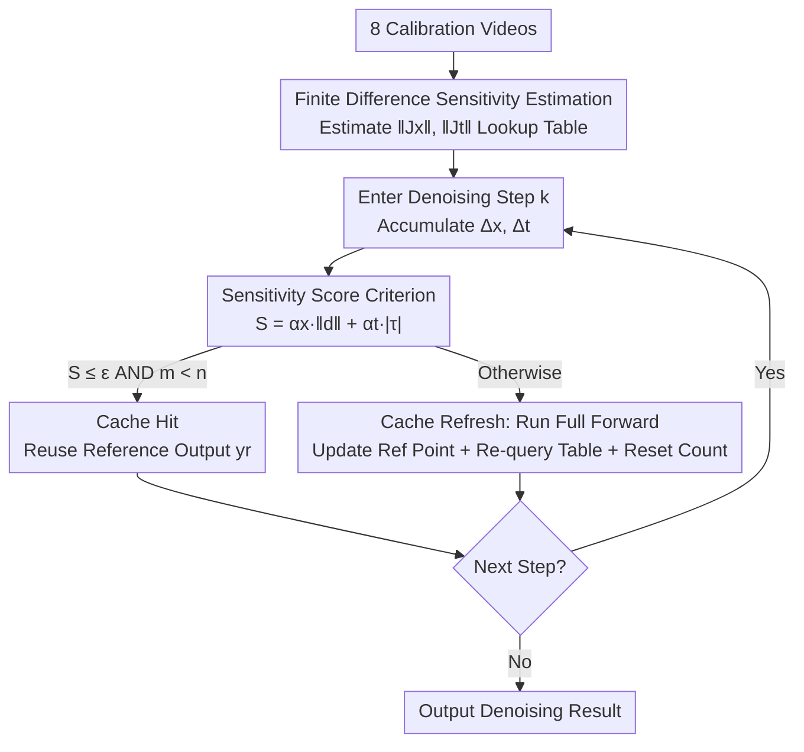

# SenCache: Accelerating Diffusion Model Inference via Sensitivity-Aware Caching

**Conference**: CVPR 2026  
**Paper**: [CVF Open Access](https://openaccess.thecvf.com/content/CVPR2026/html/Haghighi_SenCache_Accelerating_Diffusion_Model_Inference_via_Sensitivity-Aware_Caching_CVPR_2026_paper.html)  
**Code**: https://github.com/vita-epfl/SenCache  
**Area**: Diffusion Models  
**Keywords**: Diffusion model acceleration, training-free caching, network sensitivity, video generation, adaptive caching

## TL;DR
SenCache replaces empirical heuristics for cache reuse in diffusion models with a first-order estimate of the denoising network's **local sensitivity** (the Jacobian norm of the output with respect to latent and timestep perturbations). By reusing the cache only when the predicted output variation is below a tolerance $\varepsilon$, it skips redundant forward passes in a per-sample adaptive manner without retraining or architectural changes, achieving higher visual quality on Wan 2.1 / CogVideoX / LTX-Video for the same computational budget.

## Background & Motivation

**Background**: Video diffusion models (DiT architectures) offer superior image quality but are extremely expensive to infer, requiring dozens or hundreds of denoising steps where each step is a full forward pass of a multi-billion parameter network. In the "training-free" acceleration route, **caching** is preferred: denoising outputs of adjacent timesteps are often similar enough to be reused, allowing skipping expensive computation.

**Limitations of Prior Work**: Existing caching methods (e.g., TeaCache, MagCache) rely on **empirical heuristics** to decide when to cache or refresh. TeaCache uses time embedding differences to model output residuals, while MagCache uses residual magnitude ratios. They suffer from two fundamental flaws: (1) lack of theoretical grounding, requiring heavy hyperparameter tuning; (2) **static** cache schedules that apply the same strategy to all samples, failing to adapt to the specific generation difficulty of each sample. This leads to "over-caching" (quality loss) on difficult samples and "under-caching" (wasted compute) on easy ones.

**Key Challenge**: The change in output between two adjacent steps stems from **two** sources: latent drift $\|\Delta x_t\|$ and timestep interval $|\Delta t|$. Existing heuristics focus on only one signal—TeaCache primarily monitors the timestep dimension, while MagCache monitors latent residual magnitudes. Either method significantly underestimates true output variation when the unmodeled term increases, leading to erroneous cache reuse and artifacts.

**Key Insight**: The authors start from a simple but overlooked observation: the change in a denoising output is essentially the **local response** of the network to input perturbations, which can be characterized by the **Jacobian norms (sensitivity)** of the network with respect to latents and timesteps. Regions with low Jacobian norms indicate a "flat" network where the output is insensitive to perturbations, making them safe for cache reuse.

**Core Idea**: By using the local sensitivities $\|J_x\|$ and $\|J_t\|$ as local Lipschitz constants, the authors derive a first-order upper bound for output variation as $\|J_x\|\|\Delta x_t\| + \|J_t\||\Delta t|$. Only when this **sensitivity score** is below a tolerance $\varepsilon$ is the cache reused—a theoretically grounded, per-sample adaptive criterion that naturally explains why previous heuristics sometimes fail.

## Method

### Overall Architecture

SenCache is a training-free inference acceleration framework based on "full-forward caching" (caching the entire denoising network output $f_\theta(x_t,t,c)$ rather than intermediate features). Its core objective is to determine **when it is safe to reuse the previously computed output** during the iterative denoising process. The workflow consists of two phases: **one-time offline calibration** of sensitivity curves (using only 8 videos per model to estimate the distribution of $\|J_x\|, \|J_t\|$ over $t$ and storing them in a lookup table) and **online inference**, where current latent drift and timestep intervals are accumulated to calculate a sensitivity score $S$. If $S \le \varepsilon$ and the maximum continuous cache length $n$ is not exceeded, a "cache hit" occurs (zero forward pass); otherwise, the cache is refreshed (a full forward pass is executed, a new reference point is set, and the table is re-queried). The criterion depends only on local sensitivity and real input changes, making it agnostic to modality, architecture, and sampler.

### Key Designs

**1. Sensitivity Caching Criterion: Modeling "When to Reuse" as a First-Order Bound**

This is the theoretical core addressing the misjudgments of previous heuristics. From a flow-matching perspective, the denoising network $f_\theta(x_t,t,c)$ can be approximated via first-order Taylor expansion between adjacent steps: $f_\theta(x_{t+\Delta t},t+\Delta t,c)-f_\theta(x_t,t,c)\approx J_x\,\Delta x_t + J_t\,\Delta t$, where $J_x=\partial f_\theta/\partial x_t$ and $J_t=\partial f_\theta/\partial t$. Taking the norm yields an upper bound on output variation: $\|J_x\|\|\Delta x_t\| + $\|J_t\||\Delta t| + O(\|\Delta x_t\|^2+|\Delta t|^2)$, where Jacobian norms act as **local Lipschitz constants**. The **sensitivity score** is defined as:

$$S_t = \|J_x\|\,\|\Delta x_t\| + \|J_t\|\,|\Delta t|$$

Cache reuse is performed at step $t$ if and only if $S_t \le \varepsilon$. $\varepsilon$ directly controls the speed-quality trade-off. This method is more robust than prior work because it explicitly models both latent drift and timestep intervals. Sensitivity analysis on SiT-XL/2 (Fig. 3) reveals that $\|J_t\|$ is non-negligible across a wide range of $t$, meaning heuristics focusing only on latents (like MagCache) or only on time (like TeaCache) will fail when the omitted term becomes large. This criterion unifies both factors.

**2. Finite Difference Sensitivity Estimation + Small Calibration Set: Making Jacobians Affordable**

Calculating exact Jacobian norms is computationally prohibitive for inference. The authors use **directional finite differences (secants)** as approximations: for a fixed $t$, a small perturbation $\Delta x$ is applied in the sampler's direction to get $\|J_x\|\approx \frac{\|f_\theta(x_t+\Delta x,t,c)-f_\theta(x_t,t,c)\|_2}{\|\Delta x\|_2}$; for a fixed $x_t$, the time is perturbed to get $\|J_t\|\approx \frac{\|f_\theta(x_t,t+\Delta t,c)-f_\theta(x_t,t,c)\|_2}{|\Delta t|}$. Crucially, these sensitivities **only need to be calibrated once per model**. Using just 8 videos with diverse motion and scenes, the authors estimated sensitivity curves (Fig. 4) that almost perfectly overlap with those calculated from 4096 videos, indicating that these metrics are insensitive to specific samples and do not require large datasets. The results are cached as a lookup table $(\alpha_x, \alpha_t)$ indexed by $t$, making the online overhead negligible (a table lookup plus two dot products).

**3. Cache Lifespan Limit $n$: Insurance for Local Linear Approximation**

First-order expansions are only accurate near the reference point. After many consecutive reuse steps, the trajectory may drift too far, causing approximation failure and error accumulation. The authors introduce a hyperparameter $n$ to limit the **maximum consecutive cache steps**. A counter $m$ is maintained, and cache hit requires $S \le \varepsilon$ **and** $m < n$. Upon a hit, drifts are accumulated ($d \mathrel{+}= \Delta x$, $\tau \mathrel{+}= \Delta t$, $m \mathrel{+}= 1$) and $S = \alpha_x\|d\| + \alpha_t|\tau|$ is re-evaluated. After $n$ consecutive reuses, a refresh is forced (full forward pass, update reference point, reset $d, \tau, m$). This balances stability and aggressiveness; ablation shows that NFE saturates at $n=4$, beyond which quality drops without further compute savings.

### Loss & Training

SenCache is a **purely inference-time, training-free** method. It introduces no new loss functions, requires no fine-tuning or retraining of the denoising network, and does not alter the architecture. The only "offline cost" is the finite difference calibration on 8 videos. In practice, the authors are more cautious during the initial denoising phase: since the first 20% of steps are critical, a strict tolerance $\varepsilon=0.01$ (1% error) is used, with looser values for remaining steps depending on the model (Wan slow 0.1 / fast 0.2, CogVideoX 0.6, LTX 0.5), and $n$ set to 2 (slow) or 3 (fast).

## Key Experimental Results

Evaluations were performed on three SOTA video diffusion models (Wan 2.1, CogVideoX, LTX-Video) against TeaCache and MagCache, utilizing the MagCache protocol reporting LPIPS / PSNR / SSIM (quality) and NFE / Cache Ratio (efficiency) on the VBench dataset.

### Main Results

| Model / Setting | Method | NFE ↓ | Cache% ↑ | LPIPS ↓ | PSNR ↑ | SSIM ↑ |
|------|------|------|------|------|------|------|
| Wan 2.1 fast | TeaCache | 25 | 50% | 0.0966 | 25.07 | 0.8697 |
| Wan 2.1 fast | MagCache | 21 | 58% | 0.0603 | 28.37 | 0.9143 |
| Wan 2.1 fast | **SenCache** | 21 | 58% | **0.0540** | **29.14** | **0.9219** |
| CogVideoX | MagCache | 23 | 54% | 0.1952 | 21.85 | 0.7332 |
| CogVideoX | **SenCache** | 22 | 56% | **0.1901** | **22.09** | **0.7786** |
| LTX-Video | MagCache | 28 | 44% | 0.1795 | 23.37 | 0.8224 |
| LTX-Video | **SenCache** | 27 | 46% | **0.1625** | **23.67** | **0.8293** |

In the "fast" (aggressive reuse) range for Wan 2.1, SenCache significantly outperforms MagCache at identical NFE (PSNR +0.77 dB, SSIM +0.0076). On CogVideoX and LTX-Video, which are less tolerant of approximation, SenCache achieves equal or better quality with fewer or comparable NFEs. In "slow" (conservative) ranges, visual qualities converge, with the main differentiator being TeaCache's higher NFE, suggesting different criteria agree on "safe zones" when being conservative.

### Ablation Study

| Config | NFE ↓ | LPIPS ↓ | PSNR ↑ | SSIM ↑ | Description |
|------|------|------|------|------|------|
| $n=1$ | 32 | 0.0223 | 32.82 | 0.9583 | Almost no reuse, best quality but slowest |
| $n=3$ | 25 | 0.0454 | 28.99 | 0.9301 | Balanced speed/quality |
| $n=4$ | 23 | 0.0558 | 28.09 | 0.9195 | NFE saturates here |
| $n=7$ | 23 | 0.0760 | 26.53 | 0.8991 | NFE stays flat, quality collapses |

(Wan 2.1, $\varepsilon=0.05$) As $n$ increases from 1 to 4, NFE drops from 32 to 23, then **saturates**. Increasing $n$ further does not save compute but causes monotonic quality degradation, confirming that excessive consecutive reuse invalidates the first-order approximation.

| $\varepsilon$ | NFE ↓ | LPIPS ↓ | PSNR ↑ | SSIM ↑ |
|------|------|------|------|------|
| 0.04 | 25 | 0.0455 | 29.01 | 0.9301 |
| 0.06 | 23 | 0.0472 | 28.93 | 0.9287 |
| 0.07 | 22 | 0.0485 | 28.92 | 0.9277 |
| 0.13 | 21 | 0.0513 | 28.72 | 0.9244 |

(Wan 2.1, $n=3$) As $\varepsilon$ increases from 0.04 to 0.13, NFE decreases from 25 to 21, with quality dropping **linearly** and gradually. This demonstrates that $\varepsilon$ is a direct and interpretable "knob" for the speed-quality trade-off; most compute gains are realized at $\varepsilon \in [0.06, 0.07]$.

### Key Findings
- Sensitivity analysis (Fig. 3) confirms **both latent and timestep terms are essential**: $\|J_t\|$ remains large across most $t$, meaning latent-only criteria will fail during steps with large $\Delta t$.
- Sensitivity estimation is **highly robust to calibration set size**: 8 videos yielded curves nearly identical to those from 4096 videos, turning "expensive Jacobians" into a negligible one-time offline cost.
- The unified framework explains prior heuristics: TeaCache $\approx$ using only $\|J_t\||\Delta t|$, MagCache $\approx$ using only $\|J_x\|\|\Delta x_t\|$. Failure cases for each correspond to increases in the omitted term.

## Highlights & Insights
- **Theorizing Heuristics**: By using a first-order Taylor bound and Jacobian norms, the authors transform "when to reuse" into a criterion with explicit tolerance. This provides a unified explanation for when previous methods (TeaCache/MagCache) succeed or fail.
- **Per-sample Adaptivity**: The criterion depends on the actual $\Delta x_t$ and $\Delta t$ at each step. Thus, for the same $\varepsilon$, the system naturally caches less for difficult samples and more for easy ones, avoiding the "one size fits all" nature of static schedules.
- **Strong Generalizability**: The criterion is agnostic to modality, architecture, and sampler. The authors point out that "using network sensitivity as a proxy for reuse" is a general strategy that could extend to audio or human motion generation.

## Limitations & Future Work
- Only a first-order approximation is used, relying on a hard limit $n$ to prevent drift. Higher-order approximations or adaptive $n$ might be more robust for highly non-linear sampling trajectories.
- The tolerance $\varepsilon$ varies significantly between models (0.1 to 0.6) and requires specific handling for early steps ($\varepsilon=0.01$), suggesting it still requires some per-model tuning rather than being entirely parameter-free.
- CogVideoX / LTX-Video show faster quality degradation compared to Wan 2.1 in aggressive settings, indicating gains are sensitive to the backbone's inherent tolerance to approximation.
- Extension to other modalities is mentioned but not empirically validated.

## Related Work & Insights
- **vs TeaCache**: TeaCache models residuals using time embedding differences, essentially approximating only the $\|J_t\||\Delta t|$ term. SenCache adds the $\|J_x\|\|\Delta x_t\|$ term, preventing misjudgments when latents drift significantly.
- **vs MagCache**: MagCache triggers skips based on residual magnitude ratios, corresponding to the $\|J_x\|\|\Delta x_t\|$ term. It assumes a "magnitude law" across prompts/models; SenCache removes this assumption and adds the timestep term for stability at large $\Delta t$.
- **vs Distillation-based Generation (Progressive Distillation / LCM)**: These methods require additional training of few-step generators. SenCache is training-free and "plug-and-play," serving as a complementary inference-time acceleration.
- **vs Feature-level Caching (DeepCache / Δ-DiT / FORA / PAB / AdaCache)**: These cache intermediate features (Attention/MLP) often with fixed or content-adaptive schedules. SenCache is a "full-forward cache," caching the final denoising output using a theoretical sensitivity criterion.

## Rating
- Novelty: ⭐⭐⭐⭐⭐ Elevated cache criteria from heuristics to a theoretical sensitivity bound.
- Experimental Thoroughness: ⭐⭐⭐⭐ Tested on three SOTA video models with extensive ablation, though missing direct comparisons with some recent feature-level caches like AdaCache.
- Writing Quality: ⭐⭐⭐⭐⭐ Clear progression from observation to bound to algorithm; excellent coordination between formulas and figures.
- Value: ⭐⭐⭐⭐⭐ Training-free, plug-and-play, and generalizable; directly reduces inference costs for video diffusion deployment.

<!-- RELATED:START -->

## Related Papers

- [\[AAAI 2026\] SpecDiff: Accelerating Diffusion Model Inference with Self-Speculation](../../AAAI2026/image_generation/specdiff_accelerating_diffusion_model_inference_with_self-speculation.md)
- [\[CVPR 2026\] SeaCache: Spectral-Evolution-Aware Cache for Accelerating Diffusion Models](seacache_spectral-evolution-aware_cache_for_accelerating_diffusion_models.md)
- [\[CVPR 2026\] Forecast the Principal, Stabilize the Residual: Subspace-Aware Feature Caching for Diffusion Transformers](forecast_the_principal_stabilize_the_residual_subspace-aware_feature_caching_for.md)
- [\[NeurIPS 2025\] Tortoise and Hare Guidance: Accelerating Diffusion Model Inference with Multirate Integration](../../NeurIPS2025/image_generation/tortoise_and_hare_guidance_accelerating_diffusion_model_inference_with_multirate.md)
- [\[CVPR 2026\] LESA: Learnable Stage-Aware Predictors for Diffusion Model Acceleration](lesa_learnable_stage-aware_predictors_for_diffusion_model_acceleration.md)

<!-- RELATED:END -->
## Related Papers

- [\[AAAI 2026\] SpecDiff: Accelerating Diffusion Model Inference with Self-Speculation](../../AAAI2026/image_generation/specdiff_accelerating_diffusion_model_inference_with_self-speculation.md)
- [\[CVPR 2026\] SeaCache: Spectral-Evolution-Aware Cache for Accelerating Diffusion Models](seacache_spectral-evolution-aware_cache_for_accelerating_diffusion_models.md)
- [\[CVPR 2026\] Forecast the Principal, Stabilize the Residual: Subspace-Aware Feature Caching for Diffusion Transformers](forecast_the_principal_stabilize_the_residual_subspace-aware_feature_caching_for.md)
- [\[NeurIPS 2025\] Tortoise and Hare Guidance: Accelerating Diffusion Model Inference with Multirate Integration](../../NeurIPS2025/image_generation/tortoise_and_hare_guidance_accelerating_diffusion_model_inference_with_multirate.md)
- [\[CVPR 2026\] D2C: Accelerating Diffusion Model Training under Minimal Budgets via Condensation](d2c_diffusion_dataset_condensation.md)

<!-- RELATED:END -->
