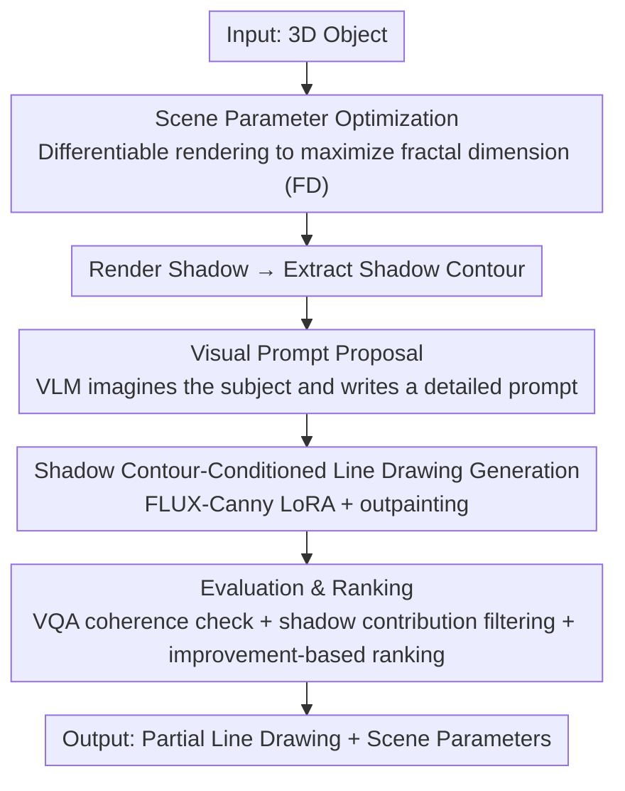

# ShadowDraw: From Any Object to Shadow-Drawing Compositional Art

**Conference**: CVPR 2026  
**Paper**: [CVF Open Access](https://openaccess.thecvf.com/content/CVPR2026/html/Luo_ShadowDraw_From_Any_Object_to_Shadow-Drawing_Compositional_Art_CVPR_2026_paper.html)  
**Code**: None (project page only)  
**Area**: Image Generation / Computational Visual Art  
**Keywords**: Shadow Art, Line Drawing Generation, Shadow Contour, Differentiable Rendering, Diffusion Models

## TL;DR
ShadowDraw transforms arbitrary 3D objects into "shadow-drawing" compositional art: the system jointly optimizes lighting and object pose to cast "interesting" shadows, then conditions a line-drawing diffusion model using the shadow contour and VLM text prompts. This allows the projected shadow to precisely complete a hand-drawn partial sketch into a unified composition. High-quality results are filtered via an automatic evaluation pipeline that discards cases where the shadow's contribution is insufficient.

## Background & Motivation
**Background**: "Shadow art" in computational visual art is typically formulated as an **inverse design** problem. Given a **pre-determined target pattern**, previous works optimize object geometry [32,36], material [2,31], or lighting [33,39] to make the cast shadow approximate this target. The shadow serves as the sole visual medium.

**Limitations of Prior Work**: These approaches assume the **target is known a priori** and then reproduce it via parameter optimization. Relying solely on shadows limits the expressive space, and the optimized geometries are often bizarre and difficult to replicate in the physical world.

**Key Challenge**: This work is inspired by Belgian artist Vincent Bal, whose art fuses everyday object shadows with hand-drawn lines to form a coherent scene. Here, the **target subject is a priori unknown**, yet generative models require detailed prompts to yield high-quality outputs. Furthermore, the structural cues provided by shadow images or composite object-shadow images are **too weak**; conditioning the generation directly on them often relegates the shadow to a minor background element. Additionally, "shadow-drawing" training samples are extremely scarce, with only dozens of real examples available online.

**Goal**: Given a 3D object, **jointly predict** the scene parameters (light direction + object pose) and a **partial line drawing**, such that the projected shadow under the specified lighting perfectly completes the line drawing into a recognizable image.

**Key Insight**: The authors **reformulate the problem around the "shadow contour"** (the boundary of the shadow). While a raw grayscale shadow and its contour encode the same geometry, empirically, reducing the shadow to a clean, binary closed contour provides a **much stronger conditioning signal**, forcing a tighter alignment between the shadow and the drawing. Moreover, closed contours can be easily extracted from abundant standard drawings, naturally enabling **scalable data synthesis** and allowing direct reuse of off-the-shelf "edge-conditioned" generative models.

**Core Idea**: Replace "raw shadow $\rightarrow$ complete image" with "closed contour $\rightarrow$ line drawing", solving the challenges of weak conditioning, data scarcity, and inability to reuse pre-trained models simultaneously. This is paired with an overall pipeline of "scene parameter optimization for interesting shadows + VLM subject imagination + automatic evaluation and ranking."

## Method

### Overall Architecture
The input is a 3D object model, and the outputs are (i) a partial line drawing, and (ii) scene parameters (3D position/direction of the spotlight + object pose). When combined and illuminated, the cast shadow completes the drawing. Setup: the canvas is on the ground, the light source is a spotlight (producing sharp shadows), and the distance from the light to the canvas center is fixed, leaving only **elevation and azimuth** as degrees of freedom. The object can rotate around the vertical axis and translate along the ground axes. Drawings are black strokes, and shadows are gray silhouettes.

The pipeline consists of three steps: first, train the line drawing generator under a simplified setting (fixed pose/lighting, known subject); second, relax these assumptions to **search for scene parameters that cast interesting shadows** and use a VLM to imagine the subject; third, use automatic evaluation to **filter and rank** the outputs to obtain a few high-quality compositions:

### Key Designs

**1. Shadow Contour Reformulation: Replacing "Raw Shadow $\rightarrow$ Complete Drawing" with "Closed Contour $\rightarrow$ Line Drawing"**

Directly training a generative model conditioned on "shadow images" or "composite object-shadow images" has two major drawbacks: weak conditioning signals (which make alignment difficult) and extreme data scarcity (only dozens of real-world samples online). The key breakthrough is replacing the **raw grayscale shadow with its 2D binary boundary contour** as the condition. Although contours and raw shadows encode the same geometry, models trained on raw shadows tend to drift from the target geometry, whereas contour conditioning enforces much tighter alignment. This reformulation also brings two major benefits: (i) it allows the **direct reuse of mature edge-conditioned generative models** (such as FLUX.1-Canny), and (ii) it supports **scalable data synthesis**, as "shadow-like closed contours" can be efficiently extracted from any standard line drawings. Based on this, the authors first use GPT-4o to generate line drawings, retaining only those containing "closed regions enclosed by strokes." They then train a FLUX-1-dev LoRA to synthesize 10,000 line drawings, from which closed contours are extracted to simulate shadow contours, bypassing the real-world data scarcity bottleneck.

**2. Shadow Contour-Conditioned Line Drawing Generation + Outpainting for Occlusion Avoidance**

With the synthesized data, the authors train a LoRA adapter $\epsilon_\theta$ on top of FLUX.1-Canny. The training uses a standard score-matching objective conditioned on both the **shadow contour $c_i$** and the **text prompt $c_t$**:

$$\min_{\theta}\ \mathbb{E}_{x_0,\epsilon,c_i,c_t,t}\ \big\|\omega(t)\big(\epsilon_\theta(x_t,c_i,c_t,t)-\epsilon\big)\big\|^2$$

where $x_0$ is the latent of the target line drawing, and $x_t$ is the noisy sample at step $t$. During inference, the shadow is rendered based on the scene parameters, its boundary is extracted, and it is fed into the model along with the text. To **prevent drawing strokes from overlapping with the physical object**, generation is framed as an **outpainting** task. Given a binary object mask $m$, the denoising process retains the occluded region at each step:

$$x_t = m\odot x_t^{mask} + (1-m)\odot \hat{x}_t,\qquad x_t^{mask}\sim\mathcal{N}(\sqrt{\bar\alpha_t}\,x_0^{mask},(1-\bar\alpha_t)I)$$

where $\hat{x}_t$ is the model's prediction at step $t$. Finally, the input shadow contour is erased from the generated drawing, and the 3D object is re-rendered onto the scene to produce the final composition.

**3. Scene Parameter Optimization: Finding "Visually Interesting" Shadows via Differentiable Fractal Dimension**

A manual setup works under simplified settings, but supporting arbitrary objects requires automatically finding scene configurations that discard boring shadows and project **diverse and semantically rich** shapes. The authors parameterize five variables: light azimuth $\theta$, elevation $\phi$, object polar coordinates $(r,\gamma)$, and self-rotation $\alpha$ around the vertical axis. They constrain $\gamma=\theta$ and $r=0.8\times$ canvas radius to ensure the shadow extends towards the center of the canvas, reducing the degrees of freedom to three. To measure "shadow quality", they use the **fractal dimension (FD)**, which quantifies contour complexity via multi-scale box-counting. A higher FD indicates a more irregular and visually rich shape. To allow gradient-based optimization, they utilize a differentiable approximation of FD as the loss:

$$L=-\mathrm{FD}(S),\qquad S=\mathrm{Renderer}(\theta,\phi,r,\gamma,\alpha)$$

where $S$ is the binary shadow rendered via PyTorch3D's differentiable silhouette renderer. In practice, they start from 48 initializations (12 azimuths $\times$ 4 elevations, each with a random self-rotation). Each initialization is updated only within its local neighborhood to prevent search space overlap and ensure physical reproducibility of parameters.

**4. Visual Prompt Proposal: VLM "Imagining" a Detailed Subject from the Shadow**

Detailed prompts significantly improve text-to-image quality, while generic descriptions like "a man" or "a bird" cannot support a coherent shadow-drawing composition. Instead of using a predefined set of hand-written prompts, this work supports arbitrary inputs and adapts to various shadow geometries by using a **VLM to generate scene-specific prompts directly from the shadow**. The model is instructed to imagine a drawing "where the shadow contour naturally serves as a key structural element" and write a detailed description (users can also modify the prompt to specify their desired subject). To enable geometric reasoning and maintain semantic and visual coherence, they employ a **chain-of-thought (CoT) prompting template**.

**5. Evaluation and Ranking: Three-Dimensional Filtering + Delta-Score-Based Top-K Selection**

After generating candidates across various scene parameters, the system determines which ones to retain via a systematic three-dimensional filtering pipeline:
**(i) Shadow-Drawing Coherence**: Verified via VQA. During the proposal stage, the VLM specifies the intended role of the shadow contour (e.g., "body of a fish"). The contour is overlaid in red on the generated drawing, and another VLM is asked a yes/no question: "Does the highlighted stroke outline the described part?" If "no", the candidate is discarded.
**(ii) Shadow Contribution**: Evaluates how important the shadow is by comparing the "full drawing" with a "partial drawing" (where the shadow contour is erased) using CLIP similarity, ImageReward, and HPS. If the partial drawing yields a higher ImageReward (IR) or HPS, it implies the shadow is redundant, and the candidate is discarded.
**(iii) Visual Quality and Ranking**: Computes improvement scores (Delta scores) for the remaining candidates:

$$\Delta_{\mathrm{CLIP}}=\mathrm{CLIP}^2_{full}/\mathrm{CLIP}^2_{partial},\quad \Delta_{\mathrm{IR}}=\Phi(\mathrm{IR}_{full})^2-\Phi(\mathrm{IR}_{partial})^2,\quad \Delta_{\mathrm{HPS}}=\mathrm{HPS}^2_{full}-\mathrm{HPS}^2_{partial}$$

where $\Phi(\cdot)$ is the standard normal CDF (since IR scores are normalized). The final ranking score is $R=\Delta_{\mathrm{CLIP}}\cdot\Delta_{\mathrm{IR}}\cdot\Delta_{\mathrm{HPS}}$. The top-K candidates are selected as the final output.

## Key Experimental Results

### Main Results
Since no existing methods specifically target "shadow-drawing art", the authors construct three baselines using SOTA generative models: Gemini (conditioned on object-shadow composites), Gemini (conditioned on shadow contours), and GPT-Image (conditioned on shadow contours), all fed with prompts generated by the proposed pipeline. The evaluation dataset comprises 200 objects (26 letters, 20 YCB, 87 Objaverse-LVIS, 30 Objaverse characters, 20 Polycam-scanned real household items, 17 MeshLRM-generated assets). The top-4 ranked outputs of each method are compared.

| Method | CLIP↑ | Conceal↑ | User Preference (Win/Draw/Lose %) |
|------|-------|----------|---------------------------|
| Gemini (object-shadow) | 31.28 | -0.2840 | 3.6 / 8.4 / 88.0 |
| Gemini (shadow contour) | 31.65 | 0.2421 | 6.0 / 23.7 / 70.3 |
| GPT-Image (shadow contour) | 31.15 | 0.0100 | 0.5 / 1.0 / 98.5 |
| **Ours** | **32.41** | **3.0059** | — |

The **concealment** metric (quantifying shadow helper performance, adapted from [12]) is defined as the difference in CLIP score between the "full drawing" and the "drawing with the shadow removed". It directly measures the shadow's contribution. The concealment of baselines is close to 0 or even negative, indicating the shadow is redundant. Ours achieves a concealment score of 3.0059, proving the shadow serves as a crucial structural element. In the user study, participants preferred Ours in 70.4% of the comparisons (with 20.1% marked as "no preference"); moreover, 96.8% of the top-4 results had at least one drawing rated as satisfactory by users.

### Ablation Study
Ablation of three core components: shadow contour conditioning, synthetic training data, and scene parameter optimization (where IR=ImageReward, HPS=Human Preference Score).

| Configuration | Condition Type | Training Data | Scene Optimization | CLIP↑ | Conceal↑ | IR↑ | HPS↑ |
|------|---------|---------|---------|-------|----------|-----|------|
| Ablation 1 | Object-Shadow | Artist-sourced | ✓ | 31.04 | 0.225 | -0.072 | 0.2244 |
| Ablation 2 | Shadow Contour | Artist-sourced | ✓ | 31.38 | 2.215 | 0.155 | 0.2269 |
| Ablation 3 | Shadow Contour | Synthetic | ✗ | 32.08 | 2.606 | 0.418 | 0.2294 |
| **Ours** | Shadow Contour | Synthetic | ✓ | **32.41** | **3.006** | **0.444** | **0.2373** |

### Key Findings
- **Shadow contour conditioning contributes the most**: Comparing Ablation 1 and 2, simply changing the "object-shadow condition" to "shadow contour condition" boosts concealment from 0.225 to 2.215 (nearly a 10$\times$ improvement) and turns the IR score positive. This proves that weak conditioning is the root cause of why the shadow becomes a mere background element in the baselines.
- **Synthetic data brings further improvements**: Comparing Ablation 2 and 3, replacing the 71 artist-sourced samples with large-scale synthetic data improves CLIP, IR, and HPS across the board, validating that data scarcity was indeed a critical bottleneck.
- **Scene parameter optimization is the cherry on top**: Combining the FD-driven optimization with synthetic training (Ours) yields the best overall performance, demonstrating that "finding an interesting shadow" is just as important as "drawing a high-quality line art."
- **Generalization and extension**: The pipeline is robust to imperfect geometries from scanning. It can scale to multi-object stacking (treated as a single composite object after physical simulation in Blender), animated objects (by stacking multi-frame contours + restricting strokes via mask), and physical deployment requiring only an object and a phone flashlight.

## Highlights & Insights
- **Elegant reduction from "weak to strong" conditioning**: Reducing a grayscale shadow to a binary closed contour—retaining the same geometric information—empirically yields much better alignment. This counter-intuitive insight leverages the fact that generative models excel at processing clean structural edges. It also unlocks synthetic data generation and the reuse of pre-trained edge-conditioned models, killing three birds with one stone.
- **Concealment as a core metric**: Quantifying the contribution of the shadow by measuring the degradation of drawing quality when the shadow is removed provides an accurate, task-aligned evaluation, which is far more meaningful than standard CLIP or aesthetic scores.
- **Generation under unknown target subjects**: Treating the VLM as an "imaginator" that infers detailed prompts from weak geometric cues turns an under-constrained creative task into a controllable conditional generation pipeline. This "imagine then generate" paradigm is highly transferable to other creative generation tasks involving partial visual hints.
- **Extremely low deployment barrier**: Achieving physical deployment with only a phone scan and a spotlight brings computational shadow art out of specialized labs to everyday creators.

## Limitations & Future Work
- The scope of the paper is limited to **single light sources and textureless/non-refractive materials**. Multi-light setups, colored shadows, or translucent materials are not covered.
- The pipeline relies heavily on **external large models** (GPT-4o for data synthesis, VLMs for subject imagination and VQA, and CLIP/ImageReward/HPS for ranking). The final quality is tightly bound to these models' preferences, posing a risk of self-consistent but human-divergent bias.
- **Scene parameter optimization only uses fractal dimension** to quantify how "interesting" a shadow is. A high FD does not guarantee semantic relevance; it can generate complex but unintelligible shapes, relying heavily on downstream filtering rather than guaranteeing high-quality generation at the source.
- Top-K filtering means many generated candidates are discarded, which incurs **substantial generation and evaluation computational overhead**. Furthermore, the outpainting mask prevents drawing strokes from overlapping with the object itself, limiting more complex and interwoven compositions.

## Related Work & Insights
- **vs. Traditional/Computational Shadow Art [2,31,32,36]**: Previous works assume the target pattern is known and optimize object geometry, materials, or lighting to replicate it, with the shadow being the sole medium. In contrast, this paper **does not assume a predefined target**, jointly estimating the scene configurations and the subject, while introducing generative drawings as a complementary medium. This increases task difficulty while expanding the creative space.
- **vs. Line Drawing Generation [11,22,24]**: Previous works treat line drawings as an isolated modality (text-to-line, image-to-line, sketch animation, etc.). This work explicitly **binds** line drawings to projected shadows, enabling the two modalities to complement each other.
- **vs. Direct Large Model Baselines (Gemini/GPT-Image)**: Large models fail to capture the subtle complementarity of shadow and line art even when fed with shadow contours, resulting in concealment scores close to 0. This paper uses "contour-conditioned generation + outpainting + contribution filtering" to ensure the shadow remains the structural centerpiece.

## Rating
- Novelty: ⭐⭐⭐⭐⭐ Introduces a new creative paradigm of "shadow + generative line drawing," jointly estimating scene and subject under unknown target setups.
- Experimental Thoroughness: ⭐⭐⭐⭐ Multi-source evaluation on 200 objects, two user studies, and thorough three-component ablation, though lacking quantitative comparisons with more generative baselines and relying heavily on subjective/model-based metrics.
- Writing Quality: ⭐⭐⭐⭐⭐ Highly engaging and clear motivation; the three-step pipeline is well-structured, with clearly defined metrics such as concealment.
- Value: ⭐⭐⭐⭐ Expands the creative space of computational visual art with a very low deployment barrier; highly practical and engaging, though focused on creative applications with limited contribution to core generative architectures.

<!-- RELATED:START -->

## Related Papers

- [\[ICLR 2026\] Learning AND-OR Templates for Compositional Representation in Art and Design](../../ICLR2026/image_generation/learning_andor_templates_for_compositional_representation_in_art_and_design.md)
- [\[CVPR 2026\] Intrinsic Concept Extraction Based on Compositional Interpretability](intrinsic_concept_extraction_based_on_compositional_interpretability.md)
- [\[CVPR 2026\] Object-WIPER: Training-Free Object and Associated Effect Removal in Videos](object-wiper_training-free_object_and_associated_effect_removal_in_videos.md)
- [\[CVPR 2026\] ViHOI: Human-Object Interaction Synthesis with Visual Priors](vihoi_human-object_interaction_synthesis_with_visual_priors.md)
- [\[ICLR 2026\] ReFocusEraser: Refocusing for Small Object Removal with Robust Context-Shadow Repair](../../ICLR2026/image_generation/refocuseraser_refocusing_for_small_object_removal_with_robust_context-shadow_rep.md)

<!-- RELATED:END -->
