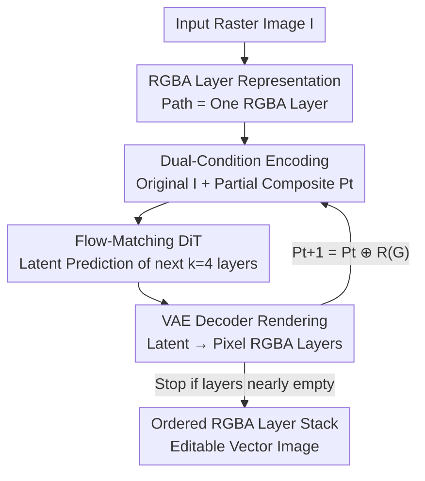

# ShapeAR: Generating Editable Shape Layers via Autoregressive Diffusion

**Conference**: CVPR 2026  
**Paper**: [CVF Open Access](https://openaccess.thecvf.com/content/CVPR2026/html/Chakraborty_ShapeAR_Generating_Editable_Shape_Layers_via_Autoregressive_Diffusion_CVPR_2026_paper.html)  
**Code**: None  
**Area**: Image Generation / Vector Graphics Generation  
**Keywords**: Vectorization, Layer Decomposition, Autoregressive Diffusion, Flow Matching, RGBA Layers

## TL;DR
ShapeAR reformulates "raster-to-vector" as a generative layered stacking task. Using latent space flow-matching diffusion conditioned on both the original image (global context) and a partial composite of previously generated layers (local context), it autoregressively generates sets of non-overlapping RGBA shape layers. This approach recovers "artist-style" complete and reorderable closed shapes, outperforming previous SOTA on multiple vectorization metrics.

## Background & Motivation
**Background**: Traditional methods for converting raster images to SVG fall into two categories: boundary tracing, which follows visible contours, and joint path optimization driven by differentiable rasterization (e.g., LIVE, O&R), which uses "analysis-by-synthesis" to backpropagate pixel losses and iteratively refine SVG paths. These methods prioritize pixel-level fidelity.

**Limitations of Prior Work**: These methods treat the input as a flattened pixel map and only trace **visible** boundaries, failing to recover "what the occluded part should have been." Consequently, partially occluded shapes are sliced into disconnected fragments—an occluded circle is traced as a broken arc rather than a complete circle. This destroys Z-order and layer relationships, resulting in a collection of overlapping, inconsistent, and hard-to-edit flattened paths (a "cutout collage" feel). Additionally, joint optimization is sensitive to initialization, prone to local minima, and carries high inference costs at scale.

**Key Challenge**: Vectorization is typically treated as an "inverse rendering" problem (recovering contours/control points to minimize reconstruction error), while artists actually paint **compositionally** by stacking complete shapes. The former's objective function does not account for shape completeness or distinct layering, so even accurate results lack the structure of artist-drawn work.

**Goal**: (1) Recover each path as a **complete closed** shape (even if occluded); (2) Maintain non-overlapping layers with correct depth stacking order; (3) Scale to complex scenes with many shapes without heavy joint optimization.

**Key Insight**: The authors redesign the representation, treating a single vector path as an **RGBA layer** (RGB for color, alpha for transparency and stacking order). A complete vector image is a stack of RGBA layers ordered by z-order. Thus, vectorization naturally becomes a **generative** problem: learning to synthesize and stack these shapes to reconstruct the image.

**Core Idea**: Use latent space autoregressive diffusion to "draw layer-by-layer" instead of "tracing/optimizing." Each step generates a set of non-overlapping RGBA layers conditioned on the original image and the already-drawn composite, building the image through stacking just like an artist.

## Method

### Overall Architecture
ShapeAR decomposes an input raster image $I \in \mathbb{R}^{4\times H\times W}$ (RGBA) into a sequence of layers $\{L_1,\dots,L_N\}$, such that their sequential alpha-over composition reconstructs the original image: $I \approx L_1 \oplus L_2 \oplus \cdots \oplus L_N$. The composition operator is defined as $I \oplus I' := (1-\alpha_{I'})\cdot I + \alpha_{I'}\cdot I'$ (evaluated right-to-left, new layers on top). Each layer contains multiple **non-overlapping** shapes (where the alpha of shapes in the same layer has no common non-zero pixels $\alpha_{S_a}\cdot\alpha_{S_b}=0$), while the sequence preserves the original depth order.

Because decomposition is highly under-constrained, the authors **learn from approximately 900,000 SVG data points** to ensure generated shapes match the distribution of artist-created shapes. The pipeline uses latent diffusion: a VAE compresses a stack of RGBA layers into a $16\times$ downsampled latent space, an SD3-style Diffusion Transformer (DiT) performs conditional generation in the latent space, and a frozen VAE decoder renders them back to pixel layers. The process is **autoregressive**: rather than generating all layers at once, it generates $k=4$ layers per step, stacking the results into a "partially synthesized image" $P_t$, which serves as local context for the next step.

### Key Designs

**1. RGBA Layer Representation + Non-overlapping Grouping: Converting Vectorization into a Learnable Generative Task**

To address the issue where tracing yields fragmented and hard-to-edit paths, the authors abandon explicit contour tracing in favor of RGBA layers as proxy representations. Each vector path is rasterized into a $\mathbb{R}^{4\times H\times W}$ shape $S$. Multiple non-overlapping shapes are packed into a "layer" $L_i := S_{i_1}\oplus\cdots\oplus S_{i_k}$. This changes "recovering a path" from a geometric tracing problem into "predicting a continuous color-alpha field," allowing the model to produce **complete closed** shapes (including occluded parts) instead of just visible contours.

**2. Dual-Condition Autoregressive Generation: Driving Layer Stacking via Global and Partial Composites**

To handle complex scenes with many shapes, the authors frame decomposition as an autoregressive process. The learned decomposer $f_\theta$ takes two conditions at step $t$: the original image $I$ (global context) and the partial composite $P_t$ (local context). At each step, it predicts $k=4$ new layers. This loop enforces spatial consistency across layers and naturally supports an **arbitrary number** of shapes without a predefined layer limit.

**3. Flow-Matching DiT + 4-axis RoPE: Efficient Latent Prediction of Layer Sets**

Following the SD3 latent diffusion design, a convolutional VAE compresses the RGBA stack into latents $z \in \mathbb{R}^{c\times d\times H_\ell\times W_\ell}$. The DiT predicts a velocity field in this latent space using flow-matching. To distinguish between condition tokens and specific layer/spatial latent tokens, a **4-axis RoPE** is used, where attention head channels are split to independently rotate based on (condition index / layer index / height / width).

**4. Geometry-Aware VAE Loss and Data Filtering: Biasing Toward "Thin, Rule-based" Artist Shapes**

To preserve high-frequency structures like thin lines, the VAE loss combines a Charbonnier regression term (to preserve high frequencies), a focal BCE loss on the alpha channel (to focus on small positive regions), and an annealed KL term. Data is filtered using a geometric metric: the probability of keeping a shape is the **harmonic mean of its symmetry score $S_{sym}$ and convexity $C_{conv}$**, ensuring the model learns clean "design primitives."

### Loss & Training
Training pairs are constructed from SVGs by rasterizing paths into sequences. Each training instance randomly samples a valid layering $\{L_1,\dots,L_N\}$. At step $t$, the model is supervised by $(I, P_t) \mapsto G(t)$, where $G(t)$ is the target set of $k$ layers. The DiT is trained with the flow-matching objective while the VAE remains frozen.

## Key Experimental Results

Evaluation was performed on 256×256 raster images from MMSVG and OmniSVG hold-out sets. Geometric metrics included Shape Blending Error $E_{blend}$, Redundant Shape Count $N_{red}$, Symmetry Score $S_{sym}$, and Convexity $C_{conv}$.

### Main Results

Vectorization Quality Comparison (100 diverse images, lower is better):

| Method | L1 ↓ | 1-SSIM ↓ | LPIPS ↓ |
|------|------|----------|---------|
| LIVE | 0.524 | 0.631 | 0.440 |
| O&R | 0.102 | 0.350 | 0.342 |
| SGLIVE | 0.142 | 0.285 | 0.243 |
| LIVSS (Prev. SOTA) | 0.008 | 0.057 | 0.049 |
| **Ours** | **0.005** | **0.020** | **0.014** |

Compared to LIVSS, ShapeAR reduces L1 by 37.5%, 1-SSIM by 64.9%, and LPIPS by 71.4%.

Geometric Quality Comparison (vs. Adobe Illustrator non-ML baseline):

| Method | $C_{conv}$ ↑ | $S_{sym}$ ↑ | KID ↓ |
|------|----------|---------|-------|
| **Ours** | **0.88 ± 0.09** | **0.49 ± 0.22** | **0.374 ± 0.002** |
| Baseline | 0.68 ± 0.10 | 0.29 ± 0.22 | 0.388 ± 0.002 |

### Ablation Study

Layer count ablation (lower is better):

| Layer Count | L1 ↓ | 1-SSIM ↓ | Redundancy ↓ | Blending ↓ |
|--------|------|----------|--------|--------|
| 4 | 3.1e−5 | 0.027 | 0.0101 | 0.0511 |
| 8 | 2.7e−5 | 0.0239 | 0.0077 | 0.0327 |
| 12 | **2.2e−5** | **0.0144** | 0.0078 | **0.0013** |

### Key Findings
- **Higher layer budgets improve reconstruction**: Moving from 4 to 12 layers reduces blending error from 0.0511 to 0.0013, as shapes are separated more cleanly.
- **Complete shapes are the "killer feature"**: Unlike tracing methods that produce fragmented paths at occlusions, ShapeAR generates coherent closed shapes.
- **Structural advantages in complex scenes**: As path count increases, ShapeAR maintains better SSIM than tracing-based methods because it avoids contour distortions.

## Highlights & Insights
- **Reformulating "Inverse Rendering" as "Compositional Generation"**: Treating a path as an RGBA layer makes "occlusion completion" a natural byproduct of the generative task.
- **Dual Conditions for Global Intent and Local Progress**: This autoregressive loop guarantees cross-layer consistency and supports an unlimited number of shapes.
- **Geometric Metrics as Data Filters**: Using symmetry and convexity as sampling probabilities directly shapes the training distribution toward high-quality design primitives.

## Limitations & Future Work
- **Raster Resolution Constraints**: Dependence on fixed raster resolution limits detail for extremely complex images.
- **Implicit Representation Dependency**: The model requires a shape-to-SVG post-processing step and cannot represent self-intersecting (non-embeddable) geometry.
- **Lack of Support for Composite Paths/Variable Opacity**: Future work may involve embedding alpha into implicit representations to decouple "topology" from "opacity."

## Related Work & Insights
- **vs. Boundary Tracing**: Tracing destroys layer relationships; Ours preserves Z-order and completes shapes.
- **vs. Optimization-based (LIVE, O&R)**: These are sensitive to initialization and computationally heavy; Ours is feed-forward and autoregressive.
- **vs. LIVSS**: LIVSS is a "simplify-then-vectorize" approach; Ours is a fully end-to-end structured vector layer generator.

## Rating
- Novelty: ⭐⭐⭐⭐⭐ Reformulating vectorization as autoregressive RGBA layer generation is a highly novel perspective.
- Experimental Thoroughness: ⭐⭐⭐⭐ Solid multi-baseline evaluation, though some baselines differ across metric tables.
- Writing Quality: ⭐⭐⭐⭐ Clear problem formulation and complete mathematical grounding.
- Value: ⭐⭐⭐⭐ Highly practical for design workflows, providing editable layers rather than fragmented paths.

<!-- RELATED:START -->

## Related Papers

- [\[CVPR 2026\] PhysGen: Physically Grounded 3D Shape Generation for Industrial Design](physgen_physically_grounded_3d_shape_generation_for_industrial_design.md)
- [\[CVPR 2026\] 3D Space as a Scratchpad for Editable Text-to-Image Generation](3d_space_as_a_scratchpad_for_editable_text-to-image_generation.md)
- [\[CVPR 2026\] FG-Portrait: 3D Flow Guided Editable Portrait Animation](fg-portrait_3d_flow_guided_editable_portrait_animation.md)
- [\[CVPR 2026\] MoCoDiff: A Controllable Autoregressive Diffusion Model for Expressive Motion Generation](mocodiff_a_controllable_autoregressive_diffusion_model_for_expressive_motion_gen.md)
- [\[ICLR 2026\] Follow-Your-Shape: Shape-Aware Image Editing via Trajectory-Guided Region Control](../../ICLR2026/image_generation/follow-your-shape_shape-aware_image_editing_via_trajectory-guided_region_control.md)

<!-- RELATED:END -->
