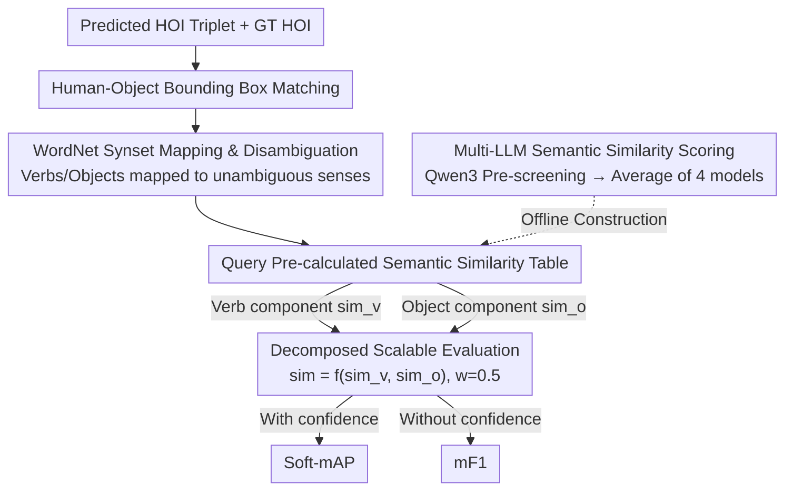

# SHOE: Semantic HOI Open-Vocabulary Evaluation Metric

**Conference**: CVPR 2026  
**arXiv**: [2604.01586](https://arxiv.org/abs/2604.01586)  
**Code**: [https://github.com/majnoa/SHOE](https://github.com/majnoa/SHOE)  
**Area**: Image Generation  
**Keywords**: Open-vocabulary HOI detection, semantic similarity evaluation, LLM scoring, WordNet, evaluation metrics

## TL;DR

The SHOE evaluation framework is proposed to decompose HOI predictions into verbs and objects for calculating LLM-driven semantic similarity. This replaces the exact matching method of traditional mAP, achieving 85.73% consistency with human judgment in open-vocabulary HOI detection evaluation, surpassing the 78.61% average consistency among human annotators.

## Background & Motivation

1. **Background**: Human-Object Interaction (HOI) detection is a fundamental task in visual understanding. The standard evaluation metric is mAP, which relies on exact categorical matching between predictions and labels.
2. **Limitations of Prior Work**: mAP treats HOI categories as discrete labels; thus, predictions that are semantically similar but lexically different (e.g., "lean on couch" and "sit on couch") are judged as incorrect. Furthermore, incomplete dataset annotations cause reasonable but unlabelled predictions to be penalized as false positives.
3. **Key Challenge**: With the rise of VLMs and MLLMs, models can generate open-vocabulary predictions beyond fixed label sets, but existing evaluation protocols cannot fairly measure the quality of these flexible outputs.
4. **Goal**: To design a semantic-aware flexible evaluation framework that supports graded matching evaluation for open-vocabulary HOI predictions.
5. **Key Insight**: Decompose HOI into two independent components—verb and object—and calculate semantic similarity using the average scores from multiple LLMs to avoid the combinatorial explosion of full HOI pairs.
6. **Core Idea**: Achieve decomposed flexible matching evaluation for HOI through WordNet disambiguation and multi-LLM semantic scoring.

## Method

### Overall Architecture

SHOE aims to resolve the "tyranny of exact matching" of mAP in open-vocabulary HOI, where a prediction is judged wrong if the verb or object text does not match the label exactly, even if the semantics are nearly identical. The workflow proceeds as follows: given the predicted HOI triplet $(b_h, b_o, v, o)$ and the GT HOI, standard human-object bounding box matching is performed first. For matched predictions, verbs and objects are mapped to their corresponding synonym sets (synsets) via WordNet. Then, scores for "predicted verb $\leftrightarrow$ GT verb" and "predicted object $\leftrightarrow$ GT object" are retrieved from a **pre-calculated LLM semantic similarity table**. These two scores are combined into an instance-level similarity. Finally, they are aggregated into Soft-mAP based on mAP ranking logic, or into mF1 when confidence scores are unavailable. Crucially, expensive semantic scoring is pre-processed into an offline look-up table, making evaluation efficient.

### Key Designs

**1. WordNet Synset Mapping & Disambiguation: Comparing Meanings instead of Words**

Directly comparing raw vocabulary is prone to polysemy—the same word "bat" can mean a sports tool or an animal. SHOE first maps each verb/object to a sense-specific WordNet synset, comparing exact meanings rather than strings. For objects, WordNet's noun hierarchy is complete, allowing neighborhood expansion via hypernyms/hyponyms. For verbs, since WordNet's verb classification is shallow and fragmented, the authors manually organized approximately 7,150 HOI-related verb synsets for fallback matching. This step provides clean, unambiguous comparison units for subsequent semantic scoring.

**2. Multi-LLM Semantic Similarity Scoring: Model Averaging as a Benchmarking Tool**

Given synsets, a score representing "how close these two senses are" is required. SHOE assigns a semantic similarity score of 0–4 for each verb-verb and object-object pair. To avoid systematic bias from a single LLM, a two-step approach is used: Qwen3-32B performs a low-cost pre-screening on the full set of pairs (approx. 850K verb pairs) to eliminate pairs with zero similarity. The remaining non-zero pairs are evaluated by DeepSeek-V3, Llama-4-Maverick-17B, Yi-1.5-34B-Chat, and Gemini-2.5-Pro. Each model scores based on synset gloss definitions on a 5-point scale, and the average is taken. Interestingly, Pearson correlation between models is lower for verbs (0.50–0.72) than for objects (up to $r=0.84$), indicating that verb semantics are harder to reach a consensus on and benefit more from averaging.

**3. Decomposed Scalable Evaluation: Splitting HOI into Verb $\times$ Object to Avoid Combinatorial Explosion**

Calculating similarity for every pair of complete HOIs would lead to quadratic expansion—$(V \times O)^2$ comparisons—which is computationally prohibitive for large vocabularies. SHOE's core optimization is decomposing HOI similarity into a synthesis of verb and object components:

$$\text{sim}(p,g) = f\big(\text{sim}_v(v^p, v^g),\ \text{sim}_o(o^p, o^g)\big)$$

The synthesis function $f$ defaults to an arithmetic mean with weight $w=0.5$. Thus, the similarity table only needs to compute $V^2 + O^2$ entries (all verbs and all objects) rather than enumerating every HOI pair. This trade-off allows the original 600 fixed HOI classes in HICO-DET to be expanded to 38 million semantically related HOIs while remaining evaluatable—the prerequisite for practical "open-vocabulary" evaluation.

### Loss & Training

SHOE does not train any models; it is a pure evaluation framework. It provides two aggregation modes depending on whether the evaluated model provides confidence scores. **With confidence**, it is compatible with mAP ranking to calculate Soft-AP and Soft-mAP. **Without confidence** (e.g., directly generated VLMs), it calculates soft precision/recall/F1 equally for all predictions.

## Key Experimental Results

### Main Results

| Method | Type | mAP | SHOE mAP |
|------|------|-----|----------|
| HOLA (ViT-L) | Default | 39.05 | 39.92 |
| LAIN (ViT-B) | Zero-shot | 34.60 | 35.37 |
| THID | Open-Vocab | 22.01 | 22.04 |
| GPT-4.1 + DETR | VLM | 49.50 | 61.67 |
| InternVL3-38B + DETR | VLM | 42.00 | 58.03 |
| Qwen2.5-VL-32B + DETR | VLM | 34.83 | **66.03** |

### Ablation Study

| Metric | Consistency with Human Judgment (%) |
|----------|---------------------|
| SHOE (Standard, Arithmetic Mean) | **85.73** |
| SHOE (Geometric Mean) | 84.29 |
| SHOE (Minimum) | 84.01 |
| DeepSeek-V3 (Direct LLM Scoring) | 83.34 |
| Gemini-2.5-Pro | 77.52 |
| CLIP-ViT-B (gloss) | 59.11 |
| WordNet WUP | 57.09 |
| SentenceBERT | 54.09 |
| mAP direct-match | 38.90 |

### Key Findings

- Qwen2.5-VL-32B has the lowest standard mAP (34.83) but the highest SHOE mAP (66.03), indicating strong semantic understanding despite not perfectly replicating the exact labels of HICO-DET.
- VLM-based methods significantly outperform traditional methods under SHOE mAP, revealing real capability differences that mAP cannot capture.
- Hyperparameter tuning shows that in "same verb, different object" scenarios, the optimal weight $w^*=0.267$ favors object similarity, whereas in "different verb, same object" scenarios, $w^*=0.733$ favors verb similarity. However, due to the limited scale of the user study, $w=0.5$ is retained.
- For zero-similarity verb pairs filtered by Qwen3-32B, the disagreement rate by other LLMs was only 0.245%~1.318%, verifying the reliability of the screening strategy.

## Highlights & Insights

- **Elegant Decomposition Logic**: Breaking down HOI similarity into independent verb and object comparisons reduces computational complexity from $(V \times O)^2$ to $V^2 + O^2$, making it possible to extend HICO-DET from 600 classes to 38 million. This approach can be generalized to any evaluation scenario requiring compositional semantic comparison.
- **Surpassing Human Consistency**: SHOE achieves 85.73% consistency with the average human score, while the average consistency among human annotators is only 78.61%. This suggests that multi-LLM averaging produces more stable semantic judgments than a single human.
- **Metric as Infrastructure**: The similarity look-up table only needs to be built once. Subsequent evaluations involve direct table look-ups, significantly reducing the cost of repeated use.

## Limitations & Future Work

- Currently verified only on HICO-DET; other HOI datasets (e.g., SWIG-HOI) also suffer from incomplete annotations and require further validation.
- The scale of the user study is relatively small (500 pairs, 5 annotators); stability in larger-scale human evaluations needs further verification.
- Confidence proxies for VLMs (e.g., token probabilities) may be unreliable; how to better obtain calibrated confidence scores for open-ended generative models remains an open question.
- The "gold standard" of semantic similarity varies by person; HOI evaluation in specific domains (e.g., medical or legal scenarios) may require domain customization.

## Related Work & Insights

- **vs. mAP (Standard Evaluation)**: mAP performs strict exact matching, while SHOE introduces semantic gradient matching. They are complementary—mAP measures exact reproduction, while SHOE measures semantic understanding.
- **vs. CLIP-based Similarity**: CLIP achieves only 59.11% consistency in HOI pair comparisons, suggesting that general vision-language embeddings are insufficient to capture subtle nuances in HOI semantics.
- **vs. Direct LLM Scoring**: Directly scoring the entire HOI pair with an LLM reaches up to 83.34%, but SHOE's decomposition strategy achieves 85.73% and is more scalable.

## Rating

- Novelty: ⭐⭐⭐⭐ The decomposed semantic evaluation logic is novel, though the core remains LLM-based scoring and averaging.
- Experimental Thoroughness: ⭐⭐⭐⭐ User studies, multi-baseline comparisons, and Qwen screening validation are quite comprehensive.
- Writing Quality: ⭐⭐⭐⭐⭐ Clear motivation, professional diagrams, and complete mathematical expressions.
- Value: ⭐⭐⭐⭐ Provides a practical tool for open-vocabulary HOI evaluation, though the impact is currently limited to the HOI community.

<!-- RELATED:START -->

## Related Papers

- [\[CVPR 2026\] Omni-Attribute: Open-vocabulary Attribute Encoder for Visual Concept Personalization](omni-attribute_open-vocabulary_attribute_encoder_for_visual_concept_personalizat.md)
- [\[CVPR 2026\] OpenDPR: Open-Vocabulary Change Detection via Vision-Centric Diffusion-Guided Prototype Retrieval for Remote Sensing Imagery](opendpr_open-vocabulary_change_detection_via_vision-centric_diffusion-guided_pro.md)
- [\[ICML 2026\] Conformal Reliability: A New Evaluation Metric for Conditional Generation](../../ICML2026/image_generation/conformal_reliability_a_new_evaluation_metric_for_conditional_generation.md)
- [\[ICML 2026\] Self-Prompting Diffusion Transformer for Open-Vocabulary Scene Text Editing via In-Context Learning](../../ICML2026/image_generation/self-prompting_diffusion_transformer_for_open-vocabulary_scene_text_editing_via_.md)
- [\[NeurIPS 2025\] Seg4Diff: Unveiling Open-Vocabulary Segmentation in Text-to-Image Diffusion Transformers](../../NeurIPS2025/image_generation/seg4diff_unveiling_open-vocabulary_segmentation_in_text-to-image_diffusion_trans.md)

<!-- RELATED:END -->
