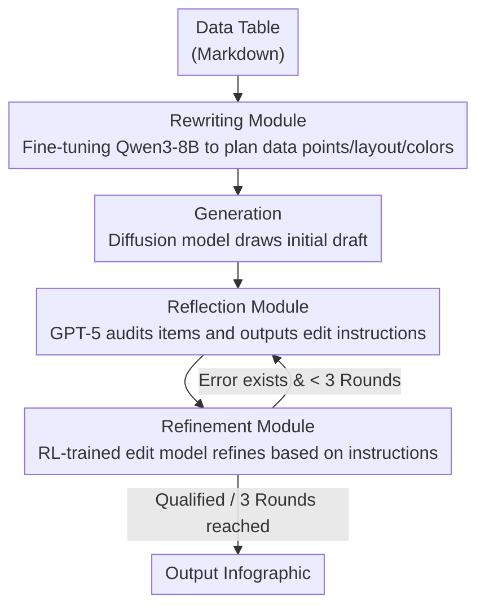

# ShowTable: Unlocking Creative Table Visualization with Collaborative Reflection and Refinement

**Conference**: CVPR 2026  
**arXiv**: [2512.13303](https://arxiv.org/abs/2512.13303)  
**Code**: [https://lntzm.github.io/showtable-page/](https://lntzm.github.io/showtable-page/)  
**Area**: Diffusion Models / Image Generation  
**Keywords**: Table Visualization, Self-correction, MLLM Reasoning, Diffusion Models, Reinforcement Learning

## TL;DR
ShowTable introduces the new task of "Creative Table Visualization" (converting data tables into infographics) and designs a progressive self-correction pipeline coordinating MLLM (reasoning + reflection) with Diffusion models (generation + refinement). Through a specifically trained rewriting module and a refinement module optimized via RL, it significantly enhances the visualization quality of all baseline models on the self-constructed TableVisBench benchmark.

## Background & Motivation

1. **Background**: Image generation models have achieved high quality in general scenarios. Recent research has progressively shifted toward more complex structured generation, such as poster design and text rendering. However, data-driven visualization (e.g., generating charts/infographics from tables) remains a significant challenge for existing models.

2. **Limitations of Prior Work**: Directly inputting markdown tables as prompts into generation models leads to a tendency to "render table text" rather than "visualize data." Existing unified models have nearly zero Data Accuracy (e.g., Bagel scores only $0.1$, Blip3o-Next scores only $0.4$) and fail to correctly map data points to visual elements (bar heights, pie chart angles, etc.).

3. **Key Challenge**: Creative table visualization requires two seemingly contradictory capabilities—creative aesthetic design (requiring flexibility) and strict data fidelity mapping (requiring precision). Generative models excel at the former but frequently fail the latter.

4. **Goal**: How to enable generative models to accurately and aesthetically visualize structured table data as infographics while automatically detecting and fixing generation errors.

5. **Key Insight**: Utilizing MLLMs for reasoning planning (Rewriting) and error auditing (Reflection), and Diffusion models for execution (Generation + Refinement), creates an iterative self-correction loop. Dedicated modules are trained for the two bottlenecks: rewriting and refinement.

6. **Core Idea**: A collaborative mode of "MLLM coordination + Diffusion model execution" implements a high-fidelity generation from tables to aesthetic infographics via a Rewriting→Generation→Reflection→Refinement self-correction cycle.

## Method

### Overall Architecture
ShowTable aims to solve the problem of converting a data-dense markdown table into an infographic that is both aesthetically pleasing and data-accurate. The difficulty lies in generation models "copying table text" rather than "translating numbers into bar heights or pie angles," with no system to correct errors. The approach allows the MLLM to act as the "conductor + auditor" and the Diffusion model as the "executor + repairer," collaborating in a self-correction closed loop.

The process consists of four connected steps: **Rewriting**, where the MLLM interprets the table and plans data points/layout/colors/background into a detailed descriptive prompt; **Generation**, where this prompt is passed to a Diffusion model to draw an initial version; **Reflection**, where the MLLM audits the generated image against the original table item-by-item to identify errors (e.g., incorrect bar height, misrendered numbers, wrong proportions) and outputs executable editing instructions; and **Refinement**, where an image editing model carries out the repairs based on the instructions. The reflection and refinement steps can iterate for up to 3 rounds, progressively improving the accuracy. The paper's core contribution lies in training dedicated modules for the two most critical stages: rewriting and refinement.

### Key Designs

**1. Rewriting Module: From "Table Rendering" to "Visualization Planning"**

When fed markdown tables directly, models treat them as text to be rendered, resulting in nearly zero data accuracy (Bagel scores $0.1$). This step requires thinking through "what to draw" at the textual level first. The authors fine-tuned a dedicated rewriting model based on Qwen3-8B. Training data was constructed by using Gemini-2.5-pro to write detailed descriptions for ground-truth visualization images, supplemented by chain-of-thought explanations of "why the table should be drawn this way," resulting in $30K$ {table, rationale} → {description} SFT samples (sourced from SlideVQA / OpenImages / Cambrian-10M). While general LLMs (GPT-5, Gemini) might miss data points in complex tables, this specialized rewriting module's Data Accuracy even surpassed the human Reference-Caption upper bound ($51.2$ vs $50.3$), indicating that planning tailored for generative models is more effective than natural language descriptions.

**2. Reflection Module: MLLM as an Auditor, Not an Artist**

MLLMs cannot draw perfect visualizations themselves, but they excel at "auditing images." This step separates generation from auditing to leverage respective strengths. The authors use GPT-5 as the reflection model to check the generated image against the original table across multiple dimensions: data point accuracy, text clarity, proportional accuracy, and logical consistency of supplementary information. It then outputs precise, actionable editing instructions (e.g., "reduce the height of the third bar by 20%"). Specific instructions facilitate more effective refinement.

**3. Refinement Module: Using RL to Turn "Worsening Repairs" into "Incremental Accuracy"**

A controlled experiment showed that with the same edit instructions, the base editing model Qwen-Image-Edit performed worse over multiple refinement rounds ($54.3 \rightarrow 49.4$), whereas Wan2.5-I2I-Preview improved steadily ($54.3 \rightarrow 63.4$). This suggests the pipeline logic is sound, but the bottleneck lies in the refinement model itself—existing editing models are not adapted to "iterative correction" and accumulate errors. Consequently, the authors used RL to train the refinement module: first, a Reward Model (RM) was trained on $30K$ preference pairs (voted by GPT-5 + Gemini) using a Bradley-Terry loss to output quality scores. This RM was combined with ImageReward to form a composite reward for training via the GRPO algorithm on $5K$ refinement samples. These $5K$ samples were curated by generating 5 candidates per case and filtering out "all-good/all-bad" extremes to let RL learn the difference between "fixing" and "breaking" an image. Post-training, the open-source model's performance reversed from worsening to continuous improvement ($54.3 \rightarrow 54.9$). RL is more suitable here than SFT because the goal is to balance data fidelity, text, proportion, and aesthetics without a single "correct" supervised answer.

### A Complete Example

Using a "Quarterly Sales by Brand" table: Rewriting interprets the table into a prompt like "draw a grouped bar chart, 4 brands × 3 quarters, Brand A Q3 is highest, use warm colors, light grey background." Generation produces an initial image where Brand B's Q2 bar is too high and the Q3 label is blurry. In Round 1 Reflection, GPT-5 audits and provides instructions: "Lower B-Q2 bar height by ~15%, redraw Q3 text label." Refinement fixes accordingly. In Round 2 Reflection, proportions are discovered to be correct but color contrast is insufficient; a color adjustment instruction is given. After Refinement, the final version aligns in proportions, text, and aesthetics, raising the Score from ~44 to ~55. The chain of "Plan→Draw→Audit→Repair" ensures that accuracy—a weakness of generative models—is guarded by MLLM auditing and specialized refinement.

## Key Experimental Results

### Main Results (TableVisBench, higher Score is better)

| Baseline Model | Original Score | +RW Score | +RW+REF Score | Gain |
| :--- | :--- | :--- | :--- | :--- |
| Flux | 29.3 | 32.1 | 36.4 | +7.1 |
| Bagel | 10.1 | 19.5 | 32.7 | **+22.6** |
| Blip3o-Next | 10.8 | 14.1 | 34.8 | **+24.0** |
| UniWorld-V1 | 14.8 | 18.6 | 33.5 | +18.7 |
| OmniGen2 | 14.4 | 21.9 | 29.9 | +15.5 |
| Qwen-Image | 44.3 | 54.3 | 54.9 | +10.6 |

### Ablation Study

**Rewriting Module**:

| Configuration | DA | RR | Score |
| :--- | :--- | :--- | :--- |
| No Rewriting | 47.5 | 26.1 | 44.3 |
| Qwen3-8B | 30.6 | 46.6 | 46.8 |
| GPT-5 | 35.9 | 47.8 | 51.2 |
| Gemini-2.5-pro | 40.8 | 53.9 | 53.3 |
| Qwen3-8B* (Ours) | **51.2** | 50.1 | **54.3** |

**Refinement Module (Multi-round Effects)**:

| Refinement Model | Round 0 | Round 1 | Round 2 | Round 3 |
| :--- | :--- | :--- | :--- | :--- |
| Qwen-Image-Edit (base) | 54.3 | 51.8 | 50.1 | 49.4 ↓ |
| Qwen-Image-Edit* (Ours) | 54.3 | 53.7 | 54.8 | **54.9** ↑ |
| Wan2.5-I2I-Preview | 54.3 | 61.3 | 62.8 | **63.4** ↑ |

### Key Findings
- Weak baseline models benefit the most—Bagel improved from $10.1$ to $32.7$ ($+22.6$), and Blip3o-Next from $10.8$ to $34.8$ ($+24.0$).
- The Rewriting module contributes most to the Relative Relationship (RR) dimension, where QI jumped from $26.1$ to $50.1$.
- The base refinement model worsened over time ($54.3 \rightarrow 49.4$), confirming the refinement capability as a bottleneck; RL training successfully reversed this to continuous improvement ($54.3 \rightarrow 54.9$).
- The fine-tuned Rewriting module's Data Accuracy ($51.2$) exceeded human Reference-Captioning ($50.3$), suggesting specialized planning suits generative models better than manual descriptions.
- Using Wan2.5 as a refiner achieves $63.4$, but open-source models also show significant gains via RL training ($+5.5$).

## Highlights & Insights
- **Identification and Solution of the Refinement Bottleneck**: Through controlled experiments with different refinement models, the authors proved the pipeline logic is sound but model capability was lacking, then solved it specifically with RL.
- **Reusable Reward Model Construction**: Direct MLLM scoring is unstable; using preference pairs to train a small RM as a bridge is a robust pattern applicable to any RL scenario requiring MLLM evaluation.
- **Practical and Challenging New Task**: Creative table visualization is directly linked to the automated generation of posters, slides, and reports, offering clear practical value.

## Limitations & Future Work
- Reflection relies on GPT-5, which is high-cost and not open-source reproducible.
- Iterative refinement is limited to 3 rounds, which may be insufficient for highly complex tables.
- Aesthetic Quality (AQ) scores show little variance across methods ($4.3-4.6$), suggesting aesthetic evaluation granularity may be insufficient.
- Only supports static infographic generation; interactive charts or animations are not supported.
- Data filtering relies on consensus between GPT-5 and Gemini, which may introduce bias.

## Related Work & Insights
- **vs AnyText/Glyph-ByT5**: These works focus on text rendering accuracy. ShowTable is more complex, requiring correct mapping of data proportions in addition to text rendering.
- **vs AutoPoster/PosterMaker**: Poster generation focuses on aesthetic layout, while ShowTable imposes additional requirements for data fidelity.
- **vs RPG/SynTalker**: Existing reflection loops are mainly used for instruction following in general scenarios. ShowTable is the first to apply this paradigm to high-information-density structured data visualization.

## Rating
- Novelty: ⭐⭐⭐⭐ Meaningful new task definition, insightful MLLM+Diffusion collaboration, and creative RL training for refinement.
- Experimental Thoroughness: ⭐⭐⭐⭐⭐ 6 baseline models × 3 configurations, detailed ablations, 5-dimensional evaluation system, and extensive case studies.
- Writing Quality: ⭐⭐⭐⭐ Rich and intuitive charts, clear pipeline descriptions, and a complete logical chain from problem discovery to solution.
- Value: ⭐⭐⭐⭐ Clear application scenarios (slides/report automation) with benchmarks and training pipelines available for the community.

<!-- RELATED:START -->

## Related Papers

- [\[CVPR 2026\] PSDesigner: Automated Graphic Design with a Human-Like Creative Workflow](psdesigner_automated_graphic_design_with_a_human-like_creative_workflow.md)
- [\[CVPR 2026\] ViStoryBench: Comprehensive Benchmark Suite for Story Visualization](vistorybench_comprehensive_benchmark_suite_for_story_visualization.md)
- [\[ICLR 2026\] Weak-to-Strong Diffusion with Reflection](../../ICLR2026/image_generation/weak-to-strong_diffusion_with_reflection.md)
- [\[CVPR 2026\] A Style is Worth One Code: Unlocking Code-to-Style Image Generation with Discrete Style Space](a_style_is_worth_one_code_unlocking_code-to-style_image_generation_with_discrete.md)
- [\[CVPR 2026\] DreamingComics: A Story Visualization Pipeline via Subject and Layout Customized Generation using Video Models](dreamingcomics_a_story_visualization_pipeline_via_subject_and_layout_customized_.md)

<!-- RELATED:END -->
