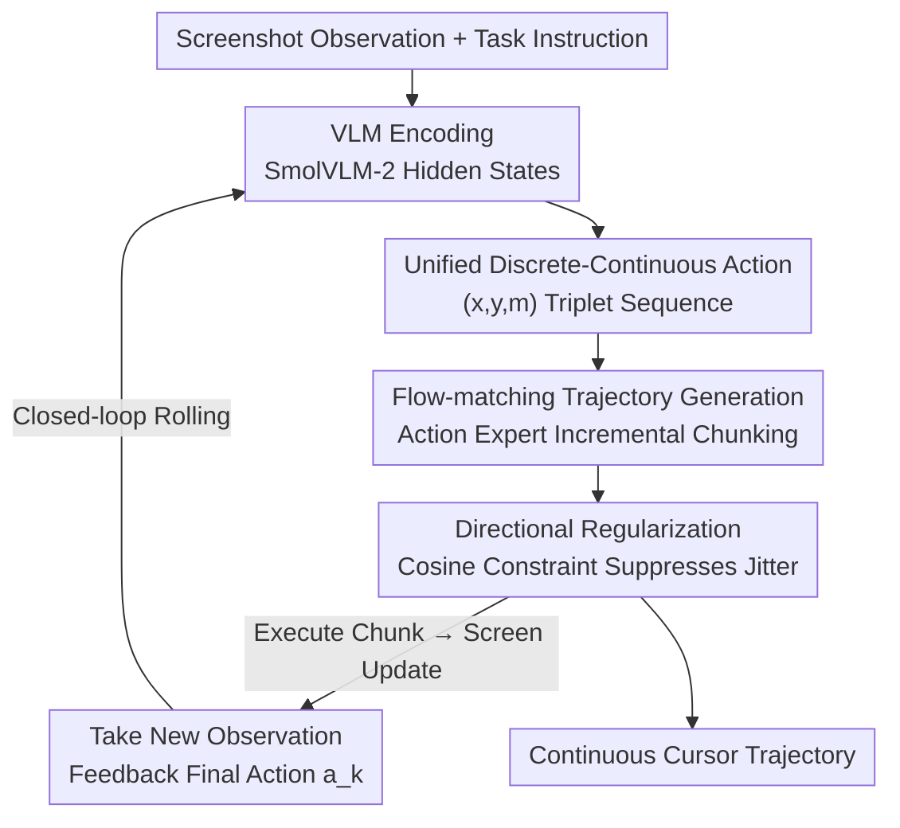

# ShowUI-π: Flow-based Generative Models as GUI Dexterous Hands

**Conference**: CVPR 2026  
**Paper**: [CVF Open Access](https://openaccess.thecvf.com/content/CVPR2026/html/Hu_ShowUI-p_Flow-based_Generative_Models_as_GUI_Dexterous_Hands_CVPR_2026_paper.html)  
**Code**: https://showlab.github.io/showui-pi (Project Page)  
**Area**: GUI Agent / VLA / Flow Matching  
**Keywords**: GUI Automation, Flow Matching, Continuous Trajectory, Drag-and-drop, Digital Dexterous Hand

## TL;DR
ShowUI-π transfers "Flow-matching VLA," typically used for dexterous manipulation in robotics, to the GUI domain. By employing a 450M lightweight action expert, it unifies clicking and dragging into continuous coordinate trajectories. This enables agents to perform high-degree-of-freedom dragging tasks requiring real-time adjustment, such as rotation, drawing, and solving slider captchas. The authors also release the ScreenDrag dataset and online/offline evaluation benchmarks.

## Background & Motivation
**Background**: Currently, mainstream GUI agents (ShowUI, UI-TARS, OpenCUA, Operator, Gemini-CUA, etc.) are predominantly fine-tuned based on VLMs, representing actions as discrete text tokens—such as `click(x, y)` or `drag(start, end)`. This paradigm relies on language decoding to "speak" the coordinates. It is effective for one-step operations like clicking and short dragging and facilitates integration with VLM planners.

**Limitations of Prior Work**: However, many real-world GUI operations cannot be clearly described by a simple "one start, one end" pair. Rotating a title in PowerPoint requires following a circular arc; handwriting involves non-linear strokes; and dial captchas require adjusting the angle while monitoring the visual feedback. These tasks are essentially **high-degree-of-freedom continuous trajectories that require real-time observation and incremental adjustment**. Discrete token representation is inherently incapable of this: it compresses dragging into start-end points, losing all intermediate state changes and failing to adjust mid-execution based on screen feedback.

**Key Challenge**: There is a fundamental conflict between the **discrete token representation** of actions and the **real-time closed-loop trajectories** required for continuous operations. The paper quantifies this gap: on their newly created ScreenDrag benchmark, even the strongest closed-source model, Gemini-2.5-CUA, achieves an online success rate of only 22.18%, Operator reaches only 13.27%, and the larger OpenCUA-32B achieves only 20.79%. This suggests that the issue cannot be resolved simply by increasing model size.

**Key Insight**: The authors noted that the robotics field has long utilized flow matching / diffusion policies (such as π0 and OpenVLA) for continuous, fine-grained real-time control. They posed an analogous question: can a "digital dexterous hand" be created for GUIs? Humans perform precise mouse movements through "persistent perception + incremental adjustment," which perfectly corresponds to the mechanism in flow matching of incrementally predicting a velocity field from visual observations.

**Core Idea**: GUI actions are modeled as continuous coordinate trajectories. A lightweight flow-matching action expert is used to incrementally generate cursor trajectories from visual observations. By reinterpreting clicking as a "drag with negligible displacement," clicking and dragging are unified within a single model and action head.

## Method

### Overall Architecture
ShowUI-π is built upon SmolVLA-450M and consists of two coupled components: a **pre-trained VLM** initialized by SmolVLM-2 and an **action expert** trained with flow matching. The VLM encodes screenshots, language instructions, and the status of the previous action into a unified embedding space. The action expert is a transformer with the same number of layers as the VLM (16 layers). During prediction, it performs interleaved self-attention and cross-attention with the corresponding VLM layers—the action expert "reads" the VLM's hidden states via cross-attention and iteratively refines noisy actions into clean action chunks $[a_1, \dots, a_k]$.

The overall process is a **closed-loop rolling** cycle: given the first observation $o_0$ and instruction $\mathcal{Q}$, the action state is initialized as $a_0 = [-1, -1]$. The action expert generates an $k$-step action chunk to be executed in the environment. After execution, the screen state is updated, and the new observation along with the final action of the previous chunk $a_k$ are fed back into the VLM to generate the next chunk. This cycle enables fine-grained cursor control via "observing while adjusting." Three core designs address: **unifying click and drag representations**, **generating smooth continuous trajectories**, and **ensuring stable trajectory directions**.

### Key Designs

**1. Unified Discrete-Continuous Action Representation: Sharing a Single Model for Clicking and Dragging**

Clicking and dragging differ significantly in spatiotemporal dynamics, making it non-trivial to fit them into one model. However, unification is critical for allowing the model to adapt flexibly across diverse GUI tasks without specialized action heads. The authors observe that "a click is essentially a drag with negligible displacement." Consequently, all interactions are formulated as sequences of $(x, y, m)$ triplets $\mathcal{A} = [a_1, \dots, a_H]$, where $(x, y)$ are cursor coordinates and $m \in \{\text{down}, \text{up}\}$ represents the mouse button state. A click degenerates into a minimal two-step trajectory $[(x_1, y_1, \text{down}), (x_1, y_1, \text{up})]$, while a drag is an incremental trajectory $[(x_1, y_1, \text{down}), \dots, (x_T, y_T, \text{up})]$. This representation removes the rigid predefined formats (language tokens) of older GUI agents and allows joint training on click and drag datasets. Ablations show the unified head (450M) outperforms a separated head (550M) by 3.7% in online drag success rate while saving 100M parameters, proving unification is both elegant and practical.

**2. Flow-matching Incremental Trajectory Generation + Key-step Reweighting: Achieving Real-time Smoothness**

For real-time interaction, efficient and smooth trajectory generation is required; thus, flow matching is used instead of autoregressive decoding. The action expert learns a conditional vector field $v_\theta$, which smoothly pushes the cursor from the segment start ($s=0$) to the segment end ($s=1$) along a continuous parameter $s \in [0, 1]$: $\frac{d\hat{a}(s)}{ds} = v_\theta(\hat{a}(s), s \mid o_t, \mathcal{Q})$. Compared to diffusion policies, flow matching directly regresses the velocity field conditioned on time and uses deterministic ODE sampling, eliminating the need for explicit score estimation or iterative denoising, resulting in more stable training and faster sampling.

However, the authors found that standard flow matching loss (treating all trajectory steps equally) suffers from "superficiality"—for GUI dragging, **the first few steps must anchor at the starting point and the last few steps must precisely reach the target**, while the middle steps allow more tolerance. Thus, a reweighting scheme is introduced to give higher priority to key steps:

$$\mathcal{L}_{\text{weighted}} = \sum_{t=1}^{T} w_t \, \mathcal{L}_{\text{flow matching}}^{(t)}$$

The specific scheme is straightforward: the weights for the start and end steps are set to 10, while the others are set to 1. Ablations indicate this change improved the online success rate from 10.49% to 26.98%, with captcha tasks jumping by 48.5%—demonstrating that "anchoring the start and end" is vital for successful dragging, whereas weights exceeding 15 hurt performance by overemphasizing the endpoints at the expense of intermediate steps.

**3. Directional Regularization: Suppressing Cursor Jitter and Directional Errors**

Standard flow matching only optimizes the "magnitude/displacement" of the trajectory and does not explicitly constrain directional consistency, which can lead to fatal errors in GUIs—such as incorrect cursor orientation or trajectory jitter. Tasks sensitive to direction, like dial captchas, fail immediately if the angle is slightly off. To address this, a directional regularization term is added, penalizing deviations using the cosine similarity between predicted and ground-truth points:

$$\mathcal{L}_{\text{reg}} = \frac{1}{T}\sum_{t=1}^{T} (1 - \cos(\hat{a}_t, u_t))$$

The final objective is $\mathcal{L}_{\text{total}} = \mathcal{L}_{\text{weighted}} + \lambda \mathcal{L}_{\text{reg}}$, with $\lambda = 0.1$ to balance the two terms. Ablation shows that adding directional regularization increased the online success rate from 12.63% to 26.98%, with the most significant gains in direction-sensitive domains like captchas and PPT rotation.

### Loss & Training
The training target is the aforementioned $\mathcal{L}_{\text{total}}$ (reweighted flow matching + directional regularization), with $\lambda = 0.1$. The action expert performs $k$ refinements per trajectory, gradually restoring noisy actions into clean predictions. The training data consists of 20K drag trajectories from ScreenDrag (manually collected + automatically synthesized), covering 5 domains and 11 task categories, each with UI state logs and dense coordinates. Key hyperparameters for inference are chunk size (number of steps predicted per chunk) and execution steps (number of steps executed before re-observation); experiments found that a chunk size of 20 and an execution step of 1 provide the best balance between accuracy and reliability.

## Key Experimental Results

The ScreenDrag benchmark contains 5 domains (OS Desktop/File Management, PowerPoint, Adobe Premiere Pro, Handwriting, and Captchas), with 101 real dragging tasks per domain, totaling 505 tasks. Evaluation follows two protocols: **Offline Open-loop** (trajectory error + endpoint accuracy) and **Online Closed-loop** (task success rate). The online environment is constructed via a data-driven approach: the model's predicted action is matched to the nearest recorded state (within a 20px tolerance) to retrieve the next observation, balancing diversity and reproducibility.

### Main Results

| Evaluation | Metric | ShowUI-π-450M | Gemini-2.5-CUA | OpenCUA-7B | Operator |
|------|------|---------------|----------------|------------|----------|
| Online Closed-loop | Overall Success Rate (%)↑ | **26.98** | 22.18 | 21.98 | 13.27 |
| Offline Open-loop | Endpoint Accuracy (%)↑ | **78.55** | 20.00 | 21.58 | 11.09 |
| Offline Open-loop | Trajectory Error (px)↓ | **159.05** | 189.15 | 425.55 | 422.17 |

With only 450M parameters, ShowUI-π outperforms the strongest closed-source model, Gemini-2.5-CUA, by 4.8 percentage points and the strongest open-source model, OpenCUA-7B, by 6.19 points in online success rate. Notably, while baselines are often strong in OS file dragging (similar to discrete clicking, with OpenCUA-7B reaching 99% offline endpoint accuracy), they collapse (mostly to 0%) in true continuous trajectory tasks like PPT rotation, handwriting, and captchas. ShowUI-π, conversely, achieves endpoint accuracies of 85%/93%/96% in these domains. Operator fails all captchas due to safety policies, and Gemini-CUA often erroneously triggers browser tools during handwriting, exposing the limitations of generic agents.

### Ablation Study

| Configuration | Online Success Rate (%)↑ | Endpoint Accuracy (%)↑ | Trajectory Error (px)↓ | Description |
|------|---------------|-------------|--------------|------|
| Flow Matching (Full) | **26.98** | **78.55** | **159.05** | Ours |
| Replace with Diffusion Policy | — | 47.33 | 267.92 | Endpoint acc. lower by 31.22% |
| Replace with Language Modeling (SmolVLM) | — | 0.40 | 412.10 | Endpoint acc. lower by 78.15% |
| w/o Reweighting (Weight=1) | 10.49 | — | — | Captcha rate drops 48.5% |
| w/o Directional Regularization (λ=0) | 12.63 | — | — | Direction-sensitive domains drop most |
| Separate Heads (550M) | 23.25 | 79.22 | — | 100M more parameters and worse |

### Key Findings
- **Modeling paradigm is the decisive factor**: Using the same SmolVLM backbone and 20K data, language modeling yielded near-zero endpoint accuracy (0.40%), while diffusion policies reached 47.33% and flow matching achieved 78.55%. This proves that discrete token representation is a ceiling for continuous operations, and the deterministic velocity field of flow matching is best for fitting free-form dragging.
- **Start-stop reweighting provides the largest single-point gain**: It raised the online success rate from 10.49% to 26.98% (a 2.5x increase), with a 48.5% boost in captchas, confirming the intuition that drag-and-drop success depends heavily on the endpoints.
- **Frequent re-observation > predicting long sequences at once**: A smaller execution step (re-observing after every step) yields higher accuracy; however, a larger chunk size (predicting 20 steps at once) can mitigate degradation when execution steps are large.
- **Large model ≠ Strong manipulation**: OpenCUA-32B actually performed worse than the 7B version, suggesting that for fine-grained control like dragging/clicking, specialized lightweight models are a more promising direction.

## Highlights & Insights
- **The observation "clicking is a drag with zero displacement" is refined**: In one sentence, it collapses discrete and continuous actions into a single $(x, y, m)$ sequence, eliminating specialized action heads and allowing joint training—an "obvious in hindsight" unification.
- **Porting flow-matching VLA from robotics to GUI is a brilliant cross-domain analogy**: Physical dexterous hands and digital ones share the essence of "persistent perception + incremental adjustment." The authors successfully adapted existing tools like diffusion policy / flow matching while adding GUI-specific modifications like endpoint reweighting and directional regularization.
- **The data-driven online environment of ScreenDrag is highly reusable**: Instead of actually running the OS/software (which is expensive and hard to reproduce), they pre-record videos and dense trajectories and match predicted actions to the nearest recorded state to retrieve the next frame. This approach of "approximating closed-loop with recording and playback" can be migrated to other agent evaluations where real environments are difficult to set up.
- **The start-stop reweighting trick is generalizable**: Any sequence generation task where the endpoints are more critical than the middle (path planning, handwriting generation, robotic arm grasping) could benefit from weighting the loss based on position.

## Limitations & Future Work
- **Overall success rate remains low**: While 26.98% is SOTA, it is far from practical, indicating that continuous GUI operation remains an open challenge.
- **OS file dragging is a relative weakness**: ShowUI-π achieves only 13.11% online success in the OS domain, which is closest to discrete clicking, far below baselines (OpenCUA 97%+). This suggests unified continuous modeling may carry a cost for "tasks that should be simple discrete ones"—treating clicks as degenerate drags is not always optimal.
- **The online environment is an approximation, not true closed-loop**: Using nearest-neighbor matching (20px tolerance) on recorded states to obtain observations is not a real software rollback; it carries risks of incomplete state coverage and matching bias. Additionally, limiting baselines to 3 interaction steps to control costs might underestimate their potential.
- **Limited domain and resolution**: Training data was primarily collected automatically using the UI Automation SDK on Windows. Generalization across OSs, resolutions, and unfamiliar software has not been fully verified. The quality of synthesized trajectories also depends on rule-based validators, which may introduce systematic biases.
- **Future directions**: Reserving a lighter "fast path" for discrete click tasks (rather than treating everything as a flow-matching drag), introducing real rollback-capable online environments, and upgrading directional regularization to finer constraints on curvature and velocity.

## Related Work & Insights
- **vs. Discrete token GUI agents (ShowUI / UI-TARS / OpenCUA / Operator / Gemini-CUA)**: These decode actions into text tokens for easy integration with VLM planners but are restricted to clicks and short drags, losing intermediate states. ShowUI-π directly models trajectories in continuous space for long, smooth, and temporally coherent operations, though it is less advantageous for purely discrete tasks.
- **vs. Robotics VLA (OpenVLA / RT-2 / π0 / Diffusion Policy)**: Physical VLAs use flow matching/diffusion for continuous control of robotic arms. ShowUI-π is the first work to bring this to digital GUIs, adding GUI-specific endpoint reweighting and directional regularization. Compared to RT-2/OpenVLA, which discretize action tokens (e.g., 256 bins per dimension), flow matching avoids temporal quantization errors.
- **vs. Diffusion Policy**: Both are continuous generation methods, but diffusion policies rely on score-based denoising and iterative sampling. Flow matching regresses a deterministic velocity field and uses ODE sampling, which is faster and more stable; in experiments, it achieved 31.22% higher endpoint accuracy, making it better suited for real-time GUI interaction.

## Rating
- Novelty: ⭐⭐⭐⭐⭐ First to introduce flow-matching VLA to continuous GUI operations; the unified "click = zero-displacement drag" representation and cross-domain transfer are solid.
- Experimental Thoroughness: ⭐⭐⭐⭐ Self-built ScreenDrag dual-protocol benchmark + extensive ablations (modeling paradigm/reweighting/regularization/chunk/unified head) are comprehensive, though the approximated online environment and 3-step baseline limit are concerns.
- Writing Quality: ⭐⭐⭐⭐ Clear logic from motivation to method to experiments; well-supported by comparative tables and figures.
- Value: ⭐⭐⭐⭐ Outperforming closed-source CUA with a 450M small model defines the "GUI dexterous hand" problem and provides the necessary data/benchmark, laying the foundation for future continuous GUI control research.

<!-- RELATED:START -->

## Related Papers

- [\[CVPR 2026\] Towards GUI Agents: Vision-Language Diffusion Models for GUI Grounding](towards_gui_agents_vision-language_diffusion_models_for_gui_grounding.md)
- [\[CVPR 2026\] OS-Oracle: A Comprehensive Framework for Cross-Platform GUI Critic Models](os-oracle_a_comprehensive_framework_for_cross-platform_gui_critic_models.md)
- [\[CVPR 2026\] GUI-CEval: A Hierarchical and Comprehensive Chinese Benchmark for Mobile GUI Agents](gui-ceval_a_hierarchical_and_comprehensive_chinese_benchmark_for_mobile_gui_agen.md)
- [\[CVPR 2026\] ModularAgent: A Task-Aware Modular Framework for Joint Optimization of Multimodal Large Language Models and World Models](modularagent_a_task-aware_modular_framework_for_joint_optimization_of_multimodal.md)
- [\[CVPR 2026\] MMBench-GUI: A Unified Hierarchical Evaluation Framework for Multi-Platform GUI Agents](mmbench-gui_a_unified_hierarchical_evaluation_framework_for_multi-platform_gui_a.md)

<!-- RELATED:END -->
