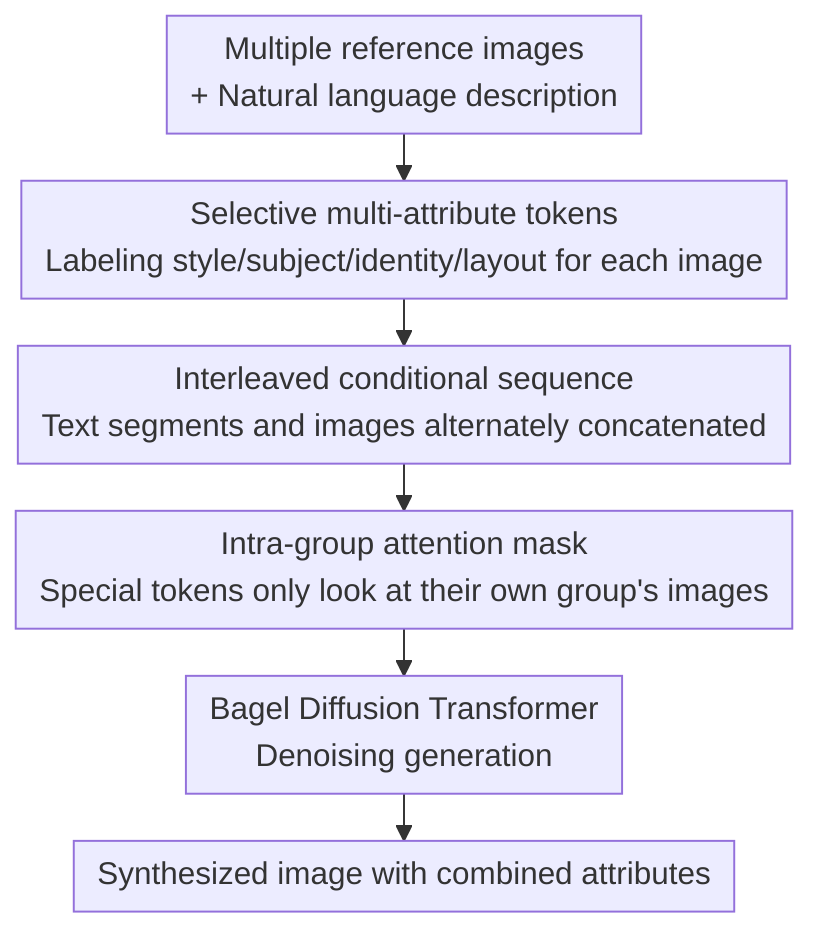

# SIGMA: Selective-Interleaved Generation with Multi-Attribute Tokens

**Conference**: CVPR 2026  
**Paper**: [CVF Open Access](https://openaccess.thecvf.com/content/CVPR2026/html/Zhang_SIGMA_Selective-Interleaved_Generation_with_Multi-Attribute_Tokens_CVPR_2026_paper.html)  
**Code**: https://github.com/auihund/SIGMA  
**Area**: Image Generation / Diffusion Models / Controllable Generation  
**Keywords**: Multi-conditional generation, unified diffusion Transformer, attribute tokens, interleaved conditions, attention mask

## TL;DR
SIGMA performs post-training on the unified diffusion Transformer (Bagel) by assigning dedicated attribute tokens like "style / subject / identity / layout" to each reference image. It inputs multiple reference images and text as a "text-image interleaved" sequence into the model, and utilizes an "intra-group attention mask" to prevent attribute leakage between different reference images. This represents the first study to enable a unified generative model to support multi-conditional, multi-reference combinatorial controllable generation.

## Background & Motivation
**Background**: Unified generative models, exemplified by Bagel, have proven that "paired image-editing data" can align multiple visual tasks such as generation, editing, and inpainting into the same diffusion Transformer, yielding strong generalization capabilities. This line of work (OmniGen, PixArt-Σ, UniDiffuser, etc.) is turning the concept of "a single model for all controllable generation tasks" into reality.

**Limitations of Prior Work**: However, almost all of these unified models can only accept a **single conditional input**—either one reference image or one text prompt. Real-world needs often require blending heterogeneous conditions, such as "this person's identity + that dog's appearance + Van Gogh's art style," into a single image. Single-condition models are fundamentally incapable of expressing such combinations.

**Key Challenge**: This highlights a classic problem in representation learning—**binding**: when elements from multiple sources are integrated into a unified representation, how does the model know to "extract the identity from Image 1, the style from Image 2, and the layout from Image 3"? Prior approaches either relied on task-specific architectures (such as separating content and style encoders) to perform rigid binding, or overfitted to a single editing modality. Neither approach generalizes well to autoregressive Transformers like Bagel. Once multiple reference images are entered simultaneously, the attention becomes chaotic, and the model struggles to distinguish which attribute should be bound to which image.

**Goal**: Without retraining the backbone, the goal is to enable the unified model to (1) parse hybrid inputs of "multiple reference images + text"; (2) selectively extract specified attributes from each image; and (3) avoid attribute leakage between reference images.

**Key Insight**: The authors observe that the key to binding lies not in modifying the architecture, but in **explicitly labeling what attribute each reference image should contribute**. If the same portrait of Van Gogh is placed under a `<Style>` token, the model extracts the brushstroke features; if placed under an `<Identity>` token, the model extracts the facial features. The semantics of the attribute are determined by the token, rather than the image itself.

**Core Idea**: By using a triad of "selective multi-attribute tokens + text-image interleaved sequences + intra-group attention masks," multi-conditional binding is explicitly encoded into the input sequence, enabling Bagel to acquire multi-reference combinatorial generation capabilities after post-training.

## Method

### Overall Architecture
SIGMA is a **post-training framework** that leaves Bagel's diffusion denoising target unchanged and only modifies the "organization of conditional inputs." The original Bagel formulations use $z_{t-1} = M_\theta(z_t, c, x_{src}, t)$, representing a single image $x_{src}$ + a single prompt $c$ for denoising. SIGMA replaces these conditions with an **interleaved sequence** $s$—which mixes text segments, multiple reference images, and the attribute tokens bound to each image. The training goal remains predicting the clean latent: $L_{SIGMA} = \mathbb{E}_{(s,x_{tgt}),t}\big[\lVert z_{t-1} - M_\theta(z_t, s, t)\rVert_2^2\big]$.

The entire data flow is structured as follows: the user provides several reference images and a natural language description → the entity phrases in the text are aligned with corresponding image placeholders (Text-Image Interleave) → specialized attribute tokens are injected before each entity to hardcode "what attribute this image should contribute" (Special Token Adding) → these are concatenated into an interleaved sequence and fed into the diffusion Transformer, which uses an intra-group attention mask to perform denoising → the final composite image is output.

### Key Designs

**1. Selective multi-attribute tokens: using tokens to determine which attribute an image contributes, instead of relying on the image itself**

The pain point is that unified models treat all reference images equally, making it impossible to convey "I only want the style of this image, and only the identity of that image." SIGMA assigns each reference image $x_i$ a token $\tau_i$ selected from a fixed attribute vocabulary $T = \{\text{Style}, \text{Subject}, \text{Identity}, \text{Layout}, \dots\}$, using it to **modulate feature extraction**—activating specific latent subspaces in the diffusion Transformer. Specifically, the image encoding $v_i = E_\phi(x_i)$ and the projected attribute token are added to obtain token-conditioned embeddings:

$$t_i = v_i + W_\tau(\tau_i)$$

where $W_\tau$ is a learnable attribute projection matrix. Consequently, for the same portrait of Van Gogh, placing it under `<Style>` extracts brushstrokes, while placing it under `<Identity>` preserves the face—rendering the attributes **selective**. In practice, 14 fine-grained tokens are used in the dataset (identity / subject / clothing / style / layout / pose / lighting, etc.), and "attribute-dense" samples are purposely constructed (e.g., the same image mapped simultaneously to `<subject>`+`<clothing>`+`<background>`) to force the model to learn **selective extraction** rather than automated fusion.

**2. Text-image interleaved conditions: aligning multiple reference images and text sequentially as specified by the user**

With attribute tokens in place, how to arrange multiple images in a sequence and align them with text still needs to be resolved. SIGMA **alternately arranges** text embeddings $T_k$ and image embeddings with attribute tokens $I_k$, concatenating them into the final input sequence:

$$H = [T_1; I_1; T_2; I_2; \dots; T_n; I_n]$$

where $[\cdot]$ denotes sequential concatenation based on the user's input order. For example, "a photo of a man" + portrait image + "with a dog" + dog image + "in the style of Van Gogh" + style image. This interleaved structure allows the model to **jointly parse text and visual conditions** during denoising. Each attribute token is positioned immediately adjacent to its described entity phrase and reference image, closely binding the text-image and attribute-image correspondences locally. During inference, users can freely combine and order multiple conditions, and the model adaptively decodes them based on token semantics. Notably, the authors emphasize that this alignment signal **does not require an explicit reward model**—it emerges naturally from the denoising objective and the interleaved structure.

**3. Intra-group attention mask: preventing attribute leakage between reference images**

The interleaved conditions bring a new issue—**attribute leakage**: the special token of a particular image may attend to patches of other reference images, leading to semantic contamination (e.g., wanting Van Gogh's style but copying Van Gogh's face instead). SIGMA adds a binary intra-group mask on top of Bagel's original causal attention. Each token $h_\ell$ has a type $\text{type} \in \{\text{special}, \text{text}, \text{image}, \text{plain}\}$, with the special and image types also carrying a group ID $\text{grp}(h_\ell)$ (one group per reference image). The final mask is composed of three parts:

$$B = (C \wedge M) \vee S, \quad A = (1 - B)\cdot(-\infty)$$

where $A$ is added to the attention logits prior to softmax. Each part serves a distinct purpose: $C$ is the causal mask inherited from Bagel ($C[q,k]=1 \iff k \le q$, maintaining autoregressiveness); $S$ is the intra-image mask that allows **fully-connected bidirectional attention** among patches of the same image (restoring local structures, geometry, and spatial relationships); $M$ is the group constraint—when the query is a special token, the key is an image patch, and they belong to different groups, it is set to 0, **inhibiting special tokens from attending to other reference images across groups**.

$$M[q,k] = \begin{cases} 0, & \text{type}(h_q)=\text{special},\ \text{type}(h_k)=\text{image},\ \text{grp}(h_q)\neq\text{grp}(h_k) \\ 1, & \text{otherwise} \end{cases}$$

This masking scheme imposes only a "minimal yet effective" structure: special tokens only connect to image patches within their own group, intra-image communication remains unrestricted, and the rest of the sequence preserves its causal order. This prevents cross-condition drift while retaining global dependencies and relational reasoning capabilities through text tokens and causal connections. Ablations indicate that the mask primarily improves structural and perceptual consistency (CLIP-I, DreamSim).

**4. 700K Interleaved Multi-Conditional Dataset: unifying heterogeneous corpora into a learnable "attribute-image binding" supervision**

Beyond mechanism, data is needed to teach the model "which attribute to extract from which image." The authors construct 700K interleaved sequences covering six major task families: combinatorial generation (100K), selective content extraction (226K), stylization (153K), relationship transfer (41.6K), image editing (70K), and conditional layout generation (110K). A portion of the data is synthesized using GPT-4o and Nano-Banana (combining people/objects/scenes); the selective extraction subset is reverse-engineered from Echo-4o (treating combined outputs as inputs and using GPT-4o to locate extraction targets); the layout subset uses geometric cues from canny/depth + MiDaS. Existing corpora such as Nano-150K, X2Edit, and ShareGPT-4o are converted into the interleaved format via a **token injection pipeline**—inserting special tokens before each entity phrase, followed immediately by the reference image, converting plain captions into structured multimodal sequences where each visual factor's source is explicitly designated.

### Loss & Training
Based on the Bagel unified diffusion backbone, **only the generation branch is trained, and the VAE is frozen**. 95% of samples from each task family are used as the training set. Training is conducted for 50K steps on 4×H200, employing token packing (up to 30K tokens per packed batch), a cosine learning rate scheduler (peak $2\times10^{-5}$, minimum $10^{-7}$), AdamW ($\beta_1=0.9,\beta_2=0.95$), gradient clipping of 1.0, and FSDP sharding. The loss function is identical to Bagel's denoising MSE (Eq. 2), without introducing any extra reward models.

## Key Experimental Results

### Main Results
Combinatorial generation (two benchmarks, gain relative to Bagel in parentheses):

| Benchmark | Method | CLIP↑ | CLIP-I↑ | DINO↑ | DreamSim↑ |
|-----------|------|-------|---------|-------|-----------|
| XVerseBench | GPT-4o (Closed-source) | 32.94 | 77.74 | 66.42 | 68.11 |
| XVerseBench | XVerse | 33.94 | 67.53 | 45.24 | 66.25 |
| XVerseBench | Bagel | 24.32 | 66.32 | 56.13 | 53.31 |
| XVerseBench | **SIGMA** | 31.96 (+7.64) | 75.57 (+9.25) | 59.52 (+3.39) | 67.87 (+14.56) |
| Our Bench | GPT-4o (Closed-source) | 31.07 | 77.93 | 63.58 | 67.49 |
| Our Bench | XVerse | 32.33 | 44.15 | 42.76 | 54.63 |
| Our Bench | Bagel | 17.91 | 52.52 | 41.62 | 43.27 |
| Our Bench | **SIGMA** | 30.29 (+12.38) | 78.94 (+26.42) | 64.08 (+22.46) | 62.45 (+19.18) |

The improvements relative to Bagel are substantial (CLIP-I +26.42, DINO +22.46 on their own benchmark); CLIP is slightly lower than XVerse, but CLIP-I / DINO / DreamSim are comprehensively higher, indicating better structural and perceptual alignment, and overall approaching closed-source models such as GPT-4o / Nano-Banana.

Selective generation (CLIP-ES↓ measures "whether irrelevant objects are wrongly selected", lower is better):

| Method | CLIP↑ | CLIP-I↑ | CLIP-ES↓ | AES↑ |
|------|-------|---------|----------|------|
| GPT-4o (Closed-source) | 25.84 | 80.14 | 60.22 | 5.882 |
| Bagel | 23.49 | 70.61 | 67.90 | 5.209 |
| **SIGMA** | 25.90 (+2.41) | 80.26 (+9.65) | 58.02 (–9.88) | 5.849 (+0.64) |

SIGMA achieves the **lowest CLIP-ES among all baselines**, indicating that it is the least prone to selecting incorrect objects and exhibits the strongest attribute exclusivity. In layout generation, the F1 score increases from 0.10 (Bagel) to 0.44 (layout only), reflecting a significant improvement in structural consistency.

### Ablation Study
Deconstructing the multi-attribute token, intra-group mask, and full-parameter fine-tuning vs. LoRA (checkmark in the "All" column indicates full-parameter fine-tuning; no checkmark indicates LoRA):

| Special token | Mask | All | CLIP↑ | CLIP-I↑ | DreamSim↑ | AES↑ |
|:---:|:---:|:---:|------|---------|-----------|------|
| ✓ | | | 25.85 | 62.67 | 44.74 | 5.576 |
| ✓ | ✓ | | 29.25 | 74.26 | 57.11 | 5.561 |
| ✓ | ✓ | ✓ | 30.29 | 78.94 | 62.45 | 5.731 |

(Note: The original table also contains a row for '✓ token + ✓ All (no mask)' yielding CLIP-I 72.64 / DreamSim 58.65.)

### Key Findings
- **Attribute tokens are the foundation**: Removing them causes a sharp drop in CLIP / CLIP-I (with CLIP-I dropping to only 62.67), as the model completely fails to understand "which attribute should be extracted and applied where," leading to visual identity mixing of object roles in qualitative results.
- **Intra-group mask governs consistency**: Adding it further boosts CLIP-I and DreamSim, improving structural and perceptual consistency. Without the mask, stylization "collapses into directly copying the style reference image," showing that the mask is key to binding the style token to the content image.
- **Full-parameter > LoRA**: LoRA is usable but lags behind full-parameter fine-tuning in both alignment and aesthetics. The limited parameter update weakens representation capacity (e.g., LoRA generation misses fine details like cables).

## Highlights & Insights
- **Transforming the binding problem into "input sequence engineering"**: Without changing the backbone or adding a reward model, merely relying on token injection + interleaved ordering + attention masking empowers a single-conditional unified model with multi-conditional capabilities. This approach is highly engineering-friendly and model-agnostic, and could theoretically be transferred to any diffusion Transformer.
- **The "attribute is determined by the token, not the image" concept is highly clever**: Extracting different attributes from the same image based on different tokens decouples the "reference image" from its "intended use," which is a key insight for multi-reference combinatorial generation.
- **Intra-group masking is a low-cost, high-yield trick**: By only restricting the cross-group connections of special ↔ image, it retains intra-image fully-connected and textual causal connections. This minimal intervention targets the precise source of attribute leakage—making this "constrain only what needs to be constrained" mask design highly reusable for any multi-source condition fusion scenario.
- **The CLIP-ES "exclusivity" metric is highly worth adopting**: Under multi-reference settings, checking similarity alone is insufficient; one must also measure "whether unintended elements have been erroneously selected."

## Limitations & Future Work
- **Heavy reliance on the Bagel backbone and synthetic data**: The 700K dataset is largely synthesized using GPT-4o / Nano-Banana, and the selective subset relies on GPT-4o back-tagging; thus, the data quality and biases directly determine the upper bound. Moreover, the attribute vocabulary (14 tokens) is fixed, and out-of-vocabulary attributes require redesigning.
- **CLIP metrics still lag behind XVerse / closed-source models**: The authors admit that CLIP is slightly lower; text-to-image semantic alignment is not its strongest suit, and its edge lies primarily in structural and perceptual consistency.
- **Benchmarks are mostly self-constructed held-out sets**: "Our Bench" shares the same distribution as the training data, so cross-domain generalization (i.e., to unusual real-user combinations) has not been fully verified. Evaluation heavily relies on CLIP-based automatic metrics, with a lack of human evaluation.
- **Potential improvements**: Making the attribute vocabulary learnable or open-vocabulary; extending the intra-group mask to a soft mask (allowing controlled cross-condition interactions, which may be more natural for relationship transfer); and exploring training with real-world multi-reference data to eliminate reliance on synthetic data.

## Related Work & Insights
- **vs. Bagel**: Bagel is a single-conditional unified model (one image, one prompt). SIGMA performs post-training on top of it, extending it to support interleaved multi-conditional, multi-reference inputs. It significantly boosts nearly all metrics compared to Bagel, serving as a direct "capability patch."
- **vs. XVerse / SSR**: Compared to these unified diffusion Transformers, SIGMA achieves higher CLIP-I / DINO / DreamSim and better structural/perceptual alignment, qualitatively showing fewer consistency issues such as "wrongly selected/applied attributes" (though XVerse has a slightly higher CLIP score).
- **vs. IP-Adapter / ControlNet / T2I-Adapter**: These are task-specific condition injection modules (pose/depth/sketch) relying on independent networks or dedicated fine-tuning, which suffer from poor cross-condition generalization. SIGMA incorporates heterogeneous conditions into a single backbone via a unified sequence without requiring separate modules for each condition.
- **vs. Closed-source GPT-4o / Nano-Banana**: As an open-source solution, SIGMA approaches or even partially surpasses (e.g., in Our Bench's CLIP-I) these models, proving that explicit binding mechanisms can compensate for some scale discrepancies.

## Rating
- Novelty: ⭐⭐⭐⭐ Combines "attribute tokens + interleaved conditions + intra-group masking" to solve multi-reference binding. The logic is clear and practical, though individual components are not radically disruptive on their own.
- Experimental Thoroughness: ⭐⭐⭐⭐ Covers three main tasks, multiple baselines, and complete ablation studies. However, the benchmarks are mostly self-constructed, and evaluation is predominantly automatic with a lack of human evaluation and cross-domain testing.
- Writing Quality: ⭐⭐⭐⭐ The motivation (binding problem) is thoroughly explained, and the formulas and diagrams are clear; some details (such as how the attribute vocabulary selects tokens) are left to the supplementary materials.
- Value: ⭐⭐⭐⭐ A model-agnostic multi-conditional post-training framework, a 700K dataset, and open-source code provide high practical value to the unified controllable generation community.

<!-- RELATED:START -->

## Related Papers

- [\[CVPR 2026\] TokenLight: Precise Lighting Control in Images using Attribute Tokens](tokenlight_precise_lighting_control_in_images_using_attribute_tokens.md)
- [\[CVPR 2026\] Omni-Attribute: Open-vocabulary Attribute Encoder for Visual Concept Personalization](omni-attribute_open-vocabulary_attribute_encoder_for_visual_concept_personalizat.md)
- [\[ICLR 2026\] SIGMA-GEN: Structure and Identity Guided Multi-Subject Assembly for Image Generation](../../ICLR2026/image_generation/sigma-gen_structure_and_identity_guided_multi-subject_assembly_for_image_generat.md)
- [\[CVPR 2026\] Camera Control for Text-to-Image Generation via Learning Viewpoint Tokens](camera_control_for_text-to-image_generation_via_learning_viewpoint_tokens.md)
- [\[CVPR 2026\] SpotEdit: Selective Region Editing in Diffusion Transformers](spotedit_selective_region_editing_in_diffusion_transformers.md)

<!-- RELATED:END -->
