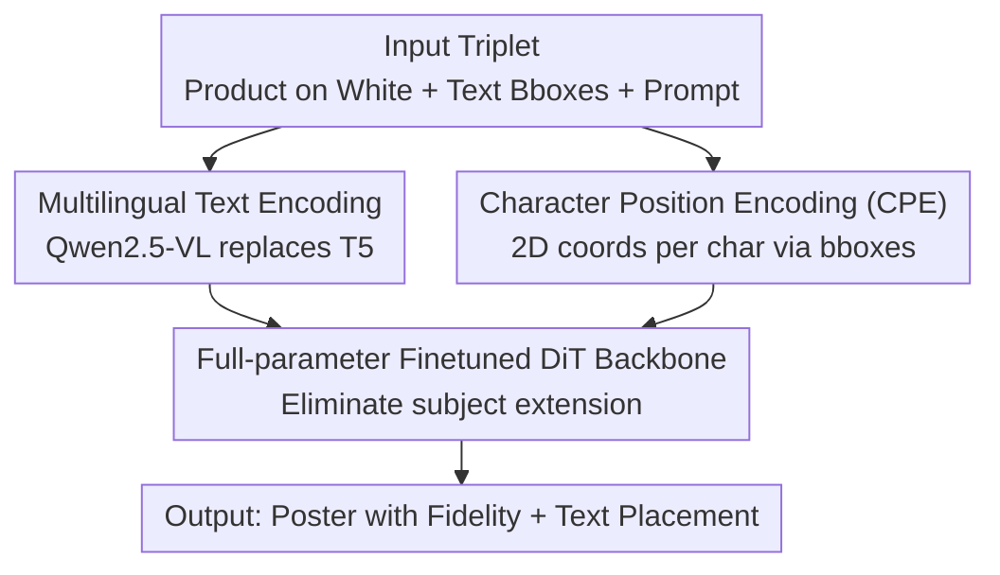

# SimplePoster: A Simple Baseline for Product Poster Generation

**Conference**: CVPR 2026  
**arXiv**: [2605.08784](https://arxiv.org/abs/2605.08784)  
**Code**: https://github.com/Alibaba-YuFeng/SIMPLEPOSTER (Available)  
**Area**: Diffusion Models / Image Generation  
**Keywords**: Product Poster Generation, Inpainting, Full-parameter Fine-tuning, Subject Fidelity, Character-level Position Encoding

## TL;DR
Aiming at the two primary requirements of e-commerce product poster generation—no distortion of the subject and precise placement of multi-line text—SimplePoster removes the stacked ControlNet / OCR encoders used in existing methods. By relying solely on "full-parameter fine-tuning of FLUX-Fill" to eliminate subject extension and "zero-cost Character Position Encoding" to achieve layout-controllable text, the subject preservation rate is increased from PosterMaker's 85.3% to 98.7%, with text accuracy also leading comprehensively.

## Background & Motivation
**Background**: The mainstream paradigm for product poster generation is inpainting: extracting the product from the original image, placing it on a white background, fixing the product area, and letting the model synthesize only the background and promotional text. Compared to general text-to-image editing models (FLUX-Kontext, SeedEdit, Gemini 2.5 Flash, GPT-4o, etc.), inpainting theoretically preserves the product without modification. Current SOTA PosterMaker adds multiple auxiliary modules to this paradigm: ControlNet for structural constraints, injected character-level OCR features for text rendering, and a trained "subject extension detector" as a reward model for reinforcement learning.

**Limitations of Prior Work**: Neither path is clean. General editing models follow the text-to-image framework and lack an explicit subject preservation mechanism, frequently resulting in texture corruption, structural deformation, color drift, and text collapse—even slight distortion of a product in e-commerce can mislead consumers. Dedicated inpainting methods, while locking the product area, still suffer from "subject extension" artifacts: the model draws redundant structures outward from the fixed product edges (e.g., adding a base to a teapot out of nowhere or extending a ceiling lamp into a pendant lamp). Solutions like PosterMaker stack ControlNet and reward models to suppress extension, resulting in complex architectures, high training costs, slow inference, and poor reproducibility.

**Key Challenge**: Prior work assumes that "external modules are necessary to control structure/text." However, the authors question whether the root cause of subject extension is a lack of controllers or a **domain gap**—standard inpainting models are trained on "random small crop completion" data, while poster generation requires completing **large background areas** around the product. These two task distributions differ significantly. Layering ControlNet on top of this misaligned base model is akin to patching a deviated model, treating the symptoms rather than the cause.

**Goal**: Use the simplest architecture to simultaneously achieve (1) strict subject fidelity and (2) precise spatial positioning of multi-line text, without introducing any external controllers or multi-stage training.

**Key Insight**: Instead of adding modules, modify the internal representation of the base model to bridge the domain gap; instead of using glyph images / OCR features / layout encoders to control text position, directly provide text tokens with meaningful spatial coordinates, allowing the DiT to learn to "draw this character here."

**Core Idea**: Use "full-parameter fine-tuning + Character Position Encoding," two modifications with zero additional modules, to replace the complex pipeline of "ControlNet + OCR encoder + reward model."

## Method

### Overall Architecture
SimplePoster is built upon the existing inpainting model FLUX-Fill (consisting of VAE + DiT + T5 text encoder). The task setup follows PosterMaker: inputting a triplet $(I, \mathcal{P}, \mathcal{B})$—a product image $I$ on a white background, a set of bounding boxes for each line of text $\mathcal{B}=\{b_i=(x_l,y_t,x_r,y_b)\}$, and a prompt $\mathcal{P}$ describing the background scene and text content—to output a realistic product poster that preserves the original appearance of the product and places each line of text within the designated boxes, i.e., learning the generative function $G(I,\mathcal{P},\mathcal{B}) \to I^*$.

The essence of the method is "subtraction": compared to the PosterMaker pipeline with ControlNet and OCR encoders, SimplePoster makes only three modifications to FLUX-Fill, **without adding any new modules or increasing inference overhead**: (1) Replace the English-only T5 with the bilingual Qwen2.5-VL as the text encoder; (2) End-to-end full-parameter fine-tuning of the entire DiT backbone (rather than freezing the base model and training external controllers) to eliminate subject extension; (3) Change the position encoding of text tokens from "fixed to (0,0)" to "calculating the actual coordinates of each character based on target bounding boxes" to achieve layout-controllable text rendering. Training is single-stage end-to-end using standard flow matching objectives without auxiliary losses.

### Key Designs

**1. Eliminating Subject Extension via Full-parameter Fine-tuning: Root Cause is Domain Gap, Not Missing Controllers**

The authors first disentangle the question of "whether to use ControlNet" through experiments. Using FLUX-Fill as a baseline, the subject extension rate on the benchmark is as high as 41%. Following PosterMaker's approach of integrating ControlNet and freezing the DiT to train only the controller reduces the extension rate to 23.6%, a limited improvement. The authors conclude that standard inpainting masks random small patches, while poster generation synthesizes large backgrounds near the product; the fundamental domain gap between these distributions cannot be bridged by controllers alone and requires direct adjustment of the base model. To verify this, they switched to LoRA fine-tuning—with fewer parameters, the extension rate dropped to 2.8%, significantly better than the frozen base + ControlNet solution. Further full-parameter fine-tuning suppressed the extension rate to 0.6%, nearly eliminating it. The conclusion: rather than adding complexity to a misaligned model, refine its internal representation to solve extension at the root. This insight directly challenges the implicit assumption that "dedicated poster methods must rely on ControlNet for structural constraints."

**2. Character Position Encoding (CPE): Zero-cost Mapping of Text Tokens to Spatial Coordinates**

In the original FLUX-Fill, RoPE maps the spatial coordinates $(x,y)$ of each image token to position-aware attention embeddings, but **all text tokens (including characters to be rendered as images) are assigned a fixed coordinate (0,0)**, independent of their target layout. This prevents the model from anchoring text generation to specific spatial regions. The CPE modification is minimal: assign the $i$-th character token meaningful 2D coordinates. Specifically, for a line containing $n$ characters with a bounding box $(x_l,y_t,x_r,y_b)$, the box is horizontally divided into $n$ sub-regions. Following the left-to-right writing order, the center of the $i$-th sub-region is used as the coordinate for the $i$-th character:

$$\left(x_c^{i}, y_c^{i}\right) = \left(x_l + \frac{i-0.5}{n}(x_r - x_l),\; \frac{y_t + y_b}{2}\right)$$

These coordinates enter the DiT's attention calculations via RoPE as usual, guiding each character to be synthesized at the user-specified location. It requires no architectural changes and zero additional inference overhead, yet achieves geometry-aware text generation without glyph images, OCR features, or layout encoders. Furthermore, this explicit coordinate supervision allows the model to learn new character sets (e.g., Chinese) within a **single training stage**—whereas previous methods required specialized multi-stage training for cross-lingual capabilities.

**3. Single-stage End-to-End Training: Compressing Multi-stage Pipelines into One Step**

Previous works often split "text generation" and "background synthesis" into multiple training stages. SimplePoster directly performs single-stage end-to-end fine-tuning on the pre-trained DiT using standard flow matching objectives without auxiliary losses. The authors found that the model converges quickly and stably without multiple stages, attributing this to CPE: precise per-character coordinates eliminate the spatial ambiguity of "text position" (coarse descriptions like "top center" in text prompts correspond to infinite valid layouts, slowing down learning), allowing structural constraints (from full-parameter fine-tuning) and layout control (from CPE) to be learned simultaneously in one pass.

### Loss & Training
- **Loss**: Only the standard flow matching objective used by SD3 / FLUX, with no auxiliary losses.
- **Training Data**: Approximately 1.5 million real e-commerce product images (shoes, toys, bags, cosmetics, furniture, etc.), including about 300,000 with Chinese promotional text. Each sample is constructed as a triplet: a segmentation + matting model places the product on a pure white background; an OCR engine detects the boxes and content of each line of text (excluding logos/labels on the product itself to avoid conflict); Qwen2.5-VL-72B generates descriptive captions as prompts, including rough spatial descriptions of the text lines.
- **Main Experiment Config**: Fine-tuned FLUX-Fill's DiT backbone for 3 epochs (approx. 40 hours) on 128 NVIDIA H20 GPUs (total batch size 512). AdamW, learning rate 5e-5, weight decay 1e-2. Training and inference at 1024×1024.

## Key Experimental Results

### Main Results
The benchmark consists of 500 self-collected test images (including 200 with dense multi-line Chinese text). Evaluation covers four dimensions: Subject Preservation Rate (SPR; manually judged, preservation requires zero geometric deformation/material change/brand distortion), Sentence Accuracy (Sen. Acc), Normalized Edit Distance (NED), prompt following, and visual appeal (5-point Likert scale by 5 annotators).

| Method | SPR↑ | Sen. Acc↑ | NED↑ | Prompt Following↑ | Visual Appeal↑ |
|------|------|------|------|------|------|
| FLUX-Kontext (pro) | 36.27% | 0.076 | 0.146 | 3.02 | 3.21 |
| Step1x-Edit | 28.8% | 0.094 | 0.313 | 2.55 | 3.08 |
| Gemini 2.5 Flash | 51.4% | 0.323 | 0.630 | 3.82 | 4.12 |
| SeedEdit 3.0 / DreamPoster | 55.2% | 0.643 | 0.783 | 3.73 | **4.22** |
| PosterMaker (Prev. SOTA) | 85.3% | 0.576 | 0.739 | 3.32 | 3.74 |
| **SimplePoster (Ours)** | **98.7%** | **0.713** | **0.806** | 3.55 | 4.03 |

The SPR increased from PosterMaker's 85.3% and the strongest general editing model SeedEdit's 55.2% to 98.7%, nearly perfect. Text rendering also leads comprehensively (Sen. Acc 0.713 vs. PosterMaker 0.576). Prompt following and visual appeal are better than PosterMaker but slightly lower than Gemini / SeedEdit—authors attribute this to e-commerce training data overemphasizing product clarity at the expense of background diversity and aesthetics.

### Ablation Study

| Configuration | Sen. Acc↑ | NED↑ | Description |
|------|------|------|------|
| Full setting | 0.7133 | 0.8062 | Full model |
| w/o Character PE | 0.2494 | 0.5484 | Without CPE, text accuracy collapses |

Without CPE, Sen. Acc plummeted from 71.33% to 24.94%, and NED dropped from 0.806 to 0.548. Crucially, without explicit coordinate supervision, the model **failed to converge on Chinese character generation** within 3 epochs, whereas with CPE, it learned both layout control and multilingual capabilities in a single stage.

Comparison of strategies for eliminating subject extension (Section 3, using a 300k subset without promotional text):

| Strategy | Subject Extension Rate↓ |
|------|------|
| FLUX-Fill Baseline | 41% |
| + ControlNet (Frozen DiT) | 23.6% |
| LoRA Fine-tuning (rank 64) | 2.8% |
| Full-parameter Fine-tuning | 0.6% |

### Key Findings
- **Fine-tuning method matters more than adding modules**: ControlNet only reduced extension from 41% to 23.6%, while LoRA (without new modules) reduced it to 2.8% and full-parameter fine-tuning to 0.6%—confirming that domain gaps require direct adaptation of the base model.
- **CPE is the bottleneck for text rendering**: Removing it nearly halves text accuracy and prevents learning Chinese in a single stage.
- **Surprising Data Efficiency**: Just 3k training images can reduce the extension rate from 41% to 3.6%, outperforming ControlNet trained on 300k images (ablation in Appendix D).
- **CPE generalizes to general T2I**: Adding CPE to FLUX.1-dev to extend Japanese/Korean increased multi-line Sen. Acc from 4.6% to 25.7% (a 458% relative gain), showing CPE is crucial for complex layouts with high spatial ambiguity.

## Highlights & Insights
- **"Subtraction" outperforms "addition"**: In a field where everyone stacks ControlNet + OCR + reward models, the authors achieved SOTA using "full-parameter fine-tuning + one coordinate formula." This proves much of the complexity is actually a patch for misaligned base models—a persuasive anti-intuitive conclusion.
- **Converting "text positioning" into a "position encoding" problem**: What originally required glyph images/OCR/layout encoders is essentially solved by correcting FLUX-Fill's shortcut of setting text token coordinates to (0,0). CPE uses a simple distribution formula to provide these coordinates with zero architectural changes and zero inference cost—a classic "minimalist cut after finding the root cause" design, easily transferable to any DiT task requiring spatially controllable text.
- **Diagnosis First**: Section 3 does not jump straight to the method but first performs controlled experiments (baseline → ControlNet → LoRA → full-parameter) to locate the root cause of subject extension as the domain gap. This approach of "quantifying the problem before designing the solution" is highly commendable.

## Limitations & Future Work
- **Dependency on segmentation/matting quality**: The framework assumes clean product images on white backgrounds. Non-white backgrounds require off-the-shelf segmentation models; over- or under-segmentation (especially with dense text in the original image) can pollute the mask, forcing inpainting to reconstruct missing product content and damaging structural fidelity.
- **Inpainting paradigm cannot change product attributes**: Unmasked product areas are strictly preserved, making it impossible to follow instructions like "change a full bottle to an empty one" that require modifying the product's state, color, or style.
- **Text accuracy still limited by base model**: Despite precise coordinates, SimplePoster's overall text quality is only slightly better than SeedEdit 3.0 (which uses only coarse prompts). Authors believe further improvements require stronger multilingual pre-training.
- **Weaker visual aesthetics**: The focus on clarity in e-commerce data leads to visual appeal lagging behind Gemini / SeedEdit, with less diverse compositions and backgrounds.

## Related Work & Insights
- **vs. PosterMaker (Prev. SOTA)**: Both have the same task setup (product + boxes + prompts). PosterMaker relies on ControlNet for structural constraints, OCR features for text, and an extension detector as a reward model. SimplePoster cuts these, using only full-parameter fine-tuning for extension and CPE for text. Ours offers a minimalist architecture, zero extra inference cost, single-stage training, and 98.7% SPR vs. 85.3%, though it depends on good segmentation and cannot edit the product itself.
- **vs. General Editing Models (SeedEdit / Gemini / FLUX-Kontext / GPT-4o)**: These follow the text-to-image framework with reference images and text prompts, lacking explicit subject preservation mechanisms (SPR only 28–55%) and relying on coarse text descriptions for positioning. SimplePoster's inpainting + CPE excels in fidelity and positioning, though general models require no explicit masks and have higher visual aesthetics.
- **vs. Visual Text Generation (AnyText / GlyphControl etc.)**: These generally depend on glyph images or character-level OCR feature injection. SimplePoster achieves geometry-aware text with a coordinate formula + RoPE, requiring no glyph/OCR input, making it lighter and capable of single-stage cross-lingual adaptation.

## Rating
- Novelty: ⭐⭐⭐⭐ While individual components aren't new (full-parameter tuning, RoPE coordinates), the insight to diagnose domain gap as the cause of extension and replace the entire external suite with zero-cost CPE is highly insightful.
- Experimental Thoroughness: ⭐⭐⭐⭐⭐ Main experiments cover 6 strong baselines and 4 evaluation dimensions, with a complete ablation for extension elimination and additional validation for data efficiency and cross-lingual generalization.
- Writing Quality: ⭐⭐⭐⭐⭐ The "diagnosis before design" narrative is clear and solidly argues why the simple method suffices.
- Value: ⭐⭐⭐⭐⭐ Establishes a strong, minimalist new baseline for product poster generation; open-sourcing code/models/benchmarks provides high industrial value.

<!-- RELATED:START -->

## Related Papers

- [\[CVPR 2026\] PosterIQ: A Design Perspective Benchmark for Poster Understanding and Generation](posteriq_a_design_perspective_benchmark_for_poster_understanding_and_generation.md)
- [\[CVPR 2026\] InnoAds-Composer: Efficient Condition Composition for E-Commerce Poster Generation](innoads-composer_efficient_condition_composition_for_e-commerce_poster_generatio.md)
- [\[CVPR 2026\] HiFi-Inpaint: Towards High-Fidelity Reference-Based Inpainting for Generating Detail-Preserving Human-Product Images](hifi-inpaint_towards_high-fidelity_reference-based_inpainting_for_generating_det.md)
- [\[CVPR 2026\] PosterOmni: Generalized Artistic Poster Creation via Task Distillation and Unified Reward Feedback](posteromni_generalized_artistic_poster_creation_via_task_distillation_and_unifie.md)
- [\[CVPR 2026\] SkyReels-Text: Fine-Grained Font-Controllable Text Editing for Poster Design](skyreels-text_fine-grained_font-controllable_text_editing_for_poster_design.md)

<!-- RELATED:END -->
