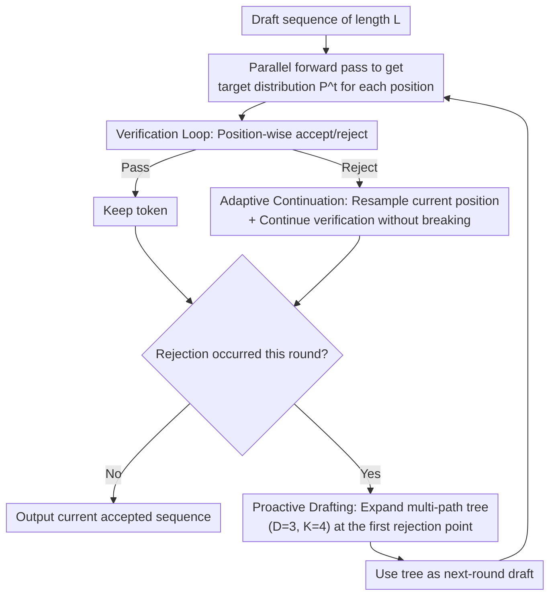

# SJD-PAC: Accelerating Speculative Jacobi Decoding via Proactive Drafting and Adaptive Continuation

**Conference**: CVPR 2026  
**arXiv**: [2603.18599](https://arxiv.org/abs/2603.18599)  
**Authors**: Jialiang Kang (Peking University), Han Shu, Wenshuo Li, Yingjie Zhai, Xinghao Chen (Huawei)  
**Code**: None  
**Area**: Image Generation  
**Keywords**: Autoregressive Image Generation, Inference Acceleration, Speculative Decoding, Jacobi Decoding, Lossless Acceleration

## TL;DR
This paper analyzes the bottleneck of Speculative Jacobi Decoding (SJD) in text-to-image generation, specifically the severely skewed distribution of its acceptance lengths. It introduces the SJD-PAC framework, which incorporates two techniques: Proactive Drafting (PD) and Adaptive Continuation (AC). Under strictly lossless conditions, SJD-PAC achieves a 3.8× inference speedup, significantly outperforming the ~2× speedup of original SJD.

## Background & Motivation

**Background**: Autoregressive (AR) text-to-image (T2I) models (e.g., Lumina-mGPT, Emu3) have achieved generation quality competitive with diffusion models. However, they suffer from significant inference latency as they require the sequential generation of thousands of tokens. Speculative Decoding (SD) is a dominant method for accelerating LLM inference but performs poorly in T2I scenarios.

**Limitations of Prior Work**: Standard SD methods (e.g., EAGLE) show almost no acceleration on T2I models. The high-entropy nature of image generation leads to extremely low acceptance rates for draft tokens—even at standard sampling temperatures, image tokens often have multiple candidates that are nearly equally probable. Existing SJD methods, though training-free and lossless, provide only a modest acceleration of approximately 2×.

**Key Challenge**: The authors' in-depth analysis reveals that the acceptance length distribution of SJD is highly skewed—about 50% of forward passes accept only 1 token (meaning no acceleration for that step). The average 2× speedup is primarily contributed by a small number of successful steps that accept many tokens. This "long-tail distribution" is the root cause of the performance bottleneck.

**Goal**
   - How to reduce the frequency of single-token acceptance (inefficient steps)?
   - How to increase the number of successfully verified tokens per step?

**Key Insight**: The root cause of single-token acceptance is the "cascading effect of context mismatch"—once position $i$ is rejected, the contexts for all subsequent proposals become invalid. This requires optimization in two directions: (1) providing diverse candidates at the rejection point to reduce subsequent cascading rejections (PD), and (2) continuing to verify subsequent tokens rather than terminating immediately after a rejection (AC).

**Core Idea**: Instead of stopping after a rejection, the system continues verification and proactively drafts multiple paths, employing a dual approach to maximize the acceptance length of each step.

## Method

### Overall Architecture

SJD-PAC aims to resolve the problem where the SJD acceleration ratio is hindered by the "long tail": approximately half of the forward passes accept only 1 token, resulting in wasted computation. SJD-PAC maintains the lossless backbone of SJD but modifies the verification loop and drafting strategy. In one iteration, the model first performs a parallel forward pass on a draft sequence of length $L$ to obtain the target distribution $P^t$ for all positions. It then enters a modified verification loop—checking acceptance/rejection position by position. However, **it does not stop upon encountering a rejection**; instead, it corrects the current position and continues verifying subsequent tokens. Finally, if any rejection occurred during the round, it **proactively expands a multi-path candidate tree** at the first rejection point to serve as the draft for the next iteration. These two modifications ensure that computation for distant tokens is not wasted after a rejection and that the next round is more likely to align at the rejection boundary.

### Key Designs

**1. Adaptive Continuation: Rejection of one token should not implicate the entire subsequent sequence**

The standard SJD verification loop uses "first-reject break"—if position $i$ is rejected, the iteration terminates immediately, and all subsequent tokens $X_{i+1:L}^{t-1}$ are discarded. However, the target distributions for these tokens have already been calculated in this forward pass; discarding them is wasteful and is the primary reason for "single-token acceptance." AC removes this break: after position $i$ is rejected, the token is first resampled according to the standard speculative decoding residual distribution $x_i^t \sim \max(p_i - q_i,\,0)$. Then, the process **continues** to perform standard rejection sampling for each position $j>i$. Tokens that pass are kept, while those that fail are resampled on the spot.

The rationale for this is the strong spatial locality of image tokens. The authors measured the total variation distance $d_{TV}$ of the output distribution for distant tokens after perturbing the context at a certain position. They found that for image tokens, $d_{TV}$ rapidly approaches 0 as distance $j$ increases (unlike text tokens, which remain highly sensitive). In other words, modifying position $i$ has almost no effect on the target distributions of distant tokens; utilizing this "slightly stale" distribution for verification remains valid. Compared to standard SJD, which resamples the entire subsequent sequence after a rejection, AC replaces only the rejected token and preserves other verified tokens. The probability of an already verified token remaining valid is $1 - d_{TV}(p_i^{t-1}, p_i^t) > 0.7$, whereas the probability of hitting the same token through resampling is less than $0.01$ (due to high entropy and numerous candidates).

**2. Proactive Drafting: Expanding multiple candidates at rejection points to stop cascading rejections**

Cascading rejections occur because the newly sampled $x_i^t$ at the rejection point fails to match the original context for subsequent tokens, causing a series of rejections in the next iteration. PD addresses this by building a "shallow and wide" tree instead of a single line at the rejection point. For the tree portion (depth $D=3$, width $K=4$), $K$ candidate tokens are sampled without replacement from $p(\cdot \mid X_{<j}^{t-1})$ for positions $i+1$ to $i+D$. The chain portion then extends autoregressively from the end of one of these $K$ paths to fill the sequence up to length $L$.

Crucially, this tree **does not require extra model forward passes**—it reuses the current (possibly stale) distribution for sampling, increasing only sampling overhead rather than compute overhead. This differs from standard tree-based speculative decoding, which requires multiple forward passes to build the tree. By preparing $K$ potential directions at the rejection boundary, the probability that at least one path aligns in the next verification round increases significantly, reducing "single-token steps" in the long tail.

**3. Orthogonal Synergy of PD and AC: One stabilizes the sequence, one broadens candidates**

Wait, both attack different ends of the same long-tail problem and do not interfere with each other. AC ensures the sequence remains as stable as possible after a rejection—allowing more verified tokens to be preserved and used as the draft for the next round. PD provides diverse candidates at the rejection point, raising the acceptance probability for the next round. Because they handle different aspects, they can be analyzed and combined independently. More importantly, both are strictly lossless: AC's subsequent verification follows standard rejection sampling, mathematically guaranteeing the final distribution matches token-by-token autoregressive generation. PD's tree is used only as a draft; the verification phase always uses the target distribution for judgment, ensuring no pollution of the output distribution.

## Key Experimental Results

### Main Results (Lumina-mGPT, MS-COCO 2017)

| Method | Training-free? | Lossless? | Step Compression↑ | Speedup↑ | FID↓ | CLIP↑ |
|------|---------|--------|---------|----------|------|-------|
| Original AR | ✓ | ✓ | 1.00× | 1.00× | 30.79 | 31.31 |
| EAGLE | ✗ | ✓ | 2.94× | 2.10× | 30.68 | 31.73 |
| SJD | ✓ | ✓ | 2.22× | 2.05× | 31.13 | 31.33 |
| GSD (Lossy) | ✓ | ✗ | 3.39× | 3.62× | 33.12 | 31.25 |
| SJD2 (Lossy) | ✗ | ✗ | 4.02× | 2.81× | 31.40 | 31.80 |
| **SJD-PAC** | **✓** | **✓** | **4.51×** | **3.80×** | **30.69** | **31.21** |

SJD-PAC outperforms all lossy methods in acceleration ratio while remaining lossless.

### Cross-model (Emu3, MS-COCO 2017)

| Method | Lossless? | Step Compression↑ | Speedup↑ | FID↓ |
|------|--------|---------|----------|------|
| SJD | ✓ | 2.32× | 2.01× | 30.74 |
| SJD2 | ✗ | 5.62× | 2.54× | 31.50 |
| **SJD-PAC** | **✓** | **4.31×** | **3.25×** | **31.10** |

While SJD2 has higher step compression, its doubled window length leads to extra overhead; the actual wall-clock speedup of SJD-PAC is significantly higher.

### Ablation Study

| Configuration | Step Compression↑ | Description |
|------|---------|------|
| SJD baseline (L=32) | 2.31× | Original method |
| + PD | 2.71× | Proactive drafting reduces cascading rejections |
| + PD + AC | 3.52× | Adaptive continuation significantly improves results |
| + PD + AC (L=64) | **4.51×** | Larger window fully utilizes AC |

### Key Findings
- AC is the most significant contributor (+0.81× compression vs. +0.40× for PD) because it directly preserves more valid tokens.
- Once AC is enabled, $L=32$ becomes a bottleneck as tokens stabilize faster; a larger window $L=64$ is needed to leverage this advantage.
- The property that image token total variation distance $d_{TV}$ decays rapidly with distance is the key theoretical support for AC's effectiveness—contrasting sharply with text generation.
- Modifying a single token (0.04% of the total) can introduce severe visual artifacts, proving the necessity of lossless guarantees for T2I.
- Tree parameters $D=3, K=4$ for PD are the "sweet spot"—too deep wastes sampling, too shallow lacks diversity.

## Highlights & Insights
- **Fine-grained analysis of SJD acceptance lengths** reveals the insight that "50% of steps contribute 0% acceleration," which serves as a clear optimization target for subsequent acceleration methods.
- **Utilizing image token locality for AC** is ingenious—the long-range dependencies of text tokens make similar methods unfeasible for LLMs, but the strong locality of image tokens makes verification with stale distributions effective.
- **Orthogonal design of PD + AC** allows the two components to be analyzed and combined independently; this modular design is noteworthy.

## Limitations & Future Work
- Tested only on Lumina-mGPT and Emu3; generalization to newer AR T2I models remains to be verified.
- Benefits diminish and computational overhead increases for window sizes $L > 64$—the hardware-specific optimal $L$ is not universal.
- PD tree construction is based on stale distributions, which is theoretically less accurate than construction via a full forward pass; there may be room for optimization under higher quality requirements.
- Adaptive $D$ and $K$ parameters could be explored—dynamically adjusting tree depth and width based on the entropy of the current region.

## Related Work & Insights
- **vs. Original SJD**: SJD-PAC modifies the verification loop and drafting strategy, increasing the speedup from 2× to 3.8× while remaining training-free and lossless.
- **vs. EAGLE**: EAGLE requires training a draft model and performs poorly on T2I (2.10×), whereas SJD-PAC requires no training and offers better acceleration (3.80×).
- **vs. GSD/LANTERN++**: These lossy methods accelerate by relaxing acceptance criteria but can introduce visual artifacts. SJD-PAC achieves superior speedup losslessly.
- **vs. SJD2**: SJD2 requires training and is lossy. While its step compression is high, its wall-clock speedup is low due to large window overhead. SJD-PAC is more practical.

## Rating
- Novelty: ⭐⭐⭐⭐ AC and PD are not entirely new individually, but their combination is well-designed for the high-entropy nature of T2I.
- Experimental Thoroughness: ⭐⭐⭐⭐ Includes two models, two benchmarks, detailed ablations, and analysis, though testing on even larger models is missing.
- Writing Quality: ⭐⭐⭐⭐⭐ In-depth problem analysis; the logical chain from observing distribution skew to deriving two solutions is very clear.
- Value: ⭐⭐⭐⭐ Directly applicable to AR T2I inference acceleration; being training-free and lossless are strong selling points.

<!-- RELATED:START -->

## Related Papers

- [\[CVPR 2026\] Parallel Jacobi Decoding for Fast Autoregressive Image Generation](parallel_jacobi_decoding_for_fast_autoregressive_image_generation.md)
- [\[AAAI 2026\] Annealed Relaxation of Speculative Decoding for Faster Autoregressive Image Generation](../../AAAI2026/image_generation/annealed_relaxation_of_speculative_decoding_for_faster_autor.md)
- [\[CVPR 2026\] Multi-Scale Local Speculative Decoding for Image Generation](multi-scale_local_speculative_decoding_for_image_generation.md)
- [\[ICCV 2025\] Grouped Speculative Decoding for Autoregressive Image Generation](../../ICCV2025/image_generation/grouped_speculative_decoding_for_autoregressive_image_generation.md)
- [\[ICML 2026\] Speculative Coupled Decoding for Training-Free Lossless Acceleration of Autoregressive Visual Generation](../../ICML2026/image_generation/speculative_coupled_decoding_for_training-free_lossless_acceleration_of_autoregr.md)

<!-- RELATED:END -->
