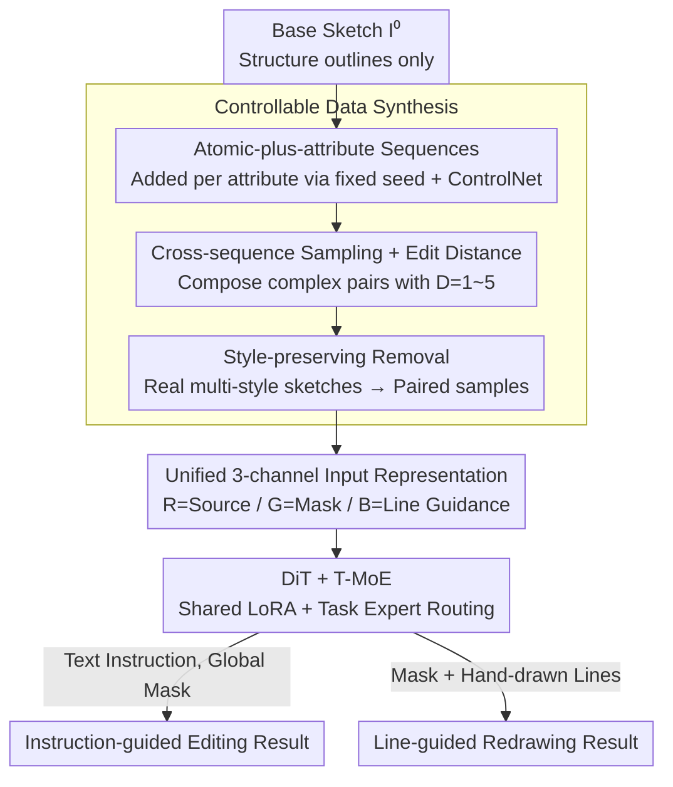

# SketchAssist: A Practical Assistant for Semantic Edits and Precise Local Redrawing

**Conference**: CVPR 2026  
**Paper**: [CVF Open Access](https://openaccess.thecvf.com/content/CVPR2026/html/Zou_SketchAssist_A_Practical_Assistant_for_Semantic_Edits_and_Precise_Local_CVPR_2026_paper.html)  
**Code**: None  
**Area**: Diffusion Models / Image Editing  
**Keywords**: Sketch editing, instruction editing, local redrawing, controllable data synthesis, task-routed MoE  

## TL;DR
SketchAssist unifies "sketch editing via text instructions" and "local redrawing via hand-drawn lines" into a single DiT framework. By utilizing a controllable data synthesis pipeline to generate structure-aligned paired training samples and employing a 3-channel unified input representation with Task-routed MoE (T-MoE), the model achieves seamless switching between editing modes and attains SOTA performance in both tasks.

## Background & Motivation
**Background**: Professional sketch creation typically involves two steps: first determining the **layout** (pose, body proportions, composition), and then adding **details** (eyes, hair, background texture). Since artists spend the majority of their strokes and time on the second step, the industry seeks to automate this stage using modern image generation models. This is usually split into two interfaces: **instruction-guided editing** (adding/removing/changing visual attributes via text) and **line-guided redrawing** (redrawing within a mask based on hand-drawn lines).

**Limitations of Prior Work**: Existing image editing and inpainting models underperform on sketches due to issues in both data and architecture. Regarding data: mainstream editing datasets originate from natural images and do not transfer well to sparse, line-based sketches; existing sketch datasets lack paired samples of the "same subject in different states with precisely controlled attribute changes," especially for complex multi-attribute edits. Simple synthesis strategies often fail to maintain structural alignment across multiple editing steps. Regarding models: instruction editing naturally affects the **entire image**, while local redrawing requires precise control over **specific regions**. Integrating both modes into one framework while maintaining style consistency across various drawing styles remains an open challenge.

**Key Challenge**: There is a fundamental difference in control granularity between high-level semantic instructions (global, text-driven) and low-level structural constraints (local, line-driven), which can lead to mutual interference if naively integrated into a single model.

**Goal**: (1) Develop a data pipeline specifically for sketches capable of producing "structure-aligned, attribute-controllable" paired samples; (2) Implement a unified framework that accommodates both editing modes without performance degradation.

**Key Insight**: For data, use "atomic-plus-attribute sequences + cross-sequence sampling" to combine complex editing pairs (sharing a base sketch to ensure structural alignment). For the model, use a "unified 3-channel input" to pack spatial conditions of both modes into a single RGB image, and apply T-MoE to decouple the behaviors of the two tasks.

## Method

### Overall Architecture
The SketchAssist workflow consists of two phases: **offline data synthesis**, which creates a large volume of structure-aligned and stylistically diverse paired training samples, and an **online unified model** based on FLUX.1-Kontext DiT that simultaneously learns instruction editing and line-guided redrawing.

The data side focuses on "decomposing edits to the finest granularity and then combining them into pairs of controllable complexity": starting from a **base sketch** $I^{(0)}$ containing only structural outlines, multi-step "atomic-plus-attribute sequences" are generated using fixed random seeds + ControlNet to add one attribute at a time. Since all sequences branch from the same $I^{(0)}$, any two samples picked across sequences or time steps are naturally aligned in pose and composition—this is **cross-sequence sampling**, paired with a formal edit distance metric to control sample complexity. A "style-preserving removal" model is also used to transform real-world multi-style sketches into controllable paired samples for style diversity. For redrawing, "user-drawn lines" are synthesized using Anime Lineart extraction + ControlNet, paired with semantic or random masks.

The model features two Key Designs: a **unified 3-channel input representation** that packs the "original image / editable mask / structural guidance" into R/G/B channels respectively, allowing both tasks to share the same input interface; and **T-MoE** embedded into LoRA layers, using text and visual features for routing to dynamically select experts, ensuring that the two tasks follow separate parameter paths to avoid interference.

### Key Designs

**1. Cross-sequence Sampling + Edit Distance Control: Composing structure-aligned complex samples via atomic edits**

Directly generating "before-and-after pairs of complex multi-attribute edits for the same subject" rarely guarantees structural alignment. Ours circumvents this in two steps. First, creating **atomic-plus-attribute sequences**: starting from a structural base sketch $I^{(0)}$, a list of ordered attributes $\{a_1,\dots,a_T\}$ is randomly sampled using Danbooru/WD14 tags. Using a fixed seed and ControlNet conditioned on the previous $I^{(t-1)}$, one attribute is added at a time to produce the sequence $\{I^{(t)}\}$. Each neighboring pair $(I^{(t-1)},I^{(t)})$ represents a pure addition with an edit distance of $D=1$. This is repeated $M$ times for the same $I^{(0)}$ with different tag orders to create $M$ branched sequences.

Second, **cross-sequence sampling**: because all sequences originate from $I^{(0)}$, any source $(I_s,A_s)$ and target $(I_t,A_t)$ are naturally aligned in pose/composition. The difference in their attribute sets is decomposed into three atomic operations—addition $O_{add}=A_t\setminus A_s$, removal $O_{rm}=A_s\setminus A_t$, and replacement $O_{rep}$ (swapping mutually exclusive attributes, e.g., short hair ↔ long hair). The total edit distance $D=|O_{add}|+|O_{rm}|+|O_{rep}|$ quantifies the transformation complexity. This allows synthesis of anything from $D=1$ atomic edits to $D\ge3$ complex instructions (e.g., "remove hat + change to long hair + add scarf"). Controlling edit distance while maintaining layout forces the model to learn true instruction following rather than relying on spurious correlations.

**2. Style-preserving Removal: Covering real-world drawing styles**

The previous synthesis data comes from a single generator, leading to limited style diversity. Applying the "add attribute" pipeline directly to real-world multi-style sketches breaks their coherence, and rigid spatial conditioners like ControlNet struggle with "removal." Ours reverses the logic: by flipping the direction of atomic pairs $(I^{(t)},I^{(t-1)})$, they are treated as atomic removals $O_{rm}$ to train a **style-preserving removal model**. Applying this to collected multi-style sketches produces high-quality paired samples for removal, injecting diverse style priors while maintaining precise control. The insight is that "removal is better suited for cross-style generalization than addition"—removing an existing attribute doesn't require imagining new content, making it easier to preserve the original style.

**3. Unified 3-channel Input Representation: Packing dual-mode spatial conditions into one RGB image**

To integrate local redrawing into an instruction editing model, common practices involve increasing input channels or adding control branches (e.g., OminiControl), which raises costs. Ours leverages the fact that sketches are **monochrome** to compress all spatial conditions into a standard 3-channel synthetic image $I_{cond}\in\mathbb{R}^{H\times W\times3}$: the **R channel (Source Context)** contains the background—the full original image for instruction mode, and the "original image with the target area erased" for line mode; the **G channel (Editable Mask)** contains binary mask $M$ (white = editable, black = keep)—global for instruction mode, local for line mode; the **B channel (Structural Guidance)** contains line guidance $G$—blank for instruction mode (text-only) and hand-drawn/extracted lines for redrawing mode. This structured routing allows the model to switch between global semantic editing and precise local redrawing without extra pipelines or retraining the input layer.

**4. T-MoE: Decoupling task parameter paths to prevent interference**

While unified input handles spatial conditions, the two tasks require different feature mappings. Ours embeds **Task-routed Mixture-of-Experts** into LoRA layers: each T-MoE layer has a **shared LoRA** to capture task-agnostic structural/style priors, plus a set of **expert LoRAs** for specific editing modes. At inference, text and visual features are concatenated into a routing input $z$ to dynamically select the most relevant experts. The output is:

$$\text{Output}=\text{BaseLayer}(x)+\text{SharedLoRA}(x)+\frac{\alpha}{r}\sum_{i=1}^{N}G(z)_i\cdot\text{ExpertLoRA}_i(x),$$

where $\alpha, r$ are the LoRA scale and rank. The expert routing probability $G(z)_i=\text{Softmax}(\text{TopK}(g(z),K))_i$ keeps only the top-$K$ terms of the pre-softmax scores $g(z)$, achieving sparse activation. This DiT architecture maintains global consistency (via shared parts) while letting semantic editing and structural redrawing follow specialized paths.

### Loss & Training
The framework is trained on the FLUX.1-Kontext architecture. Although predefined tags are used for data generation, the final model is trained on natural language instructions for user-friendliness. During training, pairs are dynamically sampled with edit distances $D=1$ to $5$. The instruction data underwent rigorous two-stage filtering—stability (Human-Art + CLIP for pose/style consistency) and semantics (WD14 Tagger for attribute verification and Qwen-VL for instruction alignment), expanding ~10,000 base sketches into ~100,000 high-quality training images, plus 4,000 multi-style samples.

## Key Experimental Results

Tests were conducted on two independent sets of 200 sketches each. The 200 base sketches for the instruction task were not seen during training.

### Main Results

Instruction-guided Editing (VIEScore protocol using Gemini-2.0-Flash + Qwen3-VL-30B; Q* denotes quality scores, WR denotes win rate against that baseline):

| Method | CLIP-T↑ | CLIP-I↑ | DINO↑ | Q SC↑ | Q O↑ | WR(%) |
|------|---------|---------|-------|-------|------|-------|
| ICEdit | 0.270 | 0.811 | 0.705 | 4.13 | 4.54 | 94.81 |
| FLUX.1 Kontext | 0.296 | 0.882 | 0.791 | 6.62 | 6.42 | 84.45 |
| Step1X-Edit | 0.295 | 0.886 | 0.809 | 7.60 | 7.25 | 82.76 |
| Qwen-Image-Edit | 0.292 | 0.849 | 0.776 | 6.89 | 6.79 | 86.91 |
| **Ours** | **0.305** | **0.931** | **0.879** | **8.74** | **8.04** | — |

Line-guided Local Redrawing:

| Method | LPIPS↓ | CLIP-I↑ | DINO↑ | WR(%) |
|------|--------|---------|-------|-------|
| SketchEdit | 0.2277 | 0.853 | 0.800 | 98.56 |
| BrushNet | 0.1877 | 0.852 | 0.795 | 97.23 |
| MagicQuill | 0.1472 | 0.903 | 0.887 | 94.49 |
| **Ours** | **0.0972** | **0.961** | **0.949** | — |

Ours leads across nearly all metrics. While Qwen-Image-Edit had slightly higher perceptual quality (Q PQ), Ours achieved the highest overall score (Q O), indicating a better balance between semantic accuracy and visual coherence. In a side-by-side user study with 50 participants, Ours attained high win rates against all baselines.

### Ablation Study

Redrawing test set expanded to 400 images (200 semantic mask + 200 random mask) for structural robustness testing. Modules added incrementally:

| Configuration | CLIP-I (Inst) | DINO (Inst) | Q O (Inst) | LPIPS (Redraw) | DINO (Redraw) |
|------|------|------|------|------|------|
| Baseline | 0.882 | 0.791 | 6.42 | 0.119 | 0.890 |
| + Atomic Sequences | 0.892 | 0.831 | 7.20 | 0.119 | 0.937 |
| + Cross-sequence Sampling | 0.901 | 0.847 | 7.55 | 0.112 | 0.948 |
| + Style Diversification | 0.931 | 0.879 | 7.86 | 0.0915 | 0.956 |
| + T-MoE (Full) | 0.931 | 0.879 | **8.04** | — | — |

### Key Findings
- **Cross-sequence sampling primarily improves structural consistency**: Introducing $D=1\sim5$ complex edits improved CLIP-I by 0.009 and DINO by 0.016, as it forces the model to maintain subject identity under various attribute combinations.
- **Style diversification improves semantic/style alignment but slightly lowers PQ**: This is a fidelity-quality trade-off; the model faithfully preserves the hand-drawn textures of multi-style source sketches rather than over-smoothing them into "clean" generic lines.
- **T-MoE achieves the best overall scores**: Dynamically routing task features effectively mitigates parameter interference between global semantic editing and local structural redrawing.

## Highlights & Insights
- **"Atomic decomposition + Cross-sequence composition" for structure-aligned data**: Branching multiple atomic sequences from a single base sketch and pairing them across sequences naturally solves the long-standing problem of structural misalignment in complex edits.
- **Reusing the "idle bits" of monochrome sketches via RGB channels**: By packing Source/Mask/Line-guidance into R/G/B channels, dual modes are unified with no extra channels, branches, or input layer retraining, which is highly efficient.
- **Removal is more suitable for cross-style than addition**: Training a removal model to create samples from real multi-style sketches is a counter-intuitive but practical trick.
- **Edit distance as a complexity knob**: Using $D=|O_{add}|+|O_{rm}|+|O_{rep}|$ to explicitly control training sample complexity enables curriculum-like training and prevents the model from taking shortcuts.

## Limitations & Future Work
- The training and testing data are **pipeline-generated**, which may result in a gap between the synthetic evaluation and noisy hand-drawn sketches in real artist workflows.
- Pixel-level metrics like PSNR/SSIM are distorted by the large white background of sketches and are relegated to the appendix. Evaluation relies on VLM scores (Gemini/Qwen), which carry risks of model preference.
- The trade-off between style diversification and PQ suggests a challenge in balancing "fidelity" and "cleanliness." Providing users with a way to adjust this preference is a potential future direction.

## Related Work & Insights
- **vs. Instruction Editing (FLUX.1 Kontext / Step1X-Edit)**: These excel at global semantic changes but lack fine-grained local control. Ours uses an instruction editing backbone but adds line-guided local editing, achieving both.
- **vs. Local Editing/Redrawing (SketchEdit / BrushNet / MagicQuill)**: These have good local control but lack instruction-based global semantic manipulation. Ours adheres strictly to guidance lines while maintaining strong semantic editing capabilities.
- **vs. OminiControl**: Unlike methods that increase channels or add branches, Ours achieves unified input via 3-channel packing for monochrome sketches, reducing training and inference overhead.

## Rating
- Novelty: ⭐⭐⭐⭐ The "atomic + cross-sequence" data generation and the 3-channel unified input + T-MoE are solid combinations of clever ideas.
- Experimental Thoroughness: ⭐⭐⭐⭐ Comprehensive comparisons and ablations across both tasks; however, the reliance on synthetic test data is a minor drawback.
- Writing Quality: ⭐⭐⭐⭐ Motivation and data pipeline are explained clearly with effective illustrations.
- Value: ⭐⭐⭐⭐ Highly practical for real sketch workflows, unifying two key editing modes with low engineering overhead.

<!-- RELATED:START -->

## Related Papers

- [\[CVPR 2026\] MapRoute: Semantic Routing for Precise Concept Erasure with Mapper](maproute_semantic_routing_concept_erasure.md)
- [\[ICLR 2026\] Deconstructing Guidance: A Semantic Hierarchy for Precise Diffusion Model Editing](../../ICLR2026/image_generation/deconstructing_guidance_a_semantic_hierarchy_for_precise_diffusion_model_editing.md)
- [\[CVPR 2026\] VectorArk: Learning Practical Image Vectorization with Rounded Polygon Representation](vectorark_learning_practical_image_vectorization_with_rounded_polygon_representa.md)
- [\[CVPR 2026\] Omni IIE Bench: Benchmarking the Practical Capabilities of Image Editing Models](omni_iie_bench_benchmarking_the_practical_capabilities_of_image_editing_models.md)
- [\[CVPR 2026\] Say Cheese! Detail-Preserving Portrait Collection Generation via Natural Language Edits](say_cheese_detail-preserving_portrait_collection_generation_via_natural_language.md)

<!-- RELATED:END -->
