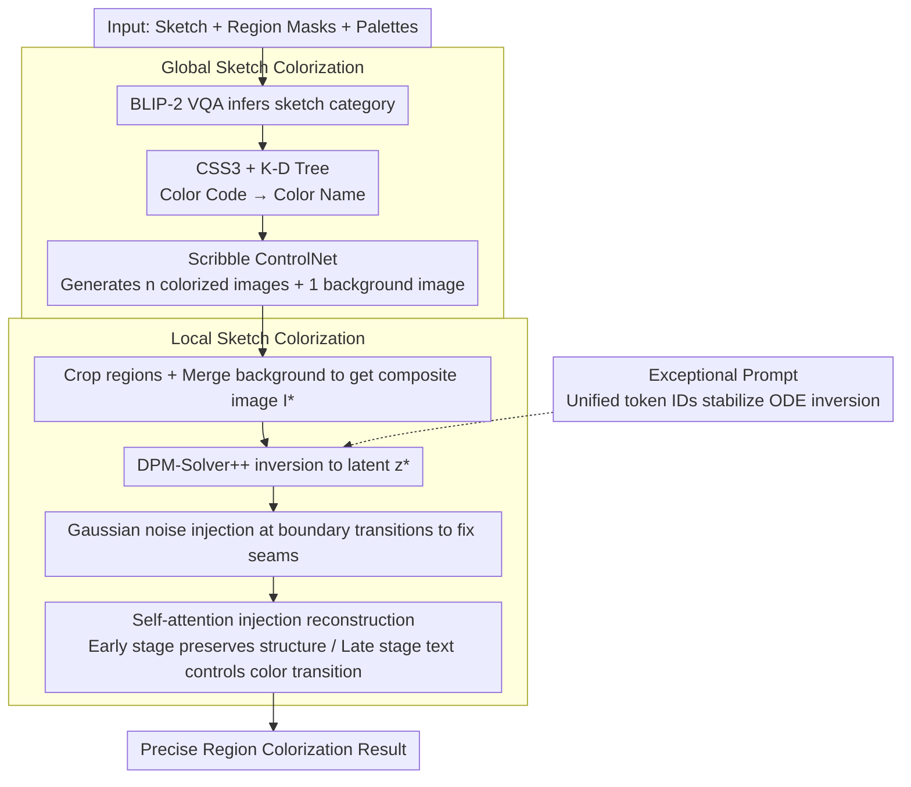

# SketchDeco: Training-Free Latent Composition for Precise Sketch Colourisation

**Conference**: CVPR 2026  
**arXiv**: [2405.18716](https://arxiv.org/abs/2405.18716)  
**Code**: None  
**Area**: Image Generation  
**Keywords**: Sketch Colourisation, Diffusion Models, training-free, Latent Composition, Self-Attention Injection

## TL;DR

SketchDeco is proposed as a training-free sketch colorization method. It employs a global-local two-stage strategy using region masks and color palettes as precise control signals. By utilizing diffusion model inversion and self-attention injection, it achieves precise regional coloring and harmonious global transitions in latent space, completing in 15-20 steps on consumer-grade GPUs.

## Background & Motivation

Sketch colorization is a fundamental task in creative workflows such as animation storyboarding, product design, and concept art. Although large-scale diffusion models have made breakthroughs in image generation, they still face challenges in fine-grained, region-level color control:

**Spatial Ambiguity of Text Guidance**: While text prompts are semantically rich, they cannot precisely specify "which region uses which color," often leading to color bleeding and semantic errors (as shown in Figure 1b).

**Low Efficiency of Traditional Methods**: Manual color assignment or reference-based color transfer is overly tedious.

**High Training Overhead**: Methods like ControlNet require fine-tuning hypernetworks, which entails high computational costs.

The core insight of this paper: The solution is not more training, but an innovative training-free composition framework that separates global consistency from local control.

## Method

### Overall Architecture

The difficulty of sketch colorization lies in the fact that text prompts cannot clearly describe "which region uses which color," often resulting in color bleeding and semantic errors; meanwhile, approaches like ControlNet require fine-tuning hypernetworks with high overhead. The core insight of SketchDeco is to avoid additional training by using a training-free composition framework that decouples "global consistency" and "local precise control" into two stages.

The inputs are a sketch $\mathcal{S}$, a set of region masks $\{\mathcal{M}^{(i)}\}$, and corresponding color palettes $\{\mathcal{P}_H\}$. The global stage first generates multiple overall colorization results maintaining sketch structure and color consistency. The local stage then achieves precise regional coloring and smooth transitions through latent space composition.

### Key Designs

**1. Global Sketch Colorization: Automatically converting palettes into usable colorization candidates**

To avoid manual per-region color tuning, the global stage uses BLIP-2 VQA to infer the sketch category ("What is this sketch depicting?") to obtain zero-shot semantic labels. Then, the CSS3 color database (147 colors) and a K-D Tree ($K=3$) are used to map hex color codes to the nearest color names—the authors found that K-D Tree color retrieval is more reliable than directly querying an LLM and saves LLM calls. A pre-trained Scribble ControlNet, combined with semantic labels and color names in the prompt, is then used to generate $n+1$ images: $n$ colorization results corresponding to each palette and one auxiliary background image without color descriptions. These are rendered in pixel space for preview, allowing users to switch seeds and compare variants.

**2. Local Sketch Colorization: Reframing region colorization as an "image composition + reconstruction" problem**

This is the most ingenious step—regressing region colorization from "imposing hard color constraints during denoising" to composition and reconstruction. For each masked region, the area is cropped from the corresponding global colorization result and merged with the background image to form a composite image $\mathcal{I}^*$. DPM-Solver++ (high-efficiency 15-20 step inversion) is used to invert $\mathcal{I}^*$ into a noisy latent variable $z^*$. Extra Gaussian noise is injected into the mask boundary transition zones to naturally fix seams using the diffusion model's generative prior. During reconstruction, self-attention injection controls fidelity: the self-attention maps $\mathcal{A}^*_{l,t}$ of the composite image are used with a scaling factor $\tau$ for segmentation. In the early phase $t \in [T, T(1-\tau)]$, self-attention is injected to maintain global structural fidelity; in the late phase $t \in [T(1-\tau), 0]$, text encoding is used to achieve smooth color transitions. Since the processing of multiple masks is completed in parallel during the global stage, the number of masks does not affect final quality.

**3. Exceptional Prompt: Preventing ODE inversion from being biased by CFG**

In ODE inversion, CFG introduces instability and amplifies reconstruction errors. SketchDeco borrows the "exceptional prompt" as a substitute for the null prompt: setting all token IDs to a uniform value and removing redundant positional encodings and special tokens. This makes the backward ODE trajectory closer to the forward trajectory, significantly improving inversion accuracy. This is a crucial support for the aforementioned "inversion-reconstruction" pipeline.

### Loss & Training

This method is entirely training-free. All components are based on pre-trained Stable Diffusion v1.5 and Scribble ControlNet. Key hyperparameters: CFG scale = 2.5, $\tau = 0.4$ (self-attention injection ratio), K-Means clustering $K=4$ for primary color extraction. Inference is performed on a single RTX 4090 Super.

## Key Experimental Results

### Main Results

**Local Colorization** (Table 1)

| Method | Place365 Indoor FID↓ | LPIPS↓ | DCCW↓ | PascalVOC FID↓ | DCCW↓ |
|------|---------------------|--------|-------|----------------|-------|
| ColorizeDiffusion | 151.52 | 0.645 | 15.30 | 110.80 | 24.37 |
| ColorFlow | 354.07 | 0.643 | 17.05 | 367.69 | 14.98 |
| MangaNinja | 134.57 | 0.548 | 15.19 | 289.21 | 10.61 |
| Cobra | 221.38 | 0.603 | 14.96 | 382.70 | 13.96 |
| **Ours** | **123.87** | **0.527** | **11.85** | **95.64** | **8.89** |

**Global Colorization** (Table 2, AFHQ-cat/dog)

| Method | AFHQ-cat FID↓ | LPIPS↓ | SSIM↑ | AFHQ-dog FID↓ |
|------|--------------|--------|-------|---------------|
| DiffBlender | 86.82 | 0.811 | 0.032 | 145.50 |
| T2I-Adapter | 68.95 | 0.706 | 0.134 | 107.12 |
| T2I-Adapter+IDeepColor | 68.41 | 0.673 | 0.133 | 116.95 |
| **Ours** | **50.31** | **0.671** | **0.187** | **89.70** |

### Ablation Study

| Configuration | Key Metrics | Explanation |
|------|---------|------|
| W/o Self-Attention Injection | Color inconsistency, loss of structure | Relying only on initial noise is insufficient |
| W/o Exceptional Prompt | High reconstruction error | CFG instability leads to ODE trajectory drift |
| W/o Gaussian Noise Injection | Harsh region boundaries | Transition areas lack generative prior |
| $\tau=0.4$ (Default) | Best balance | Structure preservation + color transition |
| $K=4$ Clustering | Optimal | $K$ too large → palette redundancy; $K$ too small → insufficient color coverage |

### Key Findings

- SketchDeco leads across the board in the DCCW metric (color palette similarity) for local colorization, proving its precise color control capability.
- The method is effective across multiple domains (animals, indoor/outdoor scenes, anime, multi-object natural scenes).
- K-D Tree outperforms LLM in color retrieval (no need for LLM calls to interpret color hex codes).
- The number of masks does not affect final quality because processing is parallelized through global colorization.

## Highlights & Insights

1.  **Ingenious Design of Divide-and-Conquer Strategy**: Decoupling the contradiction between global consistency and local control into two stages is the most inspiring design concept of the paper.
2.  **Latent Space Composition Paradigm**: Reframing region colorization as a composition+reconstruction problem avoids the difficulty of forcing color constraints directly during the denoising process.
3.  **Control Without Training**: Fully leveraging the generative prior of pre-trained models demonstrates the extensive controllability of diffusion models.
4.  **Elegant Solution for CFG Instability**: The exceptional prompt technique makes inversion more stable by removing prompt information, providing a practical tip for the ODE inversion field.
5.  **User-Friendly Workflow**: Supports interactive previews and seed switching, completing in 15-20 steps on consumer GPUs, making it suitable for practical creative workflows.

## Limitations & Future Work

- Based on Stable Diffusion v1.5, generation quality is limited by the base model; upgrading to SDXL or SD3 might bring greater improvements.
- Masks must be manually drawn (e.g., using Photoshop); automated semantic segmentation for mask generation could lower the barrier to entry.
- K-D Tree only maps to 147 CSS3 color names, limiting fine-grained color adjustment.
- Texture details of colorization results depend on ControlNet's generative capabilities, which may be limited for minimalist sketches.
- Video sketch colorization or temporal consistency scenarios were not discussed.

## Related Work & Insights

- Extends the composition framework of TF-ICON by introducing region mask and palette control.
- The exceptional prompt technique originates from TF-ICON; this paper applies it to ODE inversion stabilization.
- The choice of DPM-Solver++ reflects a consideration for efficiency and inversion accuracy (vs. 100-250 steps for DDIM).
- The methodology can be generalized to other image editing tasks: such as regional style transfer or local material replacement.

## Rating

- **Novelty**: ⭐⭐⭐⭐ — Reframing colorization as a latent space composition problem is a novel perspective, though components are clever combinations of existing techniques.
- **Experimental Thoroughness**: ⭐⭐⭐⭐ — Multiple datasets, multiple baseline comparisons, covering both global and local settings.
- **Writing Quality**: ⭐⭐⭐⭐ — Clear diagrams, detailed process descriptions, and well-reasoned motivation analysis.
- **Value**: ⭐⭐⭐⭐ — Directly useful for creative workflows; the training-free nature is a core advantage.

<!-- RELATED:START -->

## Related Papers

- [\[CVPR 2026\] Object-WIPER: Training-Free Object and Associated Effect Removal in Videos](object-wiper_training-free_object_and_associated_effect_removal_in_videos.md)
- [\[CVPR 2026\] Training-free Mixed-Resolution Latent Upsampling for Spatially Accelerated Diffusion Transformers](training-free_mixed-resolution_latent_upsampling_for_spatially_accelerated_diffu.md)
- [\[CVPR 2026\] SparVAR: Exploring Sparsity in Visual Autoregressive Modeling for Training-Free Acceleration](sparvar_exploring_sparsity_in_visual_autoregressive_modeling_for_training-free_a.md)
- [\[CVPR 2026\] Denoising as Path Planning: Training-Free Acceleration of Diffusion Models with DPCache](dpcache_denoising_path_planning_diffusion_accel.md)
- [\[CVPR 2026\] Precise Object and Effect Removal with Adaptive Target-Aware Attention](precise_object_and_effect_removal_with_adaptive_target-aware_attention.md)

<!-- RELATED:END -->
