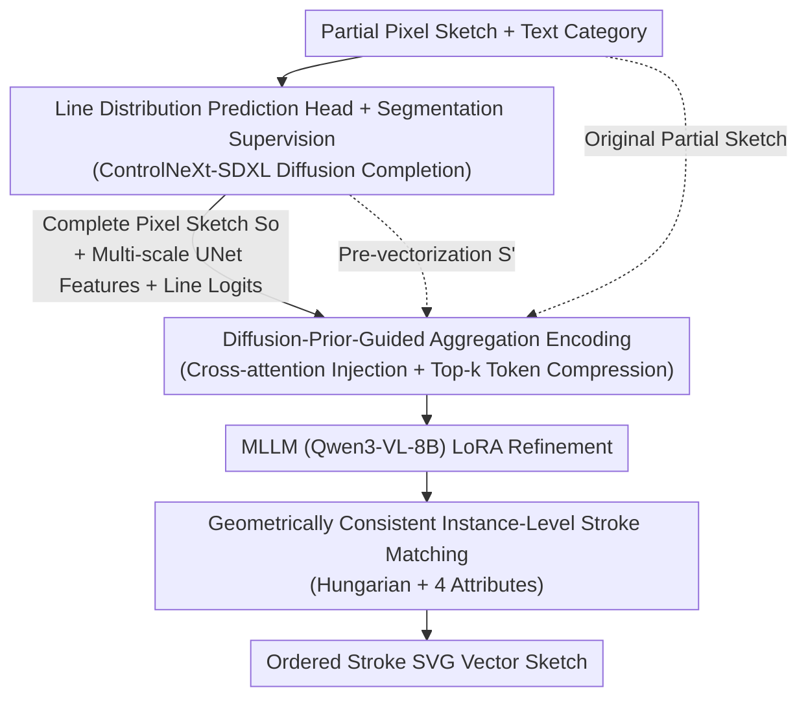

# SketchRevive: Fine-Grained Pixel-to-Vector Sketch Completion with Diffusion-Prior-Guided Multimodal LLMs

**Conference**: CVPR 2026  
**Paper**: [CVF Open Access](https://openaccess.thecvf.com/content/CVPR2026/html/Zuo_SketchRevive_Fine-Grained_Pixel-to-Vector_Sketch_Completion_with_Diffusion_Prior_Guided_Multimodal_LLMs_CVPR_2026_paper.html)  
**Code**: None  
**Area**: Diffusion Models / Vector Sketch Generation  
**Keywords**: Sketch Completion, Pixel-to-Vector, Diffusion Prior, Multimodal LLMs, SVG Vectorization

## TL;DR
SketchRevive introduces the new task of "Fine-Grained Pixel-to-Vector Sketch Completion" using a two-stage framework: a diffusion model first performs structurally consistent completion at the pixel level, followed by an MLLM for structure-aware refinement and vectorization. By injecting intermediate diffusion features into the MLLM visual stream, the framework significantly outperforms naive cascades of ControlNeXt with GPT-5 or Gemini across metrics like FID, IoU, and SRR.

## Background & Motivation
**Background**: Vector sketch generation has gained significant attention, with mainstream approaches modeling sketches as ordered stroke trajectories or parametric Bézier curves. These methods utilize sequence models, diffusion models, or SDS distillation for "from-scratch synthesis" supporting multimodal conditions such as text, reference images, or gestures.

**Limitations of Prior Work**: Existing works predominantly assume a "digital device from-scratch drawing" scenario, overlooking the most common early-stage creative process: humans sketching rough, incomplete outlines on paper, whiteboards, or tablets. There is a need for systems that can interpret these partial sketches and **complete them into fine-grained, editable vector drawings**. Current "sketch completion" paradigms often reduce the task to local gap inpainting (reconstructing from randomly masked segments), which lacks global structural reasoning and produces coarse outlines or abstract appearances. Text-guided completion is primarily used to "insert new parts/objects into an original image" rather than faithfully restoring a user's unfinished work.

**Key Challenge**: Directly adapting "from-scratch" methods like Bézier diffusion for completion faces two hurdles: they lack mechanisms to **predict and propagate structure** from fragmented sketches, and fixed stroke-count constraints limit detail expression, where random control point sampling often introduces redundant strokes and artifacts. A seemingly feasible two-stage pipeline (diffusion for pixel completion followed by MLLM for vectorization) suffers from semantic drift and structural deformation in a naive cascade, making it difficult to recover topologically consistent SVG stroke trajectories from generated pixels.

**Goal**: To formalize "Fine-Grained Pixel-to-Vector Sketch Completion"—given a pixel-level partial sketch and a text description of the category (optionally including orientation/pose), the goal is to predict the **stroke distribution of the entire object**. The output should be a vector drawing with coherent global structure, high-fidelity appearance, and a unified stroke topology that merges the original raster input with the newly generated content.

**Key Insight**: The **pixel-level completion priors** (multi-scale UNet features + line prediction logits) generated during the diffusion stage are injected into the MLLM to guide its refinement and vectorization. This maximizes the complementarity between diffusion models (proficient in pixel generation) and MLLMs (proficient in variable-length strokes and SVG code).

## Method

### Overall Architecture
SketchRevive addresses the transformation of "incomplete pixel sketches → complete editable vector drawings." The architecture consists of a two-stage serial pipeline with a cross-stage connection module. First, a realistic benchmark is constructed (based on the SFSD dataset with stroke annotations, supplemented by paper/whiteboard sketch captures and GPT-5 generated descriptions). **Stage I** employs a diffusion model to complete the partial sketch into a full sketch with consistent structure and appearance at the pixel level. **Stage II** uses an MLLM to perform structure-aware refinement and vectorization conditioned on the Stage I result and the original partial sketch, outputting SVG with ordered strokes. The two stages are linked via a "Diffusion-Prior-Guided Aggregation Encoding" module, which injects multi-scale UNet features from Stage I into the MLLM visual embeddings via hierarchical cross-attention and utilizes line prediction logits for token compression to focus the MLLM on the most informative visual regions.

### Key Designs

**1. Line Distribution Prediction Head + Line Segmentation Guidance: Reformulating "Completion" as Pixel-level Stroke Segmentation**

A key issue in Stage I is that standard $\epsilon$-noise prediction targets for diffusion are poorly suited for sketch completion, often resulting in structural inconsistencies, hallucinations, and deviations from clean binary lines. Ours reformulates the task from "indirect denoising" to "direct pixel-wise segmentation." A lightweight line prediction head (3×3 Conv → BN → ReLU → 1×1 Conv for single-channel logit → Sigmoid) is attached to the ControlNeXt-SDXL UNet decoder. It outputs a probability map $p_\text{line}\in[0,1]$ for each pixel, supervised directly by the binarized GT sketch $B_\text{gt}\in\{0,1\}$ to provide an explicit structural signal.

The supervision combines segmentation losses with denoising loss: BCE loss $L_\text{BCE}$ ensures pixel-wise classification, Dice loss $L_\text{Dice}$ handles sparse foregrounds (small stroke proportion), and structural loss $L_\text{str}$ measures the L1 distance between $p_\text{line}$ and $B_\text{gt}$. The total objective is:

$$L_\text{complete}=\lambda_1 L_\text{noise}+\lambda_2 L_\text{BCE}+\lambda_3 L_\text{Dice}+\lambda_4 L_\text{str}.$$

This training ensures stroke continuity and boundary adherence while producing three components for the next stage: the complete sketch $S_o$, multi-scale UNet intermediate features $\{F^i_\text{mid}\}_{i=1}^3$, and line prediction logits $p_\text{line}$. Explicit "stroke vs. non-stroke" signals result in cleaner completion structures, which are essential for topology recovery during vectorization.

**2. Diffusion-Prior-Guided Aggregation Encoding: Injecting Intermediate Evidence into MLLM with Token Compression**

Naive cascades amplify artifacts and structural errors from the diffusion stage, degrading the geometric fidelity of the final SVG. This module is the core innovation, bridging the two stages. First, **Prior Injection**: the binary completion $S_o$ is pre-vectorized into a smooth continuous representation $S'_o$ (skeletonization to single-pixel centerlines → voxelization for control points → B-spline fitting). This reduces token costs and allows the MLLM to refine topology on continuous curves. Simultaneously, Stage I multi-scale UNet features $\{F^i_\text{mid}\}$ are aligned to the ViT token space via a transformation function:

$$A_i=\text{Pool}\big(\phi(\text{BN}(\text{Conv}_{1\times1}(\text{Conv}^\text{dw}_{3\times3}(F^i_\text{mid}))))\big),$$

They are then injected into the MLLM visual stream through hierarchical cross-attention: $F^i_\text{par}=\text{LayerNorm}(F^{i-1}_\text{par}+\text{Attn}(F^{i-1}_\text{par},A_i,A_i))$, restoring mid-level appearance and geometric cues that might be attenuated in the final rendered image.

Second, **Token Compression**: the fused $F_\text{par}$ contains redundant tokens. Ours uses line prediction logits $p_\text{line}$ to score tokens, retaining only the Top-k most significant ones: $F'_\text{par}=\text{Gather}(F_\text{par},\text{Top}_k(\text{Flatten}(\text{Pool}(p_\text{line}))))$ (where $k=50\%$). This forces the MLLM to focus on critical stroke areas. $F'_\text{par}$ is concatenated with initial stroke sequence features $F_\text{vec}$ and task prompts for LoRA fine-tuning to output the SVG. Ablations show that removing this module (using only $S'_o$ + fine-tuned Qwen) causes FID to rise from 4.76 to 8.21 and IoU to drop from 0.56 to 0.42.

**3. Geometrically Consistent Instance-Level Stroke Matching: Supervizing Stroke Attributes via Unordered Set Matching**

The predicted stroke set $P=\{P_j\}_{j=1}^N$ and GT stroke set $S=\{S_i\}_{i=1}^M$ are **unordered and potentially unequal in number**, precluding point-to-point alignment. Ours measures similarity between two strokes using four geometric attributes: shape (Chamfer distance $d_\text{cham}$), length (arc length difference $d_\text{len}$), pose (centroid distance + angular difference of principal directions $d_\text{pose}$), and curvature (difference in curvature at sampled points $d_\text{curv}$). The combined geometric consistency cost is:

$$L_\text{geo}(S,P)=\alpha\,d_\text{cham}+\gamma\,d_\text{len}+\delta\,d_\text{pose}+\eta\,d_\text{curv}.$$

A cost matrix $C\in\mathbb{R}^{M\times N}$ is constructed, and the optimal matching $\pi^*$ is found using the Hungarian algorithm. Each predicted stroke is matched to its geometrically nearest GT instance, yielding the instance-level matching loss $L_\text{inst}=\frac{1}{K}\sum_i (\alpha\,d_\text{cham}(S_i,P_{\pi^*(i)})+\gamma\,d_\text{len}+\delta\,d_\text{pose}+\eta\,d_\text{curv})$, where $K=\min(M,N)$. This supervision ensures global instance-level consistency while constraining fine-grained geometric attributes of individual strokes.

### Loss & Training
Progressive two-stage training is employed. Stage I optimizes ControlNeXt-SDXL with the line prediction head using $L_\text{complete}$ ($\lambda_1{=}1, \lambda_2{=}1, \lambda_3{=}0.1, \lambda_4{=}0.5$). Stage II performs LoRA fine-tuning of Qwen3-VL-8B-Instruct guided by $L_\text{inst}$, with cost matrix weights $\alpha{=}0.4$ and others $\approx 0.2$, and a token compression ratio $k{=}50\%$. During training, partial sketches are constructed using stroke-level annotations as "incremental stroke prefixes." During evaluation, the first 10%–50% of strokes are provided.

## Key Experimental Results

### Main Results
Evaluation was performed on augmented SFSD (19 foreground categories, 28,845 instances; 7:3 split), using the first 10%/30%/50% of strokes. Metrics: FID↓, Geometry Score (GS)↓, IoU↑, and Stroke Reconstruction Rate (SRR)↑. The table below compares 10% and 50% benchmarks.

| Method | FID@10%↓ | FID@50%↓ | IoU@50%↑ | SRR@50%↑ |
|------|---------|---------|---------|---------|
| SketchRNN | 14.85 | 14.36 | 0.55 | 0.46 |
| SketchKnitter | 10.58 | 11.61 | 0.65 | 0.51 |
| ControlNeXt + Claude 4.5 Sonnet | 11.56 | 10.06 | 0.64 | 0.51 |
| ControlNeXt + GPT-5 | 9.81 | 9.03 | 0.68 | 0.57 |
| ControlNeXt + Gemini 2.5 Pro | 9.54 | 8.29 | 0.72 | 0.59 |
| **Ours** | **4.76** | **4.20** | **0.77** | **0.63** |

SketchRevive significantly leads across all stroke percentages and metrics. The FID is nearly half that of the strongest baseline (ControlNeXt+Gemini 2.5 Pro), demonstrating that an end-to-end two-stage approach with cross-stage interaction is superior to "stacking off-the-shelf diffusion and MLLM models" for producing semantically clear, topologically ordered vector sketches.

### Ablation Study
Ablations were conducted for Stage I (Line Segmentation targets) and Stage II (incremental components):

| Stage | Configuration | FID↓ | GS↓ | IoU↑ | SRR↑ |
|------|------|------|-----|------|------|
| Stage I | $L_\text{noise}$ only | 14.85 | 4.60 | – | – |
| Stage I | + $p_\text{line}$ + $L_\text{BCE}$ | 11.54 | 4.91 | – | – |
| Stage I | + $L_\text{Dice}$ | 7.65 | 4.01 | – | – |
| Stage I | + $L_\text{str}$ (Full) | 4.97 | 3.80 | – | – |
| Stage II | $S_o$ + Fine-tuned Qwen | 9.47 | 5.13 | 0.38 | 0.29 |
| Stage II | $S'_o$ + Fine-tuned Qwen | 8.21 | 4.37 | 0.42 | 0.34 |
| Stage II | + Diffusion Priors (Full) | 4.76 | 2.70 | 0.56 | 0.48 |

### Key Findings
- In Stage I, adding the line prediction head and segmentation losses consistently reduced FID: BCE → Dice reduced FID from 11.54 to 7.65 (Dice is crucial for sparse foregrounds), and adding $L_\text{str}$ reached 4.97, proving that "pixel-level stroke segmentation" is far superior to pure denoising.
- In Stage II, while each component added value, the **Diffusion-Prior-Guided Aggregation Encoding contributed the most**: adding prior injection to the $S'_o$+Qwen baseline improved FID from 8.21 to 4.76 and IoU from 0.42 to 0.56. Pre-vectorization ($S'_o$) also provided steady gains over directly feeding $S_o$ (FID 9.47 → 8.21), suggesting that continuous representations reduce the MLLM's reasoning burden.
- Performance improves as the input stroke percentage increases (10% → 50%). Notably, SketchRevive's performance at the most difficult 10% stroke level (FID 4.76) already outperforms all baselines at the 50% level, indicating superior structural reasoning from sparse inputs.

## Highlights & Insights
- **Cross-architecture complementarity (Diffusion Priors for MLLM)**: Diffusion is excellent for dense pixel generation, while MLLMs excel at variable-length strokes and SVG code. Rather than a simple cascade, the authors feed intermediate UNet features and line logits as "evidence" into the MLLM visual stream. This "dual-channel injection of features + confidence" can be migrated to any "generator → vectorizer" two-stage pipeline.
- **Reformulating completion as segmentation**: Noise prediction is naturally ill-suited for sparse structures like clean binary lines. Changing the target to pixel-wise sigmoid + Dice significantly dropped FID, suggesting that segmentation-based objectives are preferable for structural, sparse-foreground generation tasks.
- **Hungarian + Multi-attribute matching for unordered strokes**: This avoids constraints on fixed stroke counts and point-to-point alignment, offering a reference for any "set-to-set" generation supervision where geometric attributes are measurable.

## Limitations & Future Work
- The dataset covers only 19 single-object categories, with paper/whiteboard augmentation applied to only one-third of instances. Generalization to multi-object scene synthesis, complex structures, or open-set categories is not fully verified.
- Text descriptions are automatically generated by GPT-5; the alignment between category/pose labels and actual user intent remains unverified ⚠️. Evaluation utilizes "sequential prefixes," which may not reflect the diverse stroke orders or fragments found in real-world messy sketches.
- High dependency on large-scale components (ControlNeXt-SDXL + Qwen3-VL-8B) implies high inference costs; real-time interaction latency is not reported. Quantitative comparisons excluded SketchAgent / SketchDreamer due to their lack of GT supervision, leading to an incomplete horizontal comparison.
- Future Work: Extending cross-stage prior injection to end-to-end joint training, introducing multi-object scene-level stroke topology constraints, and evaluating with real online user sketches.

## Related Work & Insights
- **vs. SketchHealer / GAN-based Completion**: Prior works treat completion as local gap inpainting or stroke-by-stroke reconstruction, lacking global reasoning and resulting in coarse outlines. Ours performs global stroke distribution prediction and outputs vector results with a unified topology.
- **vs. SketchDreamer / SketchAgent (Text-driven Vector Sketches)**: These works focus on synthesis "from scratch" or "from outline + text." SketchAgent uses frozen MLLMs without task tuning. Ours conditions on partial sketches to predict subsequent stroke distributions and uses explicit diffusion priors, achieving higher fidelity and stroke consistency.
- **vs. Naive Cascade of ControlNeXt + MLLM**: Simple cascading leads to semantic drift and topological fractures; the Diffusion-Prior-Guided Aggregation Encoding and geometric consistency loss in ours are specifically designed to bridge this "cascade seam."

## Rating
- Novelty: ⭐⭐⭐⭐⭐ New task formalization + innovative cross-architecture complementarity design.
- Experimental Thoroughness: ⭐⭐⭐⭐ Solid multi-stage benchmark comparisons and ablations, though dataset categories are limited.
- Writing Quality: ⭐⭐⭐⭐ Clear motivation and logic; complete formulas; minor inconsistencies in notation (e.g., weight naming).
- Value: ⭐⭐⭐⭐ Highly practical for editable vector completion in creative workflows; the prior injection paradigm is reusable.

<!-- RELATED:START -->

## Related Papers

- [\[CVPR 2026\] Towards Fine-Grained Attribution: Instance-Aware Preference Optimization for Aligning Diffusion Models](towards_fine-grained_attribution_instance-aware_preference_optimization_for_alig.md)
- [\[CVPR 2026\] Fine-Grained GRPO for Precise Preference Alignment in Flow Models](fine-grained_grpo_for_precise_preference_alignment_in_flow_models.md)
- [\[CVPR 2026\] SliderEdit: Continuous Image Editing with Fine-Grained Instruction Control](slideredit_continuous_image_editing_with_fine-grained_instruction_control.md)
- [\[CVPR 2026\] Beyond Objects: Contextual Synthetic Data Generation for Fine-Grained Classification](beyond_objects_contextual_synthetic_data_generation_for_fine-grained_classificat.md)
- [\[CVPR 2026\] CogniEdit: Dense Gradient Flow Optimization for Fine-Grained Image Editing](cogniedit_dense_gradient_flow_optimization_for_fine-grained_image_editing.md)

<!-- RELATED:END -->
