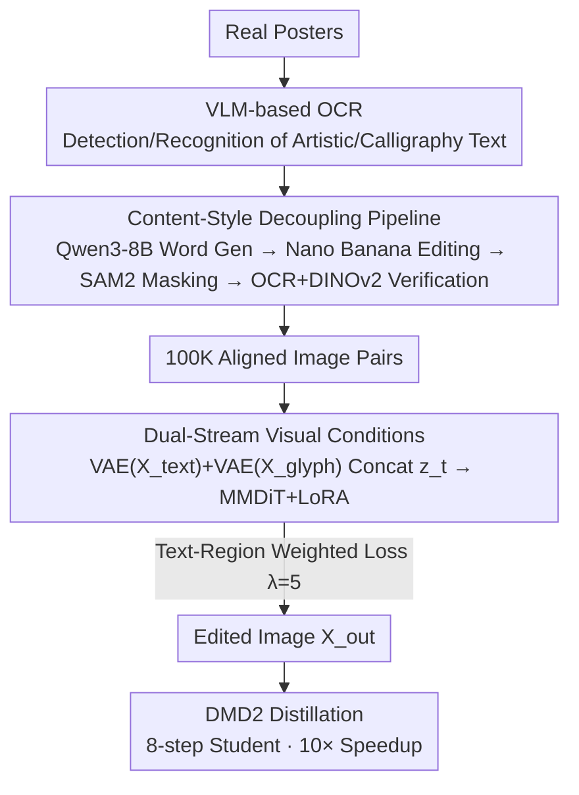

# SkyReels-Text: Fine-Grained Font-Controllable Text Editing for Poster Design

**Conference**: CVPR 2026  
**arXiv**: [2511.13285](https://arxiv.org/abs/2511.13285)  
**Code**: https://github.com/SkyworkAI/SkyReels-Text (Available)  
**Area**: Diffusion Models / Image Editing / Visual Text Generation  
**Keywords**: Text Editing, Font Controllability, Poster Design, Dual-stream Visual Conditioning, Style-Content Decoupling

## TL;DR
SkyReels-Text models "text replacement" as a region-level editing task. By using a user-cropped glyph patch as an explicit visual condition injected through a dual-stream VAE, it achieves zero-shot font transfer. This approach accurately replaces text content while precisely replicating arbitrary fonts (including handwriting and artistic styles), achieving SOTA in text fidelity and font consistency across multiple benchmarks.

## Background & Motivation
**Background**: The core requirement of poster design is to "quickly and accurately change text without destroying the original layout and font temperament." Current technical routes include: 1) General diffusion editing models (FLUX.1 Kontext, Qwen-Image-Edit, Seedream 4.0, Nano Banana) that edit images via natural language instructions; 2) Specialized visual text editing models (FLUX-Text, TextFLUX) that inject rendered glyphs and position masks into the DiT backbone to ensure correct spelling.

**Limitations of Prior Work**: General editing models often **fail to correct content or match fonts** even when reference glyphs are provided as visual context—either the semantics are destroyed or the generated text positioning/layout is inaccurate, lacking professional typesetting precision. Specialized models ensure spelling but **lack a mechanism to receive arbitrary font styles**: they are restricted to standard font libraries or internal glyph priors, unable to make the output precisely mimic a user-provided reference font image.

**Key Challenge**: Text editing must simultaneously satisfy two orthogonal constraints: **content correctness** (what to write) and **style faithfulness** (how the font looks). Existing methods either focus only on content (spelling) or are limited to preset styles, failing to use "arbitrary user-provided fonts" as fine-grained explicit conditions, leading to entanglement of content and style within the model.

**Goal**: To achieve font-controllable editing without font labels or test-time fine-tuning. By providing a cropped glyph patch (even if the font is not in any standard library), the model should replace text in a designated area with target content while strictly replicating the reference font. It must also support simultaneous editing of **multiple regions with different fonts** in a single image.

**Key Insight**: Ours reformulates font-controllable editing as a "region modification task with target visual conditions." The key insight is that instead of using vague guidance like text prompts or internal glyph priors, it is better to feed "content" and "style" as two streams of **explicit visual conditions** to provide unambiguous priors to the model.

**Core Idea**: Use dual-stream visual conditions (a plain-text reference image for content/layout + a glyph map for font). After encoding via a frozen VAE, these are concatenated with the noise latent along the sequence dimension, allowing the model to directly attend to content and font examples for zero-shot font transfer.

## Method

### Overall Architecture
SkyReels-Text aims to solve the problem: "Given a source poster, several text instances to be edited $(t_i, r_i, g_i)$ (target text, region, reference glyph), and a text prompt $y$, generate an edited image $X_{out}$ where the original text regions are replaced with target text in a visually consistent font." The system consists of two major parts: an **offline data production pipeline** (creating 100K aligned image pairs with decoupled content and style) and an **online dual-stream conditional editing model** (LoRA fine-tuning on Qwen-Image-Edit).

The key to the data side is "content-style decoupling": high-quality text instances are identified from real posters using a self-trained VLM-OCR. Qwen3-8B generates replacement words with **completely different semantics** (maximizing content decoupling), Nano Banana replaces the content while preserving font/color/alignment, SAM2 extracts compact masks, and finally, dual verification via OCR (content) and DINOv2 feature similarity (style) ensures high-quality image pairs. During inference, the model inpaints the target text into the source region for a plain-text reference $X_{text}$ (controlling content/layout) and renders the reference glyph onto a canvas for a glyph map $X_{glyph}$ (controlling font). Both are encoded by a frozen VAE and concatenated with noise latent $z_t$ for the MMDiT with LoRA, while Qwen2.5-VL processes multimodal instructions. Training utilizes a text-region weighted loss, and the model is distilled via DMD2 into an 8-step student for over 10× acceleration.

### Key Designs

**1. Dual-Stream Visual Conditioning Mechanism: Explicitly Decoupling Content and Font**

This is the core innovation, addressing the pain point of content-style entanglement and vague text prompts. Instead of relying on prompts or internal priors, the conditions are decoupled into two images: a plain-text reference $X_{text}$ (inpainting target text $t_i$ into the original context to establish "what to write and where") and a glyph map $X_{glyph}$ (rendering the reference glyph $g_i$ onto a canvas to establish "font appearance").

The injection is lightweight: rather than using heavy embedding modules or ControlNet, features from both images are extracted using a **frozen VAE encoder** and concatenated with the noise latent along the sequence dimension:

$$Z_{in} = \text{Concat}\big(z_t,\ \text{VAE}(X_{text}),\ \text{VAE}(X_{glyph})\big).$$

This allows the model to attend directly to content and font tokens during denoising. The VAE serves as a strong pre-trained visual compressor, and treating the font as an "explicit visual example" rather than a "label/category" enables zero-shot transfer of stroke styles, even for fonts not found in any library.

**2. VLM-based OCR: Enabling the Pipeline to "Read" Calligraphy and Artistic Fonts**

The bottleneck of the data pipeline is OCR. Standard OCR engines are optimized for clean, regular fonts and fail on irregular calligraphy or custom artistic glyphs. Ours fine-tunes Qwen2.5-VL 7B as a specialized OCR (approx. 72 A100-hours) to parse non-standard text patterns visually and semantically. It serves three roles: detecting/recognizing text instances during data filtering, verifying content accuracy during training, and calculating evaluation metrics (Sen. Acc / NED).

**3. Content-Style Decoupling Pipeline: Creating 100K "Same Style, Different Content" Pairs**

To prevent "content interference"—where the model confuses character features with style—ours uses a pipeline to enforce decoupling. After identifying text instances, Qwen3-8B generates replacement words that are **semantically divergent** from the original and ensures the new and old word sets do not overlap. Nano Banana then performs the edit while retaining font, color, and layout. Dual-Verification (VLM-OCR for content and DINOv2 for style similarity) ensures high-fidelity pairs where only content changes, forcing the model to learn to transfer style independently.

**4. Text-Region Weighted Loss: Focusing Optimization on the Text Area**

Text regions usually occupy less than 10% of pixels. Uniform optimization across all pixels dilutes text convergence. Ours applies spatial re-weighting based on a text mask $M$:

$$\mathcal{L} = \mathbb{E}\Big[\,\|X_{gt}-\hat{X}\|_2^2 \odot (1 + \lambda \cdot M)\,\Big],$$

where $\lambda=5$ amplifies text region loss. This ensures high glyph precision without destroying the background. Ablations show that while larger $\lambda$ increases text accuracy, $\lambda=5$ provides the best balance between text convergence and background fidelity (B-PSNR).

**5. DMD2 Distillation: 10× Faster Inference via 8-Step Student**

To accelerate inference without sacrificing font control quality, the model is distilled using Distribution Matching Distillation (DMD2) into an 8-step student. This reduces sampling steps and eliminates the need for classifier-free guidance, achieving over 10× speedup for faster poster design workflows.

### Loss & Training
- **Backbone & Fine-tuning**: Based on Qwen-Image-Edit, fine-tuned with LoRA (rank=64); batch size 64, AdamW, learning rate $10^{-4}$, 2 epochs, approx. 512 A100-hours.
- **OCR Fine-tuning**: Qwen2.5-VL 7B, learning rate $10^{-4}$, approx. 72 A100-hours.
- **Main Loss**: Text-region weighted reconstruction loss, $\lambda=5$.
- **Acceleration**: DMD2 distillation into an 8-step student model.

## Key Experimental Results

### Main Results

Comparison on the SkyReels-Text Benchmark (200 samples, various font styles):

| Method | Sen. Acc↑ | NED↑ | Spatial↑ | DINO↑ | B-PSNR↑ |
|------|-----------|------|----------|-------|---------|
| Nano Banana | 0.7290 | 0.9195 | 0.7011 | 0.8125 | 28.78 |
| Seedream 4.0 | 0.7772 | 0.9348 | 0.6844 | 0.7629 | 25.50 |
| FLUX-Kontext-Pro | 0.6390 | 0.8458 | 0.5063 | 0.8130 | 27.21 |
| Qwen-Image-Edit | 0.7760 | 0.9337 | 0.5845 | 0.8209 | 25.88 |
| FLUX-Text | 0.8266 | 0.9352 | 0.7503 | 0.6679 | **34.53** |
| Calligrapher | 0.6404 | 0.8811 | 0.7281 | 0.7162 | 24.26 |
| **Ours** | **0.8334** | **0.9502** | **0.7506** | **0.8503** | 34.17 |

> Metrics: **Sen. Acc** and **NED** (Normalized Edit Distance) use fine-tuned Qwen2.5-VL 7B to measure text fidelity; **Spatial** measures IoU of detection boxes; **DINO** measures font style similarity; **B-PSNR** measures background preservation. Ours lead across text fidelity, font style, and layout.

Ours also achieves the best results on the AnyText benchmark (1000 images, Chinese and English):

| Data | Method | Sen. Acc↑ | NED↑ | FID↓ | LPIPS↓ |
|------|------|-----------|------|------|--------|
| English | FLUX-Text | 0.8419 | 0.9400 | 13.85 | 0.0729 |
| English | **Ours** | **0.8536** | **0.9406** | **6.12** | **0.0246** |
| Chinese | FLUX-Text | 0.7132 | 0.8510 | 13.68 | 0.0541 |
| Chinese | **Ours** | **0.7710** | **0.8764** | **5.44** | **0.0192** |

Zero-shot handwriting generation (IAM / CVL, without specialized training):

| Dataset | Method | HWD↓ | IS↑ | GS↓(×10⁻³) |
|--------|------|------|-----|------------|
| IAM | DiffBrush | 1.41 | 1.85 | 2.35 |
| IAM | **Ours** | **1.32** | **1.90** | **1.26** |
| CVL | DiffBrush | 1.06 | 1.70 | 29.6 |
| CVL | **Ours** | **0.89** | 1.71 | 31.0 |

> **HWD** (Handwriting Distance) measures style fidelity. Ours outperforms specialized handwriting models like DiffBrush even in a zero-shot setting.

### Ablation Study

| Configuration | Sen. Acc↑ | NED↑ | Spatial↑ | DINO↑ | B-PSNR↑ |
|------|-----------|------|----------|-------|---------|
| w/o FSR | 0.9327 | 0.9734 | 0.6986 | 0.6995 | 33.61 |
| w/ FSR (Full) | 0.8334 | 0.9502 | 0.7506 | **0.8503** | 34.17 |
| λ=0 | 0.7998 | 0.9378 | 0.7501 | 0.8473 | 34.28 |
| λ=5 | 0.8334 | 0.9502 | 0.7506 | **0.8503** | 34.17 |
| λ=10 | **0.8363** | **0.9558** | 0.7503 | 0.8502 | 33.13 |

### Key Findings
- **Font Reference (FSR) is the source of font consistency but has a trade-off with spelling accuracy**: Adding FSR increases DINO style scores (from 0.6995 to 0.8503) and Spatial scores, but Sen. Acc/NED slightly decrease. This is likely because highly stylized fonts are harder for current OCR engines to parse, not because the generation quality is lower.
- **Weighted loss $\lambda$ improves text accuracy, with $\lambda=5$ being optimal**: Since text occupies few pixels, $\lambda>0$ is necessary for fidelity. Larger $\lambda$ increases Sen. Acc, but $\lambda=5$ provides the best balance for Spatial and DINO scores while maintaining high B-PSNR compared to $\lambda=10$.
- **Strong zero-shot generalization**: Despite no handwriting-specific training, the model outperforms specialized models on IAM/CVL using only a reference patch, proving the effectiveness of explicit visual exemplars for unseen font transfer.

## Highlights & Insights
- **"Font as a Reference Patch" Paradigm Shift**: Treating font as a visual exemplar instead of a label allows zero-shot transfer for any font (calligraphy, custom, etc.), a significant advance over internal glyph prior methods like FLUX-Text.
- **Lightweight Condition Injection**: Using frozen VAE encoding and sequence concatenation instead of ControlNet or heavy embeddings simplifies training while effectively leveraging pre-trained visual compression.
- **Data Decoupling over Model Design**: The success stems from the "same style, different content" data pairs. The Qwen3-8B + DINOv2 verification pipeline is a valuable recipe for creating decoupled data for various style transfer tasks.

## Limitations & Future Work
- **Text Fidelity Limited by OCR Evaluators**: Sen. Acc/NED metrics are bounded by the OCR's ability to read highly stylized artistic fonts, creating a metric paradox where "better style leads to lower spelling scores."
- **Dependency on External Models**: The pipeline relies on multiple external models (Qwen3, Nano Banana, SAM2, DINOv2), which limits reproduction ease and tethers data quality to these components.
- **Multi-region Interaction**: While supporting multiple fonts, the boundary of multi-region font interference hasn't been fully quantified.

## Related Work & Insights
- **vs FLUX-Text / TextFLUX**: While they ensure spelling through internal priors, they lack arbitrary font control. Ours significantly leads in font style consistency (DINO 0.8503 vs 0.6679).
- **vs Calligrapher**: Ours does not require separate training for calligraphy/handwriting, outperforming specialized methods in zero-shot handwriting fidelity.
- **vs AnyText**: Ours expands font control from a finite set to an infinite set of unseen fonts by replacing labels/libraries with visual patches.

## Rating
- Novelty: ⭐⭐⭐⭐ 
- Experimental Thoroughness: ⭐⭐⭐⭐⭐ 
- Writing Quality: ⭐⭐⭐⭐ 
- Value: ⭐⭐⭐⭐⭐ 

<!-- RELATED:START -->

## Related Papers

- [\[CVPR 2026\] PosterIQ: A Design Perspective Benchmark for Poster Understanding and Generation](posteriq_a_design_perspective_benchmark_for_poster_understanding_and_generation.md)
- [\[CVPR 2026\] PromptEnhancer: Taming Your Rewriter for Text-to-Image Generation via Fine-Grained Reward](promptenhancer_taming_your_rewriter_for_text-to-image_generation_via_fine-graine.md)
- [\[CVPR 2026\] SliderEdit: Continuous Image Editing with Fine-Grained Instruction Control](slideredit_continuous_image_editing_with_fine-grained_instruction_control.md)
- [\[CVPR 2026\] CogniEdit: Dense Gradient Flow Optimization for Fine-Grained Image Editing](cogniedit_dense_gradient_flow_optimization_for_fine-grained_image_editing.md)
- [\[CVPR 2026\] SpatialReward: Verifiable Spatial Reward Modeling for Fine-Grained Spatial Consistency in Text-to-Image Generation](spatialreward_verifiable_spatial_reward_modeling_for_fine-grained_spatial_consis.md)

<!-- RELATED:END -->
