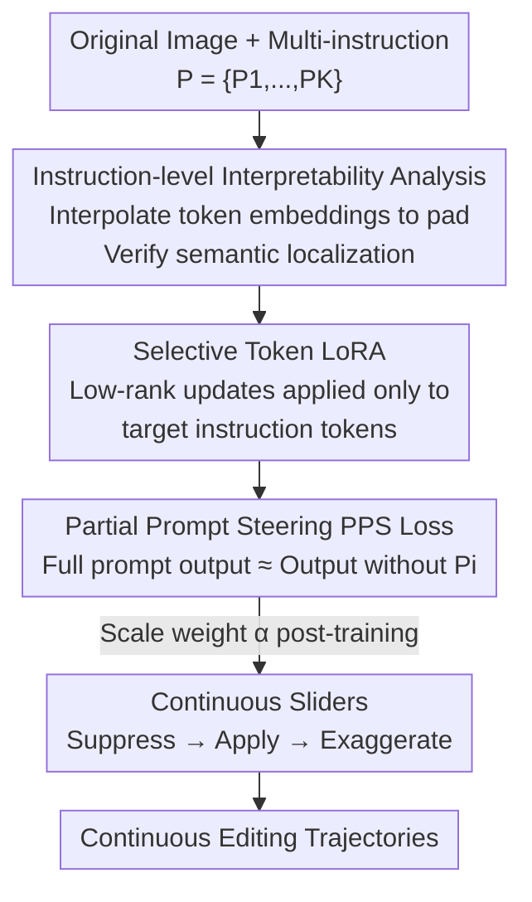

# SliderEdit: Continuous Image Editing with Fine-Grained Instruction Control

**Conference**: CVPR 2026  
**Paper**: [CVF Open Access](https://openaccess.thecvf.com/content/CVPR2026/html/Zarei_SliderEdit_Continuous_Image_Editing_with_Fine_Grained_Instruction_Control_CVPR_2026_paper.html)  
**Code**: None (Project Page: https://armanzarei.github.io/SliderEdit)  
**Area**: Image Generation / Instruction-based Image Editing  
**Keywords**: Instruction-based Image Editing, Continuous Control, LoRA, Prompt Steering, MMDiT

## TL;DR
SliderEdit introduces "sliders" for each sub-instruction in instruction-based image editing models (e.g., FLUX-Kontext, Qwen-Image-Edit). By utilizing a shared set of Low-Rank Adaptors combined with a partial prompt steering loss, it allows users to continuously and decouply adjust the intensity of each edit—from zero application to exaggerated levels—without requiring separate training for each attribute.

## Background & Motivation

**Background**: Instruction-based editing models, represented by FLUX-Kontext and Qwen-Image-Edit, can handle various edits from global styles to local details within a unified framework. Users can modify images by simply providing natural language instructions. These models are built on MMDiT (Multi-modal Diffusion Transformer), where text tokens and image tokens interact via shared attention.

**Limitations of Prior Work**: Such models are inherently **discrete and all-or-nothing**—given a prompt, they output a result with a fixed intensity. For instance, with the instruction "Make the dragon skin golden and let it breathe fire," the model cannot allow the user to choose between "slightly golden" and "bright metallic gold," nor can it transition the flame from a "small flicker" to a "massive explosion." Repeated sampling only produces random variations rather than **systematic, continuous** adjustments to specific instruction intensities.

**Key Challenge**: While continuous attribute control (e.g., Concept Sliders) exists, most methods **train a separate LoRA or embedding direction for every attribute**, which leads to attribute entanglement and performance degradation during multiple edits. Furthermore, these are primarily designed for text-to-image and yield limited results when transferred to real image editing. In other words, it is difficult to achieve "continuous control" while maintaining a "general-purpose, training-free per attribute, multi-instruction" workflow.

**Goal**: To extend SOTA instruction editing models to support **continuous, decoupled, and interpretable** per-instruction intensity control. Given a multi-instruction prompt $P=\{P_1,\dots,P_K\}$, the goal is to associate a scaling coefficient for each instruction $P_i$ that allows smooth sliding between "suppression (intensity 0) → full application (intensity 1) → exaggeration (>1)."

**Key Insight**: The authors observe that the latent representations of MMDiT **locally encode instruction semantics within their corresponding text token embeddings**. Locating and selectively modulating these tokens allows fine-grained control over the influence of a single instruction on the output. An interpolation experiment confirms this: by linearly interpolating target instruction token embeddings toward a pad token, the edit intensity diminishes smoothly while other edits remain largely unaffected.

**Core Idea**: Train **a single shared set** of low-rank adaptors (rather than per-attribute LoRAs) using a "partial prompt steering" loss to learn how to "nullify the visual effect of a specific instruction." Once trained, continuous sliders for each instruction are obtained by continuously scaling the weights of these LoRAs.

## Method

### Overall Architecture

The input to SliderEdit is an original image $X_{orig}$ and a multi-instruction prompt $P=\{P_1,\dots,P_K\}$. The output is an **editing model with intensity knobs**: for any instruction $P_i$, the user can continuously adjust its intensity via a scaling coefficient. The pipeline consists of three steps: ① Interpretability analysis to confirm that instruction semantics are localized in corresponding token embeddings; ② Formalizing "suppression of an instruction" into an adapter $M_\theta(P_i)$, trained using a Partial Prompt Steering (PPS) loss to replicate the output of a prompt where $P_i$ is removed; ③ Implementing the adapter as a Selective Token LoRA that only acts on target instruction tokens. After training, the weights are scaled to transform the "suppressor" into a "continuous slider."

Training involves adding a set of Rank-16 low-rank matrices to a frozen base model, using 1k–8k samples and converging in a few hundred iterations, making it highly lightweight.

### Key Designs

**1. Instruction-level Interpretability Analysis: Proving "localized instruction semantics"**

To achieve fine control, one must identify where the influence of an instruction lies. The authors perform linear interpolation on the subset of tokens $\{y^\ell_u,\dots,y^\ell_{u'}\}$ corresponding to a target instruction $P_{target}$ at each attention layer $\ell$: $y^\ell_j \leftarrow (1-\beta)\, y^\ell_j + \beta\, y^\ell_{<pad>}$. Here, $\beta=1$ effectively replaces the instruction with an uninformative pad token, while $\beta=0$ preserves it. Experiments (Fig. 2 in the paper) show that as $\beta$ varies, the intensity of the corresponding edit weakens smoothly while others remain unchanged. This proves that instruction semantics are **highly localized** in their own token embeddings, and direct manipulation allows for fine control. However, the authors note that simple embedding interpolation provides limited and **insufficiently smooth** modulation, necessitating a more robust learnable mechanism.

**2. Partial Prompt Steering Loss (PPS / SPPS): Converting "intensity adjustment" into "learning to erase an instruction"**

The core training objective is to teach the adapter $M_\theta(P_i)$ to "neutralize" the visual effect of an instruction. This is achieved by taking the frozen base model $\epsilon$ and running it with a prompt where the $i$-th instruction is **removed** to get a reference direction. The model with the adapter, fed the **full prompt**, is then required to match this output:

$$\mathcal{L}_{PPS} = \big\| \epsilon_{M_\theta(P_i)}(Z, X_{orig}, P) - \epsilon(Z, X_{orig}, P\setminus\{P_i\}) \big\|$$

Where $Z$ is the noise latent. Intuitively, this teaches the adapter to "act as if the instruction does not exist despite being fed the full prompt." This objective is **self-supervised and requires no extra labeling**, as the supervision signal is generated by the base model itself. A simplified variant, SPPS, treats the entire prompt as a single instruction $P=\{P_1\}$. Despite its simplicity, the adapter trained with SPPS shows **stronger generalization** and robustness even in multi-instruction scenarios. Thus, SPPS is used by default for training.

**3. Selective Token LoRA (STLoRA) and Global Variant GSTLoRA: Restricting updates to specific tokens**

The adapter $M_\theta$ is instantiated as **Selective Token LoRA**—a token-aware lightweight adapter. For a linear projection $z'=W^\ell z$, it introduces low-rank matrices $\Delta W^\ell = B^\ell A^\ell$, but **only applies this update to tokens belonging to the target instruction** $P_i$: $z'_{target}=(W^\ell+\Delta W^\ell)z_{target}$, while $z'_{others}=W^\ell z_{others}$. This selectivity ensures that modifying one instruction does not contaminate other tokens, which is key to "decoupled control." For **single-instruction** scenarios, the authors provide **GSTLoRA** (Globally Selective Token LoRA), which applies the update to **all** text and image tokens to leverage global context, often resulting in smoother trajectories.

**4. Scaling LoRA Weights → Continuous Sliders (with Extrapolation)**

A trained LoRA naturally supports continuous control. Let $M^\alpha_\theta$ be the adapter where each layer's update is scaled by $\alpha\Delta W^\ell$. By varying $\alpha$ within a range $[\alpha_{min},\alpha_{max}]$, a smooth spectrum of effects is achieved—from full suppression ($\alpha=1$) to full application ($\alpha=0$), and even **extrapolating to $\alpha<0$ for exaggerated edits**. Note that $\alpha$ is inversely related to the intensity coefficient $\beta$ defined in the background, specifically $\alpha = 1-\beta$. This step seamlessly converts "suppression capability learned during training" into "draggable sliders during inference" without retraining.

### Loss & Training
- Base models FLUX-Kontext and Qwen-Image-Edit are frozen; only low-rank adapters (Rank 16) are trained.
- $\mathcal{L}_{SPPS}$ is used by default for better generalization; $\mathcal{L}_{PPS}$ is used for STLoRA in multi-instruction scenarios.
- Training data: 1k–8k subsets of the GPT-Image-Edit dataset.
- STLoRA trained for 1000 steps (converges in ~400), GSTLoRA on FLUX trained for only 300 steps.

## Key Experimental Results

An evaluation benchmark for face editing was constructed: various subjects × various edit directions (e.g., "make hair curly," "make hair longer"), selecting samples where the target attribute was initially missing. Each edit was sampled in $\delta=15$ steps within $[\alpha_{min},\alpha_{max}]$ to form an editing space for quantifying **continuity, extrapolation, and disentanglement**.

### Main Results (Single instruction $\gamma=1$, $\delta=15$, based on FLUX-Kontext)

| Method | Continuity-CLIP ↑ | Continuity-SigLIP ↑ | Disent. LPIPSalex ↓ | Disent. ID ↓ |
|------|------|------|------|------|
| Concept Slider | 0.1803 | 0.2071 | 0.2174 | 0.7091 |
| Cont. Attr. Control | 0.1891 | 0.2167 | 0.1973 | 0.5519 |
| Implicit CFG | 0.1547 | 0.1906 | 0.2149 | 0.2748 |
| Explicit CFG | 0.1993 | 0.2263 | 0.2465 | 0.3415 |
| SliderEdit-STLoRA | 0.2538 | 0.2495 | **0.1902** | **0.2550** |
| SliderEdit-GSTLoRA | **0.2998** | **0.3062** | 0.1868 | 0.2675 |

GSTLoRA leads significantly in continuity (CLIP 0.2998 vs Explicit CFG 0.1993) while maintaining strong disentanglement and satisfying extrapolation. The two prior slider methods (Concept Slider / Cont. Attr. Control) suffer from significant ID drift due to their reliance on inversion (ID distance 0.55–0.71 vs. ~0.26 for Ours).

### Key Findings
- **Smoothness of GSTLoRA is a major highlight**: Compared to the "jumps" in Implicit/Explicit CFG, GSTLoRA's similarity scores rise progressively with $\alpha$, with smaller ID drift.
- **SPPS is more generalizable than PPS**: Treating multi-instructions as a single instruction during training yields more robust adapters, which is a counter-intuitive but practical finding.
- There exists an inherent **trade-off between continuity, extrapolation, and disentanglement**—no single configuration maximizes all three simultaneously.

## Highlights & Insights
- **"Intensity adjustment" is elegantly remapped to "learning to delete an instruction"**: The PPS loss uses the base model's own output (without the instruction) as supervision. It is fully self-supervised and avoids the need for manual intensity labeling.
- **A shared LoRA handles all attributes**: Unlike Concept Sliders' per-attribute training, SliderEdit learns a single set of matrices that generalizes to diverse edits and unseen attributes, offering better scalability.
- **Token selectivity is the physical basis for disentanglement**: STLoRA only modifies target token embeddings, turning "editing A without affecting B" into a structural guarantee rather than just a loss constraint.
- **LoRA weight scaling as a natural knob**: By learning "suppression" and then scaling the coefficient, the model produces a continuous spectrum and supports exaggeration, repurposing known LoRA properties for a new task.

## Limitations & Future Work
- The paper explicitly notes the **three-way trade-off between continuity, extrapolation, and disentanglement**.
- Quantitative evaluation is primarily focused on **facial editing benchmarks**; broader object/scene editing is mostly qualitative.
- Metrics rely on VLM (CLIP/SigLIP) similarity scores as proxies, which may contain inherent biases.
- While verified on FLUX-Kontext and Qwen-Image-Edit (MMDiT), seamless transfer to other architectures remains to be confirmed.

## Related Work & Insights
- **vs Concept Sliders / Continuous Attribute Control**: These methods train independent LoRAs per attribute and rely on inversion for T2I; SliderEdit uses a **shared adapter** for direct instruction-based editing on real images, maintaining significantly better ID consistency.
- **vs Explicit / Implicit CFG**: CFG-based methods adjust intensity via guidance scale, which is coarse and can lead to sudden trajectory changes. Crucially, **CFG cannot separately control individual instructions in a multi-instruction prompt**, whereas STLoRA achieves this via token selectivity.
- **Insight**: The paradigm of "using the base model's output after removing a condition as a self-supervision target" can be extended to any controllable generation scenario requiring fine-grained intensity adjustment (e.g., layout, style, or camera angle).

## Rating
- Novelty: ⭐⭐⭐⭐⭐ First framework for continuous, decoupled, and interpretable intensity control in instruction-based editing.
- Experimental Thoroughness: ⭐⭐⭐⭐ Solid multi-metric and multi-baseline comparisons, though quantitative data is face-centric.
- Writing Quality: ⭐⭐⭐⭐ Clear logical progression from interpretability observations to the proposed method.
- Value: ⭐⭐⭐⭐⭐ Provides a lightweight, plug-and-play upgrade for SOTA editing models to achieve continuous control.

<!-- RELATED:START -->

## Related Papers

- [\[CVPR 2026\] Kontinuous Kontext: Continuous Strength Control for Instruction-based Image Editing](kontinuous_kontext_continuous_strength_control_for_instruction-based_image_editi.md)
- [\[CVPR 2026\] CogniEdit: Dense Gradient Flow Optimization for Fine-Grained Image Editing](cogniedit_dense_gradient_flow_optimization_for_fine-grained_image_editing.md)
- [\[CVPR 2026\] SkyReels-Text: Fine-Grained Font-Controllable Text Editing for Poster Design](skyreels-text_fine-grained_font-controllable_text_editing_for_poster_design.md)
- [\[CVPR 2026\] Head-wise Adaptive Rotary Positional Encoding for Fine-Grained Image Generation](head-wise_adaptive_rotary_positional_encoding_for_fine-grained_image_generation.md)
- [\[CVPR 2026\] DreamOmni2: Multimodal Instruction-based Generation and Editing](dreamomni2_multimodal_instruction-based_generation_and_editing.md)

<!-- RELATED:END -->
