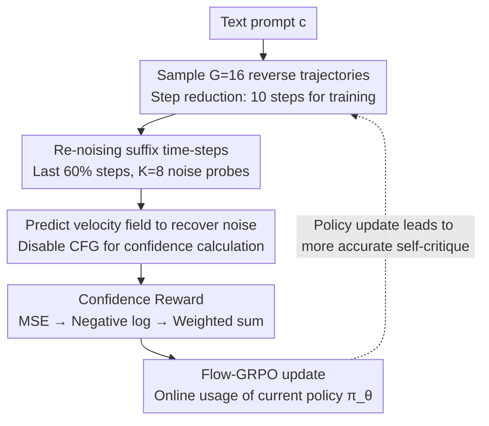

# SOLACE: Improving Text-to-Image Generation with Intrinsic Self-Confidence Rewards

**Conference**: CVPR 2026  
**arXiv**: [2603.00918](https://arxiv.org/abs/2603.00918)  
**Code**: [https://wookiekim.github.io/SOLACE/](https://wookiekim.github.io/SOLACE/)  
**Authors**: Seungwook Kim, Minsu Cho (POSTECH / RLWRLD)  
**Area**: Diffusion Models / Image Generation / Post-training  
**Keywords**: Text-to-Image, Self-Confidence Rewards, Flow-GRPO, External Reward-free, Post-training Alignment  

## TL;DR
The denoising self-confidence of a T2I model (its precision in recovering injected noise) is utilized as an intrinsic reward for post-training, substituting external reward models. This approach yields consistent improvements in compositional generation, text rendering, and image-text alignment, while complementing external rewards to mitigate reward hacking.

## Background & Motivation
T2I post-training is a crucial paradigm for enhancing generation quality, typically driven by reinforcement learning via external reward signals (e.g., PickScore, HPSv2). However, three core pain points exist:
1.  **Difficulty in Defining External Rewards**: High-quality images must satisfy diverse, weakly correlated criteria such as compositionality, text rendering, aesthetics, and alignment, with varying weights across scenarios.
2.  **Reward hacking**: Optimization against a single external metric often leads to overfitting—target scores increase while non-target capabilities degrade (e.g., PickScore rises while compositionality fails).
3.  **Cost and Complexity**: Human preference reward models require large-scale annotated training and additional evaluation model overhead during training, complicating the pipeline.

**Core Problem**: Can a T2I generator provide meaningful post-training signals itself? Large-scale pre-training has already endowed models with strong priors regarding real image distributions and image-text alignment—the model should be more "confident" when producing high-quality outputs.

## Core Idea
Inspired by Score Distillation Sampling (SDS)—which uses a pre-trained T2I model as a critic for text-to-3D—SOLACE internalizes this concept: **Let the T2I model critique its own generation**.
Specifically, noise is re-injected into the latent representation generated by the model, and the model's precision in recovering that noise is measured. Higher recovery accuracy $\rightarrow$ higher "confidence" in its output $\rightarrow$ higher reward.

## Method

### Overall Architecture

SOLACE aims to determine if a T2I generator can provide its own reward signals for post-training without relying on external preference models. The **Mechanism** involves "self-evaluation": re-noising the generated latent representations and observing how accurately the model recovers this noise. Higher recovery accuracy indicates higher "confidence" and reward, which is calculated in the latent space and fed directly to Flow-GRPO.

Given a text prompt $c$, the process for one iteration is: first, sample $G=16$ independent reverse trajectories to obtain a batch of terminal latent representations $\{z_0^{(i)}\}_{i=1}^G$; draw $K=8$ shared noise probes $\epsilon^{(m)} \sim \mathcal{N}(0,I)$ (antithetic pairing ensures zero mean); for each $z_0^{(i)}$, re-noise at specific time-steps $t \in \mathcal{T}$ via $z_t^{(i,m)} = (1-t)z_0^{(i)} + t\epsilon^{(m)}$; let the model predict the velocity field $v_\theta(z_t^{(i,m)}, t, c)$ to reconstruct the noise estimate $\hat{\epsilon}_\theta = v_\theta + z_0^{(i)}$; finally, calculate the self-confidence reward from the recovery error for Flow-GRPO. Crucially, the pipeline includes stabilization and efficiency designs: optimizing only suffix time-steps, disabling CFG for reward calculation, using an online policy instead of a frozen reference, and reducing denoising steps.

### Key Designs

**1. Self-Confidence Reward: Using Denoising Recovery Accuracy as Intrinsic Reward**

Since external rewards are difficult to define and prone to hacking, SOLACE derives rewards from the model's own denoising capability. For each sample $z_0^{(i)}$, the mean reconstruction error for $K$ probes is calculated at each time-step, followed by a negative log transformation and weighted summation across time-steps:
$$\text{MSE}_{i,t} = \frac{1}{K}\sum_{m=1}^K \|\hat{\epsilon}_\theta(z_t^{(i,m)}, t, c) - \epsilon^{(m)}\|_2^2$$
$$S_{i,t} = -\log(\text{MSE}_{i,t} + \delta)$$
$$R_{\text{SOLACE}}(z_0^{(i)}, c) = \frac{1}{\sum_{t\in\mathcal{T}} w(t)} \sum_{t\in\mathcal{T}} w(t) S_{i,t}$$
The negative log transformation accomplishes three goals: approximating Gaussian log-likelihood, compressing outliers, and making scores additive across time-steps (practically $w(t)=1$). The underlying rationale is that large-scale pre-training encodes a strong prior of real image distributions; thus, recovery accuracy encodes a judgment of image quality without external labels.

**2. Suffix Time-step Training: Optimizing only the latter 60% of denoising steps**

Directly optimizing the entire trajectory can push the model toward "easy-to-predict noise" regions, leading to collapse. SOLACE only optimizes the trajectory for the last 60% ($\rho=0.6$) of denoising steps, excluding early stages where cheating is easier; exceeding this ratio ($\rho>0.6$) triggers collapse.

**3. Disabling CFG for Confidence Calculation: Avoiding Optimization of Guided Proxies**

CFG constructs a mixed field $v_\text{cfg} = v_\text{uncond} + s(v_\text{cond} - v_\text{uncond})$. Using it for confidence calculations optimizes a guidance proxy rather than the base conditional policy, inducing hacking. Consequently, CFG is disabled during the reward calculation phase (ablation shows GenEval drops from 0.71 to 0.68 with CFG).

**4. Online vs. Offline Calculation: Using the Current Policy**

Self-confidence is calculated using the policy $\pi_\theta$ currently under training, rather than a frozen $\pi_\text{ref}$. As the model improves, its self-evaluation becomes more accurate, forming a positive feedback loop; the offline version's fixed evaluation capability leads to inferior performance (GenEval 0.71 vs 0.69).

**5. Denoising Step Reduction: 10 steps for training, 40 for inference**

During the reward calculation phase, denoising steps are compressed from 40 (inference) to 10, significantly accelerating training with negligible quality loss.

### Loss & Training
- Optimizer: AdamW, lr=3e-4
- LoRA: rank=32, $\alpha=64$
- KL Regularization: $\beta=0.04$
- GRPO group size: $G=16$
- Noise probes: $K=8$ (antithetic pairs)
- Training iterations: 2000
- Resolution: 512×512
- Inference CFG: 7.0
- Hardware: 8×NVIDIA RTX PRO 6000 Blackwell

## Key Experimental Results

### Main Results (SD3.5-M Baseline)

| Model | GenEval↑ | OCR↑ | CLIPScore↑ | Aesthetic↑ | PickScore↑ | HPSv2↑ | ImageReward↑ |
|------|----------|------|-----------|-----------|------------|--------|-------------|
| SD3.5-M | 0.65 | 0.61 | 0.282 | 5.36 | 22.34 | 0.279 | 0.84 |
| +SOLACE (**Ours**) | **0.71** | **0.67** | **0.288** | 5.39 | 22.41 | 0.278 | 0.87 |
| SD3.5-L | 0.71 | 0.68 | 0.289 | 5.50 | 22.91 | 0.288 | 0.96 |

**Key Finding**: SOLACE enables the 2.5B SD3.5-M to nearly match the 7.1B SD3.5-L on GenEval, OCR, and CLIPScore using less than 1/3 of the parameters.

### SOLACE + External Reward Complementarity

| Model | GenEval↑ | OCR↑ | CLIPScore↑ | PickScore↑ |
|------|----------|------|-----------|------------|
| SD3.5-M + FlowGRPO(GenEval) | **0.95** | 0.65 | 0.293 | 22.51 |
| + SOLACE | **0.92** | **0.71** | **0.294** | 22.50 |
| SD3.5-M + FlowGRPO(PickScore) | 0.54 | 0.68 | 0.278 | **23.50** |
| + SOLACE | 0.77 | **0.70** | 0.287 | 22.73 |

Superimposing SOLACE on FlowGRPO post-training with external rewards improves compositionality, text rendering, and alignment, with only slight drops in the target external metrics—**bridging intrinsic and extrinsic rewards while mitigating reward hacking**. Notably, PickScore post-training caused GenEval to plummet from 0.65 to 0.54, but SOLACE restored it to 0.77.

### Ablation Study
- **Noise Probes K**: Minimal difference between K=4/8/16; K=8 is slightly better and computationally efficient.
- **CFG for Confidence**: Using CFG causes performance drops (GenEval 0.68 vs 0.71), validating that guidance proxies should not be optimized.
- **Online vs. Offline**: Online consistently outperforms offline (GenEval 0.71 vs 0.69, OCR 0.67 vs 0.61).
- **Collapse Conditions**: (1) $\rho > 0.6$; (2) Disabling CFG during candidate sampling $\rightarrow$ produces textureless images.

### User Study
In ~1800 responses collected on PartiPrompts and HPSv2 prompts (20 participants), SOLACE was consistently preferred over the baseline SD3.5-M in terms of visual realism/attractiveness and text-image alignment.

## Highlights & Insights
- **Implicit Quality Priors in Pre-training**: A model's denoising ability encodes knowledge of what constitutes a "good image"; confidence is a usable intrinsic signal.
- **SDS to Self-Critique**: While SDS uses a T2I model to evaluate 3D generation, SOLACE internalizes this as self-critique—an elegant methodological transfer.
- **Intrinsic + Extrinsic Complementarity**: The two types of signals focus on different dimensions (confidence $\rightarrow$ composition/text; external $\rightarrow$ human preference); combined usage yields optimal results.
- **Refined Stabilization**: The suffix window, disabling CFG, and online calculation are essential; omitting any leads to collapse or poor performance.
- **Latent Space Operation**: Rewards are calculated entirely in the latent space, avoiding the overhead of decoding to pixels.

## Limitations & Future Work
- Weak correlation with human preference metrics means it cannot target specific alignment goals (e.g., aesthetics) in isolation.
- Only validated on flow matching architectures (SD3.5); applicability to autoregressive T2I models is unknown.
- Future work: (1) Extension to video and 3D generation for temporal/multi-view consistency; (2) Decoupling and calibrating intrinsic signals for task-level reward shaping.

## Related Work & Insights
- **vs FlowGRPO**: External rewards are targeted but prone to reward hacking and require extra models; SOLACE is independent of external models but less targeted.
- **vs DPO/ReFL**: Requires pairwise preference data or differentiable rewards; SOLACE is entirely unsupervised.
- **vs Intuitor (LLM)**: Extends confidence rewards from discrete LLM tokens to T2I continuous denoising trajectories for the first time—a non-trivial migration.
- **vs SDS**: SDS evaluates external generations (3D) using a pre-trained model; SOLACE evaluates its own generations (self-critique) using the active model.

## Rating
- **Novelty**: ⭐⭐⭐⭐ Using self-confidence as an intrinsic T2I reward is novel and theoretically grounded, though Intuitor has established precedents in LLMs.
- **Experimental Thoroughness**: ⭐⭐⭐⭐ Multiple benchmarks (GenEval/OCR/6 preference metrics) + User Study + Ablation + Multiple Models (SD3.5-M/L) + Complementarity experiments.
- **Writing Quality**: ⭐⭐⭐⭐ Clear problem definition, rigorous methodological derivation, and systematic ablation studies.
- **Value**: ⭐⭐⭐ Strong paradigm for "intrinsic signal post-training" even for those outside the direct image generation field.

<!-- RELATED:START -->

## Related Papers

- [\[CVPR 2026\] OSPO: Object-Centric Self-Improving Preference Optimization for Text-to-Image Generation](ospo_object-centric_self-improving_preference_optimization_for_text-to-image_gen.md)
- [\[CVPR 2026\] Self-Corrected Image Generation with Explainable Latent Rewards](self-corrected_image_generation_with_explainable_latent_rewards.md)
- [\[CVPR 2026\] Self-Evaluation Unlocks Any-Step Text-to-Image Generation](self-evaluation_unlocks_any-step_text-to-image_generation.md)
- [\[CVPR 2026\] LumiX: Structured and Coherent Text-to-Intrinsic Generation](lumix_structured_and_coherent_text-to-intrinsic_generation.md)
- [\[CVPR 2026\] OctoT2I: A Self-Evolving Agentic Text-to-Image Router](octot2i_a_self-evolving_agentic_text-to-image_router.md)

<!-- RELATED:END -->
