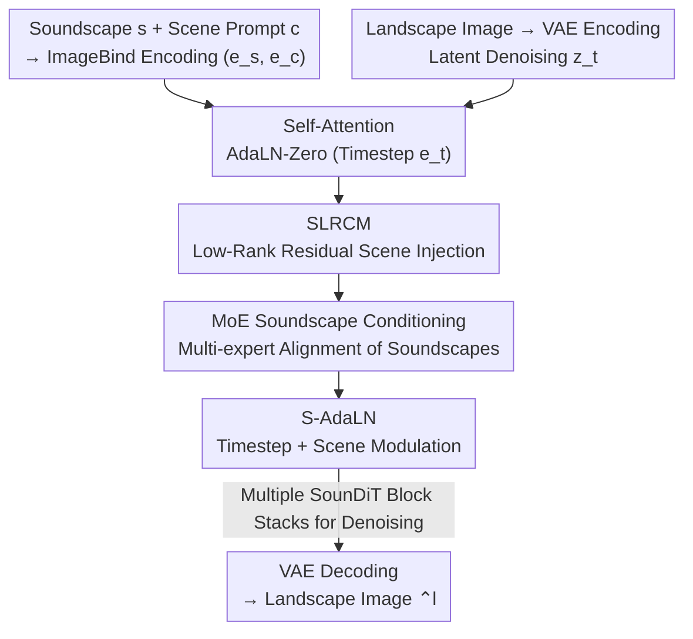

# SounDiT: Geo-Contextual Soundscape-to-Landscape Generation

**Conference**: CVPR 2026  
**Paper**: [CVF Open Access](https://openaccess.thecvf.com/content/CVPR2026/html/Wang_SounDiT_Geo-Contextual_Soundscape-to-Landscape_Generation_CVPR_2026_paper.html)  
**Code**: Project Page https://gisense.github.io/SounDiT-Page/  
**Area**: Diffusion Models / Image Generation / Cross-Modal Generation  
**Keywords**: Soundscape-to-Landscape Generation, Audio-to-Image, Diffusion Transformer, Mixture of Experts, Geographic Context

## TL;DR
This paper proposes a new task, "Geo-Contextual Soundscape-to-Landscape Generation" (GeoS2L)—synthesizing geographically realistic landscape images from environmental soundscapes (rather than individual physical sound-producing objects). To support this, the authors construct two large-scale paired soundscape-landscape datasets (SoundingSVI with 169K pairs and SonicUrban with 237K pairs), design a SounDiT model that injects both soundscape and scene context into a DiT backbone, and introduce a Place Similarity Score (PSS) evaluation framework to measure "geographic consistency." SounDiT significantly outperforms existing audio-to-image methods on metrics such as FID (reducing FID from 34 to 16, and 41 to 11).

## Background & Motivation
**Background**: Audio-to-Image (A2I) generation has achieved the ability to synthesize corresponding object images based on sound: painting a bird upon hearing chirping, or drawing a car upon hearing engine sounds. Mainstream approaches (such as Sound2Scene, AudioToken, GlueGen, CoDi, etc.) rely on general audio-visual datasets (containing object sounds, human voices, weather, and limited scene types) to map audio signals to their respective "sound sources."

**Limitations of Prior Work**: Fields like geography, urban planning, and environmental psychology are concerned not with "which specific bird or car" is present, but rather with the **environmental scene** where the sound occurs—e.g., whether bird chirps imply a forest trail or an urban green space, and whether car noises indicate a busy streetscape or a specific road. Existing A2I models bind sounds directly to sound-producing objects, thereby losing the geographic context vital for practical applications. Consequently, they often generate stylized or unrealistic images inconsistent with actual geographic environments. Even the few existing diffusion-based exploratory works in geographic A2I rely solely on soundscapes as the only input without introducing geographic context. Furthermore, modern architectures with powerful performance in image/video generation, such as Diffusion Transformers (DiTs), remain largely unexplored in A2I, let alone integrated with geographic knowledge.

**Key Challenge**: Soundscapes naturally contain insufficient information to uniquely determine a visual environment—a snippet of bird chirping could occur in either a rural park or an urban square. Relying solely on the acoustic modality cannot stably pin down "what category of place" it is. Moreover, existing evaluation metrics (FID, AIS, IIS) focus only on visual/acoustic fidelity and fail to measure whether the generated images belong to the same geographic scene category as the input soundscapes.

**Goal**: To upgrade A2I to Geo-Contextual Soundscape-to-Landscape Generation (GeoS2L), which, given an environmental soundscape $s$ and an optional scene prompt $c$ (e.g., park / beach / street), generates a landscape image $\hat{l}$ that is both visually realistic and geographically consistent with the actual landscape. Another goal is to establish an evaluation system capable of measuring this geographic consistency.

**Key Insight**: Soundscapes and landscapes co-exist in the same space, sharing the same environmental characteristics and place settings. Therefore, an **optional scene prompt** can resolve acoustic ambiguity. Furthermore, "scene context" can serve as an additional geographic condition to guide the diffusion process, shifting the evaluation from "how closely it resembles an image" to "whether they belong to the same type of place."

**Core Idea**: Simultaneously inject **soundscape conditions** (using a Mixture of Experts (MoE) for multi-level acoustic feature alignment) and **scene conditions** (injected at two locations via a Low-Rank Content Mixer (SLRCM) and a scene-conditioned AdaLN) into each block of the DiT backbone, while replacing pure visual fidelity metrics with the geographically and semantically aligned Place Similarity Score (PSS).

## Method

### Overall Architecture
SounDiT is a latent diffusion Transformer. The landscape image is first compressed into the latent space $e_l = E_L(l)$ using the VAE encoder of Stable Diffusion, where forward diffusion (noising) and reverse denoising are performed, and then reconstructed back to an image by the VAE decoder. On the conditioning side, a pre-trained multimodal encoder, ImageBind, encodes the soundscape $s$ and the scene prompt $c$ into a shared latent space, yielding the soundscape embedding $e_s$ and the scene embedding $e_c$.

The core lies in the **four-stage pipeline of each SounDiT block**: ① Multi-head self-attention conditioned on timestep embeddings $e_t$ is first executed (using AdaLN-Zero to maintain compatibility with the pre-trained DiT backbone); ② A lightweight **SLRCM** module creates a low-rank residual path within the block to inject scene context into the tokens; ③ An **MoE Soundscape Conditioning** module aligns multi-level soundscape features with visual tokens via multi-expert cross-attention; ④ Finally, **S-AdaLN** blends the timestep and scene embeddings to generate scale/shift parameters, applying scene-aware modulation to the tokens before passing them through a feed-forward network and adding them back via gated residuals to predict the noise residual. The scene condition is deliberately **injected twice—once before (SLRCM) and once after (S-AdaLN)** the MoE soundscape conditioning—to hierarchically fuse visual, scene, and soundscape cues.

### Key Designs

**1. MoE Soundscape Conditioning: Aligning Multi-level Soundscapes with Shared K/V + Expert-Specific Low-Rank Queries**

Soundscape information is multi-layered (e.g., the frequency bands of bird chirps versus the low-frequency rumble of traffic may correspond to different visual cues), which is difficult to handle simultaneously with a single cross-attention mechanism. This module uses $M$ experts with **shared keys $K_s$ and values $V_s$** ($K_s = s W_K,\ V_s = s W_V$, computed only once), but each expert maintains an **expert-specific low-rank query**: $Q_m = f(x)\,W^{(m)}_{q\downarrow} W^{(m)}_{q\uparrow}$ (where $f$ is token-wise LayerNorm). The output of each expert is $Z_m = \mathrm{MHA}(Q_m, K_s, V_s)\,W_O$ (where $W_O$ is shared across experts). Routing weights are determined by the temperature-scaled dot product of the audio summary and learnable prototypes $P$, enhanced with timestep injection: $w = \mathrm{Softmax}\!\big(\tfrac{1}{\tau} e_s^\top (P + W_t e_t \mathbf{1}^\top)\big)$. Finally, top-$k$ soft mixing is used to aggregate the outputs with a global audio gate: $x' = x + \gamma \sum_{m\in K} \mathrm{softmax}(w_m/\tau_m)\, Z_m$, where $\gamma = \tanh(e_s)$ is a zero-centered bounded scalar gate. The shared K/V keeps the computational budget constant, while the expert-specific queries enable "expert specialization" to capture different soundscape sub-structures, thereby enhancing geographic consistency across diverse soundscapes. Ablations show that increasing the number of experts from 2 to 8 monotonically improves both FID and scene consistency.

**2. SLRCM (Scene Low-Rank Content Mixer): Inexpensive Scene Prior Injection Without Disrupting Pre-trained Attention**

Directly injecting scene embeddings into the attention mechanism can disrupt the structural integrity of the pre-trained DiT. Instead, SLRCM introduces a **low-rank residual path** in each block: given token $x$ and scene embedding $e_c$, it constructs a rank-$r$ linear operator parameterized by $e_c$: $A(e_c) = W_q\,\mathrm{Diag}(\tanh(\phi(e_c)))\,W_v$, where $W_q\in\mathbb{R}^{D\times r}$ and $W_v\in\mathbb{R}^{r\times D}$ are low-rank projections, $\phi$ maps the scene embedding to an $r$-dimensional gating vector, and the diagonal operator applies element-wise gating along the rank-$r$ channels. This is paired with a **sample-wise scale** $s(e_c) = g(e_c)\,\mu\,\tanh(\alpha)$ (where $g$ outputs a positive sample-wise scale via softplus, $\mu$ is a global guidance scalar, and $\alpha$ is a bounded learnable scalar initialized to 0 to ensure a stable start from an identity mapping). The token is updated as $x' = x + s(e_c)\,\mathrm{LN}(x)\,A(e_c)$. This low-rank path with diagonal gating incurs minimal computational overhead while preserving the pre-trained attention structure. Removing it alone raises the FID from 19.2 to 20.3 and drops the scene PSS from 0.734 to 0.704.

**3. S-AdaLN (Scene AdaLN): Re-modulating Scene Information at the Block End to Consolidate Geographic Consistency**

Injecting scene information only at the beginning of the block makes it susceptible to being diluted by the subsequent MoE soundscape conditioning. S-AdaLN extends AdaLN-Zero by deriving scale-shift parameters via a learnable bounded mixture of the **timestep embedding $e_t$ and scene embedding $e_c$**, modulating the tokens (after MoE soundscape conditioning) before passing them through a pointwise feed-forward network and gated residual addition. This effectively "sandwiches" the MoE soundscape conditioning between two injections of the scene condition, allowing visual, scene, and soundscape information to be hierarchically fused. Ablations demonstrate that S-AdaLN is even more critical than SLRCM: removing S-AdaLN alone degrades the FID to 23.4 and drops the scene PSS to 0.572, which is a much larger performance drop than removing SLRCM.

**4. Place Similarity Score (PSS): Three-Level Geographic Evaluation Shifting from "Visual Fidelity" to "Place Category Matching"**

FID, AIS, and IIS only assess visual or audio fidelity and cannot measure geographic semantic alignment. PSS evaluates whether the "place settings" reflected by the generated image and the ground truth image match across three levels:

- **Element Level** $\mathrm{PSS}_{elem}$: Uses DeepLabV3 pre-trained on ADE20K to segment $K{=}150$ classes of geographic elements (trees, sky, water bodies, traffic signs, buildings, etc.), computes the normalized element proportion vectors $e_i,\hat e_i$, calculates their cosine similarity, and averages it over $n$ images: $\mathrm{PSS}_{elem} = \tfrac{1}{n}\sum_i \tfrac{e_i^\top \hat e_i}{\lVert e_i\rVert_2 \lVert \hat e_i\rVert_2}$ (higher is better).
- **Scene Level** $\mathrm{PSS}_{scene}$: Uses ResNet50 pre-trained on Places365 to predict 365 scene classes, verifying whether the intersection of the top-$k$ predicted scene sets of the generated and ground truth images is non-empty: $\mathrm{PSS}_{scene} = \tfrac{1}{n}\sum_i \mathbf{1}(P_i^k \cap T_i^k \neq \varnothing)$, where $k=1$ or $5$ (higher is better).
- **Human Perception Level** $\mathrm{PSS}_{perc}$: Uses DenseNet121 pre-trained on MIT Place Pulse to provide 6-dimensional subjective perception scores (safe/beautiful/depressing/lively/wealthy/boring), computing the $L_1$ distance between the perception vectors of the ground truth and generated images: $\mathrm{PSS}_{perc} = \tfrac{1}{n}\sum_i \lVert R(l_i) - R(\hat l_i)\rVert_1$ (lower is better).

By combining these three levels, the evaluation shifts from visual quality to whether the generated landscape is geographically aligned with the environmental characteristics of the input soundscape. This is a crucial evaluation contribution of this paper to support downstream urban planning applications.

### Loss & Training
The task is formulated as aligning the generated images with the ground truth ones via a relevance function $R(s,c,l)$: $\mathcal{L} = \mathbb{E}_{(s_i,c_i,l_i)\sim D}\big[R(s_i,c_i,l_i) - R(s_i,c_i,\hat l_i)\big]$, whose essence remains latent diffusion denoising. Implementation details: The VAE is taken from Stable Diffusion (trained on COCO); soundscapes and scenes are encoded by ImageBind-Huge (trained on 2M AudioSet clips); the learning rate is $1\times10^{-4}$, the soundscape guidance scale $\mu=1.0$, and the scene scaling parameter $\alpha$ is initialized to 0 (to start stably from an identity mapping); Classifier-Free Guidance (CFG) with a scale of 4.0 is applied to both soundscape and scene prompts during inference; training is conducted on H100/A100/A6000 GPUs.

## Key Experimental Results

### Main Results
Across two self-constructed datasets, SoundingSVI (169K pairs) and SonicUrban (237K pairs), SounDiT is evaluated against CoDi, Sound2Scene, AudioToken (with SD1/SD2 variants), GlueGen, and PixArt+MHCA. Metrics include general FID↓/AIS↑/IIS↑ and the proposed PSS metrics (Element↑/Scene↑/Perception↓). SounDiT achieves a significant lead in FID on both datasets (reducing from 34.108 to 16.839, and 41.456 to 11.553) and consistently achieves optimal performance across all levels of PSS.

| Dataset | Method | FID↓ | AIS↑ | IIS↑ | Scene↑ | Perception↓ |
|--------|------|------|------|------|--------|-------------|
| SoundingSVI | PixArt+MHCA (Prev. SOTA) | 34.108 | 0.518 | 0.578 | 0.390 | 0.743 |
| SoundingSVI | **SounDiT (Ours)** | **16.839** | **0.538** | **0.753** | **0.753** | **0.729** |
| SonicUrban | PixArt+MHCA (Prev. SOTA) | 41.456 | 0.517 | 0.592 | 0.396 | 0.796 |
| SonicUrban | **SounDiT (Ours)** | **11.553** | 0.520 | **0.706** | **0.739** | **0.759** |

> Note: On SonicUrban, SounDiT's Perception score (0.759) is slightly higher than PixArt+MHCA's (0.796 is worse; a lower value indicates better performance, meaning SounDiT is superior); in terms of AIS, SounDiT is very close to the best baseline, leading overall in both fidelity and geographic consistency. ⚠️ Individual cells should be verified against Table 2 in the original paper.

User Study: 17 participants performed two matching tasks (selecting the generated image that best matches the soundscape, and selecting the generated image that looks most like the ground truth), yielding an average matching accuracy of **86.13%**, indicating a strong perceptual alignment between the soundscape and its generated landscape.

### Ablation Study
The two scene-conditioning modules were validated on SoundingSVI (with MoE set to 2 experts). Removing both SLRCM and S-AdaLN resulted in the most severe performance drop, and removing either individually degraded the results, with S-AdaLN proving more critical than SLRCM.

| Configuration | FID↓ | AIS↑ | IIS↑ | PSS_Scene↑ | Explanation |
|------|------|------|------|-----------|------|
| Full Model | 19.195 | 0.538 | 0.750 | 0.734 | Full Model |
| w/o SLRCM + S-AdaLN | 25.375 | 0.511 | 0.539 | 0.428 | Both scene modules removed; scene consistency collapses |
| w/o SLRCM | 20.335 | 0.534 | 0.728 | 0.704 | Front-end low-rank injection removed; slight degradation |
| w/o S-AdaLN | 23.435 | 0.529 | 0.629 | 0.572 | Back-end scene modulation removed; larger degradation |

Expert Scalability: Keeping other settings constant, increasing the number of experts $M$ in the MoE soundscape conditioning from 2 to 8 monotonically improved the FID and scene consistency.

| Number of Experts $M$ | 2 | 4 | 6 | 8 |
|-----------|------|------|------|------|
| FID↓ | 19.195 | 18.304 | 17.278 | **16.839** |
| PSS_Scene↑ | 0.734 | 0.741 | 0.742 | **0.753** |

### Key Findings
- **S-AdaLN contributes more** between the two scene-conditioning modules: removing it alone raises FID by +4.2 and drops scene PSS by −0.162, vastly exceeding the loss caused by removing SLRCM. This indicates that injecting the scene condition **after** the MoE soundscape conditioning is more important than doing so before.
- "Sandwiching" the scene condition (injecting once before via SLRCM and once after via S-AdaLN) is superior to injecting it only once. Removing both causes the scene PSS to plunge from 0.734 to 0.428.
- MoE soundscape conditioning **improves monotonically with the number of experts**, confirming that the design of shared K/V + expert-specific low-rank Queries can capture more diverse soundscape structures within a fixed computational budget.
- SounDiT supports generating different, yet acoustically matched, landscape images for the **same soundscape by varying the scene prompt**, directly serving downstream applications like soundscape-guided urban design.

## Highlights & Insights
- **Reconceptualizing "sound source recognition" as "geographic place inference"**: Moving from painting "that specific bird" to painting "the type of environment where the bird lives" is the most inspiring "aha" moment of this paper. This task redefinition itself opens up practical application areas in geography and urban planning.
- **The "sandwich" injection of scene conditions is clever**: Placing SLRCM (front-end low-rank residual in block) and S-AdaLN (back-end AdaLN modulation in block) on both sides of the MoE soundscape conditioning resolves acoustic ambiguity and prevents the scene information from being washed out by the soundscape conditions—a setup strongly supported by the ablation results.
- **MoE cross-attention with shared K/V** is a reproducible trick: Fixing the key-value computation budget while allowing query-specific low-rank specialization achieves both computational efficiency and expert specialization. This can be transferred to any cross-attention scenario where "single-conditional, multi-level inputs demand multi-expert modeling without exploding VRAM."
- **PSS aligns the evaluation with the true goal of the task**: Bundling off-the-shelf segmentation, scene recognition, and perceptual models into a three-level geographic consistency metric provides a much better gauge than pure FID of "whether the outputs belong to the same type of place." This approach of "reconstructing metrics via domain knowledge" is highly worth emulating.

## Limitations & Future Work
- **Heavy reliance on external pre-trained models**: The VAE (SD/COCO), ImageBind (AudioSet), and DeepLabV3/ResNet50/DenseNet121 used in PSS are all from general domains. Their biases can propagate into generation and evaluation; moreover, PSS is essentially an "ensemble of classification/segmentation models acting as proxies for geographic consistency" rather than ground-truth geographic annotations.
- **Noise in the data construction pipeline**: SoundingSVI utilizes a sound source localization model to match soundscape segments with the most relevant street-view images, accompanied by a VLM (Qwen2.5-VL-7B) to automatically label scene prompts. Matching and labeling errors could propagate to training, and this impact is not quantitatively analyzed in the paper. ⚠️ Subject to the original text.
- **Scene prompts are optional but critical**: Ablations show a significant performance degradation when scene conditioning is removed, implying a restricted performance upper bound under pure soundscape inputs. Without manual scene prompts in real-world deployment, the model relies on automatic labeling, which can be unstable.
- **Future directions**: Incorporating explicit coordinates/remote sensing priors, replacing the proxy models in PSS with supervised geographic annotations, or enabling the model to automatically infer scene prompts from soundscapes instead of relying on external VLMs.

## Related Work & Insights
- **vs Sound2Scene / GAN-based A2I**: These works map audio to sound-producing objects using general audio-visual data, often generating stylized images. This work shifts the focus to "the environment where the sound occurs," utilizing large-scale paired geographic data + DiT, which leads to significantly higher geographic consistency (PSS).
- **vs AudioToken / GlueGen / CoDi (Diffusion-based A2I)**: Although also diffusion-based, these models rely only on soundscapes as the sole input without introducing geographic context. SounDiT explicitly injects scene conditions (SLRCM + S-AdaLN) into the DiT block and aligns multi-level soundscapes via MoE, leading in both FID and PSS.
- **vs PixArt+MHCA (Strongest DiT Baseline)**: Relying solely on multi-head cross-attention to connect soundscapes; the proposed low-rank scene injection + shared K/V MoE soundscape conditioning is more computationally efficient and more stable, lowering FID from 34 to 16 (on SoundingSVI).
- **vs Geographic Audio-Visual Datasets like SoundingEarth**: SoundingEarth pairs aerial remote sensing images (50K). Meanwhile, SoundingSVI/SonicUrban are ground-level street-view perspective datasets that are larger in volume (169K / 237K), covering over 90 countries and 131 cities, which matches street-level soundscape-landscape studies much better.

## Rating
- Novelty: ⭐⭐⭐⭐⭐ Redefining A2I as geo-contextual GeoS2L; a complete suite of task, data, model, and evaluation is provided.
- Experimental Thoroughness: ⭐⭐⭐⭐ Extensive verification on two datasets + 6 baselines + dual ablation studies (components and experts) + user study; quite solid, but misses a quantitative analysis of data construction noise.
- Writing Quality: ⭐⭐⭐⭐ Clear motivation and complete mathematical formulas; a few table columns (like the direction of Perception) should be verified against the original text.
- Value: ⭐⭐⭐⭐⭐ The datasets and PSS evaluation establish a reproducible benchmark for soundscape-landscape studies, offering major practical value for geography and urban planning.

<!-- RELATED:START -->

## Related Papers

- [\[CVPR 2026\] Beyond Objects: Contextual Synthetic Data Generation for Fine-Grained Classification](beyond_objects_contextual_synthetic_data_generation_for_fine-grained_classificat.md)
- [\[CVPR 2026\] FailureAtlas: Mapping the Failure Landscape of T2I Models via Active Exploration](failureatlas_mapping_the_failure_landscape_of_t2i_models_via_active_exploration.md)
- [\[ICLR 2026\] ContextGen: Contextual Layout Anchoring for Identity-Consistent Multi-Instance Generation](../../ICLR2026/image_generation/contextgen_contextual_layout_anchoring_for_identity-consistent_multi-instance_ge.md)
- [\[CVPR 2026\] CARE-Edit: Condition-Aware Routing of Experts for Contextual Image Editing](care-edit_condition-aware_routing_of_experts_for_contextual_image_editing.md)
- [\[NeurIPS 2025\] Contextual Thompson Sampling via Generation of Missing Data](../../NeurIPS2025/image_generation/contextual_thompson_sampling_via_generation_of_missing_data.md)

<!-- RELATED:END -->
