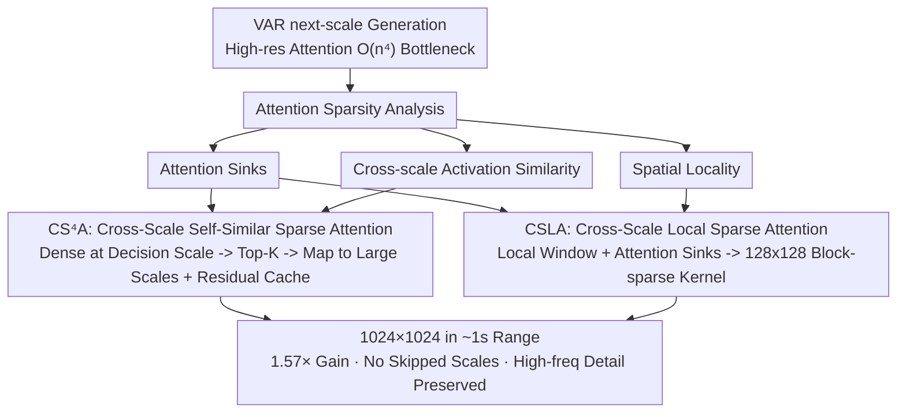

# SparVAR: Exploring Sparsity in Visual Autoregressive Modeling for Training-Free Acceleration

**Conference**: CVPR 2026  
**arXiv**: [2602.04361](https://arxiv.org/abs/2602.04361)  
**Code**: [SparVAR](https://github.com/AnyLLM/SparVAR)  
**Area**: Image Generation  
**Keywords**: Visual AutoRegressive, Sparse Attention, Training-Free Acceleration, Cross-Scale Sparsity, KV Cache

## TL;DR

This paper performs a systematic analysis of attention activation patterns in VAR models, revealing three major sparsity characteristics (attention sinks, cross-scale similarity, and spatial locality). It proposes the SparVAR training-free acceleration framework, which incorporates two plug-and-play modules—Cross-Scale Self-Similar Sparse Attention (CS⁴A) and Cross-Scale Local Sparse Attention (CSLA)—to achieve 1-second level generation for 1024×1024 images using an 8B model (1.57× acceleration) with almost no loss in high-frequency details.

## Background & Motivation

Visual AutoRegressive (VAR) models utilize a next-scale prediction paradigm: each step predicts all tokens of the next scale in parallel, progressively refining the image from coarse to fine. While more efficient than traditional token-by-token generation, it still faces significant bottlenecks during high-resolution generation:

**Attention Complexity Explosion**: Each scale must attend to tokens from all historical scales. The complexity grows with the fourth power of the resolution $\mathcal{O}(n^4)$, and the final two large-scale steps account for approximately 60% of the total inference time.

**Huge KV Cache Overhead**: Generating a 1024×1024 image with an 8B VAR model requires nearly 60GB of GPU memory.

**Limitations of Prior Work**: Methods like FastVAR and SkipVAR skip the final high-resolution scales. Although they increase speed, they lose texture details, leading to a significant drop in low-level metrics (PSNR/SSIM/LPIPS).

Core Problem: **Can VAR be effectively accelerated without skipping any scales?**

## Method

### Overall Architecture

SparVAR aims to resolve the speed bottleneck in High-Resolution VAR generation. In next-scale prediction, the final large scales must attend to all historical tokens, causing attention complexity to expand at $O(n^4)$. The authors first perform a systematic analysis of VAR attention activations and discover that attention is highly sparse. Based on these sparsity patterns, they design two plug-and-play, non-conflicting sparse attention modules: CS⁴A propagates sparse patterns from a "decision scale" to subsequent large scales to eliminate redundant dense attention, while CSLA leverages spatial locality to constrain attention within local windows and implements it as a GPU-aligned block-sparse kernel. Combined, these allow an 8B model to generate 1024×1024 images in approximately 1 second (1.57× acceleration) with almost no loss of high-frequency details.

### Key Designs

**1. Three Attention Sparsity Characteristics: The Observational Basis**

The entire acceleration framework is built on three observations of VAR attention maps. The first is **Strong Attention Sinks**: a small number of early-scale tokens consistently attract high weights, acting as global anchors that dominate the overall structure. Experiments show that keeping only the KV cache of the first 4-5 scales is sufficient to reconstruct accurate object layouts. The second is **Cross-Scale Activation Similarity**: the attention distribution of corresponding sub-blocks in adjacent scales is nearly identical, which can be expressed as $\mathbf{A}^{(k,i)} \approx \text{Upsample}(\mathbf{A}^{(k-1,i-1)})$. The third is **Spatial Locality**: as the scale increases, attention becomes more concentrated in local neighborhoods, appearing as diagonal bands in the attention map. These three points provide the basis for "caching few scales," "propagating sparsity patterns across scales," and "local windows," respectively.

**2. CS⁴A: Propagating Sparsity Patterns from a Decision Scale to Large Scales**

Since attention maps at adjacent scales are highly self-similar, calculating full dense attention at every large scale is unnecessary. SparVAR selects a sparse decision scale $S$ (determined by minimizing the PSNR difference between the mapped sparse pattern and dense attention; $S=10$ is used in experiments). Full dense attention is calculated only at this scale, and Top-K (roughly 0.2) is used to extract the indices of the most important keys $\text{inds}^{(S)}$. These indices are then mapped to each subsequent scale using $\text{inds}^{(k)} = \lfloor \frac{N_k}{N_S} \times \text{inds}^{(S)} \rfloor$ to maintain hierarchical correspondence. To compensate for information lost via Top-K, a residual cache $\mathbf{O}_\text{cache}^{(S)} = \mathbf{O}_\text{dense}^{(S)} - \text{Softmax}(\mathbf{Q}^{(S)}\mathbf{K}_\text{inds}^{(S)\top})\mathbf{V}_\text{inds}^{(S)}$ is added. This is upsampled and added to the sparse outputs of subsequent scales, significantly improving PSNR at a minimal cost.

**3. CSLA: Implementing Spatial Locality as a Hardware-Aligned Block-Sparse Kernel**

Token-level sparsity alone is not fast enough; token-level sparse masks can actually be slower than FlashAttention on GPUs. CSLA leverages spatial locality by restricting each query token to attend only to its corresponding spatial local window in historical scales (radius $r_h$), while always keeping early-scale attention sink tokens visible to all queries. The key step is converting token-level masks into 128×128 block-level masks, which fits the tiling nature of FlashAttention. Implemented via FlexAttention, this forward pass is 5.61× faster than FlashAttention and 15.26× faster than naive token-level sparse attention.

### Loss & Training

Training-free. SparVAR is a pure inference-time acceleration framework. All sparsity patterns are dynamically extracted from the attention activations of pre-trained models. It is applicable to various VAR models such as Infinity-2B/8B and HART.

## Key Experimental Results

### Main Results

**Infinity-8B 1024×1024 GenEval** (Table 2)

| Method | Skip Scales | Speedup | Latency | GenEval↑ | PSNR↑ | SSIM↑ | LPIPS↓ |
|------|--------|--------|------|----------|-------|-------|--------|
| Infinity-8B Baseline | No | 1.00× | 1.65s | 0.798 | - | - | - |
| FastVAR | No | 1.14× | 1.45s | 0.792 | 17.40 | 0.630 | 0.333 |
| ScaleKV | No | 0.67× | 2.45s | 0.793 | 23.42 | 0.803 | 0.153 |
| **SparVAR** | **No** | **1.57×** | **1.05s** | **0.796** | **29.48** | **0.920** | **0.073** |
| FastVAR+Skip2 | 2 | 1.79× | 0.92s | 0.790 | 15.27 | 0.533 | 0.421 |
| **SparVAR+Skip2** | **2** | **2.28×** | **0.72s** | **0.800** | **17.10** | **0.579** | **0.374** |

### Ablation Study

**Effectiveness of Sparse Attention Modules** (Table 5)

| Configuration | Speedup | PSNR↑ | SSIM↑ | LPIPS↓ |
|------|--------|-------|-------|--------|
| Infinity-8B Baseline | 1.00× | - | - | - |
| + CS⁴A (w/o cache) | 1.46× | 25.67 | 0.837 | 0.131 |
| + CS⁴A (w/ cache) | 1.43× | 26.36 | 0.860 | 0.114 |
| + CS⁴A + CSLA | **1.57×** | **29.48** | **0.920** | **0.073** |

**CSLA Kernel Speed** (Table 1, simulating final scale configuration)

| Implementation | Sparsity | Latency | Speedup |
|------|--------|------|--------|
| FlashAttention2 | 0% | 3.02ms | 1.00× |
| F.sdpa + Sparse Mask | 87.9% | 8.23ms | 0.37× |
| CSLA (block 128) | 83.5% | 0.54ms | **5.61×** |

### Key Findings

- SparVAR is the only method that achieves significant acceleration (1.57×) **without skipping any scales**.
- Low-level metrics (PSNR≈30, SSIM>0.9) prove that high-frequency details are almost entirely preserved, whereas FastVAR yields a PSNR of only 17.4.
- Residual cache $\mathbf{O}_\text{cache}^{(k)}$ improves PSNR by 0.7 at a minimal latency cost (1.43× vs 1.46×).
- Choosing a decision scale too early ($S < 8$) leads to severe artifacts because early attention patterns are too coarse and have low similarity to subsequent large scales.
- Retention of attention sinks is a critical component; removing them drops PSNR from 25.90 to 23.54.

## Highlights & Insights

1. **Systematic Attention Analysis**: The discovery of the three characteristics (sinks, similarity, locality) in VAR attention patterns forms the theoretical foundation. The analysis method itself has independent value for understanding VAR models.
2. **Cross-Scale Sparsity Propagation**: Utilizing self-similarity in adjacent scales for index mapping avoids calculating dense attention at every large scale.
3. **Block-level Sparse Kernel Design**: Converting continuous spatial locality into discrete block-level masks fully exploits GPU hardware features (5.61× speedup).
4. **Orthogonal to Scale Skipping**: SparVAR can be combined with skip-scale strategies from FastVAR/SkipVAR for even more extreme acceleration (2.28×).
5. **Human Preference Score Consistency**: Scores on HPSv2.1 and ImageReward remain nearly lossless; the 8B model even slightly outperforms the baseline.

## Limitations & Future Work

- The decision scale $S$ is fixed at 10; adaptive selection might offer further optimization.
- The Top-K sparsity ratio is fixed at 0.2; different image contents may require different sparsity strategies.
- CSLA window sizes require manual tuning (default [3, 5, 7] for the last 3 scales).
- Currently verified only on Infinity and HART; generalization to other VAR architectures (e.g., LlamaGen) is unknown.
- Acceleration during the training phase was not discussed.

## Related Work & Insights

- Extends the activation sparsity reuse idea from Chipmunk to the VAR domain (Chipmunk was used for diffusion models).
- The block-wise design of CSLA is built on the FlexAttention framework.
- Complementary to ScaleKV's KV cache compression—ScaleKV reduces memory usage but does not accelerate (it even slows down to 0.67×), while SparVAR reduces computation.
- The three observations on sparse attention might inspire research in other multi-scale architectures, such as super-resolution models.

## Rating

- **Novelty**: ⭐⭐⭐⭐⭐ — The systematic analysis of VAR attention sparsity and the cross-scale propagation mechanism are original contributions.
- **Experimental Thoroughness**: ⭐⭐⭐⭐⭐ — Covers 2B/8B models, multiple combination strategies, and extensive ablation studies.
- **Writing Quality**: ⭐⭐⭐⭐ — Clear structure and rich visualizations, though formulas are somewhat dense.
- **Value**: ⭐⭐⭐⭐⭐ — Solves a key bottleneck in high-resolution VAR inference with strong plug-and-play practicality.

<!-- RELATED:START -->

## Related Papers

- [\[CVPR 2026\] FVAR: Next-Focus Prediction for Visual Autoregressive Modeling](fvar_next-focus_prediction_for_visual_autoregressive_modeling.md)
- [\[ICML 2026\] Speculative Coupled Decoding for Training-Free Lossless Acceleration of Autoregressive Visual Generation](../../ICML2026/image_generation/speculative_coupled_decoding_for_training-free_lossless_acceleration_of_autoregr.md)
- [\[CVPR 2026\] Denoising as Path Planning: Training-Free Acceleration of Diffusion Models with DPCache](dpcache_denoising_path_planning_diffusion_accel.md)
- [\[ICLR 2026\] ToProVAR: Efficient Visual Autoregressive Modeling via Tri-Dimensional Entropy-Aware Semantic Analysis and Sparsity Optimization](../../ICLR2026/image_generation/toprovar_efficient_visual_autoregressive_modeling_via_tri-dimensional_entropy-aw.md)
- [\[CVPR 2026\] TAP: A Token-Adaptive Predictor Framework for Training-Free Diffusion Acceleration](tap_a_token-adaptive_predictor_framework_for_training-free_diffusion_acceleratio.md)

<!-- RELATED:END -->
