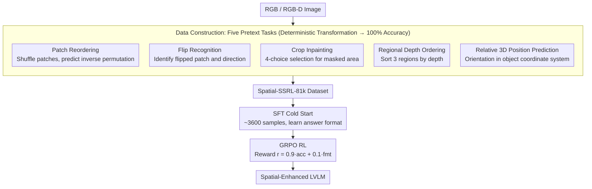

# Spatial-SSRL: Enhancing Spatial Understanding via Self-Supervised Reinforcement Learning

**Conference**: CVPR 2026  
**arXiv**: [2510.27606](https://arxiv.org/abs/2510.27606)  
**Code**: [GitHub](https://github.com/InternLM/Spatial-SSRL)  
**Area**: Image Generation  
**Keywords**: Spatial Understanding, Self-Supervised Learning, Reinforcement Learning (RLVR), Large Vision-Language Models, Depth Perception

## TL;DR
This paper proposes Spatial-SSRL, a self-supervised reinforcement learning paradigm. By automatically constructing five pretext tasks (patch reordering, flip identification, crop inpainting, depth ordering, and relative 3D position prediction) from standard RGB/RGB-D images, it utilizes GRPO to optimize the spatial understanding capabilities of LVLMs. This approach achieves an average improvement of 3.89%-4.63% across seven spatial benchmarks without requiring human annotations or external tools.

## Background & Motivation

**Background**: Large Vision-Language Models (LVLMs) are reaching saturation in tasks like VQA and image captioning, yet their spatial understanding remains significantly below human levels. Existing enhancement methods are categorized into data-driven SFT (constructing spatial QA pairs for fine-tuning) and RLVR (reinforcement learning with verifiable rewards).

**Limitations of Prior Work**: SFT methods rely on expensive human annotations or GPT-4 generated QA pairs, often overfitting to specific dataset patterns. Tool-based methods (e.g., using depth estimators or object detectors) involve complex pipelines and high computational costs. Simulation-based methods (rendering 3D scenes) suffer from a domain gap with the real world. RLVR methods are limited by specific environments (e.g., 3D scans), resulting in restricted data scale and coverage.

**Key Challenge**: Spatial understanding requires large-scale verifiable supervision signals. However, the cost of obtaining these signals via current methods—whether through expensive human labor, complex toolchains, or restricted 3D datasets—is prohibitively high.

**Goal**: Design a zero-annotation, tool-free, and scalable self-supervised scheme to generate verifiable spatial understanding signals and naturally integrate them with the RLVR training paradigm.

**Key Insight**: The inherent structural consistency of images (relative depth, geometric consistency, viewpoint invariance) provides deterministic, verifiable supervision signals. This work repositions Visual Self-Supervised Learning (SSL) pretext tasks as reward functions for RLVR, rather than traditional feature pre-training objectives.

**Core Idea**: Transform classic SSL tasks (jigsaw, flip detection, etc.) into LVLM QA prompts with deterministic verification functions, followed by post-training using GRPO.

## Method

### Overall Architecture
The core challenge addressed is the need for massive "verifiable" supervision signals for training LVLM spatial understanding. Spatial-SSRL breaks this bottleneck by identifying that deterministic geometric ground truth is hidden within ordinary images (e.g., which patch goes where, which area is closer). By applying controlled transformations, the correct answer is "programmatically" generated without human or detector intervention.

The pipeline follows two steps. First, data construction: five pretext tasks' QA pairs are automatically generated from RGB or RGB-D images to form the Spatial-SSRL-81k dataset. Since all answers derive from deterministic transformations, the label accuracy is 100%. Second, RL training: a cold-start SFT is performed on approximately 3,600 samples to teach the model the required answer format (otherwise, the success rate of producing the correct format during RL is below 5%), followed by optimization using GRPO. The five tasks range from 2D layout (RGB-only) to 3D spatial reasoning (depth-dependent), increasing in complexity.

### Key Designs

**1. Shuffled Patch Reordering: Transforming global 2D layout into a verifiable restoration problem**

This task addresses the lack of global spatial awareness. The image $I$ is divided into an $M \times N$ patch grid $\mathcal{X} = \{x_{i,j}\}$, and a random permutation $\pi$ is applied. The ground-truth is the inverse permutation:

$$\pi^{-1} = [\pi^{-1}(0),\ \pi^{-1}(1),\ \ldots,\ \pi^{-1}(M \times N - 1)]$$

The model must predict this sequence. To prevent exploitation of low-level edge-stitching cues, one patch is randomly whitened. Success requires understanding relative positions and overall layout consistency.

**2. Flipped Patch Recognition: Testing local geometry sensitivity via directional violations**

While reordering focuses on the global view, this task targets local details. A patch $\hat{x}_t$ is randomly chosen and flipped either vertically or horizontally with equal probability:

$$x_{\text{vert}}(r,c) = x(P_H - 1 - r,\, c), \qquad x_{\text{horz}}(r,c) = x(r,\, P_W - 1 - c)$$

The model predicts the index $t$ and direction $d$, i.e., $[t, d]$. This requires sensitivity to local geometry, symmetry, and directional cues like text, faces, or shadows.

**3. Cropped Patch Inpainting: Forcing texture continuity comprehension via adversarial distractors**

This task evaluates texture-context matching and structural reasoning. One area is masked, and the model selects the correct fill from 4 candidates. The distractors include the correct patch rotated 90°, its internal sub-region, and an expanded outer region. These are visually similar to the target, forcing the model to scrutinize fine-grained texture continuity.

**4. Regional Depth Ordering: Transforming depth maps into verifiable ordinal problems**

This 3D task selects three regions from a depth map $D$ with distinct depths. They are labeled with numbers and presented in random order for the model to sort by distance. Region selection follows two constraints: internal depth variance must be low, and inter-region depth differences must be high:

$$r(R_i) < r_{\max} = 0.15 \quad(\text{Internal Consistency}), \qquad d(R_i, R_{i+1}) > d_{\min} = 0.05 \quad(\text{Inter-region Separability})$$

This ensures a unique deterministic answer, forcing the model to integrate depth cues, perspective, and ordinal reasoning.

**5. Relative 3D Position Prediction: Ego-centric coordinate transformation**

The most advanced task involves predicting the relative orientation of one point in another object's coordinate system, given the object's orientation $\theta$. This involves a 2D rigid body transformation: rotating point $(x_2, z_2)$ in the camera frame to $(\tilde{x}_2, \tilde{z}_2)$ in the object's frame. Correctness requires mental rotation and a shift to an object-centric frame of reference, which is core to real-world spatial reasoning.

### Loss & Training
- **Cold-start SFT**: Conducted on ~3,600 samples for 5 epochs (lr=$1 \times 10^{-5}$) to familiarize the model with the task format.
- **GRPO Optimization**: KL divergence weight 0.01, 5 rollouts per sample, temperature 1.0, batch size 128, lr=$1 \times 10^{-6}$, 360 steps.
- **Reward Design**: $r = 0.9 \cdot r_{\text{acc}} + 0.1 \cdot r_{\text{fmt}}$, where accuracy is significantly prioritized over format.
- **Thinking Process**: Uses `<think>` tags to guide the output of a Chain-of-Thought (CoT).

## Key Experimental Results

### Main Results (7 Spatial Understanding Benchmarks)

| Model | Spatial457 | 3DSRBench | SpatialEval | QSpatial+ | What'sUp | ViewSpatial | VSI-Bench | Avg |
|------|-----------|-----------|-------------|-----------|----------|-------------|-----------|-----|
| Qwen2.5-VL-3B | 33.70 | 50.30 | 54.65 | 33.66 | 85.85 | 35.38 | 27.84 | 45.91 |
| Spatial-SSRL-3B | 46.07 | 51.72 | 59.59 | 39.60 | 86.71 | 36.62 | 33.49 | 50.54 |
| Gain | **+12.37** | +1.42 | +4.94 | +5.95 | +0.86 | +1.24 | +5.65 | **+4.63** |
| Qwen2.5-VL-7B | 44.67 | 53.39 | 62.37 | 46.53 | 86.95 | 36.83 | 38.08 | 52.69 |
| Spatial-SSRL-7B | 53.34 | 56.53 | 64.03 | 54.46 | 90.61 | 37.81 | 39.29 | 56.58 |
| Gain | **+8.67** | +3.14 | +1.66 | +7.93 | +3.66 | +0.98 | +1.21 | **+3.89** |

Improvements were observed across all seven benchmarks, with a maximum gain of +12.37% on Spatial457.

### Reasoning Capability Verification

| Configuration | Avg Accuracy | Description |
|------|----------|------|
| Qwen2.5-VL-7B (No Reasoning) | 52.69 | baseline |
| Qwen2.5-VL-7B (With Reasoning) | 49.58 | Reasoning drops performance! (-3.11) |
| Spatial-SSRL-7B (With Reasoning) | **56.58** | Reasoning chain becomes effective (+3.89) |

Enabling CoT reasoning in the baseline model actually degrades performance (e.g., What'sUp: 86.95 → 70.61), indicating that base models lack intrinsic spatial reasoning logic. Spatial-SSRL successfully trains the model to generate valid reasoning chains via RL.

### Key Findings
- 3D reasoning benchmarks benefit the most (Spatial457 +12.37%, QSpatial+ +7.93%), validating the contribution of depth-based tasks.
- A critical finding is that CoT drops performance in base models—spatial reasoning must be learned rather than prompted.
- Results on Qwen3-VL-4B show a +1.29% spatial gain and a +1.18% gain in general VQA, proving the method does not harm general capabilities.
- Spatial-SSRL-81k achieves 100% label accuracy, superior to methods relying on noisy detectors.
- Cold-start SFT is essential; direct RL results in a format success rate of less than 5%.

## Highlights & Insights
- **Integration of SSL + RLVR** is the primary innovation. SSL pretext tasks naturally provide deterministic verifiable answers, aligning perfectly with the verifiable reward requirement of RLVR.
- **Complementary Task Design** covers the full hierarchy from 2D layout to 3D spatial relations: patch reordering (global) → flip recognition (local) → inpainting (texture) → depth ordering (3D depth) → 3D position (ego-centric transformation).
- **Distractor Design** in the inpainting task (rotated, sub-region, expanded) prevents the model from relying on low-level visual shortcuts.

## Limitations & Future Work
- Depth-dependent tasks require RGB-D data, which limits potential data sources (though monocular estimation can be used with added noise).
- The relative weights of the five tasks have not been finely tuned (currently equal proportions).
- Generalization to other LVLM architectures (e.g., LLaVA, InternVL) remains untested.
- While 81k is smaller than typical SFT datasets, RL training efficiency could still be improved.
- Future work could explore other SSL tasks like color channel reordering or frequency domain prediction.

## Related Work & Insights
- **vs SpatialLadder/SpaceR**: These rely on 3D scan datasets and complex pipelines. Spatial-SSRL uses simple RGB/RGB-D images and a minimal pipeline, with its 7B version (56.58) outperforming SpaceR-7B (54.54).
- **vs Jigsaw-R1/Visual Jigsaw**: Similar SSL+RL logic but limited to jigsaw tasks. Spatial-SSRL is more comprehensive with five complementary tasks.
- **vs SSL4RL**: Focused only on 2D; Spatial-SSRL covers both 2D and 3D, with depth-based tasks providing significant gains.

## Rating
- Novelty: ⭐⭐⭐⭐⭐ The paradigm of SSL pretext tasks as RLVR rewards is pioneering.
- Experimental Thoroughness: ⭐⭐⭐⭐ 7 benchmarks across 3 base models, though ablation could be more granular.
- Writing Quality: ⭐⭐⭐⭐⭐ Clear motivation, rigorous mathematical formalization of tasks.
- Value: ⭐⭐⭐⭐⭐ Zero-annotation and scalable; opens a new path for LVLM spatial enhancement.

<!-- RELATED:START -->

## Related Papers

- [\[CVPR 2026\] Enhancing Spatial Understanding in Image Generation via Reward Modeling](enhancing_spatial_understanding_in_image_generation_via_reward_modeling.md)
- [\[ICCV 2025\] CoMPaSS: Enhancing Spatial Understanding in Text-to-Image Diffusion Models](../../ICCV2025/image_generation/compass_enhancing_spatial_understanding_in_text-to-image_diffusion_models.md)
- [\[CVPR 2026\] SpatialReward: Verifiable Spatial Reward Modeling for Fine-Grained Spatial Consistency in Text-to-Image Generation](spatialreward_verifiable_spatial_reward_modeling_for_fine-grained_spatial_consis.md)
- [\[CVPR 2026\] Exploring Spatial Intelligence from a Generative Perspective](exploring_spatial_intelligence_from_a_generative_perspective.md)
- [\[CVPR 2026\] Rethinking Glyph Spatial Information in Font Generation](rethinking_glyph_spatial_information_in_font_generation.md)

<!-- RELATED:END -->
