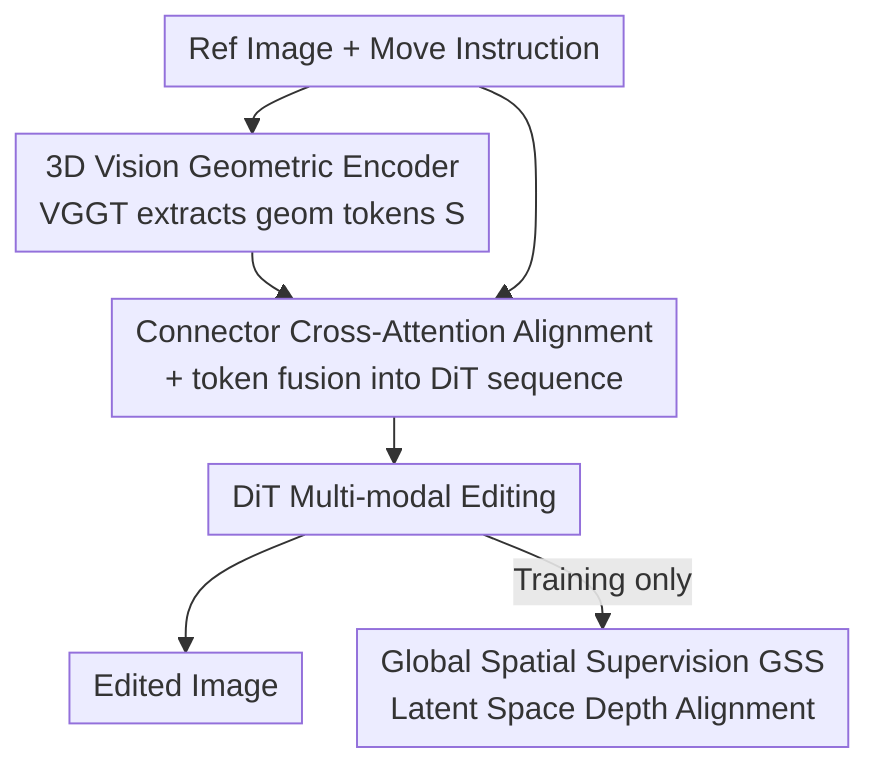

# SpatialDiff: 3D-Aware Object Movement via Implicit Spatial Modeling

**Conference**: CVPR 2026  
**Paper**: [CVF Open Access](https://openaccess.thecvf.com/content/CVPR2026/html/Liu_SpatialDiff_3D-Aware_Object_Movement_via_Implicit_Spatial_Modeling_CVPR_2026_paper.html)  
**Code**: Not disclosed  
**Area**: Image Generation / Diffusion Models / Instruct-based Image Editing  
**Keywords**: Instruct-based Image Editing, Object Movement, Implicit 3D Prior, Diffusion Transformer, Latent Space Depth Supervision

## TL;DR
SpatialDiff injects implicit spatial priors from a single image into a Diffusion Transformer via a 3D geometric encoder, supplemented by latent space depth supervision, without performing explicit 3D reconstruction. This allows instruction-driven image editing to "properly relocate" objects in complex scenes involving occlusions and multiple depth layers.

## Background & Motivation

**Background**: Instruction-driven image editing (e.g., InstructPix2Pix, Flux-Kontext, Qwen-Image-Edit) can perform style transfer, object addition/removal, and fine-grained modifications based on natural language. These are mostly based on diffusion or flow-matching models, utilizing MLLMs to jointly encode images and instructions.

**Limitations of Prior Work**: When an instruction requires "moving" an object to another location (e.g., "move the apple between the banana and the watermelon"), pure 2D methods often fail. Objects are either misplaced, distorted, or leave "ghosting" artifacts at the original location, and unedited regions are frequently corrupted. The root cause is that these models only learn 2D planar priors and lack 3D knowledge such as depth and spatial layout, making it impossible to guarantee consistency in 3D space.

**Key Challenge**: 2D diffusion editing is flexible but lacks spatial understanding; explicit 3D methods (e.g., Diffusion Handles, Diff3DEdit, LACONIC) perform geometric reasoning, but single-image explicit 3D reconstruction is an ill-posed problem—suffering from unknown viewpoints, depth ambiguity, occlusions, and incomplete geometry. Poor reconstruction quality hampers subsequent editing, especially in complex multi-object scenes. Both paths have inherent flaws.

**Goal**: Bring the benefits of 3D spatial priors into the 2D diffusion editing framework while bypassing the "explicit reconstruction" step, enabling the Diffusion Transformer (DiT) to understand and control the spatial positioning of objects.

**Key Insight**: The authors observe that 3D priors do not need to exist in an explicit form like "reconstructed depth or point clouds." Instead, the model can hold geometric information **implicitly** within internal token representations, requiring no 3D reconstruction during inference.

**Core Idea**: A pre-trained 3D geometric foundation model (VGGT) is used to extract implicit geometric features from a single image. These are integrated into the DiT latent space via an alignment module for editing, while "soft constraint" supervision using target depth maps is applied in the latent space to force the model to learn dynamic updates of spatial structures.

## Method

### Overall Architecture
SpatialDiff uses a flow-matching DiT (like Flux-Kontext) as the editing backbone. Inputs are a "reference image + movement instruction," and the output is an "edited image with the object moved to the correct spatial position." Two components are added to the backbone: an **Implicit Spatial Modeling (ISM)** path, which passes the reference image through a 3D geometric encoder to obtain geometric tokens aligned into the DiT latent space via a Connector; and **Global Spatial Supervision (GSS)**, which uses the target depth map during training to constrain the DiT's processed spatial tokens in the VAE latent space. During inference, only the former is used, ensuring no explicit 3D reconstruction is required.

### Key Designs

**1. 3D Vision Geometric Encoder (3D-VGE): Equipping the Diffusion Backbone with Spatial Awareness**

To address the lack of 3D understanding, the authors do not train a new geometric network. Instead, they leverage the Transformer backbone of VGGT—a 3D foundation model capable of estimating camera parameters, point maps, depth, and 3D point tracks from a single image. The key strategy is **extracting backbone features while discarding all task-specific prediction heads**: $S = \mathrm{3D\text{-}VGE}(x_0),\ S \in \mathbb{R}^{l' \times d'}$. This results in a set of implicit geometric prior tokens rather than explicit depth/normal outputs. This avoids the ill-posed nature of explicit reconstruction while providing 3D knowledge.

**2. Connector Cross-Attention Alignment & Token Fusion: Translating Geometric Priors for the DiT**

Since the feature space of 3D-VGE is inconsistent with the DiT latent space, a Connector utilizes learnable query tokens $Q_l \in \mathbb{R}^{l \times d}$ to selectively extract and align spatial information via cross-attention: $\hat{Q}_l = \mathrm{Softmax}\!\left(\frac{QK^\top}{\sqrt{d}}\right)V$. The aligned spatial tokens are concatenated with the image latents $x$ and instruction tokens $I$ into a unified sequence $C = [x, \hat{Q}_l, I]$. This allows the DiT to simultaneously process local appearance, spatial cues, and instructions, capturing depth and relative positioning.

**3. Global Spatial Supervision (GSS): Soft Constraints to Update Spatial Structures Dynamicallly**

ISM alone is insufficient. Even when objects are moved, artifacts often remain at the source location. GSS addresses this by using the target depth $d_{\text{tgt}} = \mathrm{DepthAnything}(x_{\text{tgt}})$ as auxiliary supervision. The post-DiT spatial tokens $\hat{s}$ are mapped by a learnable spatial decoding head $\bar{\mathcal{D}}$ to the VAE latent space, aligning with the VAE encoding of the target depth via MSE: $\mathcal{L}_{\text{GSS}} = \lVert \bar{\mathcal{D}}(\hat{s}) - \mathcal{E}(d_{\text{tgt}}) \rVert_2^2$. The authors compared **Explicit Depth Supervision (EDS)** in pixel space with **Latent Depth Supervision (LDS)** and found that LDS provides smoother, more robust signals by emphasizing high-level spatial relationships over low-level pixel details.

### Loss & Training
A two-stage training strategy is adopted. **Stage 1** optimizes only the Connector to align geometric features with the DiT latent space using the flow-matching loss $\mathcal{L}_{Align} = \mathbb{E}\,\lVert v - v_\theta(x_t, t, C)\rVert_2^2$. **Stage 2** jointly optimizes the DiT backbone, Connector, and spatial decoding head, adding the GSS loss: $\mathcal{L} = \mathbb{E}\,\lVert v - v_\theta(x_t, t, C)\rVert_2^2 + \lambda \cdot \mathcal{L}_{\text{GSS}}$, where $\lambda = 0.01$. The model is trained on Flux-Kontext with a Connector consisting of 8 cross-attention layers, query length 1024, and LoRA rank 64 at 512x512 resolution.

## Key Experimental Results

### Main Results
The training data is adapted from the OBJect-3DIT dataset, with edit instructions generated by Qwen3-VL-32B-Instruct. Evaluation is conducted on **SpatialBench**, a benchmark of 100 images with complex foreground/background objects and 50 OBJect-3DIT test images. Metrics include VIEScore: SC (Semantic Consistency), PQ (Perceptual Quality), and O (Overall score, $O = (\mathrm{SC} \times \mathrm{PQ})^{1/2}$), scored by GPT-5 and Qwen3-VL-32B.

| Method | GPT-SC↑ | GPT-PQ↑ | GPT-O↑ | Qwen-O↑ |
|------|---------|---------|--------|---------|
| Flux-Kontext | 0.292 | 0.848 | 0.498 | 0.447 |
| OmniGen2 | 0.301 | 0.661 | 0.446 | 0.458 |
| Step1X-Edit | 0.484 | 0.785 | 0.616 | 0.583 |
| BAGEL | 0.368 | 0.709 | 0.511 | 0.500 |
| Qwen-Image-Edit | 0.666 | 0.882 | 0.766 | 0.717 |
| **Ours (SpatialDiff)** | **0.803** | **0.886** | **0.843** | **0.807** |

SpatialDiff leads in all metrics. While Flux-Kontext has a high PQ (0.848), its low SC (0.292) indicates it failed to perform the edit. SpatialDiff significantly outperforms Qwen-Image-Edit in instruction following (SC).

### Ablation Study
Components added sequentially: FT (LoRA Fine-tuning), ISM (Implicit Spatial Modeling), EDS (Explicit Depth Supervision), LDS (Latent Depth Supervision).

| Configuration | FT | ISM | EDS | LDS | GPT-SC↑ | GPT-PQ↑ | GPT-O↑ |
|------|----|----|----|----|---------|---------|--------|
| Baseline | | | | | 0.236 | 0.831 | 0.443 |
| Model A | ✓ | | | | 0.398 | 0.795 | 0.563 |
| Model B | ✓ | ✓ | | | 0.518 | 0.743 | 0.620 |
| Model C | ✓ | ✓ | ✓ | | 0.566 | 0.801 | 0.673 |
| **SpatialDiff** | ✓ | ✓ | | ✓ | **0.804** | **0.871** | **0.837** |

### Key Findings
- LoRA fine-tuning alone (Model A) improves SC but reduces PQ, introducing unnatural distortions.
- Injecting implicit 3D (Model B) significantly boosts SC and overall performance, proving that 3D-aware features enhance spatial reasoning.
- The supervision method is critical for PQ: EDS (Model C) improves O but harms unedited areas. LDS (SpatialDiff) recovers PQ while maximizing the overall score, showing latent space constraints preserve global consistency.
- A user study with 35 participants (4200 votes) confirms that SpatialDiff ranks highest in SC, PQ, and overall score.

## Highlights & Insights
- **The "Implicit 3D" approach is ingenious**: Moving from "reconstruct then use" to "internalize via tokens" bypasses the ill-posed nature of single-image reconstruction and eliminates 3D overhead at inference.
- **Backbone reuse without prediction heads**: This is a highly transferable strategy—any 2D model requiring geometric awareness can use models like VGGT or DUSt3R as feature extractors without running the full reconstruction pipeline.
- **EDS vs. LDS comparison**: Applying supervision in the latent space as a "soft" signal is more effective than rigid pixel-space constraints, a lesson applicable to other generation tasks requiring structural supervision.

## Limitations & Future Work
- Training data relies on synthetic pairs; generalization to real-world complex lighting and materials needs further validation.
- Geometric quality is capped by the inference capability of the 3D-VGE (VGGT).
- Evaluation depends heavily on MLLMs like GPT-5, which may have systematic biases compared to human judgment of spatial "correctness."
- Currently limited to object movement; expanding to rotation, scaling, and complex 3D transformations is the next step.

## Related Work & Insights
- **vs. Pure 2D Editing (Flux-Kontext / Qwen-Image-Edit)**: These models lack 3D knowledge, leading to spatial inconsistencies. SpatialDiff fills this gap with ISM+GSS while maintaining high image quality.
- **vs. Explicit 3D-aware Editing (Diffusion Handles / Diff3DEdit)**: These rely on explicit reconstruction which often fails in complex scenes. SpatialDiff is more robust and scalable by holding geometry implicitly in tokens.

## Rating
- Novelty: ⭐⭐⭐⭐⭐ The combination of implicit 3D priors and latent space depth supervision is a breakthrough.
- Experimental Thoroughness: ⭐⭐⭐⭐ Complete with benchmarks, MLLM scoring, and ablation, though real-world data is somewhat limited.
- Writing Quality: ⭐⭐⭐⭐⭐ Excellent motivation and clear technical derivation.
- Value: ⭐⭐⭐⭐ Provides a low-cost, reusable paradigm for adding geometric awareness to 2D generative models.

<!-- RELATED:START -->

## Related Papers

- [\[CVPR 2025\] ObjectMover: Generative Object Movement with Video Prior](../../CVPR2025/image_generation/objectmover_generative_object_movement_with_video_prior.md)
- [\[CVPR 2026\] Enhancing Spatial Understanding in Image Generation via Reward Modeling](enhancing_spatial_understanding_in_image_generation_via_reward_modeling.md)
- [\[CVPR 2026\] SpatialReward: Verifiable Spatial Reward Modeling for Fine-Grained Spatial Consistency in Text-to-Image Generation](spatialreward_verifiable_spatial_reward_modeling_for_fine-grained_spatial_consis.md)
- [\[CVPR 2026\] SPREAD: Spatial-Physical REasoning via geometry Aware Diffusion](spread_spatial-physical_reasoning_via_geometry_aware_diffusion.md)
- [\[ICML 2026\] Direct 3D-Aware Object Insertion via Decomposed Visual Proxies](../../ICML2026/image_generation/direct_3d-aware_object_insertion_via_decomposed_visual_proxies.md)

<!-- RELATED:END -->
