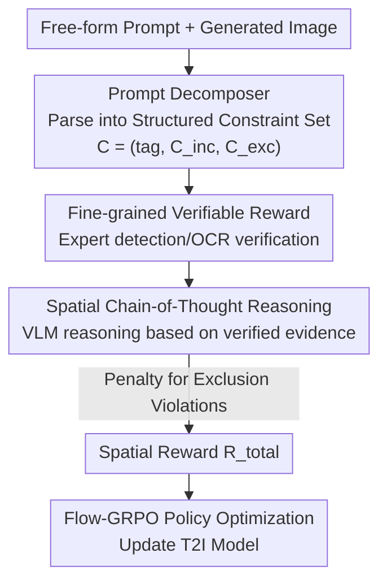

# SpatialReward: Verifiable Spatial Reward Modeling for Fine-Grained Spatial Consistency in Text-to-Image Generation

**Conference**: CVPR 2026  
**Paper**: [CVF Open Access](https://openaccess.thecvf.com/content/CVPR2026/html/Zhou_SpatialReward_Verifiable_Spatial_Reward_Modeling_for_Fine-Grained_Spatial_Consistency_in_CVPR_2026_paper.html)  
**Code**: https://github.com/LivingFutureLab/SpatialReward  
**Area**: Diffusion Models / Text-to-Image / RLHF Alignment  
**Keywords**: Text-to-Image, Spatial Consistency, Verifiable Reward, Reinforcement Learning, Chain-of-Thought Reasoning

## TL;DR
SpatialReward is a "verifiable" spatial reward model for text-to-image (T2I) generation. It first decomposes free-form text into structured constraints, then uses expert models such as object detection and OCR to objectively verify the generated images. Finally, it utilizes a Vision-Language Model (VLM) for Chain-of-Thought (CoT) reasoning based on verified facts to provide spatial reward scores. Integration with Flow-GRPO significantly enhances the spatial consistency of SD3.5-M and FLUX (SpatRelBench overall improved from 0.23 to 0.42 and 0.28 to 0.46, respectively).

## Background & Motivation
**Background**: Recently, T2I models (Stable Diffusion, FLUX, etc.) have increasingly adopted Reinforcement Learning (especially GRPO-based methods) to align with human preferences. The core component is the pre-trained Reward Model (RM), which scores generated images as feedback for policy gradient optimization. Mainstream RMs like PickScore, ImageReward, and HPSv2 are fine-tuned on CLIP to fit human preferences, while newer models like VisionReward and UnifiedReward use VLMs for holistic scoring.

**Limitations of Prior Work**: Existing RMs primarily focus on "global semantic alignment and aesthetic quality," paying little attention to **fine-grained spatial relationships between objects**. Consequently, generated images may look reasonable overall but often contain positional errors—such as placing a "phone to the right of a chair" on the left, or rendering "SIT" as a different word. Such spatial errors reduce realism and violate prompt semantics.

**Key Challenge**: The authors categorize the failures of existing evaluators into two types. The first is **prompt-side rigidity**: structured methods like GenEval and T2I-CompBench rely on fixed templates and predefined detectors, making them unable to generalize to open-ended, complex compositional prompts. The second is **vision-side oversight**: holistic scorers like CLIPScore and VLMs can handle arbitrary prompts but lack fine-grained spatial verification, often assigning high scores to images that "look right" but have "wrong positions."

**Goal**: The authors hypothesize that further improvements in T2I spatial generation depend more on "verifiable, spatial-aware" reward models than on refining RL training strategies themselves. The goals are: (1) enable the RM to parse spatial constraints in arbitrary free-form text; (2) replace subjective VLM judgments with objectively verifiable signals; and (3) maintain robust reasoning for complex relationships that are difficult to judge by rules alone.

**Key Insight**: The authors draw inspiration from the success of "verifiable rewards" in logical reasoning—where explicitly checkable rewards significantly improve complex reasoning in math or code tasks. They transplant this to visual spatial evaluation: using open-vocabulary detectors and OCR models (which are more accurate than VLM judgments) to produce "objective facts," and then letting the VLM reason on these facts rather than judging from scratch.

**Core Idea**: A three-stage pipeline consisting of "structured constraint parsing + expert detection verification + Chain-of-Thought reasoning" transforms spatial reward from "VLM subjective scoring" into "reasoned scoring based on verifiable evidence."

## Method

### Overall Architecture
SpatialReward is a three-stage pipeline. It takes a (prompt, generated image) pair as input and outputs a spatial consistency reward score $\mathcal{R}_{\mathrm{total}}$ for Flow-GRPO policy optimization. The first stage, **Prompt Decomposer**, parses free-form text into a structured constraint set. The second stage, **Fine-grained Verifiable Reward**, invokes expert models (object detection, color classification, orientation, depth, OCR) to verify each constraint. The third stage, **Spatial Chain-of-Thought Reasoning**, feeds verified bounding boxes and attribute scores as grounding to Qwen2.5-VL to reason through complex object relationships and penalize violations of exclusion constraints.

This reward is integrated into the standard Flow-GRPO framework: the T2I model samples denoising trajectories in a Markov Decision Process, and SpatialReward scores each sample for relative policy optimization.

### Key Designs

**1. Prompt Decomposer: Normalizing Free-form Text into Detectable Constraints**

**Design Motivation**: Open-ended prompts often contain irrelevant context or mix descriptions of different objects, which introduces ambiguity and reduces detection accuracy. The authors use a decoder $\mathcal{D}$ to convert prompt $P$ into a constraint set $\mathcal{C} = \mathcal{D}(P) = (\text{tag}, \mathcal{C}_{\text{inc}}, \mathcal{C}_{\text{exc}})$, where tag is the category (counting, orientation, etc.), $\mathcal{C}_{\text{inc}}$ are inclusion constraints, and $\mathcal{C}_{\text{exc}}$ are exclusion constraints.

**Mechanism**: The authors constructed approximately 100,000 multi-object metadata entries and used GPT-4o to back-generate diverse natural language prompts. A Qwen2.5-VL-7B was then fine-tuned to extract core meta-attributes from unconstrained text. This ensures that the expert detection is independent of prompt formatting, allowing the pipeline to generalize to complex scenarios.

**2. Fine-grained Verifiable Reward: Objective Sub-rewards via Expert Detectors**

**Key Challenge**: Even strong VLMs are unstable in tasks like multi-object composition, attribute binding, and counting. However, modern open-vocabulary detectors and OCR models are highly accurate in these areas. The authors use decomposed constraints to drive expert detection, calculating sub-rewards for each inclusion constraint $c \in \mathcal{C}_{\text{inc}}$.

**Mechanism**: The detector $F_{\text{det}}$ provides candidate boxes $D_c = \{(B_j, s_j)\}_{j=1}^k$. After confidence filtering, the verified set $\mathcal{B}_c$ with cardinality $\hat{N}_c$ provides presence reward $\mathcal{R}_{\text{presence}}(c) = \mathbb{I}(\hat{N}_c > 0)$ and count reward $\mathcal{R}_{\text{count}}(c) = \exp(-|\hat{N}_c - N_c^*|)$. Color reward $\mathcal{R}_{\text{color}}(c)$ is computed via CLIP classification on cropped regions. Orientation reward $\mathcal{R}_{\text{ori}}(c)$ checks angle tolerances, and depth reward $\mathcal{R}_{\text{depth}}(c)$ verifies relative depth ordering.

For text rendering, the system checks both content and position. The global OCR model $F_{\text{ocr}}$ extracts text-box pairs $\mathcal{T}_{\text{rec}}$, and the text reward is calculated as:

$$\mathcal{R}_{\text{text}}(T^*, B_{\text{obj}}) = \max_{(T'_j, B'_j) \in \mathcal{T}_{\text{rec}}} \left[ \text{sim}(T^*, T'_j) \cdot \text{IoA}(B'_j, B_{\text{obj}}) \right]$$

where $\text{IoA}(B_{\text{text}}, B_{\text{obj}})$ measures the inclusion of the text box within the target object box. Replacement of "vague subjective judgment" with "objective detector readings" significantly reduces hallucination.

**3. Spatial Chain-of-Thought Reasoning: VLM Reasoning on Grounded Evidence**

**Mechanism**: Complex relationships like "A above versus inside B" require higher-level reasoning that pure geometric rules might struggle with. Qwen2.5-VL acts as the CoT backbone, but crucially, it is fed "verified grounding" rather than raw images. The CoT prompt $P_{\text{CoT}}$ includes the target relation $r$, bounding boxes $B_A, B_B$, and the set of attribute rewards. The VLM is guided to interpret each attribute reward, perform geometric analysis, and finally judge the relation $r$.

To prevent overfitting and reward hacking, an explicit penalty for "satisfied exclusion constraints" is introduced. The total reward is defined as:

$$\mathcal{R}_{\mathrm{total}} = \sum_{c \in \mathcal{C}_{\mathrm{inc}}} \mathcal{R}_{\mathrm{spatial}}^+(c) - \sum_{c \in \mathcal{C}_{\mathrm{exc}}} \mathcal{R}_{\mathrm{spatial}}^-(c)$$

This design both rewards compliance and penalizes the presence of prohibited elements.

## Key Experimental Results

### Main Results
SpatialReward was integrated into Flow-GRPO to train SD3.5-M and FLUX, comparing against various RMs on GenEval and SpatRelBench.

| Base + Reward | GenEval Overall | SpatRelBench Overall | SpatRel-Pos.Text | SpatRel-3DRel |
|------|------|------|------|------|
| SD3.5-M (Baseline) | 0.67 | 0.23 | 0.40 | 0.36 |
| + ImageReward | 0.80 | 0.30 | 0.42 | 0.42 |
| + UnifiedReward | 0.89 | 0.33 | 0.46 | 0.40 |
| **+ SpatialReward** | **0.94** | **0.42** | **0.51** | **0.55** |
| **Gain** (vs Base) | +0.28 | +0.19 | +0.11 | +0.19 |
| FLUX1-dev (Baseline) | 0.76 | 0.28 | 0.49 | 0.38 |
| **+ SpatialReward** | **0.97** | **0.46** | **0.63** | **0.45** |
| **Gain** (vs Base) | +0.21 | +0.18 | +0.14 | +0.17 |

SpatialReward achieves the best overall performance for both bases across both benchmarks. Specifically, on GenEval, the Positions metric for SD3.5-M surged from 0.28 to 0.97.

Human alignment experiments (500 prompt-image pairs) confirmed the effectiveness:

| Reward Model | Spearman ρ | Pearson r | Accuracy (τ=0.8) |
|------|------|------|------|
| CLIPScore | 0.42 | 0.40 | 0.68 |
| UnifiedReward | 0.51 | 0.49 | 0.72 |
| VisionReward | 0.55 | 0.53 | 0.74 |
| **Ours** | **0.63** | **0.61** | **0.79** |

### Ablation Study
The contribution of each module was tested by removing them sequentially:

| Configuration | GenEval | SpatRel | T2IComp | Description |
|------|---------|---------|---------|------|
| Full SpatialReward | 95.2 | 37.1 | 50.1 | Full Model |
| – Exclusion Constraints | 90.5 | 25.9 | 45.9 | Removed negative penalty |
| – Expert Detection | 70.3 | 21.6 | 39.2 | Significant drop; verification is the foundation |
| – CoT Reasoning | 94.2 | 27.9 | 47.5 | CoT is vital for complex scenarios |

### Key Findings
- **Expert detection is the foundation**: Removing it caused the largest performance drop across all benchmarks.
- **Exclusion constraints prevent hacking**: Without them, SpatRel dropped from 37.1 to 25.9, as the model could not effectively penalize distractors.
- **CoT value is qualitative**: While quantitative drops were moderate in some benchmarks, qualitative cases showed CoT is decisive for nuances like "above vs inside."
- **Positional metrics saw the largest gains**: The model specifically successfully targets the weakness of existing RMs in fine-grained spatial relationships.

## Highlights & Insights
- **Transferring "Verifiable Reward" to Vision**: The core insight is that expert detectors/OCR are more accurate at fact-checking than generalist VLMs. Outsourcing facts to experts and reasoning to VLMs is a powerful division of labor.
- **Grounded CoT Reasoning**: Providing VLMs with bbox and attribute scores as facts effectively suppresses hallucination.
- **Negative Penalties for Exclusion**: The design of $\mathcal{R}_{\mathrm{total}}$ explicitly subtracts and penalizes violations of exclusion constraints, a practical design to counter reward hacking.

## Limitations & Future Work
- **Dependency on Expert Models**: Reliability is capped by the performance of the underlying detectors and OCR models.
- **Computational Overhead**: The pipeline involves a series of complex models (Decomposer, Multiple Detectors, VLM CoT), resulting in high inference costs per sample.
- **Aesthetic Trade-off**: A slight decrease in aesthetic scores was observed (SD3.5-M 5.39 → 5.23), suggesting a potential trade-off between spatial correctness and overall visual appeal.

## Related Work & Insights
- **Vs. Structured Methods**: Structured methods lack generalization; SpatialReward uses a Decomposer to handle open-ended text.
- **Vs. Holistic Scorers**: Holistic methods ignore spatial details; SpatialReward explicitly verifies each spatial constraint.
- **Vs. VLM-based Judges**: Pure VLM judges are prone to hallucinations; SpatialReward provides "verifiable evidence" to the VLM, improving human alignment accuracy from 0.72 to 0.79.

## Rating
- **Novelty**: ⭐⭐⭐⭐ Systematically migrates "verifiable reward" to T2I spatial evaluation. The task-sharing between expert detection and CoT is innovative.
- **Experimental Thoroughness**: ⭐⭐⭐⭐ Comprehensive testing on two base models and three benchmarks, though missing detailed computational cost analysis.
- **Writing Quality**: ⭐⭐⭐⭐ Clear motivation and intuitive diagrams.
- **Value**: ⭐⭐⭐⭐ Provides a practical reward solution for the spatial consistency bottleneck in T2I and introduces the SpatRelBench benchmark.

<!-- RELATED:START -->

## Related Papers

- [\[CVPR 2026\] Enhancing Spatial Understanding in Image Generation via Reward Modeling](enhancing_spatial_understanding_in_image_generation_via_reward_modeling.md)
- [\[CVPR 2026\] PromptEnhancer: Taming Your Rewriter for Text-to-Image Generation via Fine-Grained Reward](promptenhancer_taming_your_rewriter_for_text-to-image_generation_via_fine-graine.md)
- [\[CVPR 2026\] SpatialDiff: 3D-Aware Object Movement via Implicit Spatial Modeling](spatialdiff_3d-aware_object_movement_via_implicit_spatial_modeling.md)
- [\[CVPR 2026\] Spatial-SSRL: Enhancing Spatial Understanding via Self-Supervised Reinforcement Learning](spatial-ssrl_enhancing_spatial_understanding_via_self-supervised_reinforcement_l.md)
- [\[CVPR 2026\] Rethinking Glyph Spatial Information in Font Generation](rethinking_glyph_spatial_information_in_font_generation.md)

<!-- RELATED:END -->
