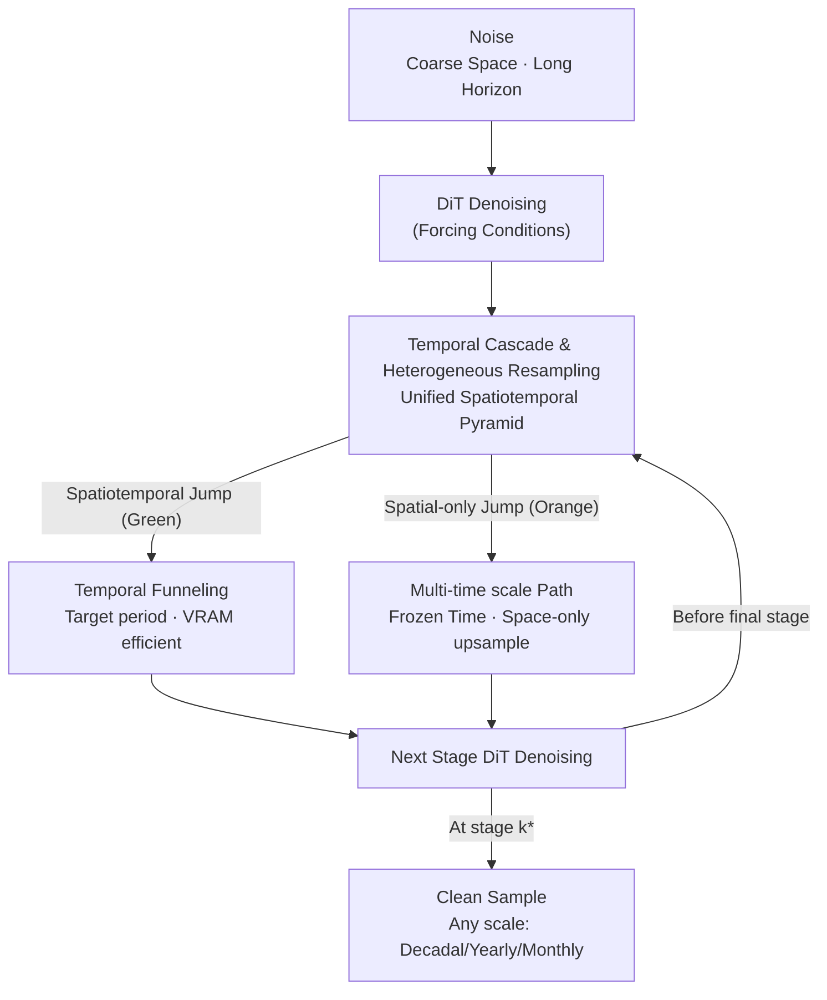

# Spatiotemporal Pyramid Flow Matching for Climate Emulation

**Conference**: CVPR 2026  
**Paper**: [CVF Open Access](https://openaccess.thecvf.com/content/CVPR2026/html/Irvin_Spatiotemporal_Pyramid_Flow_Matching_for_Climate_Emulation_CVPR_2026_paper.html)  
**Code**: https://github.com/stanfordmlgroup/spf  
**Area**: Diffusion/Flow Matching Generative Models · Climate Emulation  
**Keywords**: Flow Matching, Spatiotemporal Pyramid, Climate Emulation, Probabilistic Emulator, Multi-time scale

## TL;DR
The "coarse-to-fine" pyramid flow matching is extended to both spatial and temporal dimensions, proposing Spatiotemporal Pyramid Flow (SPF). Using a DiT network for parallel sampling of decadal/yearly/monthly climate fields in pixel space, it achieves 15–28× faster speeds than autoregressive climate emulators while attaining superior CRPS/RMSE on ClimateBench.

## Background & Motivation
**Background**: Earth System Models (ESMs) are the "gold standard" for predicting climate evolution, but running decades to centuries of simulations—plus ensembles for uncertainty quantification—incurs prohibitive computational costs even for supercomputers. Research has shifted toward training **emulators** using machine learning to replicate ESM outputs efficiently. Current mainstream approaches adopt **weather-scale autoregression (e.g., 6-hour steps)**, rolling out step-by-step to climate scales (decades), similar to weather forecasting.

**Limitations of Prior Work**: Weather-scale autoregression faces two critical issues in climate emulation. First is **error accumulation**—small local errors at each step amplify over long-range rollouts, leading to drift in long-term statistics. Existing models struggle to replicate true climate trends under greenhouse gas/aerosol forcing even when providing decadal summaries. Second is **latency**—long-range rollouts require massive serial steps. Generating a 10-year, 6-hour resolution trajectory with SOTA emulators takes nearly 3 hours. Many downstream tasks (Integrated Assessment Models, industry impact studies) only require **yearly or monthly** averages, making serial rollout of 6-hour steps highly wasteful.

**Key Challenge**: Climate emulation naturally possesses a hierarchical structure where "slow components modulate fast components"—spatially, large-scale energy/moisture transport organizes small-scale features; temporally, forcing trends and interannual variability modulate rapid weather fluctuations. Autoregressive frameworks force **fine-step rollouts** to approximate these long-range dependencies, which neither matches the physical hierarchy nor avoids computational waste on unused high frequencies.

**Goal**: (1) Develop a probabilistic emulator that operates directly in pixel space without a VAE; (2) Enable **parallel** sampling of long sequences and **direct** production of samples at arbitrary time scales (decadal/yearly/monthly) without generating the finest resolution first; (3) Capture slow trends by conditioning on forcing variables (GHGs, aerosols, etc.).

**Key Insight**: The authors adopt the **cascaded pyramid flow** concept from image/video generation—building coarse structures before iterative refinement—to concentrate compute where it impacts quality most. While existing models like PixelFlow/PyramidalFlow only use **spatial** pyramids, the authors observe that climate data has parallel hierarchies in the **time** dimension (Decadal → Yearly → Monthly), leading to the generalization of pyramids to spatiotemporal joint dimensions.

**Core Idea**: The generation trajectory is segmented into a **spatiotemporal pyramid**. Long-term states at coarse spatial resolutions are established first (encoding forcing trends), followed by hierarchical conditional refinement of space and then time. This allows for **direct sampling** of any future time point, bypassing step-by-step autoregression.

## Method

### Overall Architecture
SPF belongs to the class of flow matching models: during training, it learns a velocity field $v_t$ that transports noise to the target climate distribution via the ODE $\mathrm{d}x_t/\mathrm{d}t = v_t(x_t)$. The core innovation lies in partitioning the generation trajectory into $K$ **piecewise** stages, each corresponding to a "spatial × temporal resolution" level in the pyramid. This work utilizes $K=3$ stages, corresponding to the common climatological scales: **Decadal → Yearly → Monthly**.

The pipeline begins with coarse-spatial, long-horizon noise. Each stage uses a DiT for denoising, followed by a "stage jump"—either a **spatiotemporal jump** (upsampling both dimensions and funneling time to the target period) or a **pure spatial jump** (increasing spatial resolution while keeping time resolution fixed). This continues until the final stage, outputting clean samples at the target period and scale. Forcing variables aligned with the time period serve as cross-attention conditions.

### Key Designs

**1. Temporal Cascading & Heterogeneous Resampling: Hierarchical spatiotemporal refinement**

Traditional spatial pyramid flows segment trajectories by spatial resolution, denoising at fixed levels and upsampling (usually 2×). SPF extends "resolution" to a $(h, w, t)$ triplet and allows **different resampling factors for each dimension and stage**. Formally, downsampling and upsampling are defined as $\mathrm{Down}_k(x)=\mathrm{Downsample}(x;\dot r^h_k,\dot r^w_k,\dot r^t_k)$ and $\mathrm{Up}_k(z)=\mathrm{Upsample}(z;r^h_{k+1},r^w_{k+1},r^t_{k+1})$, where $\dot r_k=\prod_{i=1}^k r_i$ is the cumulative factor. The flow within a stage $k$ window is:

$$x_t = t' \,\mathrm{Down}_k(x_{e_k}) + (1-t')\,\mathrm{Up}_k(\mathrm{Down}_{k+1}(x_{s_k})),$$

The endpoints of the probability path share a noise sample $n\sim\mathcal N(0,I)$: $\hat x_{e_k}=e_k\mathrm{Down}_k(x_1)+(1-e_k)n$ and $\hat x_{s_k}=s_k\mathrm{Up}_k(\mathrm{Down}_{k+1}(x_1))+(1-s_k)n$, with the flow matching objective $\mathcal L_{\text{PFM}}=\mathbb E\|v_t(\hat x_t)-(\hat x_{e_k}-\hat x_{s_k})\|^2$.

To maintain **distribution continuity at stage jumps** with different resolutions, the authors generalize correction rules to arbitrary factors:

$$\hat x_{s_k}=\frac{(1-s_k)+s_k\sqrt{n_k}}{\sqrt{n_k}}\,\mathrm{Up}_k(\hat x_{e_{k+1}})+(1-s_k)\sqrt{\tfrac{n_k-1}{n_k}}\,n',$$

where $n_k=r^h_k r^w_k r^t_k$. This ensures continuity for **heterogeneous** ratios common in climate (e.g., decadal to yearly is $\times 10$, yearly to monthly is $\times 12$).

**2. Temporal Funneling: Focusing compute on relevant frames**

Generating entire long sequences at the finest resolution is memory-intensive. SPF slices the latents in the temporal dimension **before** each upsampling, retaining only $T'_k\le T_k$ time indices of interest. Since denoised latents are Gaussian, any temporal subset remains Gaussian. The mean and covariance are simply subsets of the original parameters, allowing the scaling-noise correction to hold **unchanged**. By funneling to a single frame ($T'_k=1$), memory and FLOPs are reduced by $10\times$ to $12\times$ per stage.

**3. Multi-time scale Sampling: Direct clean samples at any scale**

SPF introduces a **time-frozen path** loss to avoid always generating the finest scale first. During training, a Bernoulli indicator $\omega_k\sim\text{Bernoulli}(\varepsilon_k)$ is sampled: $\omega_k=1$ indicates spatiotemporal refinement, while $\omega_k=0$ freezes temporal resolution. With $K=3$, this covers paths for decadal, yearly, and monthly outputs. The objective becomes $\mathcal L_{\text{MT}}=\mathbb E_{k,t,\omega_k}\|v_t(\hat x_t)-(\hat x^{\omega}_{e_k}-\hat x^{\omega}_{s_k})\|^2$. At inference, the ODE is solved to stage $k^*$, followed by spatial-only upsampling, allowing for **coarse-scale fields without generating fine-scale samples**.

### Loss & Training
The backbone is an MM-DiT. Spatial encoding uses sinusoidal positions, while temporal encoding uses 1D RoPE. The model uses 8×8 patches for output and 16×16 for forcing variables. Sequence packing is employed to handle varying resolutions on a single 16GB RTX A4000. 

The authors curated **ClimateSuite**, the largest ML-ready climate dataset to date, including 10 ESMs and 33,739 simulation years. It notably includes **Stratospheric Aerosol Injection (SAI) experiments**, adding aerosol optical depth (AOD) as a forcing proxy.

## Key Experimental Results

### Main Results
Evaluated on the ClimateBench held-out scenario SSP2-4.5 (CRPS for probabilistic skill, RMSE/Bias for mean quality, Runtime in seconds for 10-year trajectory):

| Model (200M) | Temporal Capability | Year-CRPS↓ | Year-RMSE↓ | Year-Runtime | Month-CRPS↓ | Month-Runtime |
|------|------|------|------|------|------|------|
| Pyramidal Flow (AR) | Autoregressive | 0.327 | 0.671 | 24 | 0.473 | 105 |
| Multi-Monthly Flow (Ours) | Parallel | 0.231 | 0.528 | 21 | 0.443 | 21 |
| PixelFlow (Spatial Pyramid) | Single-scale | 0.224 | 0.504 | 7 | – | – |
| **SPF (Ours)** | Parallel/Multi-scale | **0.222** | 0.511 | **6** | 0.453 | **11** |

Key takeaway: SPF achieves the **lowest Year-CRPS** across categories. Compared to the autoregressive PyramidalFlow, it is **28×** (100M) to **>15×** (200M) faster for decadal outputs, reducing sampling time to seconds.

### Ablation Study (Pyramid Structure, 200M, Monthly scale)

| Variant | Stage Sequence | CRPS↓ | RMSE↓ | Note |
|------|------|------|------|------|
| DYMMM | D→Y→M→M→M | 0.474 | 1.087 | Time jumps first, then space (5 stages) |
| DYYMM | D→Y→Y→M→M | 0.463 | 1.085 | Alternating time/space (5 stages) |
| DYM-Monthly | D→Y→M | 0.453 | 1.064 | 3 Stages, monthly only |
| **SPF (DYM-Any)** | D→Y→M | **0.453** | **1.060** | 3 Stages, multi-scale support |

### Key Findings
- **Multi-scale training is "free"**: The multi-scale DYM-Any model performs identically to the monthly-only model in CRPS and slightly better in RMSE (1.060 vs 1.064).
- **3 Stages > 5 Stages**: Decoupling spatiotemporal jumps into more stages yields worse performance. Spatiotemporal joint refinement with fewer stages is superior.
- **Model Generalization**: Pre-trained SPF (600M) outperforms 600M UNet across 10 ESMs (CRPS 0.256 vs 0.393) and generalizes well to unseen UKESM1-0-LL SAI scenarios.

## Highlights & Insights
- **Hierarchical Alignment**: SPF aligns the "cascaded pyramid" architecture with the natural hierarchy of climate data (Decadal → Monthly), matching physical intuition with algorithmic structure.
- **Gaussian Funneling**: The insight that "subsets of Gaussians remain Gaussian" allows for drastic compute reduction when only specific time points are needed.
- **Pixel-Space Efficiency**: By operating in pixel space without a VAE, the model avoids compression artifacts and keeps the engineering overhead low for climatological applications.
- **Zero-cost Multi-scaling**: Using a Bernoulli indicator to randomize generation paths during training enables a single network to serve multiple resolutions flexibly.

## Limitations & Future Work
- **Physical Conservation**: SPF lacks explicit constraints for energy or mass conservation, which may lead to physical inconsistencies under certain forcing conditions.
- **Data Dependency**: Performance is tied to the diversity of ESM ensembles in ClimateSuite; generalization to unseen parametrization schemes remains a challenge.
- **Scale Resolution**: Evaluation focused on monthly/yearly scales; performance at sub-daily scales remains unverified.

## Related Work & Insights
- **vs PixelFlow**: PixelFlow uses purely spatial, homogeneous (×2) pyramids. SPF generalizes this to spatiotemporal dimensions and heterogeneous factors.
- **vs PyramidalFlow**: PyramidalFlow is autoregressive over time and VAE-dependent. SPF is parallel and VAE-free, achieving 15–28× speedups.
- **Insight**: Mapping physical hierarchies (time scales) directly to pyramid stages is often more efficient than requiring a model to learn these hierarchies through fine-step autoregression.

## Rating
- Novelty: ⭐⭐⭐⭐⭐ Extending pyramid flow matching to spatiotemporal/heterogeneous scales is a significant conceptual leap.
- Experimental Thoroughness: ⭐⭐⭐⭐ Extensive benchmarks across ClimateBench, multi-model ensembles, and SAI scenarios.
- Writing Quality: ⭐⭐⭐⭐ Clear motivation and derivations, though jump-correction formulas are dense.
- Value: ⭐⭐⭐⭐⭐ Provides a fast probabilistic paradigm and a significant new dataset (ClimateSuite) for the community.

<!-- RELATED:START -->

## Related Papers

- [\[CVPR 2026\] Flow Matching for Multimodal Distributions](flow_matching_for_multimodal_distributions.md)
- [\[CVPR 2026\] Stable Mean Flow: Lyapunov-Inspired One-Step Flow Matching](stable_mean_flow_lyapunov-inspired_one-step_flow_matching.md)
- [\[CVPR 2026\] Frequency-Aware Flow Matching for High-Quality Image Generation](freqflow_frequency_aware_flow_matching.md)
- [\[CVPR 2026\] RenderFlow: Single-Step Neural Rendering via Flow Matching](renderflow_single-step_neural_rendering_via_flow_matching.md)
- [\[CVPR 2026\] Learning Straight Flows: Variational Flow Matching for Efficient Generation](learning_straight_flows_variational_flow_matching_for_efficient_generation.md)

<!-- RELATED:END -->
