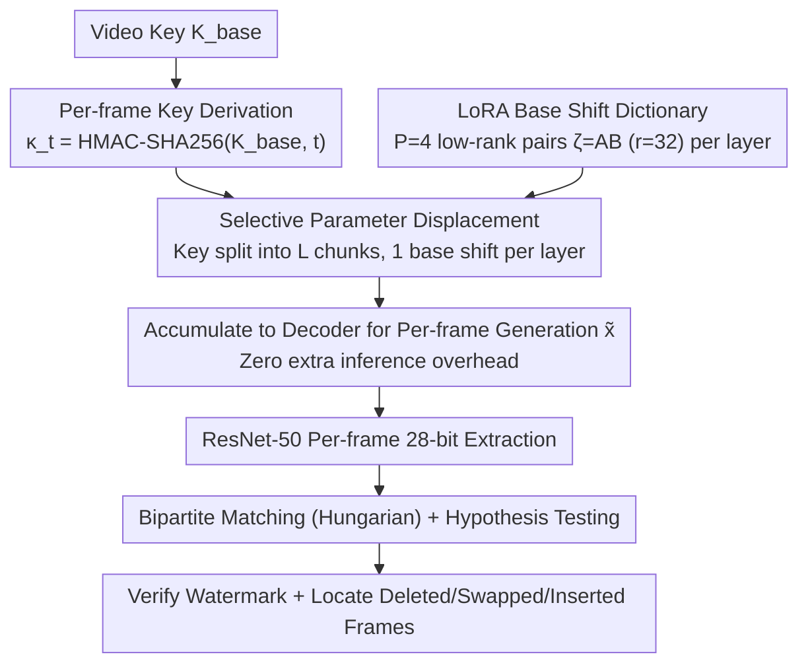

# SPDMark: Selective Parameter Displacement for Robust Video Watermarking

**Conference**: CVPR 2026  
**arXiv**: [2512.12090](https://arxiv.org/abs/2512.12090)  
**Code**: Available (mentioned in paper)  
**Area**: Diffusion Models / Video Watermarking  
**Keywords**: Video Watermarking, Parameter Displacement, LoRA, Diffusion Models, Robustness

## TL;DR
SPDMark proposes an in-model video watermarking framework based on Selective Parameter Displacement (SPD). By learning a dictionary of low-rank base shifts in the decoder and combining them based on a watermark key, it achieves per-frame embedding, imperceptibility, high robustness, and low computational overhead, while supporting temporal tampering detection and localization.

## Background & Motivation

1. **Background**: The emergence of high-quality video generation models (e.g., Sora, SVD) has made the provenance of AI-generated videos increasingly critical. The EU AI Act and US Executive Orders suggest watermarking AI-generated content. Video watermarking must simultaneously satisfy imperceptibility, robustness, and computational efficiency.

2. **Limitations of Prior Work**: (a) Post-processing methods (e.g., VideoSeal) increase latency and fail to leverage generative priors; (b) Noise-space methods (e.g., VideoShield) rely on DDIM inversion for decoding, which is computationally expensive and sensitive to perturbations; (c) Model-finetuning methods (e.g., LVMark) modulate all layers uniformly, limiting per-frame control, while VidSig embeds only a single fixed signature, failing to detect temporal tampering. These three types of methods exhibit trade-offs between imperceptibility, robustness, and efficiency.

3. **Key Challenge**: How to achieve efficient multi-key per-frame watermark embedding without sacrificing video quality, while enabling frame-level temporal tampering detection?

4. **Goal**: Design an in-generation video watermarking scheme that supports arbitrary keys, per-frame watermarking, and temporal tampering detection with negligible computational overhead.

5. **Key Insight**: Instead of perturbing pixels or noise, the watermark is embedded by learning a dictionary of low-rank base shifts and selectively displacing generative model parameters according to the watermark key.

6. **Core Idea**: Learn a fixed dictionary of LoRA base shifts. The watermark key for each frame determines which base shift is selected for each layer, thereby embedding per-frame watermarks in the decoder parameter space without inference overhead or per-key retraining.

## Method

### Overall Architecture
SPDMark aims to "write" the watermark during the generation process of the video diffusion model, embedding different watermarks per frame to maintain quality while tracking per-frame modifications. Rather than altering pixels or noise, it modifies decoder parameters. Given a video-level key $K_{base}$, a unique watermark message $\kappa_t$ is derived for each frame using a cryptographic hash. Each $\kappa_t$ is translated into a binary mask to select a "base shift" from the dictionary for each decoder layer. Selected base shifts are added to the original parameters, and the video $\tilde{\mathbf{x}}$ generated by this fine-tuned decoder carries per-frame watermarks. The extraction end uses a ResNet-50 to read messages frame-by-frame, followed by bipartite matching and hypothesis testing between the extracted and reference sequences to verify the watermark and locate deleted, swapped, or inserted frames.

### Key Designs

**1. Selective Parameter Displacement: Converting "Which Watermark" to "Which Base Shift per Layer"**

Directly learning a mapping from "key to parameter displacement" is impractical because decoder parameters are high-dimensional and the displacement space is too vast. SPDMark decomposes the problem: parameters are divided into frozen $\Phi_U$ and mutable $\Phi_M$ (decoder only). Let $\Phi_M$ span $L$ layers, with $P$ candidate base shifts $\zeta_{\ell,p}$ prepared for each layer. The actual displacement for a layer is $\Delta\phi_\ell = \sum_{p=1}^P b_{\ell,p}\,\zeta_{\ell,p}$, where the mask $b_{\ell,p}$ is determined by the key. Specifically, the $M = L\log_2 P$ bit key is split into $L$ chunks; the decimal value of the $\ell$-th chunk selects the base shift for that layer. Since only one shift is selected per layer, the displacement collapses into a pure selection:

$$\Delta\Phi_M(\kappa) = [\zeta_{1,i_1+1},\ \ldots,\ \zeta_{L,i_L+1}]^{T}$$

This ensures the dictionary $\{\zeta_{\ell,p}\}$ is fixed after training. New keys simply switch combinations within the dictionary without retraining. This reduces the search space from high-dimensional continuous displacement to discrete selection per layer.

**2. LoRA for Base Shifts: Keeping the Dictionary Lightweight**

Static base shifts as full-rank matrices would make the dictionary larger than the original model. SPDMark uses low-rank decomposition $\zeta_{\ell,p} = A_{\ell,p} B_{\ell,p}$ where $A \in \mathbb{R}^{d\times r}, B \in \mathbb{R}^{r\times d}, r \ll d$ (typically $r=32$). Selected layers perform forward passes as:

$$\mathbf{h}_\ell = \mathcal{F}_{\phi_\ell}(\mathbf{h}_{\ell-1}) + \alpha\,\mathcal{F}_{\Delta\phi_\ell}(\mathbf{h}_{\ell-1})$$

In implementation, watermarks are attached to $L=14$ spatial ResNet blocks in the decoder, with $P=4$ LoRA pairs per block. Thus, each layer carries $\log_2 4 = 2$ bits, totaling a 28-bit payload per frame. Low-rank decomposition preserves expressiveness while compressing dictionary size, which is key to "zero additional inference overhead."

**3. Per-frame Watermarking + Bipartite Matching: Detecting Temporal Tampering**

Prior in-model watermarks (e.g., VidSig) embed a single fixed signature for the entire video, making temporal tampering (deletion, reordering, insertion) undetectable. SPDMark generates unique messages per frame via HMAC-SHA256: $\kappa_t = \text{Trunc}_M(\mathcal{H}(K_{base}, t))$. Verification treats the reference sequence $\mathbf{K}$ and extracted sequence $\hat{\mathbf{K}}$ as nodes in a bipartite graph. Edge weights are Hamming similarities $\bar{S}_{m,n} = 1 - \psi(\kappa_m, \hat{\kappa}_n)/M$. The Hungarian algorithm finds the maximum weight matching, followed by binomial hypothesis testing (frame threshold $\tau_f$, video threshold $\tau_v$). Matched frames confirm watermark validity, while mismatches indicate tampering.

### Loss & Training
The objective optimizes for both imperceptibility and message recovery: $\min_{\zeta,\eta}\ \mathcal{L}_{imp}(\mathbf{x}, \tilde{\mathbf{x}}) + \mathcal{L}_{rec}(\mathcal{V}_\eta(\tilde{\mathbf{x}}), \kappa)$. Recovery uses BCElogits. Imperceptibility loss $\mathcal{L}_{imp} = \lambda_{ps}\,\mathbb{E}_t[\text{LPIPS}(x_t, \tilde{x}_t)] + \lambda_{tc}\,\mathbb{E}_t[\|\delta y_t - \delta \tilde{y}_t\|_1]$ combines LPIPS for frame quality and a temporal consistency term (L1 of adjacent frame brightness differences) to prevent flickering. Training is conducted on 10,000 videos from OpenVid-1M. The extractor uses an ImageNet-pretrained ResNet-50 with batch normalization applied across all video frames during inference for stability.

## Key Experimental Results

### Main Results (Video Quality + Detection)

**SVD-XT Model**:

| Method | Payload | Bit Acc↑ | SC↑ | BC↑ | MS↑ | IQ↑ |
|------|---------|----------|-----|-----|-----|-----|
| VideoShield | 512 | 0.979 | 0.954 | 0.954 | 0.956 | **0.695** |
| VideoSeal | 256 | **0.999** | 0.955 | 0.950 | 0.961 | 0.682 |
| VidSig | 48 | 0.958 | 0.951 | 0.953 | 0.956 | 0.693 |
| **Ours** | 28×25 | 0.995 | **0.966** | **0.958** | **0.975** | 0.690 |

### Robustness (SVD-XT Average Bit Acc)

| Method | Photometric | Temporal | Post-proc | Average |
|------|---------|---------|--------|------|
| VideoShield | ~0.82 | ~0.94 | ~0.83 | 0.833 |
| VideoSeal | ~0.94 | ~1.00 | ~0.82 | 0.912 |
| VidSig | ~0.66 | ~0.96 | ~0.53 | 0.685 |
| **Ours** | ~0.94 | ~0.99 | ~0.89 | **0.935** |

### Ablation Study

| Configuration | Key Metric | Description |
|------|---------|------|
| Full SPDMark | Avg Bit Acc 0.935 | Complete model |
| SPDMark on ModelScope | High Avg Bit Acc | Cross-architecture generalization (UNet→DiT) |
| Temporal Localization | High Precision/Recall/F1 | Validates detection of deletion/insertion/swap |

### Key Findings
- SPDMark consistently outperforms baselines in video quality metrics (SC/BC/MS), suggesting parameter displacement has minimal impact on visual quality.
- Achieves an average Bit Acc of 0.935, surpassing VideoSeal (0.912) and VideoShield (0.833).
- In Screen Recording attacks, SPDMark reaches 0.837, far exceeding VideoSeal's 0.598, indicating generative watermarks are more robust than post-processing ones.
- Under Crop & Drop composite attacks, SPDMark (0.856) significantly outperforms others (0.458-0.513).
- The per-frame mechanism allows successful detection and localization of temporal tampering.

## Highlights & Insights
- **Parameter Space Watermarking as a Paradigm Shift**: Operating in parameter space rather than pixel/noise space naturally inherits model generation quality with minimal overhead.
- **LoRA-based Shift Dictionary for Infinite Keys**: The dictionary is trained once; new keys are merely new combinations of shifts. This is far more efficient than per-key fine-tuning.
- **Cryptographic Hashing + Hungarian Matching**: Combining cryptographic tools with graph matching algorithms provides an elegant solution for verifying sequence integrity, extendable to other sequence verification tasks.

## Limitations & Future Work
- Payload is limited to 28 bits per frame (14 layers × 2 bits). Increasing depth requires more LoRA bases or layers.
- Watermarking is localized to the decoder; replacing the decoder would strip the watermark (though unlikely in API-controlled scenarios).
- The ResNet-50 extractor is relatively simple and may lack robustness against extreme attacks like high-compression H.265.
- Training requires paired watermarked/non-watermarked videos, which is data-intensive.

## Related Work & Insights
- **vs VideoShield**: Noise-space based with DDIM inversion, high overhead, and poor robustness under Crop attacks (0.521). SPDMark avoids inversion.
- **vs VideoSeal**: Post-processing method, vulnerable to Screen Recording (0.598). SPDMark leverages generative priors for better robustness.
- **vs VidSig**: Frozen PAS layers + temporal alignment, but fixed signature cannot detect temporal tampering. SPDMark's per-frame mechanism is more flexible.
- **vs AQuaLoRA**: Image-level LoRA watermarking; SPDMark extends this to video while adding temporal consistency and tampering detection.

## Rating
- Novelty: ⭐⭐⭐⭐⭐ The parameter displacement framework and LoRA-shift dictionary are highly novel.
- Experimental Thoroughness: ⭐⭐⭐⭐ Covers two architectures and various attacks, though ablation studies could be more detailed.
- Writing Quality: ⭐⭐⭐⭐ Formal derivations are clear, though notation is dense.
- Value: ⭐⭐⭐⭐⭐ Highly practical video watermarking scheme, directly deployable in video generation API services.

<!-- RELATED:START -->

## Related Papers

- [\[CVPR 2026\] Rel-Zero: Harnessing Patch-Pair Invariance for Robust Zero-Watermarking Against AI Editing](rel-zero_harnessing_patch-pair_invariance_for_robust_zero-watermarking_against_a.md)
- [\[ICLR 2026\] FARI: Robust One-Step Inversion for Watermarking in Diffusion Models](../../ICLR2026/image_generation/fari_robust_one-step_inversion_for_watermarking_in_diffusion_models.md)
- [\[ECCV 2024\] Robust-Wide: Robust Watermarking against Instruction-driven Image Editing](../../ECCV2024/image_generation/robust-wide_robust_watermarking_against_instruction-driven_image_editing.md)
- [\[CVPR 2026\] SpotEdit: Selective Region Editing in Diffusion Transformers](spotedit_selective_region_editing_in_diffusion_transformers.md)
- [\[CVPR 2026\] SIGMA: Selective-Interleaved Generation with Multi-Attribute Tokens](sigma_selective-interleaved_generation_with_multi-attribute_tokens.md)

<!-- RELATED:END -->
