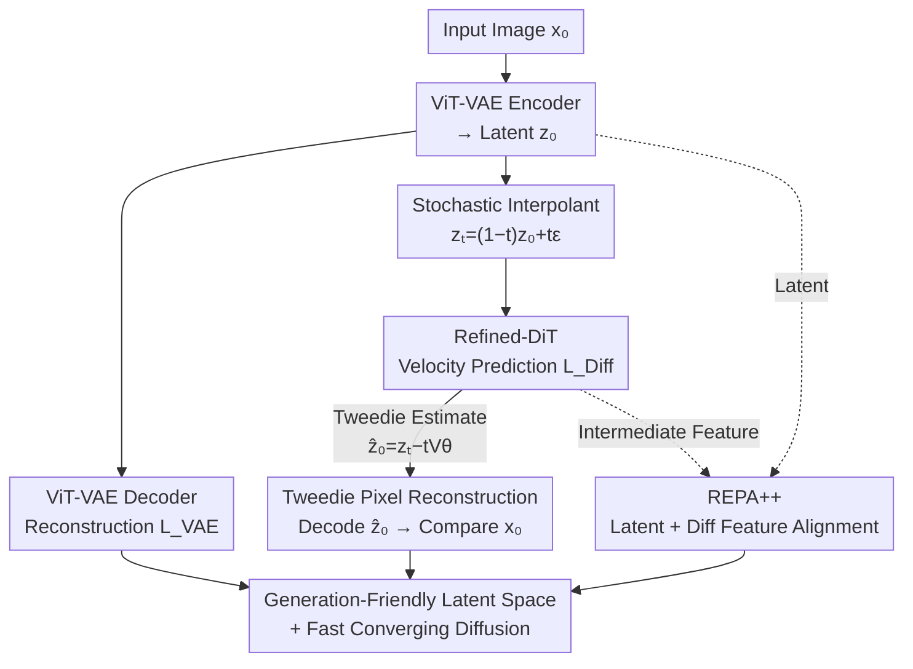

# SpeeDiff: Scalable Pixel-Anchored End-to-End Latent Diffusion Model

**Conference**: CVPR 2026  
**Paper**: [CVF Open Access](https://openaccess.thecvf.com/content/CVPR2026/html/Zhang_SpeeDiff_Scalable_Pixel_Anchored_End_to_End_Latent_Diffusion_Model_CVPR_2026_paper.html)  
**Code**: None  
**Area**: Diffusion Models / Image Generation  
**Keywords**: Latent Diffusion, End-to-End Training, VAE, Tweedie Formula, Representation Alignment  

## TL;DR
SpeeDiff dismantles the two-stage pipeline in Latent Diffusion Models (LDM)—where the VAE is trained first and then frozen—by enabling joint training of the VAE and the diffusion model from scratch without stop-gradients. The key innovation is a Tweedie Pixel Reconstruction (TPR) loss that "anchors" diffusion gradients back to the pixel space, preventing latent collapse. It achieves a gFID of 1.50 (without guidance) on ImageNet 256×256, with training speeds 140× faster than Vanilla SiT and 61× faster than REPA.

## Background & Motivation

**Background**: Latent Diffusion Models (LDM) have become the mainstream paradigm for visual generation. They typically use a VAE to compress images into a compact latent space, followed by training a diffusion model (usually a DiT) within that space. The standard practice follows a two-stage pipeline: the VAE is trained to convergence and frozen, and the diffusion model learns on the fixed latent space. Recent improvements to LDMs primarily focus on "making the VAE better," such as utilizing Visual Foundation Models (VFMs, like DINOv3) for representation alignment (REPA) or using VFMs directly as encoders.

**Limitations of Prior Work**: VAEs trained with reconstruction objectives primarily capture low-level pixel statistics, resulting in a latent space that lacks semantic structure, which makes it challenging for diffusion models to learn. Meanwhile, end-to-end optimization that makes the VAE "generation-friendly"—where gradients from the diffusion loss propagate directly back to the VAE encoder—has rarely been explored. This is due to a well-known issue since the LSGM era: naive end-to-end joint training leads to **severe performance degradation**. The authors' reproduction of Vanilla E2E on ImageNet 250 achieved a gFID of only 33.95 after 80 epochs, significantly worse than the two-stage baseline.

**Key Challenge**: The authors diagnose the root cause of degradation as **latent collapse**. In end-to-end training, the diffusion model can "cheat" by forcing the latent space into a degenerate representation: channel variance is severely suppressed, biases are large, and the latent distribution deviates from the Gaussian prior into several sharp peaks. Consequently, the conditional distribution of the clean latent $z_0$ given a noisy state $z_t$ becomes extremely concentrated. The diffusion model minimizes latent diffusion loss by predicting a near-constant mean for almost all inputs, thereby losing all semantic information required for image reconstruction. In other words, **low latent loss $\neq$ pixel reconstructibility**; the diffusion model finds a shortcut via a trivial solution.

**Goal / Key Insight**: Since the problem arises because "the diffusion model only focuses on latent-space objectives and lacks pixel-level constraints," the goal is to introduce pixel-level feedback to "anchor" the latent codes to positions capable of original image reconstruction.

**Core Idea**: Use the Tweedie formula to estimate clean latents from intermediate noisy states, decode them back to pixels, and compare them with the original image (TPR loss) to force the VAE to maintain a semantically meaningful latent space. Building on this, the authors adopt an all-Transformer architecture (ViT-VAE + Refined-DiT) and introduce an enhanced representation alignment (REPA++) to achieve a single-stage end-to-end LDM from scratch.

## Method

### Overall Architecture

SpeeDiff is a **single-stage framework that jointly trains the VAE and diffusion model from scratch without any stop-gradients**. Given an input image $x_0$, the VAE encoder compresses it into a latent code $z_0$. The diffusion model learns a velocity field in the latent space using a stochastic interpolant formulation. The output is a "generation-friendly" latent space that remains reconstructible, alongside a rapidly converging diffusion model.

The forward training process runs **four branches** simultaneously, sharing the same gradient flow (including diffusion gradients back-propagated to the VAE encoder): ① A reconstruction branch calculating the standard VAE loss $L_{VAE}$; ② A diffusion branch calculating $L_{Diff}$ via flow matching on stochastic interpolants; ③ The **TPR branch**—the core for preventing collapse—which uses the Tweedie formula to estimate clean latents from noisy states and decodes them to pixels for comparison with the original image; ④ The **REPA++ branch**, which aligns both latent codes and intermediate diffusion features with frozen VFM representations. The total objective is the sum of these four terms:

$$L_{\text{SpeeDiff}} = L_{VAE} + L_{Diff} + L_{TPR} + L_{\text{REPA++}}$$

The following diagram illustrates how these branches collaborate within a single training step:

### Key Designs

**1. Tweedie Pixel Reconstruction (TPR) Loss: Anchoring Diffusion Gradients to Pixels**

This is the most critical and cost-effective contribution, directly addressing the issue of the diffusion model "cheating" and discarding reconstruction information. The reasoning is: if collapse occurs due to a lack of pixel-level supervision, one should explicitly recover an image from the diffusion prediction and compare it with the truth. Specifically, under the stochastic interpolant $z_t = (1-t)z_0 + t\varepsilon$, the Tweedie estimate of the clean latent by the diffusion model is $\hat{z}_0 = z_t - t V_\vartheta(z_t, t)$. This is passed into the VAE decoder $D_\xi$ and compared with the original image via MSE:

$$L_{TPR} = \mathbb{E}_{x_0, z_0, \varepsilon, t}\big[\|D_\xi(\hat{z}_0) - x_0\|^2\big]$$

This term acts as a reconstruction constraint in pixel space (LPIPS perceptual loss can also be added). Its beauty lies in forcing the VAE to maintain a "pixel-decodable" latent space; if the diffusion model tries to minimize latent loss by predicting a constant, the decoded image will deviate significantly from the original, incurring a high TPR penalty. Diagnostic experiments (Paper Fig. 3) show that adding TPR pulls the latent distribution back toward a Gaussian state and balances channel biases and variances. The result is immediate: adding only this term reduces the FID of Vanilla E2E from 33.95 to 5.79 (80 epochs).

**2. All-Transformer Architecture (ViT-VAE + Refined-DiT): Enabling Joint Scaling**

Once the end-to-end pipeline was stabilized, the authors replaced the architecture with all-Transformer components to unlock joint scaling. The VAE side uses ViT-VAE instead of traditional CNN-VAE: the encoder uses patch-embedding and Transformer blocks, with a mirror-symmetric decoder. The diffusion backbone, named Refined-DiT, incorporates recent improvements (referencing LightningDiT): RMSNorm, SwiGLU activation, 2D RoPE, and replacing per-block modulation with "shared global modulation + per-block learnable bias" (similar to PixArt-α), with a fixed patch size of 1. This architecture change actually reduced single-step training costs from 436.29 GFLOPs to 334.98 GFLOPs, while further reducing 80-epoch FID to 3.66. More importantly, it avoids the capacity bottlenecks of convolutions and allows for **scaling the VAE and diffusion model together**, resulting in a cleaner scaling curve than EDM2.

**3. REPA++ Representation Alignment: Dual-Path VFM Guidance**

To accelerate convergence and enhance semantics, the authors upgraded REPA to REPA++, which **simultaneously** aligns two sets of features to a frozen VFM (default DINOv3-ViT-L/16). Let $y = \text{VFM}(x_0)$ be the semantic representation. The first path, **Latent-REPA**, maps the latent $z_0$ through a two-layer MLP $h_{\varrho_1}$ to maximize cosine similarity with $y$: $L_{\text{Latent-REPA}} = -\mathbb{E}[\text{sim}(h_{\varrho_1}(z_0), y)]$. The second path, **Diff-REPA**, follows the original REPA by aligning intermediate diffusion features $f_t$ through another MLP $h_{\varrho_2}$ to the same $y$. Because SpeeDiff lacks stop-gradients, semantic supervision **propagates through the entire encoder via backpropagation**, making the latent space inherently more semantic. Adding REPA++ reduced SpeeDiff-XL's 80-epoch FID from 3.66 to 1.69.

## Key Experimental Results

### Main Results

On ImageNet 256×256, SpeeDiff-XL achieves SOTA in both "non-VFM aligned" and "aligned" categories, requiring significantly fewer training epochs.

| Method | VAE / Diffusion | Epochs | gFID↓ (No Guidance) |
| :--- | :--- | :--- | :--- |
| SiT | SD-VAE / DiT-XL | 1400 | 8.61 |
| MDTv2 | SD-VAE / DiT-XL | 1080 | — (1.58 w/ guidance) |
| REPA | SD-VAE / DiT-XL | 800 | 5.90 |
| REPA-E | E2E-VAE / DiT-XL | 800 | 1.83 |
| **Ours-XL (w/o REPA++)** | ViT-VAE-XL / Refined-DiT-XL | 200 | **2.42** |
| **Ours-XL (w/ REPA++)** | ViT-VAE-XL / Refined-DiT-XL | 200 | **1.50** |

For 512×512 (using a 32× compression VAE, f32d32), SpeeDiff-XL (w/ REPA++) reached a gFID of **1.53** in 200 epochs, outperforming EDM2-XXL (1.91) with lower computational overhead.

Training speed: SpeeDiff-XL (w/ REPA++) reached a gFID of 7.36 in just **10 epochs**, surpassing Vanilla SiT trained for 1400 epochs. Overall training is **140× faster** than SiT and **61× faster** than REPA.

### Ablation Study

Incremental additions (ImageNet 256, 80 epochs, gFID↓), comparing "detached" vs "end-to-end" paths:

| Configuration | Detached | End-to-end |
| :--- | :--- | :--- |
| Baseline | 13.02 (2-stage) / 14.21 (1-stage) | 33.95 (Vanilla E2E, Collapse) |
| + TPR Loss | 11.65 | 5.79 |
| + Refined Architecture | 7.52 | 3.66 |
| + REPA++ | 3.47 | **1.69** |

### Key Findings
- **TPR is the linchpin of E2E**: Without it, E2E (33.95) is far worse than two-stage (13.02). With it, E2E (5.79) takes the lead. The same loss in a detached path only offers marginal gains (14.21 to 11.65), proving its true value is safeguarding backpropagated diffusion gradients.
- **E2E naturally enhances latent semantics**: Even without REPA++, E2E training improves latent linear probing accuracy by 9.45%.
- **The trained VAE is a "generation-friendly" reusable asset**: Freezing a pre-trained SpeeDiff VAE and training a new diffusion model from scratch yields a convergence rate nearly identical to SpeeDiff itself (1.73 vs 1.69 FID).

## Highlights & Insights
- **Clever use of Tweedie**: Borrowed from sampling/denoising, it is used here as a "probe" to translate latent predictions back to pixels for supervision, solving the collapse problem with zero additional structural cost.
- **Clean "Diagnosis → Cure" Research Paradigm**: The authors substantiate "collapse" through latent errors, KDE distributions, and per-channel statistics before providing a targeted solution.
- **Transferable Insight**: Any E2E task optimized in a compressed/latent space that requires reconstruction (e.g., neural compression, tokenized generation) can benefit from "anchoring" latent predictions back to the original space via the decoder.

## Limitations & Future Work
- The paper focuses on ImageNet class-conditional generation. Whether TPR is sufficient for **Text-to-Image or Video generation** remains unverified.
- The TPR branch requires an **additional decoder forward pass** per step. While total FLOPs decreased due to the architecture change, the flip-side overhead of doubling decoder calls at higher resolutions warrants attention.
- Peak performance still relies on external VFMs (DINOv3). The version without alignment (FID 2.42) is SOTA among non-aligned models but still trails the aligned version (1.50).

## Related Work & Insights
- **vs. Two-stage LDMs (SiT / DiT)**: They freeze the VAE; SpeeDiff trains it jointly, allowing the latent space to evolve alongside the generation objective, leading to 100x faster convergence.
- **vs. REPA-E**: REPA-E also propagates alignment losses to the VAE, but SpeeDiff surpasses it (1.50 vs 1.83) by first solving the fundamental "collapse" issue with TPR.
- **vs. LSGM**: LSGM abandoned joint training due to degradation; SpeeDiff identifies the cause and provides an elegant fix.

## Rating
- Novelty: ⭐⭐⭐⭐⭐ Restores the abandoned E2E VAE+Diffusion path with a minimal TPR loss.
- Experimental Thoroughness: ⭐⭐⭐⭐⭐ Comprehensive dual-resolution主表, component ablations, and latent diagnostics.
- Writing Quality: ⭐⭐⭐⭐ Clear narrative flow; minor formatting/spelling artifacts in the preprint.
- Value: ⭐⭐⭐⭐⭐ Significant 140×/61× training acceleration and SOTA FID results.

<!-- RELATED:START -->

## Related Papers

- [\[ICCV 2025\] REPA-E: Unlocking VAE for End-to-End Tuning with Latent Diffusion Transformers](../../ICCV2025/image_generation/repa-e_unlocking_vae_for_end-to-end_tuning_of_latent_diffusion_transformers.md)
- [\[CVPR 2026\] DeCo: Frequency-Decoupled Pixel Diffusion for End-to-End Image Generation](deco_frequency-decoupled_pixel_diffusion_for_end-to-end_image_generation.md)
- [\[CVPR 2026\] Your Latent Mask is Wrong: Pixel-Equivalent Latent Compositing for Diffusion Models](your_latent_mask_is_wrong_pixel-equivalent_latent_compositing_for_diffusion_mode.md)
- [\[CVPR 2026\] Bias at the End of the Score: Demographic Biases in Reward Models for T2I](bias_reward_models_t2i.md)
- [\[ICML 2026\] End-to-End Autoregressive Image Generation with 1D Semantic Tokenizer](../../ICML2026/image_generation/end-to-end_autoregressive_image_generation_with_1d_semantic_tokenizer.md)

<!-- RELATED:END -->
