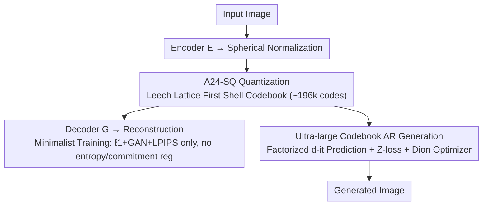

# Spherical Leech Quantization for Visual Tokenization and Generation

**Conference**: CVPR 2026  
**Paper**: [CVF Open Access](https://openaccess.thecvf.com/content/CVPR2026/html/Zhao_Spherical_Leech_Quantization_for_Visual_Tokenization_and_Generation_CVPR_2026_paper.html)  
**Code**: http://cs.stanford.edu/~yzz/npq/  
**Area**: Image Generation / Visual tokenizer / Vector Quantization  
**Keywords**: Non-parametric quantization, Lattice code, Leech lattice, Visual tokenizer, Ultra-large codebook autoregressive generation  

## TL;DR
This paper unifies non-parametric quantization (NPQ) methods like LFQ, FSQ, and BSQ into the language of "lattice codes." It identifies that entropy regularization essentially performs lattice relocation. Consequently, based on the "densest sphere packing" principle, the authors derive $\Lambda_{24}$-SQ using the 24-dimensional Leech lattice. This pushes the visual codebook size to approximately 200,000, enabling tokenizer training without any entropy or commitment regularization. It also marks the first time a discrete visual autoregressive model achieves a near-oracle 1.82 gFID on ImageNet-1k using a ~200k codebook.

## Background & Motivation
**Background**: Discrete visual tokenization is the foundation for visual compression, generation, and understanding. Following the language modeling paradigm, visual autoregressive models first quantize images into discrete tokens and then perform next-token prediction. To scale codebook sizes while saving parameters, non-parametric quantization (NPQ) methods—such as LFQ, BSQ, and FSQ—have emerged, replacing learnable vector quantization codebooks with fixed implicit codebooks (e.g., $\{\pm1\}^d$ or $\{\pm\frac{1}{\sqrt d}\}^d$ on a unit hypersphere).

**Limitations of Prior Work**: While language model vocabularies have reached 130k (DeepSeek-R1) or even 200k (GPT-4o), mainstream visual codebooks remain stuck at the 1k–16k magnitude. Worse, existing NPQ methods rely on various "patches": LFQ is simple but its entropy calculation explodes exponentially with dimension; BSQ is efficient but suffers from codebook collapse without entropy regularization; FSQ avoids complex regularization but its selection of levels per channel ($L_1,\dots,L_d$) is heuristic. These ad hoc techniques stem from a lack of unified principled design.

**Key Challenge**: There is a long-standing tension between scaling codebooks and maintaining simple training, usually bridged by regularization terms (entropy penalty, commitment loss) that introduce hyperparameter tuning and numerical burdens.

**Goal**: (1) Provide a unified, interpretable mathematical framework for all NPQ methods; (2) Derive a theoretically grounded, simple-to-implement quantizer that scales to ~200k codes; (3) Solve training stability issues for autoregressive generation with ultra-large codebooks.

**Key Insight**: The authors observe that NPQ codebooks are essentially discrete sets of points from a **lattice** under constraints. The two terms of entropy regularization correspond to "pushing inputs toward lattice points" and "finding the optimal distribution of lattice points." Therefore, rather than using regularization to approximate a uniform distribution, one should directly select a lattice that is naturally most uniform.

**Core Idea**: Use the "densest sphere packing" lattice—the 24-dimensional Leech lattice—to form a fixed codebook ($\Lambda_{24}$-SQ) from its first shell. Its high symmetry and uniform distribution on the hypersphere render entropy regularization redundant, achieving both simplified training and superior rate-distortion trade-offs.

## Method

### Overall Architecture
The method consists of two layers. The **first layer is the tokenizer**: an image is processed by encoder $E$ to produce continuous latent representations, which are normalized to a unit hypersphere. Each vector is quantized to the nearest Leech lattice point using $\Lambda_{24}$-SQ. The decoder $G$ then reconstructs the image. Crucially, the quantizer uses a **fixed** set of lattice points and does not undergo gradient updates; training requires only a minimalist $\ell_1$ + GAN + LPIPS loss suite. The **second layer is generation**: the ~200k discrete codes are fed into a visual autoregressive model (VAR/Infinity-style) for next-scale prediction, supported by techniques to stabilize ultra-large codebook training. The workflow is as follows:

The "Unified Lattice Code Perspective" serves as the theoretical foundation, while "$\Lambda_{24}$-SQ Codebook," "Minimalist Training," and "Ultra-large Codebook AR Generation" correspond to the respective nodes in the framework.

### Key Designs

**1. Unifying Non-Parametric Quantization as Lattice Codes: Entropy Reg as Lattice Relocation**

Existing NPQ methods often appear disparate. This paper reformulates them into a single lattice code language: a $d$-dimensional lattice $\Lambda_d = \{\lambda = Gb \mid b\in\mathbb{Z}^d\}$ combined with constraints $f(\lambda)=c_1,\ h(\lambda)\le c_2$ to form enumerable codebooks. In this framework, LFQ is a generator matrix $G=I_d$ with a $\|\lambda\|_1=d$ constraint (i.e., $\lambda_i=\pm1$), BSQ is $G=\frac{1}{\sqrt d}I_d$ with a unit sphere constraint, and FSQ is a bounded integer lattice. All are instances of the same quantizer $Q_\Lambda(z)=\arg\min_{t\in\Lambda}\|z-t\|$ on different lattices.

More importantly, the **entropy regularization** $L_{\text{entropy}}=\mathbb{E}[H[q(z)]]-\beta H[\mathbb{E}[q(z)]]$ is reinterpreted: the two terms correspond to "making each input close to a lattice point (rather than a decision boundary)" and "making the Voronoi regions equal in volume for class balance." Thus, entropy regularization is implicitly **relocating lattice points into a maximally uniform configuration**. This shifts the engineering problem of "whether to use regularization" into a geometric problem of "which lattice is most uniform," serving as the logical starting point for all subsequent designs. It also explains why FSQ needs no entropy regularization (Voronoi regions of equal volume are naturally balanced in bounded domains) while LFQ does.

**2. $\Lambda_{24}$-SQ: Using the Densest Sphere Packing Leech Lattice as a Codebook**

Since maximizing entropy is equivalent to spreading $N$ points as widely as possible on a hypersphere (maximizing the minimum distance between any two points $\delta_{\min}(N)$, a generalization of the Tammes problem), the optimal solution is the **densest sphere packing lattice**. Among lattices proven optimal in dimensions 1–8, 12, 16, and 24, the authors select the **Leech lattice $\Lambda_{24}$**. Its first shell contains 196,560 minimal norm ($\sqrt{32}$) vectors, which, when normalized to unit length, form a spherical codebook of ~200k points, denoted as $\Lambda_{24}$-SQ. Compared to a BSQ codebook of similar scale ($d=18, 2^{18}=262,144$), $\Lambda_{24}$-SQ increases the minimum angular distance $\delta_{\min}$ from $2/\sqrt{18}\approx0.471$ to $\sqrt{3}/2\approx0.866$—an **improvement of over 80%**. More dispersed points lead to lower quantization error and better codebook utilization. Despite the massive codebook size, the fixed lattice vectors allow memory and runtime costs to be kept lower than vanilla VQ via tiling and JIT compilation. Smaller codebooks can be flexibly derived using subsets $\Lambda_{24}(2)_s$, covering scales from 1,104 to 98,304.

**3. Minimalist Training Recipe: Removing Regularization via Uniform Lattices**

Because the points of $\Lambda_{24}$-SQ are naturally uniformly distributed on the hypersphere, class balance is "free" by geometry. Consequently, tokenizer training **no longer requires commitment loss or entropy penalties**, leaving only the "irreducible triplet": $\ell_1$ (for PSNR), GAN (for FID), and LPIPS (for perception). The value lies in simplicity: while older methods collapse without regularization, Ours performs better without it—reducing rFID from 1.14 (BSQ-ViT) to 0.83 with a slightly lower effective bitrate ($d_\omega=17.58$ vs. $18$). Ablations (Table 8) confirm that for fixed codebooks, quantizers with larger $\delta_{\min}$ ($\Lambda_{24}$-SQ > BSQ > Random Projection VQ) yield superior rFID/LPIPS/SSIM/PSNR, and learnable codebooks do not change the conclusion—proving the gains come from **lattice geometry** rather than learning.

**4. Ultra-large Codebook Autoregressive Generation: Factored d-it Prediction + Stable Training**

Scaling to a ~200k codebook in AR models faces two hurdles: codebook mapping representation and gradient explosion. For the former, the authors generalize "bit-by-bit prediction" into **factorized d-it prediction**—assuming independence between dimensions, the joint log-probability of a lattice code is approximated by the sum of marginals: $\log p(c^{(1:d)})\approx\sum_i^d \log p(c^{(i)})$. For $\Lambda_{24}$-SQ, this uses 24 heads with 9-way classification (values $\{-4,\dots,4\}$). Memory and stability are managed via cut cross-entropy (CCE) and Kahan summation. Regarding the latter, large codebooks show highly imbalanced frequencies (max/min ratio jumping from ~5.6 in VQ to ~37), causing gradient norms to surge and losses to explode in 16-layer Infinity models. Inspired by LLMs, two techniques are introduced: **Z-loss** $L_Z=\xi|\log Z|^2$ ($\xi=10^{-4}$) to prevent logit explosion, and the **Dion orthogonal normalization optimizer** (Dion for >1D tensors, Lion for 1D/embedding layers, with embedding learning rate scaled by $1/\sqrt{d_{in}}$), resulting in smoother training and lower final loss. Note: While d-it prediction is efficient, it sacrifices diversity (slightly worse gFID and lower recall), so main results still use a full-codebook CE head.

### Loss & Training
- **Tokenizer**: $L = \ell_1 + \lambda_{\text{GAN}}L_{\text{GAN}} + \lambda_{\text{LPIPS}}L_{\text{LPIPS}}$, no entropy/commitment reg; optional VF alignment loss with DINOv2 to mitigate the reconstruction-generation trade-off.
- **Generation Model**: CE (or 9-way factorized CE) + Z-loss; Dion/Lion optimizers; Sampling via hierarchical linear scaling CFG + nucleus (top-$p$).
- $\Lambda_{24}$-SQ can be integrated into multi-scale residual quantization (VAR/Infinity tokenizers) as a plug-and-play component.

## Key Experimental Results

### Main Results
ImageNet-1k reconstruction (256×256, ViT architecture) and generation comparison:

| Task | Metric | Ours ($\Lambda_{24}$-SQ) | Prev. SOTA | Gain |
|------|------|------|----------|------|
| Reconstruction (ImageNet val) | rFID↓ | **0.83** | 1.14 (BSQ-ViT) | -0.31 |
| Reconstruction (ImageNet val) | PSNR↑ | **26.37** | 25.36 (BSQ) | +1.01 |
| Reconstruction (ImageNet val) | LPIPS↓ | **0.0622** | 0.0761 (BSQ) | Better |
| Reconstruction | Effective bits | ≈17.58 | 18 (BSQ) | Lower |
| Generation (gFID, 2.8B) | gFID↓ | **1.82** | 1.92 (VAR-d30) | Near oracle 1.78 |
| Generation (IS, 2.8B) | IS↑ | **333.4** | 323.1 (VAR-d30) | +10.3 |

Kodak Compression (Table 6): Using only $\ell_1$ loss without arithmetic coding, $\Lambda_{24}$-SQ achieves PSNR 29.632 / MS-SSIM 0.9637, surpassing JPEG2000, WebP, and BSQ-ViT with a lower BPP (0.2747).

### Ablation Study
Fixed codebook size, varying quantization bottleneck (ViT-small, ImageNet 128×128, Table 8):

| Quantizer | Codebook $|C|$ | rFID↓ | LPIPS↓ | PSNR↑ | Note |
|------|------|------|------|------|------|
| Random Projection VQ (U) | $2^{14}$ | 13.08 | 0.1080 | 23.018 | Lowest dispersion |
| BSQ | $2^{14}$ | 12.98 | 0.1048 | 23.171 | Median $\delta_{\min}$ |
| $\Lambda_{24}$-SQ | $2^{14}$ | **11.16** | **0.1007** | **23.390** | Best at same size |
| $\Lambda_{24}$-SQ | 196,560 | **8.98** | 0.0811 | 24.282 | Further gain from size |

Prediction Head Ablation ($\rightleftharpoons$-CC, Table 9): $\Lambda_{24}$-SQ with full CE head achieves gFID 8.7; switching to 24×9-way factorized CE increases gFID to 11.7. While recall improves, diversity suffers, confirming diversity trade-offs in factorized approximation.

### Key Findings
- **Dispersion ($\delta_{\min}$) is the primary driver of rate-distortion**: With a fixed codebook size, a larger $\delta_{\min}$ improves all four reconstruction metrics. This advantage is more pronounced in high dimensions ($d=24$) than low dimensions ($d=3$). Learnable codebooks yield similar results, indicating the gain is inherent to lattice geometry.
- **Large codebooks are only cost-effective for large models**: Increasing codebook size from 16,384 to 196,560 significantly improves gFID only when scaling from 12 layers (0.24B) to 16 layers (0.49B), mirroring LLM scaling laws. This pushes the precision-recall Pareto frontier toward the validation set oracle.
- **VF Alignment** slightly degrades reconstruction but accelerates VAR generation convergence and improves final gFID/IS/recall, extending VAVAE findings from continuous latents to discrete tokens.
- **Training Stability**: Ultra-large codebooks naturally cause frequency imbalance (~37×). Z-loss + Dion are critical for preventing 16-layer Infinity models from collapsing.

## Highlights & Insights
- **"Pick a Better Lattice" instead of "Tune Regularization"**: Reinterpreting ad hoc regularization in LFQ/BSQ/FSQ as "lattice relocation" and solving it via densest sphere packing is a elegant reframing. This geometric principle can be applied to any scenario relying on regularization to approximate uniform distributions.
- **Creative Use of the Leech Lattice**: The 24-dimensional Leech lattice, a classic in coding theory and cryptography, is used here as a visual codebook. Its natural symmetry and ~200k point count perfectly match LLM-scale vocabularies, serving as a model for interdisciplinary application.
- **Fixed Codebooks are More Efficient**: Fixed lattice vectors do not require gradient updates. Combined with tiling and JIT compilation, a 200k codebook uses less memory than vanilla VQ, breaking the intuition that large codebooks must be expensive.
- **First Discrete Visual AR to Approach Oracle with ~200k Codes**: 1.82 gFID against an oracle of 1.78, with higher recall, proves that large vocabularies benefit generative diversity—a conclusion previously unreported in this field.

## Limitations & Future Work
- The authors acknowledge that verification is currently limited to ImageNet-scale; larger scales (e.g., text-to-image) remain for future work.
- The dimensionality is restricted to 24 (unique to the Leech lattice). Changing codebook sizes requires taking subsets or switching to other dense packing lattices (e.g., $E_8$, $\Lambda_{16}$), making it less flexible than FSQ.
- Factorized d-it prediction reduces memory but sacrifices diversity. A solution that balances both for ultra-large codebooks is still needed.
- Frequency imbalance from large codebooks necessitates additional tricks like Z-loss/Dion; the robustness of these tricks across different architectures needs further validation (⚠️ training hyperparameters should follow the original paper).

## Related Work & Insights
- **vs. BSQ [91]**: BSQ projects hypercube codes to a unit sphere, essentially a simple square lattice with low dispersion. This paper shows BSQ is not densest packing; using Leech lattice improves $\delta_{\min}$ by 80%, yielding better reconstruction without entropy reg.
- **vs. FSQ [56]**: FSQ uses bounded integer lattices to avoid entropy reg, but level selection is heuristic. This paper provides a unified lattice perspective and a more principled, scalable (200k) alternative.
- **vs. LFQ / MAGVITv2 [86]**: LFQ suffers from exponential entropy calculation costs and requires tricks like index subgrouping for large codebooks. Ours reaches ~200k without subgrouping, multihead, or bit-flipping "hacks."
- **vs. Learnable VQ [33, 77]**: Traditional VQ is difficult to train due to distribution mismatch. This paper follows the "fixed codebook" path (like LFQ/BSQ/FSQ) and pushes geometric design to the limit.

## Rating
- Novelty: ⭐⭐⭐⭐⭐ Upgrades quantization from "reg-tuning" to "geometry-selection" via lattice theory; first to scale visual AR to ~200k codes.
- Experimental Thoroughness: ⭐⭐⭐⭐⭐ Covers reconstruction, compression, and generation; includes rigorous ablations on $\delta_{\min}$ and codebook scale.
- Writing Quality: ⭐⭐⭐⭐ Technically dense with heavy notation; requires background in lattice codes/coding theory.
- Value: ⭐⭐⭐⭐⭐ Provides a simple, scalable baseline for visual tokenizers, directly benefiting discrete visual autoregressive generation.

<!-- RELATED:START -->

## Related Papers

- [\[CVPR 2026\] EVATok: 自适应长度视频Tokenization用于高效视觉自回归生成](evatok_adaptive_length_video_tokenization_for_eff.md)
- [\[CVPR 2026\] Seeing What Matters: Visual Preference Policy Optimization for Visual Generation](seeing_what_matters_visual_preference_policy_optimization_for_visual_generation.md)
- [\[CVPR 2026\] ThinkGen: Generalized Thinking for Visual Generation](thinkgen_generalized_thinking_for_visual_generation.md)
- [\[CVPR 2026\] CaTok: Taming Mean Flows for One-Dimensional Causal Image Tokenization](catok_taming_mean_flows_for_one-dimensional_causal_image_tokenization.md)
- [\[CVPR 2026\] Mirai: Autoregressive Visual Generation Needs Foresight](mirai_autoregressive_visual_generation_needs_foresight.md)

<!-- RELATED:END -->
