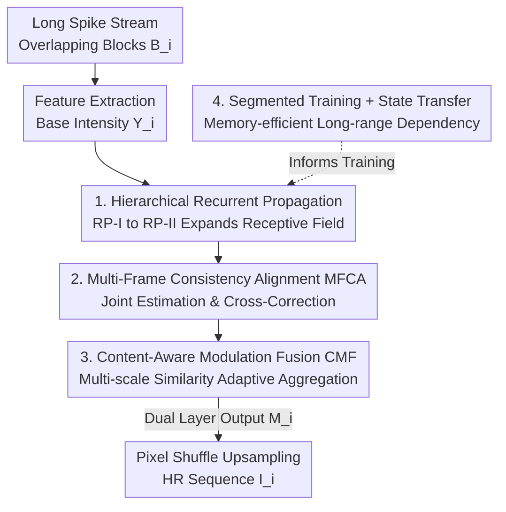

# Spk2VidNet: A Hierarchical Recurrent Architecture for High-Fidelity Video Reconstruction from Long Spike-Camera Streams

**Conference**: CVPR 2026  
**Paper**: [CVF OpenAccess](https://openaccess.thecvf.com/content/CVPR2026/html/Wang_Spk2VidNet_A_Hierarchical_Recurrent_Architecture_for_High-Fidelity_Video_Reconstruction_from_CVPR_2026_paper.html)  
**Code**: None  
**Area**: Image/Video Restoration and Reconstruction (Spike Camera Super-Resolution)  
**Keywords**: Spike camera, super-resolution, hierarchical recurrent network, temporal alignment, long sequence modeling

## TL;DR
Addressing the limitations of Spike Camera Super-Resolution (SCSR) in handling fixed short sequences and spike signal fluctuations, Spk2VidNet employs "dual-layer recurrent propagation with expanding temporal receptive fields + multi-frame consistency alignment + content-aware modulation fusion + segmented training state transfer" to reconstruct high-resolution image sequences from arbitrary long spike streams. It sets a new SOTA on synthetic and real data with faster speeds (REDS-LSSR ×4 PSNR 29.92dB, 43ms inference).

## Background & Motivation

**Background**: The spike camera is a neuromorphic visual sensor where each pixel independently performs "photon integration and firing upon reaching a threshold" (accumulation-and-fire). It records the **absolute intensity** of a scene with extremely high temporal resolution (approx. 40,000Hz), making it ideal for high-speed motion. However, its spatial resolution is low, leading to the field of Spike Camera Super-Resolution (SCSR): reconstructing High-Resolution (HR) images from Low-Resolution (LR) binary spike streams. Representative methods include VidarSR, SpikeSR-Net, Spk2SRImgNet, and SCSRNet.

**Limitations of Prior Work**: Existing SCSR methods face two structural issues. First, they typically operate on **fixed-length short spike segments** (e.g., 101 frames), restricting temporal information to a local neighborhood and failing to leverage rich intensity cues in long streams; meanwhile, long-range information is the spike camera's greatest advantage. Second, due to photon arrival randomness, quantization in spike readout, and thermal noise, spike signals exhibit **fluctuation**, meaning a single spike frame does not directly carry intensity, making reliable extraction difficult.

**Key Challenge**: The advantage of spike cameras lies in "long-range temporal redundancy from ultra-high temporal resolution," but existing methods fail to utilize long-range temporal data (limited by fixed segments) and are disturbed by fluctuations within short segments. The fundamental tension is utilizing long sequences without exploding GPU memory during training.

**Goal**: Decomposition into three sub-problems: (1) Utilizing long-range dependencies of arbitrary long streams without memory overflow; (2) Performing precise alignment under inter-frame motion to aggregate temporal info; (3) Suppressing misaligned/noisy signals in unreliable alignment regions.

**Key Insight**: Ultra-high temporal resolution implies **coherent motion and highly consistent motion fields** between adjacent features—this consistency can be used to cross-correct motion estimation across frames. Furthermore, the correlation between neighboring frames and the current frame is spatially adaptive and should be fused according to content similarity.

**Core Idea**: Use "hierarchical recurrent propagation to expand the temporal receptive field" for gradual feature refinement to suppress fluctuations, combined with multi-frame consistency-guided alignment and content-aware modulation fusion. Segmented training with state transfer extends the recurrent network to arbitrary long sequences.

## Method

### Overall Architecture

Spk2VidNet is an end-to-end trainable hierarchical recurrent SCSR network. The input is a long spike stream $\{S(u)\} \in \mathbb{B}^{H\times W\times L}$ (binary, length $L$), and the output is the corresponding HR image sequence $\{I_i\}_{i=0}^{N-1}$, $I_i \in \mathbb{R}^{rH\times rW\times 1}$ where $r$ is the SR factor.

The pipeline consists of four steps: (1) **Feature Extraction**—slicing the long stream into $N$ overlapping short-time spike blocks $B_i=\{S(u)\}_{t_i-w}^{t_i+w}$ and extracting base intensity features $\{Y_i\}$; (2) **First-layer Recurrent Propagation RP-I**—iteratively updating $\{Y_i\}$ into more reliable features $\{F_i\}$; (3) **Second-layer Recurrent Propagation RP-II**—sampling historical features with a **temporal dilation factor of 2** to refine $\{F_i\}$ into $\{M_i\}$, expanding receptive fields for long-range dependencies; (4) **Upsampling Reconstruction**—applying pixel shuffle to $\{M_i\}$ to obtain HR images. RP-I and RP-II share the same internal structure (MFCA alignment + CMF fusion) but use independent parameters and inputs.

### Key Designs

**1. Hierarchical Recurrent Propagation + Expanding Temporal Receptive Field: Progressive Refinement Against Fluctuations**

Spike fluctuations contaminate single-frame intensity extraction; single-layer local aggregation is insufficient for robust recovery. Spk2VidNet uses two layers of recurrent propagation to "progressively" expand the temporal receptive field. RP-I utilizes the current input $Y_i$ and $K$ preceding features $\{F_{i-1},\dots,F_{i-K}\}$ to extract consistent signals and suppress perturbations, producing $F_i$. RP-II then takes the current $F_i$ and **samples $K$ preceding features with a dilation factor of 2** $\{M_{i-2},M_{i-4},\dots,M_{i-2K}\}$ to generate $M_i$. Dilated sampling allows the second layer to cover a longer timespan without increasing the number of aggregated frames, capturing more reliable long-range dependencies.

**2. Multi-Frame Consistency-Guided Alignment (MFCA): Cross-Correcting Motion Estimation**

Independent motion estimation per frame is prone to spike noise. MFCA's insight is that at ultra-high temporal resolutions, motion fields of adjacent features are highly consistent and can be **jointly estimated and mutually refined**. Features $\{F_{i-K},\dots,F_{i-1},Y_i\}$ are concatenated to extract motion cues $X_i = m([F_{i-K},\dots,F_{i-1},Y_i])$, deriving $K$ initial motions $\mathcal{O}_{i-n}=f_n(X_i)$. Cross-correction is then applied:

$$\mathcal{O}_{i-n}^{\text{R}} = \mathcal{O}_{i-n} + h_n([\mathcal{O}_{i-1},\mathcal{O}_{i-2},\dots,\mathcal{O}_{i-K}])$$

Each moment absorbs refinement signals $h_n(\cdot)$ from others. Finally, the corrected motion $\mathcal{O}_{i-n}^{\text{R}}$ is used via Deformable Convolution (DCN) to align frames: $\tilde{F}_{i-n}=\text{DCN}(F_{i-n},\mathcal{O}_{i-n}^{\text{R}})$.

**3. Content-Aware Modulation Fusion (CMF): Suppressing Misalignment via Multi-Scale Similarity**

Even after alignment, occlusions or lighting changes make some regions unreliable. CMF uses **content similarity for spatially adaptive modulation** of each aligned feature. The core MDM (Multi-Dilation Modulation) module uses multiple convolutional branches with different dilation rates to evaluate the correlation between $\tilde{F}_{i-n}$ and $Y_i$ as $\text{P}_{i-n}=f_{\text{MDConv}}([\tilde{F}_{i-n},Y_i])$. This generates spatial scaling $\alpha_{i-n}$ and translation $\beta_{i-n}$ parameters to modulate the feature:

$$\hat{F}_{i-n} = (\alpha_{i-n}\odot\tilde{F}_{i-n}+\beta_{i-n}) + \tilde{F}_{i-n}$$

This multi-dilation design ensures accurate similarity assessment across scales, enhancing relevant regions and suppressing misaligned ones.

**4. Segmented Training + State Transfer: Building Long-range Dependencies with Limited Memory**

To avoid memory overflow from Backpropagation Through Time (BPTT) on long sequences, the stream is divided into shorter segments for **sequential training**. For adjacent segments within a sequence, the **final states of the previous segment are detached from the computation graph**, stored in a buffer, and passed to the next segment as extended context. This allows the model to utilize historical temporal information while maintaining temporal continuity at segment boundaries.

### Loss & Training
The network uses the Adam optimizer and L1 loss for 800 epochs. Batch size is 8; initial learning rate is 0.0002, decaying by 0.7 every 100 epochs. Spike inputs are randomly cropped to $64\times64$ with random flips/rotations. Parameters include $K=2$, $L=461$, and $N=45$ ($w=10$). All experiments were conducted on a single NVIDIA RTX 3090.

## Key Experimental Results

### Main Results

On synthetic data, Spk2VidNet outperforms all methods across two datasets and two SR factors while being the fastest and most memory-efficient:

| Factor | Method | REDS PSNR↑ | Adobe240 PSNR↑ | LPIPS↓(REDS) | Params(M) | Runtime(ms) |
|------|------|-----------|----------------|--------------|-----------|-------------|
| ×4 | VidarSR | 28.42 | 30.07 | 0.3244 | 12.79 | 740 |
| ×4 | SpikeSR-Net | 29.20 | 31.14 | 0.2962 | 3.34 | 1088 |
| ×4 | Spk2SRImgNet | 29.46 | 31.31 | 0.2813 | 3.86 | 219 |
| ×4 | SCSRNet | 29.50 | 31.31 | 0.2786 | 5.30 | 187 |
| ×4 | **Ours** | **29.92** | **32.36** | **0.2624** | 3.73 | **43** |
| ×8 | SCSRNet | 25.81 | 26.15 | 0.4311 | 5.45 | 61 |
| ×8 | **Ours** | **26.20** | **27.19** | **0.4149** | 3.88 | **21** |

Notably, Adobe240-LSSR sequences are roughly twice as long as REDS-LSSR; Ours achieves a larger lead on the longer sequence (+1.05dB over SCSRNet at ×4), validating the long-range modeling advantage. Real data qualitative results show sharper textures and fewer artifacts.

### Ablation Study

Evaluated on REDS-LSSR ×4 (b-5 is final model):

| Config | MFCA | CMF | Prop. Layers | PSNR↑ | SSIM↑ |
|------|------|-----|---------|-------|-------|
| b-1 | ✗ | ✗ | 2 | 28.39 | 0.7969 |
| b-2 | Indep. Align | ✗ | 2 | 29.02 | 0.8197 |
| b-3 | ✓ | ✗ | 2 | 29.41 | 0.8325 |
| b-4 | ✗ | ✓ | 2 | 29.27 | 0.8273 |
| b-5 | ✓ | ✓ | 2 | **29.79** | **0.8432** |
| a-5 | ✓ | ✓ | 1 | 29.66 | 0.8383 |

### Key Findings
- **MFCA and CMF are complementary**: Both significantly improve the baseline; MFCA's cross-correction (29.41) is notably better than independent alignment (29.02).
- **Dual-layer propagation is superior**: Moving from one layer (29.66) to two (29.79) provides gains by expanding the temporal field.
- **State transfer is critical**: Segments trained independently yield 29.58dB, whereas state transfer enables 29.79dB, proving the value of cross-segment history.
- **PSNR rises with sequence length**: Unlike fixed-segment methods, Ours shows a rising PSNR curve as it accumulates more long-range temporal cues.

## Highlights & Insights
- **Leveraging High Temporal Resolution**: Instead of viewing spike fluctuations as a liability, the method uses "high temporal resolution $\Rightarrow$ consistent motion fields" as a physical prior for MFCA.
- **Practical Long-Stream Paradigm**: The combination of recurrence and state transfer effectively bypasses the memory wall, a strategy transferable to event cameras or streaming video tasks.
- **Temporal Dilation**: Applying dilated convolution concepts to the temporal dimension in the second recurrent layer elegantly expands the coverage area without increasing computation.
- **Efficiency**: Achieving SOTA while being 4× faster than previous methods with lower memory makes it highly practical for high-speed imaging.

## Limitations & Future Work
- **Lack of Quantitative Real-world Evaluation**: Due to missing GT for real spike sensors, evaluation remains qualitative.
- **Simulator Reliance**: Training relies on LSSR datasets generated via simulators; domain gaps in noise modeling between simulated and real spikes may affect performance.
- **Fixed Hyperparameters**: $K=2$ and segment lengths are manually set; adaptive values for different motion dynamics were not explored.

## Related Work & Insights
- **Compared to Fixed-Length SCSR**: Previous methods are limited to local temporal windows. Ours outperforms them significantly on longer sequences (Adobe240) due to long-range dependency modeling.
- **Compared to Video SR (BasicVSR)**: While sharing recurrent concepts, Ours is tailored for spike physicals (binary, fluctuations, ultra-high frame rate) via MFCA and CMF.

## Rating
- Novelty: ⭐⭐⭐⭐
- Experimental Thoroughness: ⭐⭐⭐⭐
- Writing Quality: ⭐⭐⭐⭐
- Value: ⭐⭐⭐⭐

<!-- RELATED:START -->

## Related Papers

- [\[CVPR 2026\] Preserving Source Video Realism: High-Fidelity Face Swapping for Cinematic Quality](preserving_source_video_realism_high-fidelity_face_swapping_for_cinematic_qualit.md)
- [\[CVPR 2026\] AE2VID: Event-based Video Reconstruction via Aperture Modulation](ae2vid_event-based_video_reconstruction_via_aperture_modulation.md)
- [\[ICLR 2026\] WeTok: Powerful Discrete Tokenization for High-Fidelity Visual Reconstruction](../../ICLR2026/image_generation/wetok_powerful_discrete_tokenization_for_high-fidelity_visual_reconstruction.md)
- [\[CVPR 2026\] Taming Video Models for 3D and 4D Generation via Zero-Shot Camera Control](taming_video_models_for_3d_and_4d_generation_via_zero-shot_camera_control.md)
- [\[CVPR 2025\] Efficient Long Video Tokenization via Coordinate-based Patch Reconstruction](../../CVPR2025/image_generation/efficient_long_video_tokenization_via_coordinate-based_patch_reconstruction.md)

<!-- RELATED:END -->
