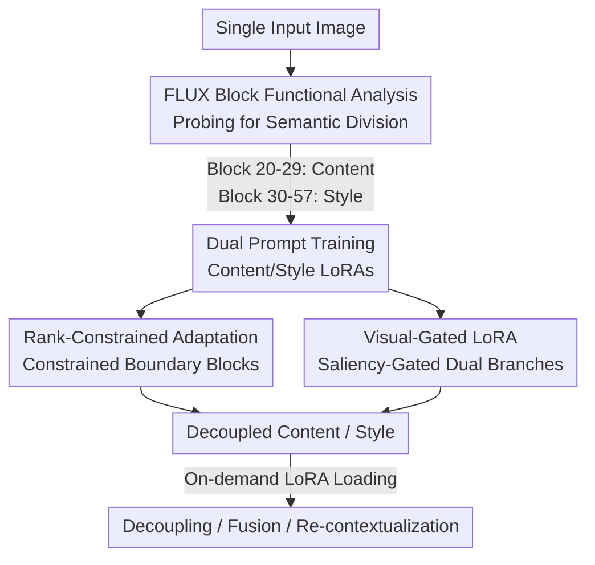

# SplitFlux: Learning to Decouple Content and Style from a Single Image

**Conference**: CVPR 2026  
**Paper**: [CVF Open Access](https://openaccess.thecvf.com/content/CVPR2026/html/Yang_SplitFlux_Learning_to_Decouple_Content_and_Style_from_a_Single_CVPR_2026_paper.html)  
**Code**: https://github.com/yangyt46/SplitFlux  
**Area**: Image Generation / Diffusion Models / Content-Style Decoupling  
**Keywords**: Content-Style Decoupling, FLUX, LoRA, Personalized Generation, Re-contextualization  

## TL;DR
This work systematically analyzes the functional division of blocks within the FLUX model, discovering that single stream blocks are essential for image generation, with the early stages controlling content and the late stages controlling style. Based on this, SplitFlux fine-tunes these blocks using LoRA for content-style decoupling from a single image. By incorporating Rank-Constrained Adaptation (RCA) to preserve identity and Visual-Gated LoRA (VGRA) to enable re-contextualization, this method significantly outperforms SDXL and FLUX baselines in content fidelity.

## Background & Motivation

**Background**: Decoupling "content" (subject identity, structure) and "style" (color, brushstrokes, artistic flair) from a single image is a core capability for personalized generation. This separation enables tasks like "painting this cat in that watercolor style" or "placing this character into a new scene." Mainstream approaches are based on DreamBooth + LoRA, grouped into two categories: content-style decoupling (e.g., B-LoRA, UnZipLoRA, which identify specific blocks in SDXL) and content-style fusion (e.g., ZipLoRA, K-LoRA).

**Limitations of Prior Work**: Most existing methods are built upon SDXL (U-Net architecture), where image quality has reached a ceiling, limiting the quality of decoupled content. While recent works have transitioned to the more powerful FLUX (DiT architecture), the specific functions of FLUX blocks remain unexplored, making SDXL-based decoupling strategies ineffective. Specifically: (1) **Unknown Characteristics**—the role of FLUX blocks in decoupling is unknown; (2) **Identity Loss**—decoupled content often loses structural and identity features; (3) **Difficulty in Re-contextualization**—decoupled content tends to overfit, making it hard to integrate into new scenes.

**Key Challenge**: While FLUX is superior to SDXL, which layers manage content versus style remains a "black box." Blind fine-tuning either fails to decouple the two or destroys the subject's identity in the process.

**Goal**: To analyze the functional division of FLUX blocks and perform constrained LoRA fine-tuning on targeted blocks to achieve (a) clean separation of content and style, (b) identity and structure preservation, and (c) flexible re-contextualization of content.

**Key Insight**: Inspired by the "per-block probing" of B-LoRA on SDXL, this work designs probing experiments tailored to FLUX's property where "each block dynamically updates text embeddings" to locate blocks responsible for semantic generation.

**Core Idea**: The 38 single stream blocks in FLUX are the primary drivers of image generation, with Blocks 20–29 controlling content and Blocks 30–57 controlling style. Applying constrained LoRA (lowered rank + amplified magnitude) only to these blocks decouples content and style while preserving identity.

## Method

### Overall Architecture
The SplitFlux pipeline consists of three stages: first, locating semantic divisions through probing (Analysis Phase); second, training content and style LoRAs using dual prompts (`A <c> object` and `A <s> style`) on identified blocks; third, applying Rank-Constrained Adaptation (RCA) at "semantic boundary blocks" to prevent content leakage and adding Visual-Gated LoRA (VGRA) with complementary loss to enable flexible re-contextualization. At inference, LoRAs are loaded based on the task: content/style generation, fusion, or re-contextualization using $\Delta W_{cnt}$.

### Key Designs

**1. FLUX Block Anatomy: Identifying "Content vs. Style" Blocks**

FLUX contains 19 double stream blocks and 38 single stream blocks. The authors designed a "prompt replacement probe": using prompts $P_1$, $P_2$, and a copy $P_1^*$, the text embedding for $P_1^*$ is replaced with $P_2$ in specific block ranges to measure the change in output. Findings: ① Injecting semantics into double stream blocks (Blocks 1–19) has zero impact on output, whereas single stream blocks (Blocks 20–57) significantly alter both content and style. ② Injection into Blocks 20–29 only changes content, while Blocks 30–57 primarily change style.

**2. Rank-Constrained Adaptation (RCA): Preserving Identity at Semantic Boundaries**

Experimentation shows that fine-tuning only Blocks 20–29 loses identity, but including Blocks 30–32 introduces style leakage. Blocks 30–31 serve as the "semantic boundary." RCA restricts the rank and scales the magnitude for these boundary blocks: $\Delta W_{RCA} = \alpha B A$, where $A \in \mathbb{R}^{\frac{r}{\alpha}\times d_{in}}$ and $B \in \mathbb{R}^{d_{out}\times \frac{r}{\alpha}}$. By using $\alpha$ to lower the rank ($r/\alpha$), the update subspace is narrowed to prevent leakage, while the amplified magnitude compensates for capacity loss.

**3. Visual-Gated LoRA (VGRA) + Complementary Loss: Enabling Re-contextualization**

To prevent content overfitting, the content LoRA is split into two branches via saliency gating. Image token features $E^I_n$ are used to calculate a normalized activation magnitude $s_n = \frac{\|E^I_n\|_2 - \mu}{\sigma}$, converted into a gate $g_i = \text{Sigmoid}(s_i)$. The update is:
$$\Delta W_c = g \odot \Delta W_{cnt} + (1-g) \odot \Delta W_{res}$$
The high-rank branch $\Delta W_{cnt}$ captures main subject info, while the low-rank $\Delta W_{res}$ handles residual details. A complementary loss $L_{comp} = (\|AC^\top\|_F^2 + \|B^\top D\|_F^2) + |BA \odot DC|$ ensures direction orthogonality and non-overlapping activations between branches.

### Loss & Training
The model uses FLUX as the base, Adam optimizer, learning rate $1\text{e-}4$, and a batch size of 1 for 1000 steps on an L20 (48G). Content LoRA ranks are 48 ($r_{cnt}$) and 16 ($r_{res}$); RCA uses $\alpha=2$ (rank 32); style LoRA rank is 64. Complementary loss weight $\lambda=0.1$.

## Key Experimental Results

### Main Results

| Method | Base Model | DINO-C↑ (Decouple) | VLM-C↑ (Decouple) | VLM-C↑ (Fusion) | Training Params↓ |
| :--- | :--- | :--- | :--- | :--- | :--- |
| B-LoRA | SDXL | 0.547 | 0% | 0% | 56.36M |
| UnZipLoRA | SDXL | 0.567 | 15% | 8.25% | 185.8M |
| LoRA-Flux | FLUX | 0.756 | 17.5% | 14% | 44.83M |
| **Ours** | FLUX | **0.808** | **67.5%** | **77.75%** | **43.65M** |

SplitFlux leads in content fidelity: VLM content preference jumped from 17.5% (LoRA-Flux) to 67.5% (Decoupling) and reached 77.75% for fusion, with the lowest training parameters.

### Ablation Study

| Config | CLIP-C↑ | CLIP-S↑ | DINO-C↑ | DINO-S↑ | Note |
| :--- | :--- | :--- | :--- | :--- | :--- |
| w/o RCA (LoRA-Flux) | 0.859 | 0.665 | 0.756 | 0.358 | Full rank LoRA, $\alpha=1$ |
| w/o FT (No B30–31) | 0.842 | 0.645 | 0.709 | 0.337 | Blocked semantic flow |
| $\alpha=2$, B30–31 | **0.879** | **0.666** | **0.784** | **0.370** | Full RCA configuration |
| $\alpha=4$ | 0.877 | 0.664 | 0.781 | 0.370 | Minor content loss |
| B30–35 (Too wide) | 0.879 | 0.628 | 0.784 | 0.307 | Drops style quality |

### Key Findings
- **Semantic boundary blocks are critical**: Skipping fine-tuning for B30–31 (w/o FT) breaks the information flow, degrading both content fidelity and style transfer.
- **$\alpha$ Trade-off**: An $\alpha$ that is too large (rank too low) results in minor content loss; $\alpha=2$ provides the best balance.
- **RCA Range**: Extending RCA to B30–35 occupies too many style blocks, harming style quality.
- **VGRA Balancing**: $r_{cnt}=48$ yields the best compromise between content fidelity and re-contextualization flexibility.

## Highlights & Insights
- **"Analyze-then-Act" Paradigm**: Instead of blindly applying SDXL logic, the authors quantify FLUX block functions using probes, ensuring every design choice (which blocks to tune/constrain) is evidence-based.
- **Boundary Precision**: Identifying Blocks 30–31 as the specific leakage points allows for targeted "surgical" interventions rather than global rank reduction.
- **Rank Scaling Factor $\alpha$**: A single hyperparameter addresses two conflicting goals: blocking leakage (rank reduction) and maintaining capacity (magnitude amplification).
- **Saliency-Gated Routing**: Applying MoE-style routing to LoRA branches ensures the main subject is captured with higher capacity while avoiding overfitting on backgrounds.

## Limitations & Future Work
- The dataset is small (40 images), and block functional analysis is architecture-specific (needs re-doing for models like SD3).
- The stability of semantic boundaries across diverse categories or complex scenes remains to be fully explored.
- The use of VLM (Qwen3-VL) for preference scoring may not perfectly mirror human perception.
- VGRA rank allocation is currently a manual hyperparameter; automated adaptive mechanisms could be explored.

## Related Work & Insights
- **vs B-LoRA**: SplitFlux adopts the probing strategy but applies it to FLUX's unique architecture. It solves the identity-loss and low-quality issues inherent in B-LoRA's SDXL base.
- **vs UnZipLoRA**: SplitFlux uses significantly fewer parameters (43.65M vs 185.8M) and fixed prompts, outperforming UnZipLoRA in content fidelity without requiring per-image descriptions.
- **vs LoRA-Flux**: While both use FLUX, SplitFlux introduces RCA and VGRA to solve the structural identity loss and overfitting problems present in standard LoRA-Flux.

## Rating
- Novelty: ⭐⭐⭐⭐
- Experimental Thoroughness: ⭐⭐⭐⭐
- Writing Quality: ⭐⭐⭐⭐
- Value: ⭐⭐⭐⭐

<!-- RELATED:START -->

## Related Papers

- [\[CVPR 2026\] CRAFT-LoRA: Content-Style Personalization via Rank-Constrained Adaptation and Training-Free Fusion](craft-lora_content-style_personalization_via_rank-constrained_adaptation_and_tra.md)
- [\[CVPR 2026\] Learning Latent Proxies for Controllable Single-Image Relighting](learning_latent_proxies_for_controllable_single-image_relighting.md)
- [\[CVPR 2026\] Mixture of Style Experts for Diverse Image Stylization](mixture_of_style_experts_for_diverse_image_stylization.md)
- [\[ICCV 2025\] SCFlow: Implicitly Learning Style and Content Disentanglement with Flow Models](../../ICCV2025/image_generation/scflow_implicitly_learning_style_and_content_disentanglement_with_flow_models.md)
- [\[ICML 2026\] Content-Style Identification via Differential Independence](../../ICML2026/image_generation/content-style_identification_via_differential_independence.md)

<!-- RELATED:END -->
## Related Papers

- [\[CVPR 2026\] CRAFT-LoRA: Content-Style Personalization via Rank-Constrained Adaptation and Training-Free Fusion](craft-lora_content-style_personalization_via_rank-constrained_adaptation_and_tra.md)
- [\[CVPR 2026\] Learning Latent Proxies for Controllable Single-Image Relighting](learning_latent_proxies_for_controllable_single-image_relighting.md)
- [\[ICCV 2025\] SCFlow: Implicitly Learning Style and Content Disentanglement with Flow Models](../../ICCV2025/image_generation/scflow_implicitly_learning_style_and_content_disentanglement_with_flow_models.md)
- [\[ICML 2026\] Content-Style Identification via Differential Independence](../../ICML2026/image_generation/content-style_identification_via_differential_independence.md)
- [\[ECCV 2024\] Implicit Style-Content Separation using B-LoRA](../../ECCV2024/image_generation/implicit_style-content_separation_using_b-lora.md)

<!-- RELATED:END -->
