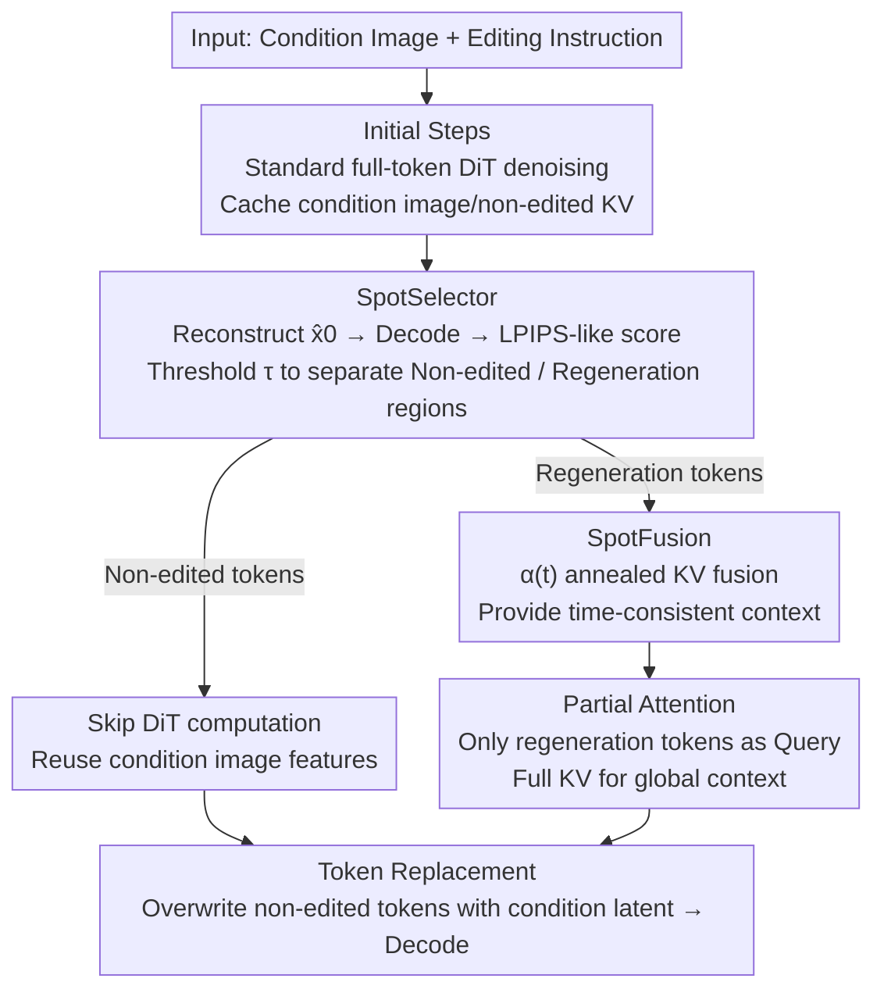

# SpotEdit: Selective Region Editing in Diffusion Transformers

**Conference**: CVPR 2026  
**Paper**: [CVF Open Access](https://openaccess.thecvf.com/content/CVPR2026/html/Qin_SpotEdit_Selective_Region_Editing_in_Diffusion_Transformers_CVPR_2026_paper.html)  
**Code**: https://biangbiang0321.github.io/SpotEdit.github.io/ (Project Page)  
**Area**: Diffusion Models / Image Editing  
**Keywords**: Diffusion Transformer, Instructed Image Editing, Region Selection, Training-free, Inference Acceleration

## TL;DR
SpotEdit is a training-free DiT image editing framework that exploits the phenomenon where "non-edited regions converge rapidly in the early stages of denoising." It utilizes perceptual similarity to automatically identify stable tokens, removes them from DiT computation to reuse conditional image features, and combines this with a time-annealed KV fusion mechanism to maintain context. It achieves a 1.7×–1.95× speedup on FLUX.1-Kontext with almost no loss in editing quality.

## Background & Motivation
**Background**: Current mainstream instructed image editing methods (FLUX.1-Kontext, Qwen-Image-Edit, etc.) are built upon Diffusion Transformers (DiTs)—encoding conditional images into tokens and processing them alongside noise tokens through transformer layers for joint denoising. The benefit of this paradigm is the high usability of editing images via high-level instructions without manual masks.

**Limitations of Prior Work**: In real-world editing tasks, the vast majority of cases involve modifying only a small area (e.g., replacing a football with a sunflower or adding a person). However, existing methods indiscriminately perform full denoising on **all tokens of the entire image** at every timestep. This leads to two specific problems: first, redundant denoising of background regions that should be preserved can introduce subtle artifacts and destroy the original image; second, a massive amount of computation is wasted on regions that do not need modification.

**Key Challenge**: Editing tasks are inherently **sparse**—only a subset of tokens needs to change, while most should remain unchanged; however, the full denoising paradigm of DiT treats all spatial positions equally. Existing diffusion acceleration methods (TeaCache, TaylorSeer, ToCa, etc.), while offering speedups, perform feature reuse or step-skipping at the "full-token level" without distinguishing between editing and non-editing regions. In cases of aggressive acceleration, quality loss tends to concentrate in the semantically critical editing regions, which is counterproductive.

**Key Insight**: The authors observe the temporal convergence patterns of different regions during denoising (Figure 2 in the paper) and find that in local editing tasks, **non-edited regions stabilize very early** and become visually consistent with the original image, while editing regions continue to evolve until the end. Since the model itself "exposes" which regions are stable and which are still being refined, one can follow this signal to **edit only the parts that need editing**.

**Core Idea**: Use perceptual similarity to detect stabilized non-edited tokens online, remove them from DiT calculations to reuse conditional image features, and use a time-annealed KV fusion to restore the contextual contribution of these regions to the editing zone—thereby focusing computational power precisely on the tokens that actually need to change.

## Method

### Overall Architecture
SpotEdit is a **training-free** inference-time framework wrapped around DiT editors like FLUX.1-Kontext based on Rectified Flow. It divides the denoising process into three stages: ① **Initial Steps**—performing standard DiT denoising on all tokens for the first few steps while caching conditional images and KV of non-edited regions for later use; ② **Spot Steps**—at each step, the **SpotSelector** uses an LPIPS-like perceptual score to classify tokens into "non-edited regions" and "regeneration regions." Non-edited tokens skip DiT computation and reuse conditional features, while regeneration tokens continue iterative denoising, supported by **SpotFusion** to provide time-consistent conditional KV caches for attention; ③ **Token Replacement**—in the final step, non-edited tokens are directly overwritten with conditional image latents before decoding, ensuring the background is strictly consistent with the original image.

The method operates around two core components: SpotSelector is responsible for "determining which tokens do not need computation," and SpotFusion is responsible for "how skipped tokens continue to provide context to the editing region without quality degradation."

### Key Designs

**1. SpotSelector: Online selection of tokens that "do not need redrawing" via perceptual similarity**

The pain point is that without manual masks, the model does not know which regions should be preserved. SpotSelector leverages an analytical property of Rectified Flow: under its linear interpolation dynamics, there is a closed-form relationship between the latent at time $t$ and the fully denoised state $\hat{X}_0$ as $\hat{X}_0 = X_{t_i} - t_i \cdot v_\theta(X_{t_i}, C, t_i)$. Therefore, at each step, one can "preview" the current denoising result and decode it into an image. By comparing it with the original image, one can determine which regions stabilized early (= non-edited regions) and which are still evolving (= editing regions).

The key is how to measure similarity—Euclidean distance in latent space does not align with human perception. The authors draw inspiration from LPIPS and use multi-layer features from the VAE decoder to calculate token-level perceptual scores:

$$s_{\text{LPIPS}}(i) = \sum_{l \in L} w_l \left\| \hat{\phi}_l(\hat{X}_0)_i - \hat{\phi}_l(Y)_i \right\|_2^2$$

where $\hat{\phi}_l(\cdot)$ denotes the $l$-th layer feature of the decoder, $w_l$ is the layer weight, and $Y$ is the conditional image latent. A threshold $\tau$ is then used for binary routing $r_{t,i} = \mathbb{1}[s_{\text{LPIPS}}(i) \le \tau]$: tokens assigned to the non-edited set $R_t$ are removed from DiT computation and directly reuse conditional image features; tokens in the regeneration set $A_t$ continue with the full reverse integration update. This step uses the denoising dynamics themselves as a signal, eliminating the need for manual masks while ensuring the selected regions align with the model's generation process. In the final step, a lightweight "latent integration" is performed—all non-edited tokens are directly overwritten with conditional latents before decoding to ensure pixel-level background consistency.

**2. SpotFusion: Time-annealed KV fusion to restore context for skipped tokens**

While removing non-edited tokens saves computation, it also erases the context they contribute to the editing region through cross-token attention. Naively discarding them leads to a significant drop in editing quality. An intuitive approach is to cache KV of non-edited tokens or the conditional image and reuse them; however, this introduces **temporal inconsistency**: cached KV are features frozen at a specific moment, while the hidden states of the editing region drift across timesteps. Unlike language models with static embeddings, DiT features drift continuously throughout the denoising process. Static KV caches become increasingly misaligned, which ablation studies prove significantly degrades quality.

The authors analyzed the trajectories of non-edited tokens using PCA (Figure 4 in the paper) and found that the hidden states of non-edited tokens (the $x$ branch) **quickly approach the conditional image trajectory** (the $y$ branch) after an initial transient and converge to the same latent subspace as $t \to 0$. Since the two approach smoothly rather than abruptly, one can use "progressive reinforcement" instead of "static caching." SpotFusion thus interpolates the cached non-edited features toward the conditional image features for each block at every timestep:

$$\tilde{h}^{(b,t)}_x = \alpha(t)\, \tilde{h}^{(b,t+1)}_x + (1-\alpha(t))\, h^{(b)}_y, \quad \alpha(t) = \cos^2\!\left(\tfrac{\pi}{2}t\right)$$

The same interpolation is applied directly to the KV ($K^{(b)}_{t,i} \leftarrow \alpha(t)K^{(b)}_{t+1,i} + (1-\alpha(t))K^{(b)}_{y,i}$, same for V). $\alpha(t)$ makes the representation **more dependent on the current cached estimate in the early stages and gradually switch toward the conditional image reference in the later stages**, thereby maintaining temporal coherence while avoiding boundary artifacts, all without running extra denoising for non-edited regions.

**3. Partial Attention: Query only with editing tokens while retaining full context**

With the time-consistent KV cache provided by SpotFusion, DiTs can calculate attention using "a small set of Queries with a full set of KV." During denoising, only regeneration tokens require forward propagation, so the Query set is restricted to regeneration tokens $A_t$ plus instruction prompt tokens: $Q_{\text{active}} = [Q_P, Q_{A_t}]$. Although non-edited and conditional image tokens skip computation, their contextual influence must remain present, so the Key/Value sets are completed by concatenating cached features: $K_{\text{full}} = [K_P, K_{A_t}, K^C_{R_t}, K^C_Y]$ (same for V). Attention is only computed for the active queries:

$$\text{Attn} = \text{softmax}\!\left(\frac{Q_{\text{active}} K_{\text{full}}^\top}{\sqrt{d}}\right) V_{\text{full}}$$

In this way, the computational cost falls precisely on where the editing occurs, while the cached KV maintains global coherence—this is the direct source of SpotEdit's acceleration (skipping the forward pass of non-edited and conditional branches).

### Loss & Training
SpotEdit is **entirely training-free** and serves as a pure inference-time framework with no loss functions or fine-tuning. Key hyperparameters: base model flux-kontext-dev, $T=50$ steps, $1024\times1024$ resolution, seed 42; SpotSelector threshold $\tau=0.2$; fusion weight $\alpha(t)=\cos^2(\pi t/2)$; conditional image features are cached after the initial stage $t=4$ and reused for remaining steps. Additionally, a **periodic token reset** mechanism is introduced to prevent the accumulation of numerical errors.

## Key Experimental Results

### Main Results
On the imgEdit-Benchmark and PIE-Bench++, the original flux-kontext-dev inference is used as a baseline to compare against cache-based acceleration methods (TeaCache, TaylorSeer) and precise editing methods (FollowYourShape):

| Method | Dataset | CLIP↑ | SSIMc↑ | PSNR↑ | DISTS↓ | Acceleration↑ |
|------|--------|-------|--------|-------|--------|---------|
| Original (FLUX-Kontext) | imgEdit | 0.699 | 0.67 | 16.40 | 0.17 | 1.00× |
| TeaCache | imgEdit | 0.698 | 0.60 | 15.02 | 0.21 | 3.43× |
| TaylorSeer | imgEdit | 0.666 | 0.52 | 14.36 | 0.37 | 3.61× |
| FollowYourShape (single) | imgEdit | 0.686 | 0.47 | 11.73 | 0.27 | 0.33× |
| **SpotEdit (Ours)** | imgEdit | **0.699** | **0.67** | **16.45** | **0.16** | 1.67× |
| Original (FLUX-Kontext) | PIE-Bench++ | 0.741 | 0.791 | 18.76 | 0.136 | 1.00× |
| TeaCache | PIE-Bench++ | 0.735 | 0.764 | 18.89 | 0.144 | 3.59× |
| **SpotEdit (Ours)** | PIE-Bench++ | **0.741** | **0.792** | 18.73 | **0.136** | 1.95× |

Key comparisons: Cache-based methods (TeaCache/TaylorSeer) reach higher speedups (3.4–3.9×) but suffer significant drops in structural and perceptual metrics (SSIMc falls from 0.67 to 0.52–0.60); the precise editing method (FollowYourShape) is slower than the original (0.33×) and severely distorts non-edited regions (PSNR drops 4.6+ dB). SpotEdit maintains quality (multiple metrics are on par with or slightly better than the original) while achieving 1.67×/1.95× speedups, representing the best quality-efficiency trade-off. On the VL comprehensive score across eight sub-categories of imgEdit, SpotEdit achieved the highest score of 3.77 (original 3.91, other acceleration baselines 3.43–3.70).

Cross-model generalization: Applying SpotEdit to Qwen-Image-Edit shows almost no quality loss (+0.01 PSNR, −0.01 DISTS) with 1.59× speedup on imgEdit; on PIE-Bench++, it even improves quality (+0.03 SSIMc, +1.08 PSNR) with 1.72× speedup, indicating that this local editing strategy is not tied to a single architecture.

### Ablation Study

| Config | CLIP↑ | SSIMc↑ | PSNR↑ | DISTS↓ | Acceleration↑ | Description |
|------|-------|--------|-------|--------|---------|------|
| Default (Full) | 0.741 | 0.792 | 18.73 | 0.136 | 1.95× | Full SpotEdit |
| w/o Reset | 0.738 | 0.782 | 17.10 | 0.154 | 2.25× | No periodic reset; faster but PSNR drops 1.6 dB |
| w/o Condition Cache | 0.787 | 0.801 | 19.155 | 0.131 | 1.24× | Recompute condition weekly; higher quality but much slower |

Ablation of Token Fusion (qualitative in Figure 6): Comparing three variants: Naive Skip (dropping non-edited tokens without caching) loses context; Static Token Fusion (caching without alignment to conditional image) shows temporal inconsistency artifacts; only SpotFusion with adaptive per-token fusion preserves both background fidelity and editing quality.

### Key Findings
- **SpotFusion alignment is crucial**: Static KV caches become increasingly mismatched due to DiT feature drift. The $\alpha(t)$ annealing, which interpolates cached features toward the conditional image reference, is necessary to eliminate artifacts from temporal inconsistency.
- **Condition Cache is an explicit efficiency-quality knob**: Recomputing conditional features at every step yields slightly better quality (PSNR 19.155 vs 18.730) but only 1.24× acceleration; using the cache drops PSNR to 18.73 but boosts acceleration to 1.95×—the authors chose the cache, suggesting the quality trade-off for ~1.6× additional speedup is worthwhile.
- **Reset prevents numerical error accumulation**: Removing it allows for higher speedup (2.25×) but the PSNR drops by 1.6 dB. Since the cost of reset is negligible, it serves as a low-cost stabilizer.
- **Threshold $\tau$ is robust in the [0.15, 0.25] range**; being too low causes flickering, too high intrudes into the editing region, with 0.2 being the final choice.

## Highlights & Insights
- **Using "diffusion's own convergence differential" as a free mask signal**: No additional networks or manual annotations are required. The insight of using Rectified Flow's closed-form $\hat{X}_0$ preview + LPIPS-like perceptual score to identify stable regions is elegant and low-cost.
- **Differentiated acceleration source**: Traditional acceleration focuses on "skipping steps across time," while SpotEdit focuses on "reducing tokens across space"—running the forward pass only on editing tokens. This naturally fits the spatial sparsity of editing tasks, allowing speedup without quality loss, whereas cache methods lose quality because they also aggressively accelerate the editing zone.
- **The annealed fusion concept is transferable**: Using $\alpha(t)=\cos^2(\pi t/2)$ to smoothly transition between "cached estimates" and "reference features" essentially solves the general problem of "cached features drifting over time." This can be applied to any scenario aiming to reuse intermediate diffusion features.
- **Completely training-free + Plug-and-play**: It can be directly applied to both FLUX-Kontext and Qwen-Image-Edit, making the deployment cost extremely low.

## Limitations & Future Work
- **Modest acceleration ratio**: 1.67×–1.95× is significantly lower than the 3.4×+ achieved by cache-based methods. Its appeal may be limited for scenarios seeking extreme speed at the cost of some quality. Inherently, SpotEdit's speedup is bounded by the "editing region ratio"—the larger the edited area, the fewer tokens can be skipped, and the lower the gain (e.g., global style transfer offers almost no gain).
- **Dependency on per-step decoding for perceptual scoring**: SpotSelector requires decoding $\hat{X}_0$ to calculate LPIPS-like scores, which has its own overhead. The paper does not fully decompose the proportion of this cost relative to the net speedup; its scalability for ultra-high resolutions or more steps remains questionable.
- **Threshold/Cache starting points are manual hyperparameters**: $\tau=0.2$ and caching start at $t=4$ are empirical values. Whether these need re-tuning or their robustness across different base models or task distributions is not fully explored beyond the $\tau$ range given for imgEdit.
- **Quality "maintenance" relies on preserving the background**: SpotEdit's strength is background fidelity, but it does not improve the quality ceiling of the editing region itself (which is limited by the base model).

## Related Work & Insights
- **vs Cache Acceleration (TeaCache / TaylorSeer / ToCa)**: These reuse/predict features across steps at the full-token level without distinguishing regions, causing quality loss in semantic editing zones. SpotEdit instead computes only editing tokens, preserving quality at the cost of less aggressive acceleration.
- **vs Precise Editing (FollowYourShape / ControlNet / KV-injection)**: These rely on structural cues or KV injection to preserve reference features during full-image denoising. They remain slow and often distort backgrounds. SpotEdit removes non-edited tokens from calculation and overwrites them with conditional images for pixel-level background consistency.
- **vs Mask-based Inpainting Editing**: Traditional mask methods restrict computation to a mask but require explicit binary masks, reducing flexibility. SpotEdit identifies regions automatically via perceptual similarity, gaining the benefits of "only computing what's needed" without needing a manual mask.
- **vs Concurrent Work RegionE**: Both are based on the same observation that "non-edited regions converge early." However, RegionE uses regional differences for **adaptive step-skipping** (spatio-temporal acceleration), while SpotEdit uses it for **spatial token exemption** with a focus on background fidelity.

## Rating
- Novelty: ⭐⭐⭐⭐ The insight of "edit only what needs editing" is simple yet powerful. Introducing spatial sparsity into DiT editing acceleration is a clear new perspective, though it shares core observations with the concurrent RegionE.
- Experimental Thoroughness: ⭐⭐⭐⭐ Validated on two benchmarks and across models with decent component ablations. Qualitative comparisons are strong, though user studies and full $\tau$ sensitivity are relegated to the supplemental material.
- Writing Quality: ⭐⭐⭐⭐ Logic flow from motivation to observation to method is smooth. The three components have well-defined roles within the pipeline.
- Value: ⭐⭐⭐⭐ High utility for real-world local editing due to being training-free, plug-and-play, and high fidelity. The primary ceiling is the modest acceleration ratio and its inverse relationship with editing area size.

<!-- RELATED:START -->

## Related Papers

- [\[CVPR 2026\] Region-Adaptive Sampling for Diffusion Transformers](region-adaptive_sampling_for_diffusion_transformers.md)
- [\[CVPR 2026\] HierEdit: Region-Aware Hierarchical Diffusion for Efficient High-Resolution Editing](hieredit_region-aware_hierarchical_diffusion_for_efficient_high-resolution_editi.md)
- [\[CVPR 2026\] ResCa: Residual Caching for Diffusion Transformers Acceleration](resca_residual_caching_for_diffusion_transformers_acceleration.md)
- [\[CVPR 2026\] DDiT: Dynamic Patch Scheduling for Efficient Diffusion Transformers](ddit_dynamic_patch_scheduling_for_efficient_diffusion_transformers.md)
- [\[CVPR 2026\] Training-free Mixed-Resolution Latent Upsampling for Spatially Accelerated Diffusion Transformers](training-free_mixed-resolution_latent_upsampling_for_spatially_accelerated_diffu.md)

<!-- RELATED:END -->
