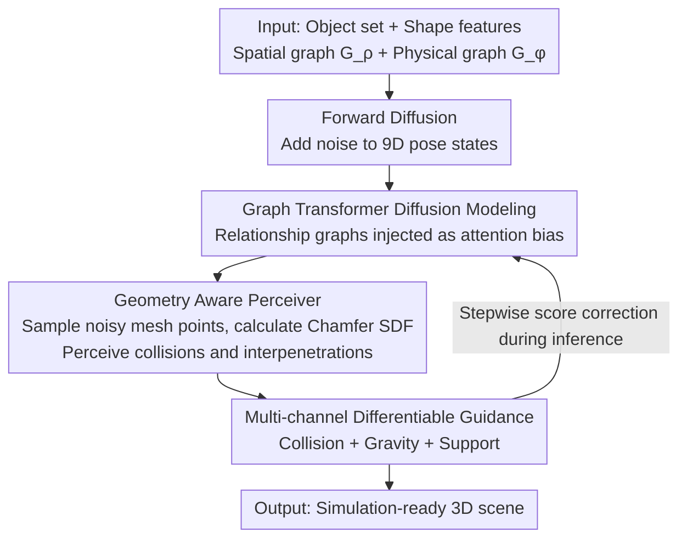

# SPREAD: Spatial-Physical REasoning via geometry Aware Diffusion

**Conference**: CVPR 2026  
**Paper**: [CVF Open Access](https://openaccess.thecvf.com/content/CVPR2026/html/Li_SPREAD_Spatial-Physical_REasoning_via_geometry_Aware_Diffusion_CVPR_2026_paper.html)  
**Code**: https://github.com/L-avenir/SPREAD  
**Area**: Diffusion Models / 3D Vision  
**Keywords**: 3D Scene Generation, Guided Diffusion, Graph Transformer, Physical Plausibility, Geometry Awareness

## TL;DR
SPREAD formulates "how to place objects in a physically plausible manner" as a guided diffusion framework: it uses a Graph Transformer to jointly encode spatial and physical relationship graphs, "observes" collisions and interpenetrations between noisy meshes via a Geometry Aware Perceiver during each denoising step, and employs a three-way differentiable guidance (Collision / Gravity / Support) during inference to push objects into physically consistent poses. This generates 3D indoor scenes that are almost entirely stable in Isaac Sim, making them directly applicable to Embodied AI.

## Background & Motivation
**Background**: Automatic 3D scene generation is transitioning from "graphical aesthetic layouts" to "realistic complex scenes serving Embodied AI." Mainstream methods fall into three categories: optimization-based methods produce physically plausible results for single scenes but are not scalable; procedural generation relies on manual rules for large-scale production but introduces human bias and lacks real-world cluttered diversity; and data-driven generative models (especially diffusion) learn scene distributions directly from data, with some using text or scene graphs as spatial priors to achieve controllability.

**Limitations of Prior Work**: Most data-driven methods only model **spatial relationships** (left/right/front/back), ignoring **physical relationships** (support, contact, gravity). Consequently, generated results often feature floating objects or interpenetrations. The few methods emphasizing physical plausibility (e.g., Physcene) use bounding boxes to approximate collisions, sacrificing contextual relationships for stability and resulting in "stable but irrational layouts." Furthermore, current datasets like 3D-FRONT only provide coarse-grained furniture placement, lacking the fine-grained object interaction data needed to learn complex physical relationships.

**Key Challenge**: Spatial consistency and physical plausibility are modeled **separately** in existing diffusion frameworks—either focusing on layout correctness or physical stability. No existing work jointly optimizes both during the denoising process, nor do they truly "perceive" mesh-level geometry (where collisions/interpenetrations occur) during generation.

**Goal**: To build a 3D scene diffusion generator that faithfully follows spatial+physical relationship graphs, is physically self-consistent at the mesh level (no collisions, proper support, following gravity), and is simulation-ready.

**Key Insight**: Humans use spatial common sense and physical intuition simultaneously (e.g., a pencil lies flat but stands upright in a pen holder; a cup must be upright to hold water). The authors argue that a generative model must explicitly perform geometry and relationship reasoning regarding "how objects interact stably, support each other, and coexist spatially" at every denoising step, rather than applying post-processing to the final layout.

**Core Idea**: Inject spatial and physical graphs as differentiable priors into a Graph Transformer diffusion model, paired with a geometry-aware Perceiver that calculates Chamfer Signed Distance Fields (SDF) based on noisy mesh point clouds at each denoising step. Supplement this with multi-channel differentiable guidance (Collision / Gravity / Support) during inference—replacing "generate then constrain" with a "generate while perceiving geometry and guiding physics" approach.

## Method

### Overall Architecture
The input to SPREAD is a set of objects to be generated (each with shape features) and two graphs describing their relationships—a spatial relationship graph $G_\rho$ (pairwise relative directions) and a physical relationship graph $G_\phi$ (support/contact/attachment). The output is the 3D translation $p$ and 6D continuous rotation $r$ for each object, forming a physically consistent and relationally coherent scene. The pipeline is a **guided diffusion** model: the forward process adds Gaussian noise to the 9D state (position + rotation), while the reverse process uses a Graph Transformer network $\epsilon_\theta(x_t, t, f, G_\rho, G_\phi)$ to denoise step-by-step.

It differs fundamentally from other scene diffusion models in two ways: ① At **every step** of reverse denoising, the two relationship graphs are injected as biases into graph attention, while a **Geometry Aware Perceiver** samples point clouds from noisy meshes to calculate collisions/interpenetrations, allowing the network to "see" geometric conflicts during denoising. ② During inference, a **multi-channel differentiable guidance** suite is overlaid, directly correcting the score function via gradients derived from collision, gravity, and support laws. The denoising network (including the Perceiver) is learned during training, while guidance is enabled only during inference.

### Key Designs

**1. Graph Transformer Diffusion: Injecting Spatial and Physical Graphs as Differentiable Priors**

To address the lack of physical modeling and fragmented optimization in existing methods, SPREAD represents the scene in a joint state space—each object $o_j$ is represented by a tuple $\langle p_j, r_j, f_j, \rho_j, \phi_j\rangle$, with the state vector $x_0 = \bigoplus_{j=1}^{N}[p_j \| r_j] \in \mathbb{R}^{N\times(3+6)}$ (3D position + 6D continuous rotation). The spatial graph $G_\rho$ and physical interaction graph $G_\phi$ are $N\times N$ adjacency matrices where values represent $K$ relationship types. They are first mapped to a continuous latent space $E = \text{MLP}(\text{Embedding}(G))$, resulting in edge embeddings $E\in\mathbb{R}^{N\times N\times d_e}$, which are then injected into Graph Attention layers as **bias terms**. Each denoising step processes both types of relationship information through a Graph Block $H_t^{l+1} = \text{GraphBlock}^l(H_t^l, G_\rho, G_\phi)$. Crucially, by projecting discrete relationships into a continuous feature space, **spatial relationships and physical constraints are jointly optimized within each graph block**, rather than being combined post-hoc—ensuring spatial consistency and physical plausibility are no longer decoupled.

**2. Geometry Aware Perceiver: Perceiving Collisions via Noisy Mesh Point Clouds**

To address the "blindness" of diffusion models to geometric conflicts during the process, SPREAD does not rely on implicit shape embeddings. Instead, at **each time step $t$**, it samples $M$ points $p_i^M$ from the mesh of object $i$ and calculates the unidirectional Chamfer distance to the point clouds of all other objects $P_{\neg i}$. Signs are assigned using nearest-neighbor normals $n_{nn}$ to approximate a Signed Distance Field (SDF):

$$d_{scd}(p) = \min_{q\in P_{\neg i}} \|p-q\|_2 \cdot \text{sign}\big(n_{nn}^\top(p-q)\big)$$

This results in a feature tensor of shape $(B, N, M, 4)$ (first 3 channels are global coordinates, 4th is $d_{scd}$). A Perceiver module uses cross-attention to distill these sparse high-dimensional features into $n$, $d$-dimensional tokens $f_{geo}$, enabling the network to "perceive" collisions and interpenetrations. Within the architecture, the 9D object state (with positional encoding) undergoes sequential cross-attention with **static shape tokens** (256×64 dimensional from a pre-trained Michelangelo encoder, providing a stable shape prior) and **dynamic geometry tokens** $f_{geo}$. This fuses a "shape-aware and geometry-aware" representation, which is then propagated via Graph Attention. All normalization layers use AdaLayerNorm conditioned on time step embedding $t_{emb}$. The sign of the SDF is the core of this design—it allows the network to distinguish between "near but not touching" and "already interpenetrating," which is far more precise than bounding box approximations.

**3. Multi-channel Differentiable Guidance: Three-way Gradients for Physical Consistency**

To ensure hard physical constraints that the score function alone cannot guarantee, SPREAD layers a differentiable guidance suite during inference to correct the score function: $\nabla_{x_t}\log p_\gamma(x_t) = s_\theta(x_t, t) + \gamma\nabla_{x_t}\mathcal{G}(x_t)$. The composite guidance signal $\mathcal{G} = \lambda_C \mathcal{G}_C + \lambda_H \mathcal{G}_H + \lambda_R \mathcal{G}_R$ consists of three terms. **Collision Guidance** $\mathcal{G}_C$ quantifies collisions directly based on intersecting triangles from different meshes rather than bounding boxes. Using a Bounding Volume Hierarchy (BVH) to find the set $C$ of colliding triangle pairs, each pair is evaluated using a Conical Distance Field (CoDF): $\mathcal{G}_C = \frac{1}{|C|}\sum_{a,b,a\neq b}\sum_{(i,j)\in C}\text{CoDF}(t_a^i, t_b^j)$. **Gravity Guidance** $\mathcal{G}_H$ calculates the vertical offset $r_i = d_i - \epsilon$ of each object relative to its support, penalizing floating ($r_i > \theta_H$) and interpenetration ($r_i < 0$): $\mathcal{G}_H = \sum_{r_i>\theta_H \lor r_i<0}|r_i|$. **Relationship (Support) Guidance** $\mathcal{G}_R$ approximates support validity via the overlap of projected convex hulls on the XZ plane. For a directed support pair $(i,j)$, it penalizes the average minimum Euclidean distance $s(\alpha,j)$ of vertices $V_{i,j}$ of object $i$ that fall outside the convex hull of $j$: $\mathcal{G}_R = \sum_{(i,j)\in E}\sum_{\alpha\in V_{i,j}}\frac{s(\alpha,j)}{|V_{i,j}||E|}$. Combined, these gradients eliminate interpenetration, floating, and improper support structures.

### Loss & Training
Training optimizes only the denoising network: node features are passed through an MLP to predict noise $\hat\epsilon$, minimizing the Mean Squared Error $\|\hat\epsilon - \epsilon\|^2$. Geometry perception (Chamfer SDF + Perceiver) is learned concurrently. Multi-channel differentiable guidance is **only enabled during inference** and requires no additional training. The forward diffusion follows the Markov chain $q(x_t|x_{t-1}) = \mathcal{N}(x_t; \sqrt{1-\beta_t}x_{t-1}, \beta_t I)$.

## Key Experimental Results

### Main Results
Evaluated on 3D-FRONT (designer-curated furniture scenes) and ProcTHOR (procedurally generated with rich small-object interactions), SPREAD is compared against ATISS (autoregressive transformer), DiffuScene (non-autoregressive diffusion), and InstructScene (two-stage graph framework). Metrics include FID (visual fidelity), Colmesh (mesh collision rate), GRecall (graph recall/structural accuracy), ASD (average support distance), and Stability (relationship retention rate after Isaac Sim simulation).

| Dataset | Metric | Ours | Best Baseline | Conclusion |
|---------|--------|------|---------------|------------|
| 3D-FRONT Bedroom | FID ↓ | 0.097 | 0.275 (ATISS) | Significant lead in visual fidelity |
| 3D-FRONT Livingroom | FID ↓ | 0.185 | 0.350 (InstructScene) | Superior |
| ProcTHOR | GRecall ↑ | 0.979 | 0.964 (InstructScene) | Highest, most faithful layout |
| ProcTHOR | Colmesh ↓ | 0.007 | 0.021 (InstructScene) | Lowest collision rate |
| ProcTHOR | ASD ↓ | 0.121 | 0.260 (InstructScene) | Almost seamless contact |
| ProcTHOR | Stability ↑ | 0.950 | 0.886 (DiffuScene) | Most stable post-simulation |

On the interaction-heavy ProcTHOR dataset, SPREAD outperforms all baselines across all physical metrics; FID is also significantly better on 3D-FRONT.

### Ablation Study
Incremental module testing on ProcTHOR starting from a vanilla diffusion baseline:

| Configuration | GRecall ↑ | Colmesh ↓ | ASD ↓ | Stability ↑ | Description |
|---------------|-----------|-----------|-------|-------------|-------------|
| Ours (base) | 0.963 | 0.241 | 0.014 | 0.934 | Graph diffusion baseline only |
| +Geometry | 0.965 | 0.225 | 0.012 | 0.938 | Added Perceiver; collision and ASD decrease |
| +Guidance | 0.979 | 0.121 | 0.007 | 0.950 | Added multi-channel guidance; best across all metrics |

### Key Findings
- **Complementary Roles**: The Geometry Aware Perceiver primarily reduces collision and ASD (enabling the network to understand geometry during generation), while Guidance provides the most significant leap—cutting Colmesh from 0.225 to 0.121 and raising Stability to 0.950. Physical gradients during inference are the primary source of physical plausibility.
- **Guidance Specialization**: Collision guidance removes interpenetration, gravity guidance removes floating, and support guidance maintains correct support structures, collectively achieving the lowest ASD, highest GRecall, and best simulation stability.
- **Simulation Ready**: Following Isaac Sim simulations, 95% of pairwise relationships remain unchanged, whereas baselines often exhibit object drifting or structural collapse.
- **User Study**: Out of 57 valid responses, 88.6% preferred SPREAD (ATISS 0.9%, DiffuScene 6.1%, InstructScene 4.4%).

## Highlights & Insights
- **SDF for Geometry Conflict Perception**: Calculating signed Chamfer distances for noisy meshes during denoising allows the network to distinguish "close vs. interpenetrating." This "real-time geometry perception during generation" is transferable to any layout or assembly task requiring collision avoidance.
- **Physical Laws as Differentiable Guidance**: Formulating physical common sense (Collision, Gravity, Support) as differentiable penalty terms added to the score function allows for hard constraints without retraining. This is a robust demonstration of the "train for distribution, infer for constraints" decoupling paradigm.
- **Dual Spatial+Physical Priors**: The explicit introduction of physical relationship graphs (support/contact) rather than just directional ones is why SPREAD outperforms others in interaction-rich environments like ProcTHOR.

## Limitations & Future Work
- **Domain Constraint**: Currently restricted to **indoor scenes** due to dataset limitations; future work aims to extend this to outdoor environments via image-conditioned paradigms.
- **Inference Speed**: SPREAD takes 14.72s per scene, significantly slower than ATISS (0.02s), InstructScene (2.58s), or DiffuScene (10.25s). This is the cost of modeling complex object relationships and pursuing high structural integrity. Efficiency improvements via flow matching are planned.
- **SE(3) Manifolds**: The authors aim to define diffusion directly on the SE(3) manifold to better utilize geometric priors of rotation.
- **Self-identified limitations**: Sensitivity to guidance weights ($\lambda_C/\lambda_H/\lambda_R$) is not fully disclosed. Mesh-level collision calculation (BVH+CoDF) for complex scenes likely accounts for the high inference latency, raising questions about scalability for extremely large environments.

## Related Work & Insights
- **vs. Physcene**: Physcene relies on bounding box predictions for collision and guidance for physical stability at the cost of contextual layout. SPREAD utilizes mesh-level and relationship-level guidance, achieving both stability and layout rationality.
- **vs. InstructScene / DiffuScene**: These represent spatial-only modeling (graphs or diffusion) and often result in floating or interpenetrating objects. SPREAD’s addition of physical graphs and guidance leads it to dominate in all physical metrics on ProcTHOR.
- **vs. ATISS**: ATISS is an autoregressive set transformer without explicit geometric/physical reasoning. SPREAD’s non-autoregressive diffusion with geometry perception is significantly better for physical plausibility and simulation stability, though slower.

## Rating
- Novelty: ⭐⭐⭐⭐ The combination of geometry-aware SDF, three-way differentiable physical guidance, and spatial/physical dual-graph priors is a pioneering integration for scene diffusion.
- Experimental Thoroughness: ⭐⭐⭐⭐ Comprehensive testing on two datasets, four baselines, detailed ablations, Isaac Sim verification, and user studies.
- Writing Quality: ⭐⭐⭐⭐ Logical flow from motivation to method and experiment is clear; formulas and diagrams are well-placed.
- Value: ⭐⭐⭐⭐ High practical value for producing simulation-ready scenes for Embodied AI data generation, though inference speed remains a bottleneck.

<!-- RELATED:START -->

## Related Papers

- [\[CVPR 2026\] Probing and Bridging Geometry–Interaction Cues for Affordance Reasoning in Vision Foundation Models](probing_and_bridging_geometry-interaction_cues_for_affordance_reasoning_in_visio.md)
- [\[CVPR 2026\] SpatialDiff: 3D-Aware Object Movement via Implicit Spatial Modeling](spatialdiff_3d-aware_object_movement_via_implicit_spatial_modeling.md)
- [\[ICML 2026\] Geometry-Aware Tabular Diffusion](../../ICML2026/image_generation/geometry-aware_tabular_diffusion.md)
- [\[CVPR 2026\] Circuit Mechanisms for Spatial Relation Generation in Diffusion Transformers](circuit_mechanisms_for_spatial_relation_generation_in_diffusion_models.md)
- [\[CVPR 2026\] GeoRK2: Geometry-Guided Runge-Kutta Integration for Diffusion Transformer Acceleration](geork2_geometry-guided_runge-kutta_integration_for_diffusion_transformer_acceler.md)

<!-- RELATED:END -->
