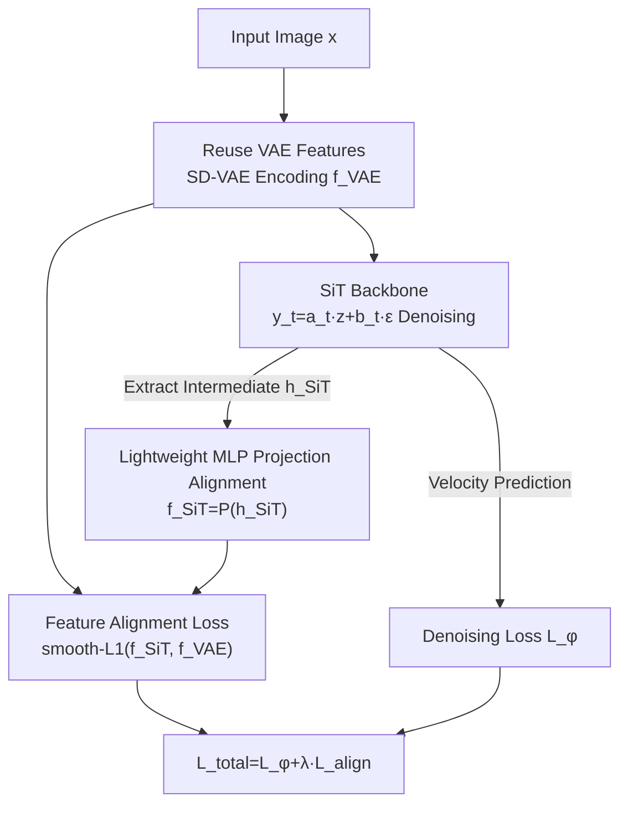

# SRA 2: Variational Autoencoder Self-Representation Alignment for Efficient Diffusion Training

**Conference**: CVPR 2026  
**Paper**: [CVF Open Access](https://openaccess.thecvf.com/content/CVPR2026/html/Wang_SRA_2_Variational_Autoencoder_Self_Representation_Alignment__for_Efficient_Diffusion_CVPR_2026_paper.html)  
**Code**: None  
**Area**: Diffusion Models  
**Keywords**: Diffusion Transformer, Training Acceleration, Representation Alignment, VAE Features, SiT

## TL;DR
SRA 2 directly utilizes the existing SD-VAE encoding features from the first stage of latent diffusion as supervision signals. By using a lightweight MLP to project intermediate SiT features for alignment, it accelerates diffusion Transformer training convergence by up to $7\times$ with only a 4% increase in GFLOPs, without introducing external representation encoders or maintaining a dual-model teacher.

## Background & Motivation
**Background**: Latent diffusion (LDM) based diffusion Transformers (DiT / SiT) are currently the primary models for high-fidelity image generation. However, they suffer from slow training convergence, often requiring millions or even tens of millions of iterations to achieve satisfactory FID. To accelerate training, three main approaches have emerged: ① Masked modeling (e.g., MaskDiT, SD-DiT, requiring an additional diffusion decoder); ② External representation guidance (e.g., REPA, using large-scale pre-trained encoders like DINOv2 to align intermediate diffusion layers); ③ Self-alignment (e.g., SRA, using an EMA teacher DiT to provide cleaner features for self-supervision).

**Limitations of Prior Work**: These three routes all incur additional costs for the "supervision signal." Methods like REPA require an external large encoder during training, which increases compute and tethers the model to external pre-trained knowledge—making it difficult to find suitable external encoders for domains like T2I / T2V / T2A (citing Flux.2 as evidence). Self-alignment methods like SRA maintain an extra teacher EMA DiT, requiring an additional forward pass per training step.

**Key Challenge**: To provide "visual priors / semantic guidance" for accelerating convergence without relying on "extra external models or additional forward overhead."

**Key Insight**: The authors observe that the LDM framework already inherently contains a neglected high-quality feature source—the pre-trained SD-VAE from the first stage. It is trained on large-scale natural images with high-quality reconstruction capabilities, so its encoded features naturally contain texture details, low-level structural patterns, and foundational semantic information. PCA visualization comparing SD-VAE features with SiT latent features at various layers reveals that the former are significantly stronger in depicting visual concepts and maintaining structural integrity and semantic coherence. Crucially, during the second stage of diffusion training, these VAE features are already pre-extracted and cached offline, allowing for **reuse with zero additional extraction cost**.

**Core Idea**: Use the existing SD-VAE features as alignment targets for diffusion Transformer intermediate layers. This requires neither external representation encoders nor dual-model teachers; by inserting a lightweight MLP projection layer and a feature alignment loss, noise-free targets rich in visual priors are injected into the diffusion learning process.

## Method

### Overall Architecture
SRA 2 retains the full SiT denoising training framework and inserts an "alignment branch." During training, an image is encoded into latent features $f^{VAE}$ by the SD-VAE (reused with zero extra cost as it is also the SiT generation target). SiT takes the noisy latent $y_t = a_t z + b_t \epsilon$ as input for denoising prediction. Simultaneously, features $h^{SiT}$ are extracted from an intermediate hidden layer, projected into the same dimensional space as $f^{VAE}$ via a lightweight MLP $P(\cdot)$ to obtain $f^{SiT} = P(h^{SiT})$, and then aligned with $f^{VAE}$ using an alignment loss. The final loss is a weighted sum of the original SiT denoising loss and this alignment loss. During inference, the MLP and alignment branch are discarded, keeping the model structure identical to the original SiT.

### Key Designs

**1. Reuse Pre-extracted VAE Features as Endogenous Guidance: Using "Existing Assets" as Supervision**

This is the core contribution. While previous acceleration routes are "expensive" because they seek supervision signals from **outside** the model (external encoders / teacher DiT), SRA 2 directly utilizes the SD-VAE features output by the first stage of LDM. For a $3\times256\times256$ input image, the SD-VAE encoder outputs a feature tensor $f^{VAE}\in\mathbb{R}^{C\times H\times W}$ (shape $4\times32\times32$). Since $f^{VAE}$ is already pre-extracted and stored for the second stage of diffusion training, using it as an alignment target yields "zero additional feature extraction cost." PCA visualization demonstrates why VAE features are suitable "teachers": they outperform SiT’s own latent representations in texture, structure, and semantic coherence. This also removes dependency on fixed external pre-trained knowledge, supporting domain-specific training (enabling generalization to T2I).

**2. Lightweight MLP Projection + smooth-L1 Alignment Loss: Bridging the Space Gap**

Intermediate SiT features $h^{SiT}$ and VAE features $f^{VAE}$ reside in distinct feature spaces and cannot be aligned directly. SRA 2 uses a lightweight MLP $P(\cdot)$ for non-linear dimensional transformation. The alignment uses an element-wise smooth-L1 loss, denoted as $\Delta f = f^{SiT} - f^{VAE}$:

$$\mathcal{L}_{\text{align}} = \mathbb{E}_{z,\epsilon,t}\left[\sum_{i=1}^{N}\begin{cases}\frac{1}{2\beta}(\Delta f_i)^2 & |\Delta f_i|\le\beta\\[2pt]\frac{|\Delta f_i|}{\beta}-\frac{1}{2} & \text{otherwise}\end{cases}\right]$$

Where $N = C\times H\times W$ and $\beta=0.05$. Smooth-L1 balances the smooth gradient of L2 for small errors and the robustness of L1 for large errors. Ablations show it outperforms pure $\ell_1$, $\ell_2$, and cosine similarity. This design draws inspiration from deep supervision—pulling intermediate layers towards an information-rich, noise-free target. Note that the MLP should not be too shallow: 5 layers (8M parameters) significantly outperform 2 layers (1M parameters).

**3. Shallow + Full-Timestep Alignment: Feeding Priors at the Right Place and Time**

The efficacy of alignment depends on the layer and noise level. Findings include: ① **Depth-wise, earlier is better**—alignment at the 2nd layer yields the best FID 28.89 for SiT-B/2 (Gain 4.13 over baseline). As alignment moves deeper, performance degrades. Authors speculate that deeper layers handle fine details and high-level semantics beyond what VAE features provide, and rigid constraints there might disrupt refinement (thus, layers 2/8/8 are chosen for B/L/XL). ② **Timestep-wise, full coverage is best**—aligning across $t\in[0,1]$ is superior to $[0,0.5]$ or $[0.5,1]$. VAE texture/structure aids representation refinement in low-noise stages, while its visual attributes help combat degradation in high-noise stages. The final training objective is:

$$\mathcal{L}_{\text{total}} = \mathcal{L}_{\phi} + \lambda\cdot\mathcal{L}_{\text{align}},\quad \lambda=1.0$$

## Key Experimental Results

Experiments were conducted on ImageNet 256×256 following SiT / REPA configurations (AdamW, lr 1e-4, batch 256, SD-VAE features). Sampling used SDE Euler–Maruyama with 250 steps.

### Main Results: Training Convergence Acceleration (No CFG, Table 2)

| Model | Iterations | FID↓ | Note |
|------|--------|------|------|
| SiT-B/2 | 400K | 33.0 | Baseline |
| SiT-B/2 + SRA 2 | 400K | **28.9** | Gain 4.1 |
| SiT-L/2 | 400K | 18.8 | Baseline |
| SiT-L/2 + SRA 2 | 400K | **14.3** | Exceeds XL/2 at 600K (14.6) |
| SiT-XL/2 | 7M | 8.3 | Baseline (7M steps) |
| SiT-XL/2 + SRA 2 | 1M | **8.2** | 7× Speedup and better |
| SiT-XL/2 + SRA 2 | 4M | **6.6** | Further improvement |

Notably, SiT-XL/2 plus SRA 2 matches the 7M-step baseline in just 1M steps (8.2), a $7\times$ speedup.

### Compatibility & SOTA Comparison (With CFG, Table 3)

| Method | Epochs | FID↓ | IS↑ | External Dependency |
|------|--------|------|-----|---------|
| SiT-XL/2 (Baseline) | 1400 | 2.06 | 270.3 | ✗ |
| + SRA [18] | 800 | 1.58 | 305.7 | ✓ teacher DiT |
| + REPA [44] | 800 | 1.42 | 311.4 | ✓ DINOv2 |
| + REG [39] | 800 | 1.36 | 299.4 | ✓ Encoder |
| **+ SRA 2** | 200 | 1.98 | 284.5 | **✗ None** |
| **+ SRA 2** | 800 | **1.52** | **316.2** | **✗ None** |

SRA 2 reaches FID 1.52 / IS 316.2 at 800 epochs, comparable to REPA (1.42) in FID while leading in IS, with **zero external dependencies**. It is also additive: combined with REPA at 100K/200K/400K, it further reduces FID by 3.1/1.9/1.1.

### Ablation Study (SiT-B/2, 400K, No CFG, Table 1)

| Configuration | FID↓ | Description |
|------|------|------|
| Vanilla SiT-B/2 | 33.02 | Baseline |
| Align at Layer 2 | **28.89** | Optimal depth |
| Align at Layer 6 | 32.44 | Too deep, prior fails |
| Align at Layer 8 | 36.20 | Worse than baseline |
| Timestep $[0,1]$ | **28.89** | Full range is best |
| Timestep $[0,0.5]$ | 30.04 | Low-noise only |
| smooth-ℓ1 | **28.89** | Optimal objective |
| cosine / ℓ1 / ℓ2 | 29.30 / 29.50 / 29.40 | All slightly worse |
| λ=1.0 | **28.89** | λ=0.1 → 30.10 |
| 5-layer MLP | **28.89** | 2-layer → 31.32 |

### Key Findings
- **Alignment Depth Sensitivity**: Performance degrades from Layer 2 (28.89) to Layer 8 (36.20). Deep layers refine features beyond VAE capabilities; forced alignment there is counterproductive.
- **Minimal Compute Overhead**: SRA 2 adds only ~4% GFLOPs to SiT-XL/2, with zero feature extraction cost for an external guidance model.
- **T2I Generalization**: Using MMDiT on MS-COCO, SRA 2 reduces FID from 5.08 to 4.67 and improves PickScore from 20.54 to 20.92, proving effectiveness in text-to-image scenarios without external encoders.

## Highlights & Insights
- **"Supervision is already in the pipeline"**: The most elegant aspect is reusing the cached VAE features as alignment targets, achieving "zero extra cost" literally. 
- **Evidence-based Motivation**: PCA visualization justifies "VAE as a teacher" before implementation, grounding the method in solid evidence rather than heuristics.
- **Shallow Alignment Protocol**: Applying guidance at early layers across all timesteps provides a practical design rule for future diffusion alignment methods.

## Limitations & Future Work
- Primarily validated on ImageNet 256×256 and the SiT series. While T2I was tested, higher resolutions and T2V/T2A require more evidence.
- The "ceiling" is limited by SD-VAE’s expressive power (textures/structures) rather than high-level semantics. This explains why deep layer alignment fails and why REPA/REG (using DINOv2) still hold a slight edge in FID (1.52 vs 1.42/1.36).
- The 5-layer MLP requirement suggests a significant gap between SiT and VAE feature spaces; narrowing this gap more efficiently is an open direction.

## Related Work & Insights
- **vs REPA / REG**: These use external DINOv2 encoders for alignment. They achieve slightly lower FID but require large external models and struggle where encoders are unavailable. SRA 2 uses endogenous features, achieves similar FID and better IS, with zero dependencies.
- **vs SRA**: SRA uses an EMA teacher DiT, requiring an extra forward pass. SRA 2 removes the teacher and uses VAE features, costing only 4% GFLOPs while yielding better FID/IS at the same epoch.
- **vs MaskDiT / SD-DiT**: These require additional diffusion decoders. SiT-XL/2 + SRA 2 at 200 epochs outperforms MaskDiT at 1600 epochs.

## Rating
- Novelty: ⭐⭐⭐⭐ Clever use of "existing assets" as targets; solid motivation.
- Experimental Thoroughness: ⭐⭐⭐⭐ Excellent coverage of convergence, SOTA, ablations, and T2I; lacks high-res/video.
- Writing Quality: ⭐⭐⭐⭐ PCA visualization and comparison diagrams are very clear.
- Value: ⭐⭐⭐⭐ High practical utility: 7× speedup for ~4% overhead with zero dependencies.

<!-- RELATED:START -->

## Related Papers

- [\[ICLR 2026\] Latent Diffusion Model without Variational Autoencoder](../../ICLR2026/image_generation/latent_diffusion_model_without_variational_autoencoder.md)
- [\[CVPR 2026\] VA-π: Variational Policy Alignment for Pixel-Aware Autoregressive Generation](va-p_variational_policy_alignment_for_pixel-aware_autoregressive_generation.md)
- [\[CVPR 2026\] Efficient and Training-Free Single-Image Diffusion Models](efficient_and_training-free_single-image_diffusion_models.md)
- [\[CVPR 2026\] When Local Rules Create Global Order: Self-Organized Representation Learning for Latent Diffusion Models](when_local_rules_create_global_order_self-organized_representation_learning_for_.md)
- [\[CVPR 2026\] ExpPortrait: Expressive Portrait Generation via Personalized Representation](expportrait_expressive_portrait_generation_via_personalized_representation.md)

<!-- RELATED:END -->
