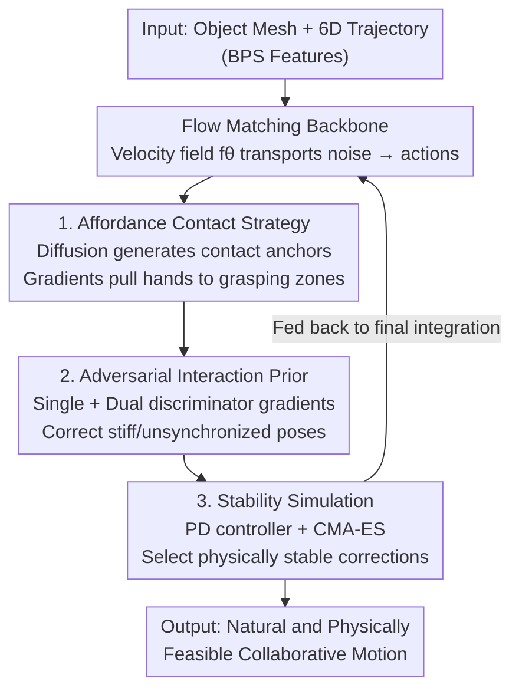

# Stability-Driven Motion Generation for Object-Guided Human-Human Co-Manipulation

**Conference**: CVPR 2026  
**arXiv**: [2604.20336](https://arxiv.org/abs/2604.20336)  
**Code**: https://github.com/boycehbz/StaCOM (Available)  
**Area**: Human Motion Generation / Human-Object Interaction / Physics Simulation  
**Keywords**: Dual-person collaborative manipulation, flow matching, grasping affordance, adversarial interaction prior, stability simulation

## TL;DR
Given an object mesh and its trajectory, this paper employs a flow matching framework to generate full-body motions for two individuals collaborating on object transport. Through three modules—affordance-guided contact strategy, adversarial interaction prior, and sampling-based stability simulation—the generated motions simultaneously satisfy intentional correctness (correct grasping), natural poses, and physical stability (minimal floating and penetration). On Core4D, it significantly outperforms existing HOI baselines in contact accuracy, penetration depth, and distributional fidelity.

## Background & Motivation
**Background**: Human motion generation has evolved from single-person scenarios (walking in static environments or following object trajectories) to multi-person interactions (socializing, dual dancing). The Human-Object Interaction (HOI) branch has shifted from "contact-aware diffusion" to "affordance-driven reasoning," represented by works like OMOMO, InterDiff, and CG-HOI.

**Limitations of Prior Work**: Existing methods are almost entirely designed for single-person scenarios or multi-person scenarios without object manipulation. Single-person HOI methods (e.g., OMOMO) lack mechanisms for human-human communication and adaptation. Direct expansion to dual-person scenarios leads to coordination instability and frequent penetrations. Multi-person interaction methods (InterGen, ComMDM) focus on social/dance tasks without object manipulation; applying them directly fails to guarantee reasonable physical dynamics or human-object coordination. RL-based physical methods (CooHOI) ensure physical feasibility but fail to generalize to different objects and tasks.

**Key Challenge**: Realistic collaborative transport is a tightly coupled triad interaction of "human-human-object." Each person must adapt to the object's motion, their partner's behavior, and the payload-induced dynamics. Existing paradigms either model kinematics only (resulting in floating and penetration) or use RL for physics with poor generalization, failing to address both aspects.

**Goal**: The authors decompose "realistic collaborative transport" into three criteria that must be satisfied simultaneously—Intention: Grasping strategies determined by object shape, affordance, and target state; Naturalness: Poses that are natural and responsive to the partner; Effectiveness: A transport process that is stable and follows physical laws.

**Key Insight**: Utilize deterministic flow matching as the generative backbone. Compared to the stochastic denoising of diffusion, flow matching provides a deterministic vector field, facilitating the injection of various conditions as guidance. Three external modules are then attached to "bend" the generated trajectories based on the three criteria.

**Core Idea**: At each Euler integration step of flow matching, three forces—contact anchor gradients (for intention), adversarial discriminator gradients (for naturalness), and physics simulation corrections (for stability)—simultaneously modify the velocity field to produce dual-person transport motions that are obedient, natural, and physically feasible.

## Method

### Overall Architecture
The input consists of an object mesh $\mathcal{O}$ and its rigid-body trajectory $\{(R^o_t,\mathbf{d}^o_t)\}$; the output is a collaborative transport motion sequence for two individuals (represented by SMPL-X). The core is a Transformer-based flow matching network $f_\theta$ that learns a continuous velocity field, transporting noise $\mathbf{x}_0$ along the vector field to clean dual-person motions $\mathbf{x}_1$. The condition $\mathbf{c}$ includes the object's 6D pose, BPS shape features, and cached contact anchors.

On top of this backbone, three modules are independently pre-trained and jointly executed during inference: (b) **affordance-guided contact strategy**—a diffusion model generates contact anchors based on object affordance to guide hands toward high-probability grasping regions; (c) **adversarial interaction prior**—two discriminators (single-pose + dual-interaction) score naturalness and backpropagate gradients to eliminate stiff or unsynchronized poses; (d) **stability simulation**—at the penultimate integration step, the current motion is fed into a physics engine (PD controller + CMA-ES sampling optimization) to select physically stable corrections for the final integration step.

### Key Designs

**1. Flow Matching Collaborative Framework**
To meet the requirement of a generator capable of efficiently injecting multiple conditions, flow matching is used instead of diffusion. It models motion generation as velocity field regression, learning a continuous vector field that transports noise $\mathbf{x}_0$ to the data distribution $\mathbf{x}_1$. The update is $\mathbf{x}_{\tau+\Delta\tau}=\mathbf{x}_\tau+\Delta\tau\, f_\theta(\mathbf{x}_\tau,\tau,\mathbf{c})$, requiring only $K=10$ Euler steps for inference. The condition $\mathbf{c}$ concatenates object poses, BPS embeddings ($\mathbf{b}_t\in\mathbb{R}^{1024}$ for dynamic shape perception), and cached contact anchors.

The training objective is the mean square flow matching loss:
$$\mathcal{L}_{\text{flow}}=\mathbb{E}_{\tau,\mathbf{x}_\tau}[\|f_\theta(\mathbf{x}_\tau,\tau,\mathbf{c})-(\mathbf{x}_1-\mathbf{x}_0)\|_2^2]$$
To stabilize articulated joint decoding, an L1 loss on SMPL-X parameters $\mathcal{L}_{\text{SMPL}}=\mathbb{E}_\tau[\|\hat{\mathbf{x}}_1-\mathbf{x}_1^{\text{gt}}\|_1]$ is added. To suppress foot sliding, a foot contact loss $\mathcal{L}_{\text{foot}}=\|(\mathbf{J}_f^{t+1}-\mathbf{J}_f^t)\cdot f^t\|_2^2$ is applied. 

**2. Affordance-Guided Contact Strategy**
To address the issue that many hand motions can generate the same object trajectory, a regression network first predicts affordance probability $\alpha_k$ on the object surface. A diffusion model, conditioned on affordance and BPS, generates a contact strategy $\mathcal{C}=\{(\mathbf{p},\mathbf{n},\boldsymbol{\delta},s)\}$ (position, normal, local offset, contact state). This model is constrained by:
$$\mathcal{L}_{\text{str}} = \lambda_1\mathcal{L}_{\text{anchor}} + \lambda_2\mathcal{L}_{\text{normal}} + \lambda_3\mathcal{L}_{\text{aff}}$$
The predicted anchors guide the flow via a differentiable distance loss $\mathcal{L}_{\text{contact}}$, where the flow is corrected at each Euler step: $\tilde{f}_\theta(\mathbf{x}_\tau)=f_\theta(\mathbf{x}_\tau)-\gamma\nabla_{\mathbf{x}_\tau}\mathcal{L}_{\text{contact}}$.

**3. Adversarial Interaction Prior**
The paper establishes two adversarial discriminators for "single-person pose" and "dual-person interaction." The single-person discriminator $\mathcal{D}_\phi^{\text{body}}$ extracts joint-level reality cues using $1\times1$ convolutions on rotation matrices. The interaction discriminator $\mathcal{D}_\phi^{\text{int}}$ processes concatenated dual-person rotations and relative root transforms to capture interpersonal coordination. During inference, these function as guidance:
$$\tilde{f}_\theta(\mathbf{x}_\tau)=f_\theta(\mathbf{x}_\tau)+\eta\sum_{k\in\{\text{body,int}\}}\nabla_{\mathbf{x}_\tau}\log\mathcal{D}_\phi^k$$
This pushes the integration toward regions of "authentic human motion patterns."

**4. Stability-Driven Simulation**
To eliminate "floating or penetration," sampling-based physics simulation is introduced. At the penultimate integration step, the SMPL-X parameters are instantiated in PyBullet. CMA-ES optimizes corrections $\Delta\mathbf{x}_\tau$ by sampling from $\mathcal{N}(\boldsymbol{m},\boldsymbol{C})$. Each sample is evaluated by:
$$\mathcal{L}_{\text{phys}}=\mathcal{L}_{\text{sim}}+\mathcal{L}_{\text{sta}}$$
The stability loss $\mathcal{L}_{\text{sta}}$ ensures the net forces and torques match the object's linear and angular acceleration derived from the input trajectory. The best correction $\tilde{\mathbf{x}_\tau}$ is fed back into the final flow step to restore naturalness.

### Loss & Training
- Total loss: $\mathcal{L}_{\text{total}}=\mathcal{L}_{\text{flow}}+\mathcal{L}_{\text{SMPL}}+\mathcal{L}_{\text{foot}}+\mathcal{L}_{\text{prior}}$, where $\mathcal{L}_{\text{prior}}=\mathcal{L}_{\text{prior}}^{\text{body}}+\mathcal{L}_{\text{prior}}^{\text{int}}$.
- Contact strategy diffusion is trained separately with $\mathcal{L}_{\text{str}}$.
- Training: NVIDIA RTX 4090, batch size 10, AdamW optimizer with cyclic cosine scheduling. Inference takes 1.19s for the flow network and ~3 min for physics simulation per 128-frame sequence.

## Key Experimental Results

### Main Results
Evaluated on Core4D (human-object-human interaction) and Inter-X. Metrics include Interaction Distance Field (IDF↓), Contact Accuracy (Contact Acc.↑), FID↓, Diversity (Div.↑), and Penetration Depth (Pene.↓).

| Method | IDF↓ (S1) | Contact Acc.↑ (S1) | FID↓ (S1) | Pene.↓ (S1) |
| :--- | :--- | :--- | :--- | :--- |
| ComMDM | 0.41 | 0.11 | 52.5 | 0.19 |
| OMOMO | 0.38 | 0.21 | 45.8 | 0.15 |
| InterGen | 0.47 | 0.13 | 35.4 | 0.11 |
| **Ours** | **0.22** | **0.44** | **25.5** | **0.05** |

Ours significantly outperforms baselines, particularly doubling contact accuracy from ~0.21 (OMOMO) to 0.44 and reducing penetration from 0.11 to 0.05.

### Ablation Study
Ablations on Core4D-S1 demonstrate the contribution of each module:

| Configuration | IDF↓ | Contact Acc.↑ | FID↓ | Pene.↓ |
| :--- | :--- | :--- | :--- | :--- |
| Flow Matching Baseline | 0.25 | 0.35 | 26.3 | 0.15 |
| + Affordance Contact | 0.24 | 0.40 | 26.0 | 0.20 |
| + Interaction Prior | 0.23 | 0.35 | 25.4 | 0.16 |
| + Stability Simulation | 0.23 | 0.42 | 28.6 | 0.02 |
| **Complete (Ours)** | **0.22** | **0.44** | **25.5** | **0.05** |

### Key Findings
- **Stability simulation is critical**: Without it, penetration increases from 0.05 to 0.16, proving physical feedback is indispensable.
- **Synergy between Simulation and Flow**: Simulation ensures physics but degrades FID (28.6); the final flow step recovers naturalness (FID 25.5).
- **Contact guidance improves intent**: Affordance anchors boost contact accuracy from 0.35 to 0.40.
- **Priors enhance coordination**: Adversarial interaction priors improve interpersonal alignment without sacrificing distribution fidelity.

## Highlights & Insights
- **Decomposed guidance**: Decomposing generation standards into intention, naturalness, and effectiveness allows for specialized external modules. The deterministic nature of flow matching provides a cleaner interface for gradient-based guidance than diffusion.
- **Dual-use discriminators**: Using discriminators for both training and inference (as classifiers-guidance) provides a robust Pose Prior for the inference stage.
- **Penultimate simulation trick**: Inserting physics simulation before the final integration step effectively balances "physical feasibility" and "visual naturalness."
- **Zero-shot refinement**: CMA-ES + PD controller refinement requires no strategy training, making it generalizable to any object, though it increases inference time.

## Limitations & Future Work
- **Computational overhead**: Physics simulation takes ~3 minutes per sequence, limiting real-time application.
- **Input dependency**: Requires predefined object trajectories; it does not plan the object's path itself.
- **Dataset bias**: Success is partially limited by the quality of human-object-human datasets like Core4D.
- **Scalability**: Restricted to dual-person scenarios; the complexity of $N$-person collaborative transport remains unexplored.

## Related Work & Insights
- **Comparison with OMOMO**: While OMOMO handles single HOI, it lacks collaborative mechanisms. Ours doubles its contact accuracy.
- **Comparison with InterGen**: InterGen focuses on social interaction; ours adds essential physics and object-manipulation constraints.
- **Comparison with CooHOI**: CooHOI uses RL, which is physically accurate but task-specific. Ours generalizes better through sampling-based optimization.

## Rating
- **Novelty**: ⭐⭐⭐⭐ (First work to integrate flow matching, affordance, and physics simulation for dual-person transport).
- **Experimental Thoroughness**: ⭐⭐⭐⭐ (Detailed ablation studies; clear module contribution).
- **Writing Quality**: ⭐⭐⭐⭐ (Logical structure and clear motivation).
- **Value**: ⭐⭐⭐⭐ (Significant for robotics and VR, although inference speed is a bottleneck).

<!-- RELATED:START -->

## Related Papers

- [\[CVPR 2026\] OneHOI: Unifying Human-Object Interaction Generation and Editing](onehoi_unifying_human-object_interaction_generation_and_editing.md)
- [\[CVPR 2026\] EgoFlow: Gradient-Guided Flow Matching for Egocentric 6DoF Object Motion Generation](egoflow_gradient-guided_flow_matching_for_egocentric_6dof_object_motion_generati.md)
- [\[CVPR 2026\] ViHOI: Human-Object Interaction Synthesis with Visual Priors](vihoi_human-object_interaction_synthesis_with_visual_priors.md)
- [\[CVPR 2026\] PoseD-Flow: Versatile and Guided Flow Matching Model of Human Pose](posed-flow_versatile_and_guided_flow_matching_model_of_human_pose.md)
- [\[CVPR 2026\] Cross-Axis Feature Fusion with Joint-Wise Motion Difference Prediction for Text-Based 3D Human Motion Editing](cross-axis_feature_fusion_with_joint-wise_motion_difference_prediction_for_text-.md)

<!-- RELATED:END -->
## Related Papers

- [\[CVPR 2026\] Towards Highly-Constrained Human Motion Generation with Retrieval-Guided Diffusion Noise Optimization](towards_highly-constrained_human_motion_generation_with_retrieval-guided_diffusi.md)
- [\[CVPR 2026\] ReGenHOI: Unifying Reconstruction and Generation for 3D Human-Object Interaction Understanding](regenhoi_unifying_reconstruction_and_generation_for_3d_human-object_interaction_.md)
- [\[CVPR 2026\] MoLingo: Motion-Language Alignment for Text-to-Human Motion Generation](molingo_motion-language_alignment_for_text-to-motion_generation.md)
- [\[CVPR 2026\] MotionMaster: Generalizable Text-Driven Motion Generation and Editing](motionmaster_generalizable_text-driven_motion_generation_and_editing.md)
- [\[CVPR 2026\] Towards Decompositional Human Motion Generation with Energy-Based Diffusion Models](towards_decompositional_human_motion_generation_with_energy-based_diffusion_mode.md)

<!-- RELATED:END -->
