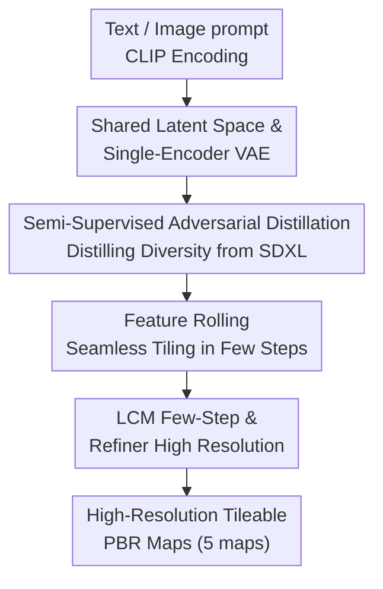

# StableMaterials: Enhancing Diversity in Material Generation via Semi-Supervised Learning

**Conference**: CVPR 2026  
**Paper**: [CVF Open Access](https://openaccess.thecvf.com/content/CVPR2026/html/Vecchio_StableMaterials_Enhancing_Diversity_in_Material_Generation_via_Semi-Supervised_Learning_CVPR_2026_paper.html)  
**Code**: https://gvecchio.com/stablematerials  
**Area**: Image Generation / Diffusion Models  
**Keywords**: Material Generation, PBR, SVBRDF, Semi-Supervised Learning, Adversarial Distillation, Latent Diffusion Models

## TL;DR
StableMaterials is a PBR material generation method based on latent diffusion models. It transfers the diverse knowledge of the large-scale image model SDXL into the material domain through "semi-supervised adversarial distillation." Faced with a severe scarcity of only about 6,200 labeled materials, it utilizes unlabeled textures generated by SDXL to supplement the training distribution. Combined with few-step LCM distillation, feature rolling tileability, and diffusion refinement, it achieves fast, tileable, high-resolution, and diverse material generation.

## Background & Motivation

**Background**: Video games, films, and architectural visualization require a vast amount of Physically Based Rendering (PBR) materials, but traditional manual creation has an extremely high barrier to entry. Recent learning-based methods follow two main paradigms: estimating SVBRDF reflectance parameters from single images (e.g., MatGen/ControlMat) or directly generating materials from text/image conditions (e.g., MatFuse, TileGen, Substance 3D Sampler).

**Limitations of Prior Work**: The capabilities of these methods are bottlenecked by training data. Even with "large-scale" material datasets such as MatSynth, OpenSVBRDF, and Deschaintre, their diversity is far inferior to that of natural image datasets like LAION. Material annotations (multiple aligned reflectance maps) are inherently scarce and expensive. This lack of data diversity directly leads to monotonous generated materials and an inability to handle out-of-domain concepts outside the training set.

**Key Challenge**: To supplement diversity, one might leverage the rich priors of large-scale pre-trained image models (such as SDXL). However, **images and materials belong to two different domains**—a single texture image versus multiple aligned SVBRDF maps (base color, normal, height, roughness, metallic). Distillation techniques like LoRA fine-tuning and Diff-Instruct only work well within the **same domain**. Direct cross-domain ($image \rightarrow material$) distillation fails because textures generated by SDXL lack corresponding material attribute labels, making direct supervision impossible.

**Goal**: ① Incorporate unlabeled (non-PBR) textures into the training of material generation models; ② Distill knowledge across domains from SDXL to enhance diversity; ③ Achieve fast few-step generation while maintaining tileability and high resolution.

**Key Insight**: Since direct supervision is infeasible for SDXL textures, **pixel-to-pixel alignment is not required**. Instead, adversarial loss is employed in a shared latent space to align the distribution of "SDXL textures" with that of "真实材质" (real materials)—forcing the generator to output latent features that "look like materials" even when starting from unlabeled textures.

**Core Idea**: Utilize a semi-supervised training scheme combining "primary supervision + auxiliary adversarial learning." This treats the adversarial loss as a cross-domain distillation signal to inherit diversity from SDXL, while using the supervised term to anchor physical plausibility and avoid mode collapse.

## Method

### Overall Architecture
StableMaterials is built upon the LDM paradigm of MatFuse: a VAE compresses 5 material maps into a decoupled latent tensor $z$, and a time-conditional U-Net diffusion model performs denoising on $z$. The input is a text or image prompt (encoded by CLIP into a single feature vector), and the output consists of five $512\times512$ PBR maps, which are subsequently upscaled to high resolution via a refiner. The entire pipeline introduces four key modifications: first, embedding textures and materials into the **same shared latent space** (and streamlining the multi-encoder VAE into a single-encoder VAE) to enable SDXL textures to enter training; second, utilizing **semi-supervised adversarial distillation** during training to inject the diversity of SDXL; third, using **feature rolling** during inference to resolve tileability seams under few-step generation; and finally, combining **LCM few-step generation with a diffusion Refiner** to achieve 4-step fast, high-resolution outputs.

### Key Designs

**1. Shared Latent Space and Single-Encoder VAE: Hosting Unlabeled Textures and Materials in the Same Latent Space**

To incorporate SDXL textures into training, a prerequisite is that textures and materials must be compressed into the **same** latent representation; otherwise, the adversarial loss has no common "feature space" to align. The authors accomplish this in three steps: First, a multi-encoder VAE is trained following MatFuse, where each encoder $E_i$ compresses the $i$-th map $M_i$ into $z_i$, concatenated to form $z=\text{concat}(z_1,\dots,z_N)$. The decoder reconstructs $\hat{M}=D(z)$, trained with pixel L2, LPIPS perceptual, patch adversarial, and rendering losses, alongside KL regularization. Second, **the decoder is frozen, and only a single encoder $E'$ is trained** to compress the concatenated maps directly into the same $z$. This reduces parameters from 271M to 101M, while the reconstruction quality remains virtually unchanged (see Tab. 2) and the decoupled latent representation is preserved. Finally, **a texture autoencoder is fine-tuned** to compress a single texture (e.g., base color) into the same $z$, with the decoder frozen as well. This third network specifically serves the semi-supervised training, ensuring that SDXL textures and materials share the same latent space, which makes the adversarial loss meaningful.

**2. Semi-Supervised Adversarial Distillation: Using Adversarial Loss as a Cross-Domain Distillation Signal to Gain Diversity from SDXL**

This is the core of the paper. Directly utilizing SDXL textures for supervision is unfeasible due to the lack of material annotations and the cross-domain nature. Therefore, the authors split the training into "primary supervision + auxiliary adversarial learning." The supervised loss ensures that labeled materials are reconstructed correctly and physically plausible:

$$L_{sup} = \mathbb{E}_{t,z_0,\epsilon}\big[\|\epsilon_t-\epsilon_\theta(z_{t,mat},t)\|^2\big] + \alpha\,\mathbb{E}_{t,z_0,\epsilon}\big[\|\epsilon_t-\epsilon_\theta(z_{t,tex},t)\|^2\big]$$

where $z_{t,mat}$ and $z_{t,tex}$ represent the noisy latent variables of the material and texture at step $t$ respectively, and $\alpha=0.15$ controls the weight of the unlabeled texture term. The adversarial loss forces the generator to map both textures and materials to the same feature distribution:

$$L_{adv} = -\mathbb{E}_{z\sim p(z)}\big[\,LD(z_{t-1})\,\big],\quad z_{t-1}=\text{concat}(z_{t-1,mat},\,z_{t-1,tex})$$

It acts on the denoised latent variable $z_{t-1}$. Here, a **Latent Discriminator (LD)** is introduced: it is trained using hinge loss, treating real material latent variables encoded by the VAE as 'real' and those denoised by the generator as 'fake', with **only real material latent variables being considered as real samples**. The LD is time-conditional (likewise receiving $t$ and CLIP embeddings); its architecture mirrors the encoder of the diffusion U-Net and is initialized with its weights, leveraging this to understand the latent space and effectively guide the generator. The key lies in training **primarily with supervision, supplemented by adversarial learning**: adversarial loss serves purely as a distillation signal to inject the diversity of SDXL textures without overwhelming the process and causing mode collapse; simultaneously, the adversarial term ensures that SDXL textures are mapped into 'real material' latents, neutralizing shading artifacts in the textures. Unlike other works that use adversarial distillation for **fast generation** (such as SD-Turbo), the adversarial loss here is utilized to **bridge the cross-domain gap between materials and textures**.

**3. Feature Rolling: Seamless Tiling Even Under Few-Step Generation**

Material generation must be tileable. Previous "noise rolling" achieved tileability through iterative diffusion, but **it fails when the step count is low**—which presents a conflict since this work specifically targets few-step generation for speed. The authors shift the rolling operation from the noise input to the U-Net features: in each convolutional and attention layer, the **feature maps are randomly rolled, processed, and then rolled back**, thereby maintaining edge continuity and eliminating seams even with fewer diffusion steps. For highly structured materials (such as regular tiles), feature rolling is enabled only after the first diffusion step to preserve the global layout. This is a direct remedy to the conflict between few-step fast generation and tileability.

**4. LCM Few-Step Generation and Refiner High-Resolution: 4-Step Output + Two-Stage Refinement for Upscaling**

To accelerate generation, the authors distill a Latent Consistency Model (LCM): it performs single-stage guided distillation on an augmented probability flow ODE (PF-ODE), using a consistency function $f_\theta(z_t,c,t)\mapsto z_0$ to directly predict the solution at $t=0$, and integrates the guidance scale $\omega$ directly into the PF-ODE. Combined with a skip-step strategy to ensure consistency between adjacent timesteps, it avoids the alignment issues of two-stage methods—ultimately squeezing inference down to 4 steps per stage. For high-resolution generation, a "coarse-to-fine" two-stage pipeline (similar to SDXL) is adopted: generation is first performed at $512\times512$ resolution, followed by SDEdit with a strength of 0.5 for refinement and upscaling to balance new high-frequency details and global consistency. The Refiner is trained on full-resolution $512\times512$ crops (without downsampling) of 4K materials, specializing in fine surface details. Combined with patch-based diffusion to manage GPU memory, the patches are first stabilized at $512\times512$ before upscaling, avoiding cross-patch scale and consistency artifacts caused by simple patch-wise generation.

### Loss & Training
The total objective is the sum of the supervised loss and the adversarial loss, $L_{sup} + L_{adv}$. Training is conducted in stages: the autoencoder is trained on a single RTX 4090 (24GB) using Adam with a batch size of 8 for 1,000,000 steps (learning rate $4.5\times10^{-4}$, enabling $L_{adv}$ after 300,000 steps); the diffusion model is first trained with pure supervision for 400,000 steps (AdamW, batch size of 16, learning rate $3.2\times10^{-5}$), and then fine-tuned semi-supervised for 200,000 steps (batch size of 8); the Refiner is fine-tuned for 50,000 steps; the LCM is fine-tuned for 10,000 steps ($T=4$ sampling steps). Regarding conditioning, modalities are randomly dropped during training—with a 75% probability of dropping text and a 25% probability of dropping images to balance both conditioning modalities. The data comprises 6,198 PBR materials from MatSynth + Deschaintre, combined with 4,000 texture-text pairs generated by SDXL using 200 prompts suggested by ChatGPT.

## Key Experimental Results

### Main Results
As material quality is difficult to measure using standard image metrics like FID/IS (since the distribution of materials differs significantly from natural images), the authors employ CLIP-based metrics: CLIP Score to evaluate semantic alignment, and CLIP-IQA to evaluate perceptual quality (calculated using "high-quality/low-quality" contrastive pairs), evaluated across 80 text-conditioned generations.

| Method | Dataset | CLIP Score ↑ | CLIP-IQA ↑ |
|------|--------|--------------|------------|
| MatFuse | Public | 26.2 | 0.52 |
| MatGen | Private | 28.8 | 0.66 |
| Substance 3D Sampler | Private | 24.9 | **0.71** |
| **StableMaterials (Ours)** | Public | **29.6** | 0.70 |

StableMaterials achieves the highest CLIP Score (29.6), and its CLIP-IQA (0.70) is on par with Sampler (0.71) which is trained on private data, significantly outperforming MatFuse which also uses public data.

A user study conducted with 20 domain experts, each evaluating preferences and assigning a score of 1–5 across 10 prompts:

| Method | Preference Votes | Average Score (1–5) |
|------|-------------|----------------|
| MatFuse | 4 | 1.85 |
| MatGen | 25 | 2.28 |
| Substance 3D Sampler | 66 | 2.71 |
| **StableMaterials (Ours)** | **105** | **3.50** |

One-way ANOVA confirms a significant difference ($F=60.5$, $p<0.05$); the Chi-squared goodness-of-fit test on preference votes yields $\chi^2=120.44$, $p<0.001$, deviating significantly from random chance; the correlation coefficient between the average score and the preference count is $R=0.99$.

### Ablation Study

| Configuration | Key Observation | Description |
|------|---------|------|
| Single-Encoder VAE (101M) | RMSE is roughly on par with Multi-Encoder (271M) | Parameters are cut by 63%, with no drop in reconstruction quality (see table below) |
| w/o semi-supervised distillation | Out-of-domain material generation is unstable/fails | Removing distillation fails to reliably generate out-of-domain materials |
| w/ semi-supervised distillation | Diversity is significantly enhanced, enabling new material generation | Core contribution, primarily improving OOD and diversity |
| Only patched diffusion | Scale/consistency artifacts appear across patches | Direct patch-by-patch generation is undesirable |
| Two-stage (base+refine) | Sharper details and more coherent large-format generation | Refiner significantly enhances quality and sharpness |

Reconstruction error comparison of VAE architectures (RMSE ↓):

| Model | Albedo | Normal | Height | Rough. | Metal. |
|------|--------|--------|--------|--------|--------|
| Multi-E (271M) | 0.030 | 0.035 | 0.030 | 0.032 | 0.016 |
| Single-E (101M) | 0.028 | 0.037 | 0.030 | 0.032 | 0.015 |

Inference speed (4 denoising steps + 2 refinement steps, LCM sampling, FP16 parallel 8 patches):

| Resolution | StableMaterials | VRAM | LDM (DDIM 50+25 steps) |
|--------|-----------------|------|---------------------|
| $512\times512$ | 0.6s | — | — |
| $1024\times1024$ | 1.5s | 6.5GB | — |
| $2048\times2048$ | 4.9s | 7.4GB | 20.6s |
| $4096\times4096$ | 18.6s | 12GB | 65.4s |

### Key Findings
- **Semi-supervised distillation contributes the most**: Without it, the purely supervised baseline collapses on out-of-domain materials—this is the core of the data scarcity issue and the main selling point of this paper (Fig. 8).
- **Single-encoder VAE is a "free lunch" optimization**: Parameters drop from 271M to 101M (approx. $-63\%$), while the RMSE of the five maps remains virtually unchanged, proving that the decoupled latent space can be compressed via transfer learning.
- **Few-step + Refiner brings order-of-magnitude speedup**: At $4096\times4096$, the time drops from 65.4s (LDM) to 18.6s (approx. $3.5\times$), while keeping memory usage manageable (12GB); this makes high-resolution material generation feasible on a single 24GB consumer-grade GPU.
- **Quality does not rely on scaling data**: Trained on public data, the model can still match the CLIP-IQA of Sampler trained on private data, demonstrating that distilling diversity from SDXL is an effective alternative.

## Highlights & Insights
- **Repositioning "adversarial loss" as a "cross-domain distillation signal"**: By avoiding pixel-to-pixel alignment and instead aligning distributions with a discriminator in a shared latent space, it cleverly bypasses the bottleneck of SDXL textures lacking material annotations. This formula of "primary supervision anchoring physics, auxiliary adversarial injecting diversity" can be transferred to any generation task where target domain data is scarce but a large-scale adjacent domain model exists (e.g., 3D, video, medical imaging).
- **Feature Rolling** is a clean engineering insight: The requirement for tileability naturally conflicts with few-step fast generation. The authors move the rolling operation from the noise layer to the U-Net feature layers, delaying activation by one step for structured materials to maintain the global layout—offering a reusable trick for seamless texturing in few-step diffusion.
- **Reusing the diffusion U-Net encoder architecture and initializing weights for the discriminator**: This allows the discriminator to "inherently understand" the latent space, eliminating the need to learn representations from scratch. This is a valuable initialization tip for hybrid GAN-diffusion training.

## Limitations & Future Work
- **Poor handling of natural language prompts describing spatial relations**: Prompts describing position/layout relationships (e.g., "square tiles surrounded by rectangular tiles") are prone to failure. The authors suggest increasing the diversity of training prompts.
- **Hallucinating incorrect reflectance properties**: For material categories that only appear in unlabeled data, the model may misclassify materials as metallic, etc. The authors suggest that adding text prompts describing surface properties during training could mitigate this.
- **Diversity is limited by the ceiling of unlabeled data**: Although the model can generate out-of-annotation materials, it is still restricted to **categories covered by the unlabeled data (SDXL textures)**—essentially shifting the bottleneck from "labeled materials" to "textures that SDXL can generate", rather than achieving truly open-ended generation.
- Evaluation heavily relies on CLIP-based proxy metrics (since FID/IS are not applicable to materials), lacking a direct measure of physical accuracy, which makes quantitative evaluation of "physically faithful reflectance" somewhat weak.

## Related Work & Insights
- **vs MatFuse**: This work builds directly on the LDM paradigm of MatFuse but replaces its multi-encoder VAE with a single-encoder VAE (more than halving the parameters) and introduces semi-supervised distillation. MatFuse is limited to $256\times256$, often producing blurry/simplistic outputs, and struggles with complex textures; StableMaterials outputs high-resolution, tileable, and more diverse materials.
- **vs MatGen/ControlMat**: MatGen uses private data, yielding high quality but suffering from over-sharpening artifacts and difficulty following complex prompts; StableMaterials matches or outperforms it using only public data, without over-sharpening issues.
- **vs Material Palette / Substance 3D Sampler**: Both follow a two-step "texture generation then SVBRDF estimation" approach, which is dragged down by SVBRDF prediction bias (guessing properties from light-surface interactions, often yielding natural images with perspective rather than flat surfaces); Material Palette additionally requires fine-tuning a LoRA for each prompt, which is computationally expensive. StableMaterials directly generates PBR maps end-to-end, bypassing the extra estimation step.
- **vs Diff-Instruct / LoRA (Same-Domain Distillation)**: These methods only reuse pre-trained knowledge within the same image domain and cannot transfer to non-image domains; the proposed semi-supervised adversarial distillation is specifically designed for cross-domain ($image \rightarrow material$) transfer.

## Rating
- Novelty: ⭐⭐⭐⭐⭐  
- Experimental Thoroughness: ⭐⭐⭐⭐  
- Writing Quality: ⭐⭐⭐⭐  
- Value: ⭐⭐⭐⭐⭐  

<!-- RELATED:START -->

## Related Papers

- [\[CVPR 2026\] Spatial-SSRL: Enhancing Spatial Understanding via Self-Supervised Reinforcement Learning](spatial-ssrl_enhancing_spatial_understanding_via_self-supervised_reinforcement_l.md)
- [\[CVPR 2026\] DiverseGRPO: Mitigating Mode Collapse in Image Generation via Diversity-Aware GRPO](diversegrpo_mitigating_mode_collapse_in_image_generation_via_diversity-aware_grp.md)
- [\[CVPR 2026\] MatPedia: A Universal Generative Foundation for High-Fidelity Material Synthesis](matpedia_a_universal_generative_foundation_for_high-fidelity_material_synthesis.md)
- [\[CVPR 2026\] Enhancing Spatial Understanding in Image Generation via Reward Modeling](enhancing_spatial_understanding_in_image_generation_via_reward_modeling.md)
- [\[CVPR 2026\] IDperturb: Enhancing Variation in Synthetic Face Generation via Angular Perturbations](idperturb_enhancing_variation_in_synthetic_face_generation_via_angular_perturbat.md)

<!-- RELATED:END -->
