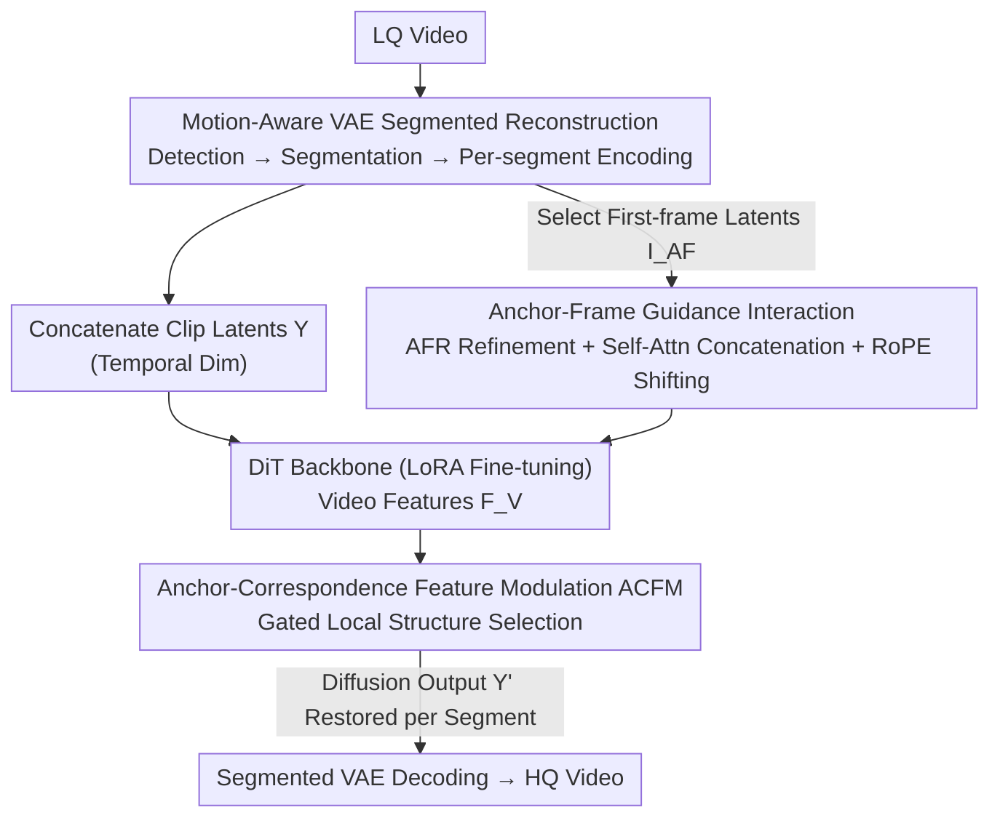

# STCDiT: Spatio-Temporally Consistent Diffusion Transformer for High-Quality Video Super-Resolution

**Conference**: CVPR 2026  
**Paper**: [CVF Open Access](https://openaccess.thecvf.com/content/CVPR2026/html/Chen_STCDiT_Spatio-Temporally_Consistent_Diffusion_Transformer_for_High-Quality_Video_Super_Resolution_CVPR_2026_paper.html)  
**Code**: https://jychen9811.github.io/STCDiT_page (Project Page)

**Area**: Image/Video Restoration (Video Super-Resolution)  
**Keywords**: Video Super-Resolution, Video Diffusion Models, Motion-Aware VAE, Anchor-Frame Guidance, Parameter-Efficient Fine-Tuning

## TL;DR
STCDiT performs real-world video super-resolution (VSR) based on a pre-trained video diffusion model (Wan2.1). It addresses VAE reconstruction distortions under complex camera movements using "Motion-Aware VAE Segmented Reconstruction" and injects well-preserved spatial structure information from the first-frame latent of each segment into the generation process via "Anchor-Frame Guidance." By adding only approximately 7% of the trainable parameters of a standard LoRA, it surpasses SOTAs such as SeedVR and STAR in structural fidelity and temporal consistency.

## Background & Motivation
**Background**: Video Super-Resolution (VSR) aims to restore high-quality (HQ) frames from low-quality (LQ) videos. Traditional methods (sliding windows, bidirectional/grid propagation like BasicVSR++) excel at mining spatio-temporal dependencies but struggle to generate fine details under real-world degradation. Image diffusion models can synthesize realistic details but suffer from temporal inconsistency and flickering because they perform frame-independent sampling and produce different results for different noise samples with the same input. Video diffusion models naturally model spatio-temporal continuity and have become the new backbone for VSR.

**Limitations of Prior Work**: Directly applying pre-trained video diffusion models to VSR faces two specific challenges. The first is **temporal stability during the reconstruction phase**. Mainstream video diffusion models use pre-trained VAEs for temporal downsampling/upsampling, but their temporal scaling operators are local operations in the spatial dimension and cannot model complex spatial transformations across frames. Significant movements, such as camera shake or zooming, lead to structural distortions and artifacts during direct VAE reconstruction. The second is **structural fidelity during the generation phase**. Existing methods (e.g., SeedVR) rely on full fine-tuning of large DiTs for fidelity, which is computationally expensive. Parameter-efficient fine-tuning (PEFT) like LoRA saves costs but is limited by the low-rank constraint in capturing complex feature interactions. VSR requires both preserving LQ structures and synthesizing details, making simple LoRA insufficient.

**Key Challenge**: Redesigning VAE operators or architectures to adapt to complex motion is highly labor-intensive, while a tension exists between fidelity and "parameter efficiency"—saving parameters via LoRA suppresses the feature interactions required for structural fidelity.

**Goal**: Achieve both temporal stability and structural fidelity without **altering the VAE architecture or performing full fine-tuning of the DiT**.

**Key Insight**: The authors made two observations. First, complex motion causes VAE failure because multiple motion patterns are mixed within a single video sequence; segmenting the video into clips with "consistent motion patterns" allows the VAE to handle them individually. Second, after motion-aware VAE encoding, **the first-frame latent of each segment (referred to as the "anchor-frame latent") undergoes no temporal compression**, thereby retaining richer spatial structure than subsequent frames—this is precisely the information needed for fidelity.

**Core Idea**: Use "segmented reconstruction" to bypass VAE limitations regarding complex motion and use "anchor-frame structural information" as a parameter-efficient guidance signal to constrain DiT generation. The coupling of these two elements enables high-quality VSR using video diffusion models.

## Method

### Overall Architecture
STCDiT is a VSR framework built on a pre-trained video diffusion model, with a pipeline divided into reconstruction and generation phases. **Reconstruction side**: Given an LQ video, motion detection is first performed to segment it into clips with consistent motion patterns. Each clip is independently encoded by the VAE to obtain clip latents $\{X_i\}_{i=1}^{L}$, which are concatenated along the temporal dimension into a unified latent $Y$ for the diffusion process. The diffusion output $Y'$ is restored to segments and decoded by the VAE to form the final HQ video. **Generation side**: Anchor-frame latents $I_{AF}$ are selected from the first frames of each segment and processed by an Anchor-Frame Feature Refinement (AFR) module to obtain anchor features $F_{AF}$. Within each DiT block, anchor tokens are concatenated with video tokens in the self-attention layer to facilitate interaction (diffusing structural information to all frames), while an Anchor-Correspondence Feature Modulation (ACFM) module performs gated local structure selection and fusion. The LQ video latent $Y$, noise latent $N$, and an all-ones mask $M$ are concatenated channel-wise and patchified to obtain video features $F_V$. The entire DiT is fine-tuned via LoRA, with trainable parameters accounting for only ~7% of LoRA (rank=128) parameters (for Wan-14B).

### Key Designs

**1. Motion-Aware VAE Segmented Reconstruction: Decomposing "Complex Motion" into "Local Uniform Motion"**

The pain point is that the pre-trained VAE's temporal scaling operators only perform local operations in the spatial dimension. When shaking, zooming, and panning occur simultaneously, it cannot model large-scale cross-frame transformations, resulting in distorted reconstructions. Instead of redesigning the VAE, the authors use motion-adaptive segmentation at the input: Shi–Tomasi corner detection finds feature points, and Lucas–Kanade sparse optical flow estimates trajectories to fit an **affine transformation matrix**, from which inter-frame parameters (translation, rotation, scale) are decomposed. Frames where "motion mutations" occur are identified using empirical thresholds, segmenting the video into $L$ clips. Each clip is independently encoded as $X_i \in \mathbb{R}^{C\times F\times H\times W}$ and concatenated into $Y\in\mathbb{R}^{C\times F'\times H\times W}$. After diffusion, $Y'$ is split back into $\{X_i'\}$ for decoding. This ensures motion within each clip is approximately uniform, fitting the capabilities of the VAE operators. Segment length is capped at 9 frames during inference to prevent drift. This approach improved reconstruction PSNR from 27.22dB to 31.42dB (+4.20dB), serving as the foundation for stability.

**2. Anchor-Guided Spatio-Temporal Feature Interaction: Using "Non-temporally Compressed First Frames" as Structural Anchors**

LoRA's low-rank bottleneck makes it difficult for DiT to balance preserving LQ structures and synthesizing details. The authors observed that after motion-aware VAE encoding, the **first frame** latent of each clip does not undergo temporal compression, retaining more spatial structure. Sparse selection of these first frames as anchor latents $I_{AF}$ (sampling one-fourth in implementation) provides high-quality guidance. Anchor frames are first enhanced via the AFR refinement module:

$$\hat I_{AF} = \mathrm{DConv}(\mathrm{PConv}(I_{AF})),\quad \tilde F_{AF} = \downarrow_2(\hat I_{AF}) + \mathrm{TConv}(I_{AF}),\quad F_{AF} = \mathrm{DConv}(\mathrm{PConv}(\zeta(\tilde F_{AF})))$$

where $\mathrm{DConv}$ is $3\times3$ depthwise convolution, $\mathrm{PConv}$ is $1\times1$ convolution, $\downarrow_2$ is max pooling with $\times2$ downsampling, $\zeta$ is SiLU, and $\mathrm{TConv}$ is $2\times2$ convolution with stride 2. In the $j$-th DiT block, video features $F^V_j$ and anchor features $F^{AF}_j$ are flattened into tokens and concatenated along the sequence dimension as $T^C_j$ for self-attention:

$$\mathrm{Attn}(T^C_j) = \mathrm{softmax}\!\left(\frac{Q_j K_j^{\top}}{\sqrt{d}}\right) V_j$$

Two critical details: first, when applying position embeddings to $Q_j, K_j$, the **position indices of video tokens remain unchanged, while anchor token indices are shifted along the temporal dimension**, leveraging the extrapolation properties of RoPE to avoid index overlap. Second, **anchor tokens are excluded from subsequent cross-attention with text embeddings**, as this interaction destroys the preserved structural information (ablation shows a 4.84 MUSIQ drop if included).

**3. Anchor-Correspondence Feature Modulation (ACFM): Global Self-Attention Supplemented by Gated Local Selection**

While self-attention captures global dependencies, it underutilizes **local spatial information**. Inspired by DiT4SR, ACFM estimates a **gating unit** from the anchor features for discriminative feature selection. Local information is extracted from anchor frames:

$$\hat D^{AF}_j = \mathrm{DConv}(O^{AF}_j) + O^{AF}_j,\qquad \hat S^{AF}_j = \hat D^{AF}_j \odot \phi(\mathrm{DConv}(\hat D^{AF}_j))$$

where $\odot$ is element-wise multiplication and $\phi$ is GELU. $\phi(\cdot)$ acts as a gate determining which local structures pass through. The selected $\hat S^{AF}_j$ is then fused into the corresponding video features. This gated fusion is more effective for recovering structural details like grids or text strokes compared to direct injection, contributing 2.66/1.31 gains to MUSIQ/DOVER respectively.

### Loss & Training
Training uses HQ videos from UltraVideo and HQ images from LSDIR. LQ samples are synthesized using the RealBasicVSR / Real-ESRGAN degradation pipeline, with added camera shake and zoom. Text descriptions are generated by Qwen2.5-VL. STCDiT-tiny and STCDiT are based on Wan2.1 T2V-1.3B / I2V-14B with LoRA rank=128. Training utilizes AdamW (LR 5e-5) and MSE loss. Inference uses 10 steps.

## Key Experimental Results

### Main Results
Evaluation was conducted on REDS30/UDM10 (synthetic) and RealVSR/VideoLQ/SportsLQ (real-world). Representative metrics on REDS30 and UDM10:

| Dataset | Metric | STAR(2B) | DOVE(5B) | SeedVR(7B) | Wan(14B) | STCDiT(14B) |
|--------|------|----------|----------|------------|----------|-------------|
| REDS30 | LPIPS ↓ | 0.4289 | 0.3487 | 0.3209 | 0.2943 | **0.2866** |
| REDS30 | MUSIQ ↑ | 40.45 | 50.33 | 54.50 | 55.05 | **61.65** |
| REDS30 | DOVER ↑ | 36.43 | 36.83 | 36.36 | 39.69 | **42.94** |
| UDM10 | MUSIQ ↑ | 60.84 | 60.84 | 64.62 | 63.75 | **66.46** |
| UDM10 | DOVER ↑ | 54.03 | 57.70 | 60.93 | 60.64 | **64.10** |
| UDM10 | LPIPS ↓ | 0.2312 | 0.1581 | 0.1827 | 0.1720 | 0.1682 |

STCDiT achieved top performance across nearly all no-reference perceptual metrics (MUSIQ, CLIPIQA+, DOVER), with STCDiT-tiny often matching or exceeding larger 7B/14B models.

### Ablation Study

Motion-Aware VAE Reconstruction (Pure reconstruction task on REDS30):

| Configuration | PSNR ↑ | SSIM ↑ | E*warp ↓ |
|------|--------|--------|----------|
| ST VAE (Standard) | 27.22 | 0.7802 | 1.76 |
| **MA VAE (Ours)** | **31.42** | **0.8924** | **1.34** |

Anchor-Frame Guidance (On RealVSR):

| Configuration | MUSIQ ↑ | DOVER ↑ |
|------|---------|---------|
| Base (No anchors) | 68.30 | 55.62 |
| + First-frame Interaction (FF) | 70.58 | 58.68 |
| + FF & ACFM | 73.24 | 59.99 |
| **Ours (FF & ACFM & AFR)** | **73.57** | **60.81** |

### Key Findings
- **Motion-aware reconstruction is the primary driver**: This single technique improved reconstruction PSNR by 4.20dB, ensuring stability under complex motion.
- **Anchors must be "first frames"**: These frames are not temporally compressed. Switching to uniform sampling dropped MUSIQ from 73.57 to 69.72.
- **Anchors must avoid cross-attention**: Interacting with text embeddings contaminated structural information, lowering MUSIQ by 4.84.
- **E*warp bias**: The warping error does not show a dominant advantage because it penalizes high-detail results. STCDiT's rich details lead to a lower score on this specific metric despite high visual quality.

## Highlights & Insights
- **Engineering wisdom in "changing the input when operators are fixed"**: Rather than redesigning VAE operators, segmenting the video ensures the input falls within the existing VAE's capability range—a highly reusable strategy achieving a 4.2dB gain with zero architecture changes.
- **Free lunch in "non-temporally compressed first-frame latents"**: This observation provides a cost-free structural anchor for video diffusion frameworks that utilize temporal compression.
- **RoPE indexing for seamless token integration**: Shifting anchor token indices via RoPE allows the pre-trained DiT to accept extra guidance tokens without altering its temporal priors.
- **Extreme parameter efficiency**: Achieving superior fidelity and consistency over full fine-tuning (e.g., SeedVR) with only ~7% of LoRA parameters proves that "better guidance signals" are more valuable than "more trainable parameters."

## Limitations & Future Work
- **Reliance on classical motion estimation**: Segmentation depends on Shi–Tomasi corners and Lucas–Kanade flow; these may fail in textureless regions or under extreme motion.
- **Fragmented segments**: Capping segments at 9 frames may weaken long-term temporal modeling when motion is frequent.
- **Temporal consistency metrics**: The lack of a definitive advantage in E*warp requires a more credible temporal metric to provide further proof of stability.
- **Future directions**: Exploring learnable motion segmentation, multi-anchor guidance beyond the first frame, and memory mechanisms for ultra-long videos.

## Related Work & Insights
- **vs. Non-diffusion VSR**: Methods like BasicVSR++ have weak detail generation under real-world degradation; STCDiT uses diffusion priors for better perceptual quality.
- **vs. Image-diffusion VSR**: STCDiT avoids the inherent flickering of frame-independent sampling by using a video diffusion backbone.
- **vs. SeedVR/STAR**: STAR has insufficient LQ-generation interaction; SeedVR is computationally expensive due to full fine-tuning. STCDiT provides a "parameter-efficient + strong guidance" trade-off.

## Rating
- Novelty: ⭐⭐⭐⭐ (First-frame observation and motion-aware segmentation are clever additions.)
- Experimental Thoroughness: ⭐⭐⭐⭐⭐ (5 datasets and comprehensive ablation.)
- Writing Quality: ⭐⭐⭐⭐ (Logical flow from observation to method is clear.)
- Value: ⭐⭐⭐⭐ (Migratable insights for other video diffusion tasks.)

<!-- RELATED:START -->

## Related Papers

- [\[ECCV 2024\] Enhancing Perceptual Quality in Video Super-Resolution through Temporally-Consistent Detail Synthesis using Diffusion Models](../../ECCV2024/image_generation/enhancing_perceptual_quality_in_video_super-resolution_through_temporally-consis.md)
- [\[CVPR 2026\] DTG-Restore: Training-Free Diffusion Refinement for Generative Video Super-Resolution](dtg-restore_training-free_diffusion_refinement_for_generative_video_super-resolu.md)
- [\[CVPR 2026\] DUO-VSR: Dual-Stream Distillation for One-Step Video Super-Resolution](duo-vsr_dual-stream_distillation_for_one-step_video_super-resolution.md)
- [\[CVPR 2026\] Training-free, Perceptually Consistent Low-Resolution Previews with High-Resolution Image for Efficient Workflows of Diffusion Models](training-free_perceptually_consistent_low-resolution_previews.md)
- [\[CVPR 2026\] EffectErase: Joint Video Object Removal and Insertion for High-Quality Effect Erasing](effecterase_joint_video_object_removal_and_insertion_for_high-quality_effect_era.md)

<!-- RELATED:END -->
