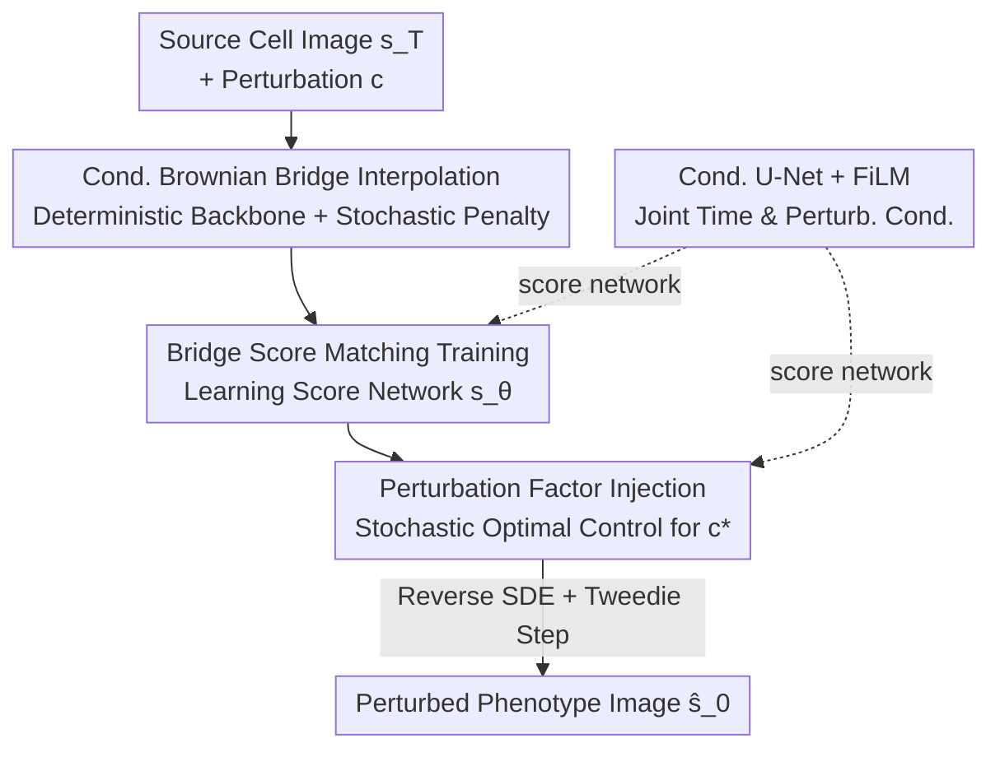

# Steering Where to Diffuse: Generative Modeling of Phenotypic Response Simulation with Steered Diffusion Bridge

**Conference**: CVPR 2026  
**Paper**: [CVF Open Access](https://openaccess.thecvf.com/content/CVPR2026/html/Zhang_Steering_Where_to_Diffuse_Generative_Modeling_of_Phenotypic_Response_Simulation_CVPR_2026_paper.html)  
**Code**: None  
**Area**: Diffusion Models / Generative Modeling / Cellular Phenotypic Simulation  
**Keywords**: Diffusion Bridge, Brownian Bridge, Stochastic Optimal Control, Phenotypic Response Simulation, Cell Morphological Generation

## TL;DR
SimuSDB models the task of "predicting the morphological change of an unperturbed cell image under specific chemical/genetic perturbations" as a **stochastic diffusion bridge** from the source cell distribution to the perturbed distribution. By using a conditional Brownian bridge, trajectories are allowed to diverge around a deterministic backbone to capture phenotypic diversity. The constraint that "generative results must match a specific perturbed phenotype" is reformulated as a **stochastic optimal control problem** to steer the drift term. SimuSDB outperforms diffusion, flow matching, and GAN baselines in FID/KID across BBBC021, RxRx1, and JUMP benchmarks.

## Background & Motivation

**Background**: Phenotypic response simulation aims to use computational models to predict morphological changes in cells under small molecule or genetic perturbations (CRISPR knockout, ORF overexpression). This enables "in silico" drug screening, saving months of high-throughput imaging experiments across multiple batches. Mainstream approaches have evolved from early discriminative or end-to-end models (e.g., GAN-based style transfer like IMPA) to recent generative paradigms like diffusion models and flow matching that learn trajectories on data manifolds.

**Limitations of Prior Work**: The two primary generative routes have distinct flaws. **Diffusion models starting from pure noise** (e.g., PhenDiff) must begin from isotropic Gaussian noise and undergo hundreds of denoising steps to cover the distribution; many intermediate states lack explicit guidance from the data manifold, leading to drift. Conversely, **flow matching** utilizes more direct deterministic optimal transport paths but is constrained by the linear interpolation assumption—all trajectories from the same source point are compressed into the **same linear subspace** connecting the source and target points, with tangent vectors constantly pointing at $s_T - s_0$. This prevents the exploration of phenotypic diversity and causes premature convergence to the statistical mean when samples are imbalanced.

**Key Challenge**: Cellular response to the same perturbation is inherently **highly stochastic and multimodal**—a single molecular perturbation can push a population of cells toward several different phenotypic states or along divergent continuous evolutionary paths. Discriminative models naturally fail to capture this multimodality, while deterministic generative models flatten this diversity into a single trajectory. Additionally, **batch effects** in cross-batch experiments can sometimes be stronger than actual phenotypic signals, leading models to mistake experimental artifacts for perturbation features.

**Goal**: Construct a generative model capable of mapping between two **arbitrarily complex distributions** (source cell state ↔ perturbed phenotypic state) that maintains endpoint conservation (starting from real source images and ending at target phenotypes), generates diverse trajectories, and is **explicitly guided** by perturbation rules.

**Key Insight**: The authors noted that the Diffusion Bridge / Schrödinger Bridge framework naturally supports stochastic transport between arbitrary paired distributions. Treating the source cell image as an "informative prior" instead of Gaussian noise avoids the intermediate state drift characteristic of pure noise starting points. Furthermore, Brownian bridges introduce controlled stochasticity to break the linear subspace constraint.

**Core Idea**: Replace linear interpolation with a **conditional Brownian bridge** to "spread out" trajectories for diversity, and reformulate the requirement that "generations must match the perturbation phenotype" as a **stochastic optimal control** problem to steer the direction of the drift term. In short: "Diffuse to allow divergence, but steer it to the right place."

## Method

### Overall Architecture
The input to SimuSDB is a source cell image $s_T = s_1$ (unperturbed/control state, used as the starting prior for the diffusion bridge) and a perturbation condition $c$ (molecular fingerprints for chemicals, one-hot encoding for genes); the output is the perturbed phenotype image $s_0$. The pipeline consists of: **(1)** Defining a family of **stochastic interpolation trajectories** between the source state $s_T$ and target state $s_0$ using a conditional Brownian bridge, and training a score network to fit the bridge's conditional score; **(2)** Formalizing the requirement for results to match perturbation $c$ as a **stochastic optimal control** problem during inference, yielding an analytical optimal control policy $c^*_t$ injected into the drift term of the reverse SDE to steer generation; **(3)** Using a conditional U-Net as the score network, where time steps and perturbation conditions are injected into residual blocks via FiLM. Note that "diffusion direction" is managed by the former (diverging trajectories for diversity), while "steering target" is managed by the latter (constraining divergence to the target phenotype).

### Key Designs

**1. Conditional Brownian Bridge Stochastic Interpolation: Spreading trajectories to recover phenotypic diversity**

To address the flaw wherein flow matching traps trajectories in a 1D linear subspace, SimuSDB overlays a **Brownian motion penalty term** on a deterministic interpolation backbone. First, a deterministic skeleton is defined as $I_t(s_0, s_T, t) = \alpha_t s_0 + \beta_t s_T$, where coefficients satisfy $\alpha_t + \beta_t = 1$, $\alpha_t$ decreases monotonically, and $\beta_t$ increases monotonically (boundary conditions $I_0 = s_0, I_T = s_1$). Then, stochastic interpolation is introduced:

$$s_t = \underbrace{\alpha_t s_0 + \beta_t s_T}_{I_t(s_0, s_T, t)} + \underbrace{\sigma_t B_t(s_0, \beta_t s_T, t)}_{\text{trajectory penalty term}}$$

Here, $\sigma_t$ is a time-varying diffusion coefficient forced to $\sigma_0 = \sigma_T = 0$, ensuring both endpoints are precisely anchored. $B_t$ is standard Brownian motion, allowing trajectories starting from the same source to diverge and explore the neighborhood around the deterministic path. Under the conditions $f \equiv 0$, $g \equiv 1$, and $\nabla_{s_t} \log q(s_T = s_1 | s_t) := (s_T - s_t)/(1-t)$, the Brownian bridge holds. The penalty term is a zero-mean Gaussian process with variance $t(1-t)$, resulting in an analytical conditional distribution $p(s_t | s_0, T) = \mathcal{N}(s_t; I_t(s_0, s_T, t), t(1-t)\sigma_t^2 E_d)$. When $\sigma_t = 0$, it degrades to deterministic interpolation. The brilliance lies in expanding the reachable path space from a **1D line** to a $d$-dimensional manifold while zeroing out variance at endpoints—aligning with the stochastic, heterogeneous nature of cellular responses.

**2. Stochastic Optimal Control Steering: Reformulating perturbation matching as an analytically solvable control problem**

Spreading the trajectories is insufficient; they must diffuse "correctly." The authors inject the perturbation factor $c_t := c(s_t, t)$ as a control term into the reverse SDE of the bridge process: $ds_t = [f(s_t, t) - g^2(t)\nabla_{s_t}\log q(s_t)] + g(t)(c_t\, dt + dw_t)$. They then define a constrained cost function:

$$f_c(s_t, t) = \mathbb{E}\!\left[ l_c(s_1) + \int_0^T \tfrac{1}{2} g^2(t)\|c_t\|^2\, dt \right]$$

The terminal cost $l_c(s_1)$ measures the deviation of the final generated image from the target phenotype of perturbation $c$, while the integral term penalizes the control magnitude to prevent excessive deviation from the original Brownian bridge. According to stochastic optimal control theory, the optimal policy is $c^*_t = g(t)\nabla_s \log \psi(s_t, t)$, where the desirability function is $\psi(s_t, t) = \mathbb{E}_{Q_0}[e^{-l_c(s_1)} | s_t]$. Theoretically, sampling with this control causes the terminal distribution to converge to $Q^*(s_1) \propto p(s_1 | s_0, c)\cdot e^{l_c(s_1)}$.

Since calculating $\psi$ directly requires integrating over all trajectories from $s_t$ to $s_T$, the authors use a Jensen’s inequality lower bound approximation: at each step $t$, $N$ candidate next states $\{s^{(i)}_{t+\Delta t}\}$ are sampled, their final images $\{\hat s^{(i)}_{t+\Delta t}\}$ are estimated via a single Tweedie step, and the candidate minimizing $l_c(\hat s_1)$ is selected. This allows "perturbation specificity" to be steered in real-time during sampling.

**3. Conditional U-Net + FiLM Joint Conditioning: Unified injection of time and perturbation**

The score network uses a conditional U-Net (encoder-decoder + skip connections). Time step $t$ is mapped to an embedding via sinusoidal encoding and a 2-layer MLP. Perturbation conditions $c$ (molecular fingerprints or gene one-hots) are projected into the same embedding space. Both embeddings are added element-wise and injected into each residual block via the **FiLM** mechanism. This architecture serves as the vehicle for the trainable score predictor $s_\theta(s_t, t, s_1, c)$.

### Loss & Training
The objective is **denoising bridge score matching**: learning the conditional score function $\nabla_{s_t}\log q(s_t | s_0, s_T = s_1, c)$. The unknown term $q(s_t | s_T = s_1)$ is estimated by the network $s_\theta$:

$$L(\theta) = \mathbb{E}_t \mathbb{E}_{s_0, s_1 \sim q_{\text{data}}} \mathbb{E}_{s_t \sim q(s_t|s_0, s_T=s_1, c)}\big[ w(t)\,\|s_\theta(s_t, t, s_1, c) - \nabla_{s_t}\log q(s_t | s_0, s_T, c)\|_2^2 \big]$$

At inference, starting from source image $s_T$, the reverse SDE is solved using the score network and Tweedie-assisted steering. Implementation details include an EDM time schedule, skewed time-step sampling, initial noise of 0.5, cosine annealing learning rate ($10^{-4}$), and AdamW ($10^{-2}$ weight decay) on 4x A100-80GB GPUs.

## Key Experimental Results

### Main Results
Benchmarks used include **BBBC021** (chemical, MCF-7 cells, 112 compounds, 26 perturbations) and **RxRx1** (genetic, U2OS cells, >1000 siRNAs, 1042 perturbations). Metrics include overall (o) and conditional (c) FID/KID.

| Dataset | Metric | SimuSDB | Prev. SOTA (CellFlux) | PhenDiff | IMPA |
|--------|------|---------|----------------|----------|------|
| BBBC021 (Chem) | FIDo↓ | **16.5** | 18.7 | 49.5 | 33.7 |
| BBBC021 (Chem) | FIDc↓ | **53.7** | 56.8 | 109.2 | 76.5 |
| BBBC021 (Chem) | KIDo↓ | **1.32** | 1.62 | 3.10 | 2.60 |
| RxRx1 (Gen) | FIDo↓ | **29.9** | 33.0 | 65.9 | 41.6 |
| RxRx1 (Gen) | FIDc↓ | **156.8** | 163.5 | 174.4 | 164.8 |
| JUMP (Mixed) | FIDo↓ | **8.7** | 9.0 | 49.3 | 14.6 |
| JUMP (Mixed) | FIDc↓ | **82.8** | 84.4 | 127.3 | 99.9 |

SimuSDB consistently leads across all datasets. PhenDiff performs poorly due to pure noise initialization. CellFlux suffers in conditional consistency due to linear interpolation. SimuSDB’s FIDc/FIDo ratio on BBBC021 (3.25) indicates balanced generation quality across perturbations.

### Ablation Study

| Config (BBBC021) | FIDo↓ | FIDc↓ | KIDo↓ | KIDc↓ | Note |
|------|-------|-------|-------|-------|------|
| Full (Brownian Bridge + Steering) | **16.5** | **53.7** | **1.32** | **1.43** | Full model |
| w/o Brownian term | 20.7 | 57.7 | 1.76 | 1.82 | Trajectory collapses to 1D line |
| w/o Control Steering | 17.5 | 54.8 | 1.44 | 1.49 | Perturbation specificity drops |

### Key Findings
- **Brownian stochasticity is critical for quality**: Removing it increases FIDo from 16.5 to 20.7, as the trajectory space collapses, reducing diversity and manifold coverage.
- **Optimal control steering enhances specificity**: It outperforms standard classifier guidance in steering generations toward the correct target phenotypic regions.
- **Generalization stems from learned morphological priors**: In OOD experiments, SimuSDB's performance gap is smaller than baselines, suggesting it learns "how cell morphology evolves" rather than memorizing mappings.

## Highlights & Insights
- **Dual design of "diffuse where to steer"**: The Brownian bridge manages "spreading" (multimodal diversity) while optimal control manages "steering" (phenotypic specificity), cleverly separating two conflicting requirements.
- **Source images as priors**: Replacing Gaussian noise with source images fundamentally avoids the drift issues of standard diffusion models in image-to-image tasks.
- **Analytical steering framework**: Reformulating guidance as stochastic optimal control provides a plug-and-play framework for inference that is more native than classifier guidance.
- **Endpoint variance zeroing**: The detail of $\sigma_0 = \sigma_T = 0$ is crucial, allowing intermediate stochasticity without violating endpoint conservation.

## Limitations & Future Work
- Adaptation is needed for de novo prediction (where no source image exists). Performance may degrade when training data for certain perturbations is extremely sparse.
- Evaluation relies on distribution similarity (FID/KID) rather than downstream biological verification (e.g., cell-based assay ranking).
- Computational overhead of optimal control steering increases with the number of candidates $N$ sampled at each step.
- Future work: Exploring unconditional bridge variants or latent-based population modeling.

## Related Work & Insights
- **vs PhenDiff (Diffusion)**: PhenDiff's pure noise start leads to poor FID due to drift; SimuSDB's bridge process using source priors solves this.
- **vs CellFlux (Flow Matching)**: CellFlux is limited to a linear subspace; SimuSDB expands this to a $d$-dimensional manifold via Brownian motion.
- **vs IMPA (GAN)**: SimuSDB offers more stable training and explicit multimodality modeling compared to GAN-based style transfer.
- **Relationship to Schrödinger Bridges**: SimuSDB builds on diffusion bridges (Doob’s h-transform) and integrates stochastic optimal control specifically for phenotypic tasks requiring endpoint conservation and rule-based steering.

## Rating
- Novelty: ⭐⭐⭐⭐ Combining Brownian bridges with stochastic optimal control for phenotypic simulation is original; components are well-grounded in theory.
- Experimental Thoroughness: ⭐⭐⭐⭐ Covers various perturbation types and OOD; however, lacks downstream biological validation and computational cost analysis.
- Writing Quality: ⭐⭐⭐⭐ Clear motivation and derivation; math is comprehensive.
- Value: ⭐⭐⭐⭐ Significant for in silico drug screening; the "source prior + steering bridge" paradigm is transferable to other conditional generation tasks.

<!-- RELATED:START -->

## Related Papers

- [\[CVPR 2026\] AS-Bridge: A Bidirectional Generative Framework Bridging Next-Generation Astronomical Surveys](as-bridge_a_bidirectional_generative_framework_bridging_next-generation_astronom.md)
- [\[NeurIPS 2025\] Coupling Generative Modeling and an Autoencoder with the Causal Bridge](../../NeurIPS2025/image_generation/coupling_generative_modeling_and_an_autoencoder_with_the_causal_bridge.md)
- [\[CVPR 2026\] Texvent: Asynchronous Event Data Simulation via Text Prompt](texvent_asynchronous_event_data_simulation_via_text_prompt.md)
- [\[CVPR 2026\] POLAR: A Portrait OLAT Dataset and Generative Framework for Illumination-Aware Face Modeling](polar_a_portrait_olat_dataset_and_generative_framework_for_illumination-aware_fa.md)
- [\[CVPR 2026\] Test-Time Instance-Specific Parameter Composition: A New Paradigm for Adaptive Generative Modeling](test-time_instance-specific_parameter_composition_a_new_paradigm_for_adaptive_ge.md)

<!-- RELATED:END -->
