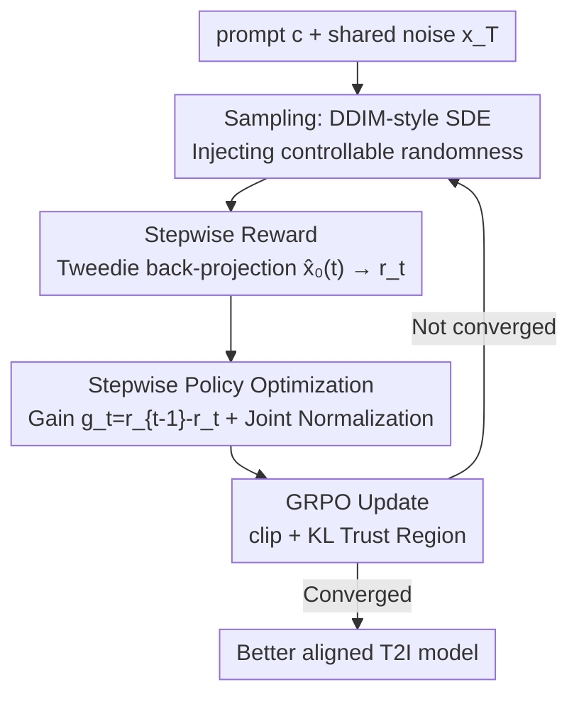

# Stepwise-Flow-GRPO: Assigning Stepwise Credit to Denoising Steps in Flow-Matching Models

**Conference**: CVPR 2026  
**Paper**: [CVF Open Access](https://openaccess.thecvf.com/content/CVPR2026/html/Savani_Stepwise_Credit_Assignment_for_GRPO_on_Flow-Matching_Models_CVPR_2026_paper.html)  
**Code**: None (Project page: stepwiseflowgrpo.com)  
**Area**: Diffusion Models / Alignment RLHF / Image Generation  
**Keywords**: Flow-GRPO, Credit Assignment, Tweedie Formula, Incremental Advantage, T2I-RL  

## TL;DR
To address the flaw in Flow-GRPO that distributes the "same final image advantage" uniformly across all denoising steps, this paper uses the Tweedie formula to estimate intermediate rewards. It employs "adjacent step reward gain" as the stepwise advantage for GRPO and incorporates a DDIM-style SDE to improve sampling quality, achieving higher sample efficiency and faster convergence in text-to-image RL.

## Background & Motivation
**Background**: The mainstream approach for applying Reinforcement Learning (RL) to flow-matching text-to-image models is Flow-GRPO / DanceGRPO. These methods rewrite deterministic flow ODEs into stochastic SDEs that match marginal distributions, enabling policy gradient on denoising trajectories. GRPO is then used to optimize the policy based on "intra-group relative advantages."

**Limitations of Prior Work**: Flow-GRPO only calculates a single reward $r=R(x_0,c)$ on the **final image** $x_0$, obtaining a trajectory-level advantage $A_i$. This same $A_i$ is then **uniformly distributed (uniform credit)** to every denoising step in the trajectory. This ignores the inherent temporal structure of diffusion generation: early steps determine composition and layout (low-frequency structure), while late steps refine texture and details (high-frequency). Treating the entire trajectory with a uniform reward based on final quality reinforces bad early steps in trajectories that were only "corrected" later.

**Key Challenge**: The denoising process is **stepwise, frequency-dependent, and coarse-to-fine**, while Flow-GRPO's credit assignment is **undifferentiated**. The paper explains this hierarchy using frequency-domain SNR: natural image energy concentrates in low frequencies (power spectrum $\propto|k|^{-\alpha}$), while Gaussian noise is flat across frequencies. Thus, the SNR at frequency $k$ and time $t$ is $\text{SNR}_t(k)=\left(\frac{1-t}{t}\right)^2\frac{1}{|k|^{\alpha}}$. Low frequencies emerge from noise before high frequencies. It is unreasonable to assign equal responsibility to a step determining object layout and a step merely sharpening edges.

**Goal**: Assign each denoising step the credit it **actually contributes**, rather than relying solely on the final image, without introducing additional critic models like in PPO.

**Key Insight**: Since the intermediate state $x_t$ is noisy and cannot be directly fed into a reward model, **estimate the corresponding clean image and score the estimate**. This allows each step to have its own reward, facilitating the measurement of "how much this step improved the reward."

**Core Idea**: Use the Tweedie formula to obtain intermediate rewards $r_t$ for each step, and use the **adjacent step gain** $g_t=r_{t-1}-r_t$ as the advantage for GRPO. This reinforces steps that truly improve rewards and penalizes those that decrease them, equivalent to a "critic-free" fine-grained credit assignment.

## Method

### Overall Architecture
Stepwise-Flow-GRPO follows the "ODE→SDE→GRPO" backbone of Flow-GRPO, modifying only **reward calculation**, **advantage calculation**, and introducing an improved sampling SDE. For each prompt $c$, $N$ trajectories are sampled starting from a shared initial noise $x_T$. Unlike Flow-GRPO, for **every step** $x_t$, a clean image $\hat{x}_0(t)$ is inferred using Tweedie plus a few ODE sub-steps. Scoring this gives an intermediate reward $r_t$. The difference between adjacent step rewards $g_t=r_{t-1}-r_t$ is used as the "marginal contribution of this step." These gains are **jointly normalized** across steps and trajectories to form the group relative advantage $\tilde{A}_t^i$, used in the GRPO clip+KL objective. A DDIM-style SDE is used during sampling to ensure cleaner samples and more reliable reward signals.

### Key Designs

**1. Stepwise Reward: Scoring Noisy Intermediate States with Tweedie Formula**

Reward models only recognize clean images and cannot score intermediate noisy states $x_t$. The authors use the Tweedie formula for a one-step unbiased estimate: $\hat{x}_0(t):=\mathbb{E}[x_0\mid x_t]=x_t-t\hat{x}_1$, where $\hat{x}_1$ is the predicted noise already calculated during generation. One-step Tweedie estimation has **nearly zero extra overhead**. To improve accuracy, the interval $[t,0]$ is discretized into $T'$ sub-steps, solving the flow ODE from $x_t$ to $\hat{x}_0(t)$ via forward Euler. $T'=1$ degrades to single-step Tweedie; $T'=5$ was found optimal for the quality-overhead trade-off. For each step, $r_t^i=R(\hat{x}_0^i(t),c)$ is obtained. Since steps are independent, they can be calculated in parallel.

**2. Gain Advantage: Stepwise Credit Assignment via Reward Differences and Joint Normalization**

Maximizing $r_t$ directly would optimize for "high-scoring intermediate Tweedie estimates" rather than high-scoring final images. Instead, the authors optimize the **stepwise gain** $g_t^i:=r_{t-1}^i-r_t^i$, which measures the improvement contributed by that step. A key property is that gains are **telescoping**: $\sum_{t=1}^{T}g_t^i=r_0^i-r_T^i$. Maximizing stepwise gains is equivalent to maximizing the total improvement from initial noise to the final image. For normalization, **joint normalization** (calculating mean and variance across all steps and trajectories) is used. Figure 2 shows that early step gains have larger magnitudes (composition decisions drive most reward improvement); per-step normalization would amplify late-stage noise. The group relative advantage is:

$$\tilde{A}_t^i=\frac{g_t^i-\text{mean}}{\text{std}},\quad \text{mean}=\frac{1}{NT}\sum_{j,k}g_k^j,\ \ \text{std}=\sqrt{\frac{1}{NT}\sum_{j,k}(g_k^j-\text{mean})^2}$$

The GRPO objective replaces the uniform advantage $A_i$ with the stepwise advantage $\tilde{A}_t^i$:

$$J(\theta)=\frac{1}{NT}\sum_{i=1}^{N}\sum_{t=0}^{T-1}\Big[\varphi(s_t^i(\theta),\tilde{A}_t^i)-\beta D_{\mathrm{KL}}^{i,t}(\pi_\theta\|\pi_{\text{ref}})\Big]$$

Where $\varphi$ is the clipped propensity-ratio term and $s_t^i(\theta)$ is the importance ratio. Shared initial noise $x_T$ ensures reward differences stem **only from the stochastic denoising process**.

**3. DDIM-style SDE: Cleaner Samples while Retaining Exploration**

Standard Flow-GRPO SDEs inject noise that makes samples visually "dirty," which can mislead reward models trained on clean images. The authors construct an interpolation between deterministic and stochastic sampling by setting $\alpha_t=(1-t)^2, \beta_t=t^2$:

$$x_{t-\Delta t}=(1-(t-\Delta t))\,\hat{x}_0(t)+\sqrt{(t-\Delta t)^2-\sigma_t^2}\,\hat{x}_1+\sigma_t\epsilon$$

When $\sigma_t=0$, it reverts to the deterministic flow ODE. The noise schedule is set as $\sigma_t=a(t-\Delta t)\sqrt{1-t}$, injecting maximum randomness at $t=1$ for exploration and annealing to $\sigma_t \to 0$ as $t \to 0$. This Gaussian policy $\pi_\theta(x_{t-1}\mid x_t,c)$ allows for likelihood ratio calculation while significantly improving visual quality.

### Loss & Training
The final objective $-J(\theta)$ is minimized using AdamW. Each iteration: sample prompt and shared noise $x_T$ → autoregressively generate $N$ trajectories → calculate $\hat{x}_0(t)$ and $r_t$ using $T'$ sub-steps → compute gain $g_t$ and normalized $\tilde{A}_t$ → update policy. The naive gain approach outperformed variants like GAE or EMA baselines.

## Key Experimental Results

Backbone: SD3.5-Medium, 8×A100; 10 denoising steps, batch 16. Rewards: PickScore / ImageReward / UnifiedReward-7b. Evaluation: GenEval and PickScore datasets.

### Main Results: GenEval Final Model Quality (PickScore Training)

| Model | Overall | Two Objs. | Counting | Position | Attr. Binding |
|------|---------|-----------|----------|----------|---------------|
| SD3.5-M (cfg=1.0, Pre-trained) | 0.28 | 0.23 | 0.15 | 0.05 | 0.08 |
| SD3.5-M (cfg=4.5, Pre-trained) | 0.63 | 0.78 | 0.50 | 0.24 | 0.52 |
| Flow-GRPO (cfg=1.0) | 0.60 | 0.73 | 0.67 | 0.21 | 0.35 |
| **Ours (cfg=1.0)** | 0.60 | **0.75** | 0.67 | 0.21 | 0.34 |
| Flow-GRPO (cfg=4.5) | 0.68 | 0.82 | 0.64 | 0.24 | 0.59 |
| **Ours (cfg=4.5)** | **0.71** | **0.85** | **0.70** | **0.29** | 0.59 |

At cfg=1.0, results are comparable to Flow-GRPO (faster convergence without sacrificing quality). At cfg=4.5, **Ours** outperforms in **counting and spatial positioning** (Position 0.24→0.29, Counting 0.64→0.70). In terms of sample efficiency (Fig 4), convergence is faster and final rewards are higher in most settings.

### Ablation Study

| Configuration | Phenomenon | Conclusion |
|------|------|------|
| $T'$ Sub-steps | $T'\le3$ leads to noisy reward estimates; $T'\in[6,10]$ has negligible gains | $T'=5$ is optimal for quality/efficiency |
| Joint vs. Per-step Norm | Per-step normalization slows convergence | Joint norm preserves early large gains for layout |
| Improved SDE | **Ours** still leads even when both use DDIM-SDE | Credit assignment and sampling improvements are complementary |

### Key Findings
- **Gain magnitude decreases over time** (Fig 2): Early steps have the largest gains, confirming that composition decisions drive most reward improvement.
- **Telescoping property is the bridge**: $\sum_t g_t=r_0-r_T$ ensures that local optimization aligns with maximizing total global reward, preventing reward hacking of intermediate estimates.
- Qualitative analysis (Fig 3) shows Flow-GRPO occasionally places objects incorrectly (e.g., buses in the sky), while **Ours** exhibits better spatial reasoning.

## Highlights & Insights
- **"Gain = Fine-grained credit without a critic"**: Using reward differences between adjacent steps achieves the effect of stepwise credit assignment without the need to train a separate critic model.
- **Tweedie is almost free**: Since $\hat{x}_1$ is already calculated, one-step Tweedie adds no cost. Adding a few ODE sub-steps solves the "unscorability of intermediate states" efficiently.
- **Telescoping sums** align local and global objectives, which is theoretically robust and practically avoids reward hacking.
- Sampling and credit assignment are decoupled, allowing independent and additive improvements.

## Limitations & Future Work
- **Submodularity not formally verified**: The assumption that reward gains are monotonic and submodular lacks formal proof beyond empirical evidence.
- **Increased intermediate overhead**: Each step requires $T'=5$ sub-steps and reward model scoring. When the reward model is heavy (e.g., UnifiedReward), this cost is non-trivial.
- **Ours** won 3 out of 4 settings in efficiency, rather than absolute domination.
- Future work: Using per-prompt gain variance for curriculum learning or adaptive step weighting.

## Related Work & Insights
- **vs. Flow-GRPO**: Both use ODE→SDE→GRPO, but Flow-GRPO uses only final rewards and uniform credit. **Ours** provides independent stepwise rewards + gain advantages and a cleaner SDE.
- **vs. TempFlow-GRPO / Granular-GRPO**: TempFlow uses manual noise-level weighting; Granular only optimizes early steps. **Ours** uses data-driven telescoping gains, requiring no manual scheduling.
- **vs. PPO/RLHF**: **Ours** achieves fine-grained credit similar to PPO but bypasses the difficulty of learning a value function by using reward increments.

## Rating
- Novelty: ⭐⭐⭐⭐ Introducing "stepwise gain + telescoping sum" to Flow-matching GRPO is a precise and theoretically grounded improvement over Flow-GRPO.
- Experimental Thoroughness: ⭐⭐⭐⭐ Multiple reward models and datasets were tested; however, verification on larger models is lacking.
- Writing Quality: ⭐⭐⭐⭐⭐ Well-motivated (using SNR), clear derivation, and clean formulas.
- Value: ⭐⭐⭐⭐ A plug-and-play acceleration for T2I-RL that is industrially applicable.

<!-- RELATED:START -->

## Related Papers

- [\[CVPR 2026\] Fine-Grained GRPO for Precise Preference Alignment in Flow Models](fine-grained_grpo_for_precise_preference_alignment_in_flow_models.md)
- [\[CVPR 2026\] GRPO-Guard: Mitigating Implicit Over-Optimization in Flow Matching via Regulated Clipping](grpo-guard_mitigating_implicit_over-optimization_in_flow_matching_via_regulated_.md)
- [\[CVPR 2026\] Neighbor GRPO: Contrastive ODE Policy Optimization Aligns Flow Models](neighbor_grpo_contrastive_ode_policy_optimization_aligns_flow_models.md)
- [\[CVPR 2026\] Flow Matching for Multimodal Distributions](flow_matching_for_multimodal_distributions.md)
- [\[ICLR 2026\] TempFlow-GRPO: When Timing Matters for GRPO in Flow Models](../../ICLR2026/image_generation/tempflow-grpo_when_timing_matters_for_grpo_in_flow_models.md)

<!-- RELATED:END -->
